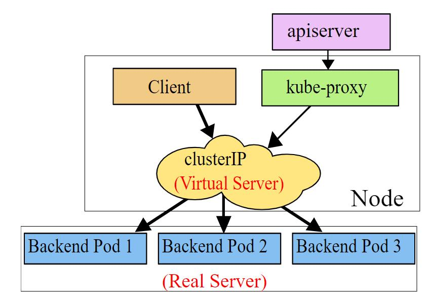

<h1 align='center'>Kubernetes学习笔记</h1>

[toc]

# 一、Kubernetes的概述

## 1、Kubernetes简介

Kubernetes（简称K8s）是一个开源的，用于管理云平台中多个主机上的容器化的应用（类似于docker swarm），Kubernetes的目标是让部署容器化的应用简单并且高效（powerful），Kubernetes提供了应用部署，规划，更新，维护的一种机制。

Kubernetes一个核心的特点就是能够自主的管理容器来保证云平台中的容器按照用户的期望状态运行着（比如用户想让apache一直行，用户不需要关心怎么去做，Kubernetes会自动去监控，然后去重启，新建，总之，让apache一直提供服务），管理员可以加载一微型服务，让规划器来找到合适的位置，同时，Kubernetes也系统提升工具以及人性化方面，让用户能够方便的部署自己的应用（就像canary deployments）。

## 2、Kubernetes的特点

- 自动化装箱：在不牺牲可用性的条件下，基于容器对资源的要求和约束自动部署容器。同时，为了提高利用率和节省更多资源，将关键和最佳工作量结合在一起。
- 自愈能力：当容器失败时，会对容器进行重启；当所部署的Node节点有问题时，会对容器进行重新部署和重新调度；当容器未通过监控检查时，会关闭此容器；直到容器正常运行时，才会对外提供服务。
- 水平扩容：通过简单的命令、用户界面或基于CPU的使用情况，能够对应用进行扩容和缩容。
- 服务发现和负载均衡：开发者不需要使用额外的服务发现机制，就能够基于Kubernetes进行服务发现和负载均衡。
- 自动发布和回滚：Kubernetes能够程序化的发布应用和相关的配置。如果发布有问题，Kubernetes将能够回归发生的变更。
- 保密和配置管理：在不需要重新构建镜像的情况下，可以部署和更新保密和应用配置。
- 存储编排：自动挂接存储系统，这些存储系统可以来自于本地、公共云提供商（例如：GCP、AWS、AliCloud等）、网络存储(例如：NFS、iSCSI、Gluster、Ceph、Cinder和Floker等)。

## 3、学习文档

http://docs.kubernetes.org.cn/


# 二、Kubernetes的相关概念

## 1、Cluster

Cluster由多台虚拟机或者物理设备组成，是计算、存储和网络等资源的集合，Kubernetes利用这些资源运行各种基于容器的应用。

## 2、Master

Master是Cluster集群的大脑，它的主要职责是调度、即决定将应用放在哪个节点运行。Master 运行 Linux 操作系统，可以是物理机或者虚拟机。为了实现高可用，可以运行多个 Master。

## 3、Node

Node是用于运行容器应用的节点。Node由Master管理，Node主要负责监控并汇报容器的状态，并根据Master的要求管理容器的生命周期。Node运行在Linux操作系统上，可以是物理机或者虚拟机。

## 4、Pod

Pod是Kubernetes的最小工作单元。每个Pod可以包含一个或者多个有紧密联系的容器应用。Pod中的容器回作为一个整体被Master调度到一个Node上运行。即便是只有一个容器，Kubernetes管理的也是Pod而不是直接管理容器。

引入Pod的目的：

* 可管理性：有些容器天生就是需要紧密联系，一起工作。Pod提供了比容器更高层次的抽象，将它们封装到一个部署单元中。Kubernetes以Pod为最小单位进行调度、扩展、共享资源、管理生命周期。
* 通信和资源共享：Pod中的所有容器使用同一个网络namespace，即相同的IP地址和Port空间。它们可以直接用localhost通信。同样的，这些容器可以共享存储，当Kubernetes挂载 volume到Pod，本质上是将volume挂载到Pod中的每一个容器。

## 5、Controller Manager

Controller Manager作为集群内部的管理控制中心，负责集群内的Node，Pod副本，服务端点（endpoint），命名空间（namespace）等的管理，当某个Node意外宕机，Controller Manager会及时发现此故障并执行自动化修复流程，确保集群始终处于预期的工作状态。

Kubernetes通常不会直接创建Pod。而是通过Controller Manager来管理Pods的，Controller Manager中定义了Pod的部署特性，比如有几个副本，在哪个Node上运行等，Controller Manager有许多不同的Controller，用来提供各种功能。

## 6、Service

Service在Kubernetes中主要提供的功能是负载均衡和服务自动发现，它提供了我们访问单个或者多个容器应用的能力。每个Service在其生命周期内，都拥有一个固定的IP地址和端口（所以Pod的IP变化，不会影响到这个Pod的上层Service的IP地址变化）。这样也方便后端进行Pod的弹性伸缩等操作。Kubernetes运行Pod和访问Pod这两项任务分别由Controller和Service执行。

## 7、Namespace

我们可以认为NameSpace是Kubernetes Cluster中的虚拟化集群。在一个Kubernetes集群中可以有多个命名空间，这些命名空间在逻辑上彼此隔离。常见的pods, services, replication controllers和deployments等都是属于某一个namespace的（默认是default）。

类似于default这样的默认NameSpace，Kubernetes集群共有三个：

* default：创建资源时如果不指定NameSpace的话，默认将被放到default中。
* kube-system：kubernetes系统组件使用。
* kube-node-lease：用于节点间的心跳检测。
* kube-public：公共资源使用。

## 8、Label

一个label是一个key=value的键值组合，然后可以通过label selector（标签选择器）查询和筛选拥有某些label的资源对象。

label selector的重要使用场景：

kube-controller进程通过资源对象RC上定义的label selector来筛选要监控的pod的数量，从而实现全自动控制流程。

kube-proxy进程通过service的label selector来选择对应的pod，自动建立起每个service到对应pod的请求转发路由表。从而实现service的智能负载均衡机制。


# 三、Kubernetes的架构


## 1、Kubernetes的基本组成

Kubernetes属于主从分布式架构，主要由Master节点和Worker节点组成，以及包括客户端命令行工具kubectl和其它附加项。

### （1）Master

作为控制节点，对集群进行调度管理，Master节点由API Server、Scheduler、Cluster state store和Controller-Manager所组成。

### （2）Node

作为真正的工作节点，运行业务应用的容器；Worker节点包含kubelet、kube proxy和Container Runtime。

### （3）kubectl

用于通过命令行与API Server进行交互，而对Kubernetes进行操作，实现在集群中进行各种资源的增删改查等操作.

### （4）Add-ons插件

是对Kubernetes核心功能的扩展，例如增加网络和网络策略等能力。

## 2、Master基础组件

### （1）API server（API服务器）

API Server主要用来处理REST的操作，确保它们生效，并执行相关业务逻辑，以及更新etcd（或者其他存储）中的相关对象。API Server是所有REST命令的入口，它的相关结果状态将被保存在etcd（或其他存储）中。API Server是Kubernetes Cluster的前端接口，各种客户端工具（CLI或UI）以及Kubernetes其他组件可以通过它管理Cluster的各种资源。

API Server的基本功能包括：

- REST语义，监控，持久化和一致性保证，API 版本控制，放弃和生效
- 内置准入控制语义，同步准入控制钩子，以及异步资源初始化
- API注册和发现

* API Server也作为集群的网关。默认情况，客户端通过API Server对集群进行访问，客户端需要通过认证，并使用API Server作为访问Node和Pod（以及service）的堡垒和代理/通道。

### （2）Scheduler（调度器）

scheduler组件为容器自动选择运行的主机。依据请求资源的可用性，服务请求的质量等约束条件，scheduler监控未绑定的pod，并将其绑定至特定的节点。Kubernetes也支持用户自己提供的调度器，Scheduler负责根据调度策略自动将Pod部署到合适Node中，调度策略分为预选策略和优选策略。

Pod的整个调度过程分为两步：

* 预选节点：遍历集群中所有的节点，按照具体的预选策略筛选出符合要求的节点列表。如没有节点符合预选策略规则，该Pod就会被挂起，直到集群中出现符合要求的节点。
* 优选节点：预选节点列表的基础上，按照优选策略为待选的节点进行打分和排序，从中获取最优节点。

### （3）Cluster state store（集群状态存储）

Kubernetes默认使用etcd作为集群整体存储，当然也可以使用其它的技术。

etcd是一个简单的、分布式的、一致的key-value存储，主要被用来共享配置和服务发现。etcd提供了一个CRUD操作的REST API，以及提供了作为注册的接口，以监控指定的Node。集群的所有状态都存储在etcd实例中，并具有监控的能力，因此当etcd中的信息发生变化时，就能够快速的通知集群中相关的组件。

### （4）Controller-Manager Server（控制管理服务器）

Controller-Manager Serve用于执行大部分的集群层次的功能，它既执行生命周期功能(例如：命名空间创建和生命周期、事件垃圾收集、已终止垃圾收集、级联删除垃圾收集、node垃圾收集)，也执行API业务逻辑（例如：pod的弹性扩容）。控制管理提供自愈能力、扩容、应用生命周期管理、服务发现、路由、服务绑定和提供。

 不同的controller管理不同的资源，Kubernetes默认提供Replication Controller、Node Controller、Namespace Controller、Service Controller、Endpoints Controller、Persistent Controller、DaemonSet Controller等控制器。

* Replication Controller和ReplicaSet（副本控制器）

它能够保证Pod持续运行，并且在任何时候都有指定数量的Pod副本，在此基础上提供一些高级特性，比如滚动升级和弹性伸缩。 副本控制器会在每个节点上创建Pod，Pod上如果有相应的Images可以直接创建，如果没有，则会拉取这个镜像再进行创建。

* Node Controller（节点控制器）

kubelet在进程启动时通过API server注册自身节点信息, 并定时向API server回报状态信息， API server将状态信息更新到etcd中。

* Service Controller（服务控制器）

属于Kubernetes集群与外部云平台之间的一个接口控制器。

* Endpoints Controller（端点控制器）

Endpoints表示一个Service对应的所有Pod副本的访问地址，而Endpoints Controller就是负责生成和维护所有Endpoints对象的控制器。它负责监听Service和对应的Pod副本的变化，如果检测到Service被删除，则删除和该Service同名的Endpoints对象。如果检测到新的Service被创建或者修改则根据该Service信息获得相关的Pod列表，然后创建或者更新Service对应的Endpoints对象。

* DaemonSet Controller（进程控制器）

DaemonSet 确保全部（或者一些）Node上运行一个Pod的副本。当有Node加入集群时，也会为他们新增一个Pod。当有Node从集群移除时，这些Pod也会被回收。删除DaemonSet将会删除它创建的所有 Pod。

* Deployment Controller（部署控制器）

Deployment为Pod与ReplicaSet提供声明式定义的方式，Deployment会自动创建ReplicaSet来维持Pod数量，同时Deployment在ReplicaSet的基础上还支持滚动更新、回滚。典型用法：web服务。

## 3、Node基础组件

### （1）Kubelet

kubelet是node的agent，当Scheduler确定在某个Node上运行Pod后，会将Pod的具体配置信息（image、volume等）发送给该节点的kubelet，kubelet会根据这些信息创建和运行容器，并向master报告运行状态。

### （2）Kube-proxy

service在逻辑上代表了后端的多个Pod，外界通过service访问Pod。service接收到请求就需要kube-proxy完成转发到Pod的。每个Node都会运行kube-proxy服务，负责将访问的service的TCP/UDP数据流转发到后端的容器，如果有多个副本，kube-proxy会实现负载均衡，有2种方式：LVS或者Iptables。

### （3）Container runtime

容器运行时的环境，负责节点的容器的管理工作，如docker。

### （4）fluent

日志收集服务，fluentd是一个守护进程，可提供cluster-level logging。

### （5）pod

是k8s管理的基本单元，pod的内部是容器，k8s不是直接管理容器，而是管理pod。

## 4、kubectl

Kubectl是Kubernetes集群管理工具。

### （1）kubectl命令的查看

查看所有的命令

```shell
[root@master ~]# kubectl help
kubectl controls the Kubernetes cluster manager.

 Find more information at: https://kubernetes.io/docs/reference/kubectl/overview/

Basic Commands (Beginner):
  create        Create a resource from a file or from stdin
  expose        Take a replication controller, service, deployment or pod and expose it as a new Kubernetes service
  run           Run a particular image on the cluster
  set           Set specific features on objects

Basic Commands (Intermediate):
  explain       Get documentation for a resource
  get           Display one or many resources
  edit          Edit a resource on the server
  delete        Delete resources by file names, stdin, resources and names, or by resources and label selector

Deploy Commands:
  rollout       Manage the rollout of a resource
  scale         Set a new size for a deployment, replica set, or replication controller
  autoscale     Auto-scale a deployment, replica set, stateful set, or replication controller

Cluster Management Commands:
  certificate   Modify certificate resources.
  cluster-info  Display cluster information
  top           Display resource (CPU/memory) usage
  cordon        Mark node as unschedulable
  uncordon      Mark node as schedulable
  drain         Drain node in preparation for maintenance
  taint         Update the taints on one or more nodes

Troubleshooting and Debugging Commands:
  describe      Show details of a specific resource or group of resources
  logs          Print the logs for a container in a pod
  attach        Attach to a running container
  exec          Execute a command in a container
  port-forward  Forward one or more local ports to a pod
  proxy         Run a proxy to the Kubernetes API server
  cp            Copy files and directories to and from containers
  auth          Inspect authorization
  debug         Create debugging sessions for troubleshooting workloads and nodes

Advanced Commands:
  diff          Diff the live version against a would-be applied version
  apply         Apply a configuration to a resource by file name or stdin
  patch         Update fields of a resource
  replace       Replace a resource by file name or stdin
  wait          Experimental: Wait for a specific condition on one or many resources
  kustomize     Build a kustomization target from a directory or URL.

Settings Commands:
  label         Update the labels on a resource
  annotate      Update the annotations on a resource
  completion    Output shell completion code for the specified shell (bash or zsh)

Other Commands:
  api-resources Print the supported API resources on the server
  api-versions  Print the supported API versions on the server, in the form of "group/version"
  config        Modify kubeconfig files
  plugin        Provides utilities for interacting with plugins
  version       Print the client and server version information

Usage:
  kubectl [flags] [options]

Use "kubectl <command> --help" for more information about a given command.
Use "kubectl options" for a list of global command-line options (applies to all commands).
```

### （2）kubectl命令的组成

命令的格式 kubectl [command] [type] [name] [flags]

| 参数    | 作用                                            |
| ------- | ----------------------------------------------- |
| command | 指定要对资源执行的操作，例如create、get、delete |
| type    | 指定资源类型，例如pod、service、namespace       |
| name    | 指定资源的名称，大小写敏感                      |
| flags   | 指定额外的可选参数                              |

### （3）基础命令

* 基本命令-初级

| 命令   | 作用                                                         |
| ------ | ------------------------------------------------------------ |
| create | 通过yaml/json 文件或者标准输入创建一个资源对象，支持很多子命令 例如namespace pod deployment service等 |
| expose | 将json/yaml文件中定义的资源对象的端口暴露给新的service资源对象 |
| run    | 创建并运行一个或多个容器镜像                                 |
| set    | 配置资源对象设置特定功能                                     |

* 基础命令-中级

| 命令    | 作用                                                         |
| ------- | ------------------------------------------------------------ |
| explain | 查看资源对象的详细信息(一般用以编写yaml的时候做一个提示kubectl explain deployment会出现deployment下面可以写的字段以及字段属性还有可以逐级使用) |
| get     | 获取一个或多个资源对象的信息                                 |
| edit    | 使用默认编辑器编辑服务器上定义的资源对象                     |
| delete  | 通过json/yaml文件、标准输出、资源名称或标签选择器来删除资源  |

### （4）部署命令

| 命令      | 作用                                                       |
| --------- | ---------------------------------------------------------- |
| rollout   | 资源管理对象的部署                                         |
| scale     | 扩容或者缩容deployment replicaset replication controller等 |
| autoscale | 自动设置在k8s系统中运行的pod数量（水平自动伸缩）           |

### （5）集群管理命令

| 命令         | 作用                         |
| ------------ | ---------------------------- |
| certificate  | 修改证书资源对象             |
| cluster-info | 查看集群信息                 |
| top          | 显示资源cpu内存 存储使用情况 |
| cordon       | 标记节点为不可调度           |
| uncordon     | 指定节点为可调度             |
| drain        | 安全的驱逐节点的所有pod      |
| taint        | 将一个或多个节点设置为污点   |

### （6）故障排查和调试命令

| 命令         | 作用                                  |
| ------------ | ------------------------------------- |
| describe     | 显示一个或多个资源对象的详细信息      |
| logs         | 输出pod资源对象中一个容器的日志       |
| attach       | 连接到一个运行的容器                  |
| exec         | 在指定容器内执行命令                  |
| port-forward | 将本机指定端口映射到pod资源对象的端口 |
| proxy        | 将本机指定端口映射到kube-apiserver    |
| cp           | 用于pod与主机交换文件                 |
| auth         | 检查认证                              |
| debug        | 调试                                  |

### （7）高级命令

| 命令      | 作用                                                         |
| --------- | ------------------------------------------------------------ |
| diff      | 对比本地json/yaml文件与kube-apiserver中运行的配置文件是否有差异 |
| apply     | 通过json/yaml文件 标准输入对资源进行配置更新或者创建         |
| patch     | 通过patch方式修改资源对象字段（补丁式）                      |
| replace   | 通过json/yaml文件或者标准输入来替换资源对象                  |
| wait      | 在一个或者多个资源上等待条件达成                             |
| kustomize | 定制kubernetes配置                                           |

### （8）设置命令

| 命令       | 作用                                            |
| ---------- | ----------------------------------------------- |
| label      | 增删改资源的标签                                |
| annotate   | 更新一个或者多个资源对象的注释（annotaion）信息 |
| completion | 命令自动补全                                    |

### （9）其他命令

| 命令          | 作用                                                      |
| ------------- | --------------------------------------------------------- |
| api-resources | 列出当前kubernetes系统支持的resource资源列表              |
| api-versions  | 列出当前kubernetes系统支持的资源组和资源版本，表现形式为/ |
| config        | 管理kubeconfig配置文件                                    |
| plugin        | 运行命令行插件功能                                        |
| version       | 查看客户端服务端的系统版本信息                            |

### （10）资源类型

* 工作负载型资源

Pod，ReplicaSet，Deployment，statefulset，DaemonSet，Job，CronJob

* 服务发现及负载均衡资源

Serivce，Ingress

* 配置与存储型资源

Volume、CSI（容器存储资源）

* 特殊类型的存储卷：

ConfigMap（存储配置文件，热更新），Secret（加密存储），DownwardAPI

* 集群级别资源

Namespace，Node，Role、ClusterRole、RoleBinding、ClusterRoleBinding

* 元数据型资源

HPA、PodTemplate、LimitRange

## 5、addons插件

插件都是在master上的

### （1）DNS

虽然不严格要求使用插件，但Kubernetes集群都应该具有集群DNS。kube-dns是一个DNS服务器，能够为 Kubernetes services提供 DNS记录。由Kubernetes启动的容器自动将这个DNS服务器包含在他们的DNS searches中。

### （2）UI

用户界面，kube-ui提供集群状态基础信息查看。

### （3）容器资源监测

容器资源监控提供一个UI浏览监控数据。

### （4）Cluster-level logging

负责保存容器日志，搜索/查看日志。


# 四、Kubeadm安装Kubernetes

## 1、Kubernetes的安装方法

* 使用kubeadm通过离线镜像安装 

* 使用阿里公有云平台K8S

* 通过yum官方仓库安装

* 二进制包进行安装，kubeasz(github)

## 2、kubeadm

### （1）kubeadm简介

Kubernetes集群的一键部署工具，通过把Kubernetes的各类核心组件和插件以pod的方式部署来简化安装过程。

### （2）kubeadm init

初始化一个kubernetes主节点。

```shell
kubeadm init \
--kubernetes-version=1.22.0 \
--apiserver-advertise-address=10.0.2.15 \
--image-repository registry.aliyuncs.com/google_containers \
--service-cidr=10.96.0.0/12 \
--pod-network-cidr=10.244.0.0/16
```

* --kubernetes-version：k8s软件的版本，kubeadm的版本高的话，也需要高的k8s版本，不支持低版本
* --apiserver-advertise-address：master主机的IP地址
* --image-repository：这个是镜像地址，由于国外地址无法访问，故使用的阿里云仓库地址：registry.aliyuncs.com/google_containers，由于kubeadm默认从官网k8s.grc.io下载所需镜像，国内无法访问，因此需要通过–image-repository指定阿里云镜像仓库地址。
* --pod-network-cidr：k8s内部的pod节点之间网络可以使用的IP段，不能和service-cidr写一样

### （3）kubeadm join

启动一个kubernetes工作节点并加入到集群中，该命令会在管理节点初始化之后自动生成。

```shell
kubeadm join 10.0.2.15:6443 --token lcu24w.nqa49ehd6gc8uagm \
     --discovery-token-ca-cert-hash sha256:55e9e6548bf7f4aa7c018e33cb6e131ff2aba6cade71e693bcf106a71dff04b9
```

### （4）kubeadm upgrade

更新Kubernetes集群到较新版本。

### （5）kubeadm config

集群的配置

* kubeadm config images list：查看kudeadm所需要的镜像

```shell
#查看集群所需要的镜像
[root@master manifests]# kubeadm config images list
k8s.gcr.io/kube-apiserver:v1.22.1
k8s.gcr.io/kube-controller-manager:v1.22.1
k8s.gcr.io/kube-scheduler:v1.22.1
k8s.gcr.io/kube-proxy:v1.22.1
k8s.gcr.io/pause:3.5
k8s.gcr.io/etcd:3.5.0-0
k8s.gcr.io/coredns/coredns:v1.8.4
```

* kubeadm config images pull：拉取kudead用的镜像
* kubeadm config print init-defaults：查看master节点初始化的配置
* kubeadm config print join-defaults：查看工作节点加入集群的配置
* kubeadm config migrate：将本地旧版本的配置对象转换为最新支持的版本，而无需变更集群中的任何内容

### （6）kubeadm token

生成node节点加入集群的人认证token，使用kubeadm join来管理认证，token的有效器为24小时，失效后需重新生成新的token。

### （7）kubeadm reset

重置，还原之前使用的kubeadm init或者kubeadm join对节点尝试的改变。

### （8）kubeadm version 

查看kubeadm版本

```shell
[root@master manifests]# kubeadm version
kubeadm version: &version.Info{Major:"1", Minor:"22", GitVersion:"v1.22.1", GitCommit:"632ed300f2c34f6d6d15ca4cef3d3c7073412212", GitTreeState:"clean", BuildDate:"2021-08-19T15:44:22Z", GoVersion:"go1.16.7", Compiler:"gc", Platform:"linux/amd64"}
```

### （9）kubeadm alpha

预览一组可用的新功能以便从社区搜集反馈

```shell
[root@master manifests]# kubeadm alpha
Kubeadm experimental sub-commands
```

## 3、环境准备

| role   | os        | cpu  | memory | kernel | host name | ip        | MAC               | product_uuid                         |
| ------ | --------- | ---- | ------ | ------ | --------- | --------- | ----------------- | ------------------------------------ |
| master | centos7.9 | 4c   | 4G     | 3.10   | master    | 10.0.2.15 | 08:00:27:22:56:0a | DBECE29A-E672-2741-A1A1-30E33ED6DF3C |
| node1  | centos7.9 | 2c   | 2G     | 3.10   | node1     | 10.0.2.4  | 08:00:27:57:4d:90 | 33545969-0F5A-C443-9C54-A63291A2C33D |
| node2  | centos7.9 | 2c   | 2G     | 3.10   | node2     | 10.0.2.5  | 08:00:27:c1:43:fd | BB07E083-C38B-1043-9F35-0EE91FF73C74 |

### （1）Linux内核和内存

* 内核版本：3.10以上或者4版本，因为3版本可能会存在一些docker和K8s的bug。

```shell
[root@hao etc]# cat /proc/version
Linux version 3.10.0-1160.el7.x86_64
```

* CPU个数要>=2，如果低于2，则会报错：[ERROR NumCPU]: the number of available CPUs 1 is less than the required 2
* 内存>=2G，如果低于2G，则会报错：[ERROR Mem]: the system RAM (990 MB) is less than the minimum 1700 MB

### （2）Centos版本

版本要在centos7.5以上的

```shell
[root@hao etc]# cat /etc/redhat-release
CentOS Linux release 7.9.2009 (Core)
```

### （3）设置主机名

三个主机的主机名不可重复

```shell
#master
[root@hao ~]# hostname
hao
[root@hao ~]# hostnamectl set-hostname master
[root@hao ~]# reboot
[root@master ~]# hostname
master

#node1
[root@node1 ~]# hostname
node1

#node2
[root@node2 ~]# hostname
node2
```

### （4）IP和MAC地址

每个主机的MAC地址要保证唯一性

```shell
#master
[root@master ~]# ifconfig
enp0s3: flags=4163<UP,BROADCAST,RUNNING,MULTICAST>  mtu 1500
        inet 10.0.2.15  netmask 255.255.255.0  broadcast 10.0.2.255
        inet6 fe80::85bd:a9f2:bdb6:2400  prefixlen 64  scopeid 0x20<link>
        ether 08:00:27:22:56:0a  txqueuelen 1000  (Ethernet)
        RX packets 413205  bytes 482957418 (460.5 MiB)
        RX errors 0  dropped 0  overruns 0  frame 0
        TX packets 102213  bytes 12750735 (12.1 MiB)
        TX errors 0  dropped 0 overruns 0  carrier 0  collisions 0

#node1
[root@node1 ~]# ifconfig
enp0s3: flags=4163<UP,BROADCAST,RUNNING,MULTICAST>  mtu 1500
        inet 10.0.2.4  netmask 255.255.255.0  broadcast 10.0.2.255
        inet6 fe80::6238:dcba:a84:c96c  prefixlen 64  scopeid 0x20<link>
        ether 08:00:27:57:4d:90  txqueuelen 1000  (Ethernet)
        RX packets 747020  bytes 244740019 (233.4 MiB)
        RX errors 0  dropped 0  overruns 0  frame 0
        TX packets 740295  bytes 126105100 (120.2 MiB)
        TX errors 0  dropped 0 overruns 0  carrier 0  collisions 0

#node2
[root@node2 ~]# ifconfig
enp0s3: flags=4163<UP,BROADCAST,RUNNING,MULTICAST>  mtu 1500
        inet 10.0.2.5  netmask 255.255.255.0  broadcast 10.0.2.255
        inet6 fe80::3276:16dd:7260:df31  prefixlen 64  scopeid 0x20<link>
        ether 08:00:27:c1:43:fd  txqueuelen 1000  (Ethernet)
        RX packets 770030  bytes 295942952 (282.2 MiB)
        RX errors 0  dropped 0  overruns 0  frame 0
        TX packets 728247  bytes 120341271 (114.7 MiB)
        TX errors 0  dropped 0 overruns 0  carrier 0  collisions 0
```

### （5）product_uuid

要保证每台主机的product_uuid不同

```shell
#master
[root@master ~]# cat /sys/class/dmi/id/product_uuid
DBECE29A-E672-2741-A1A1-30E33ED6DF3C

#node1
[root@node1 ~]#  cat /sys/class/dmi/id/product_uuid
33545969-0F5A-C443-9C54-A63291A2C33D

#node2
[root@node2 ~]# cat /sys/class/dmi/id/product_uuid
BB07E083-C38B-1043-9F35-0EE91FF73C74
```

### （6）添加域名解析

三台主机都需要添加域名解析

```shell
[root@hao etc]# cat  >>/etc/hosts <<EOF
> 10.0.2.15 master
> 10.0.2.4 node1
> 10.0.2.5 node2
> EOF

[root@master ~]# cat  /etc/hosts
127.0.0.1   localhost localhost.localdomain localhost4 localhost4.localdomain4
::1         localhost localhost.localdomain localhost6 localhost6.localdomain6
10.0.2.15 master
10.0.2.4 node1
10.0.2.5 node2
```

### （7）关闭防火墙

三台主机都需要关闭防火墙

防火墙，会对所有网络流量进行过滤、转发，如果是内网机器一般都会直接关闭，省的影响网络性能，但K8s不能直接关了，K8s是需要用防火墙做ip转发和修改的，当然也看使用的网络模式，如果采用的网络模式不需要防火墙也是可以直接关闭的。

```shell
[root@master ~]# systemctl status firewalld
● firewalld.service - firewalld - dynamic firewall daemon
   Loaded: loaded (/usr/lib/systemd/system/firewalld.service; enabled; vendor preset: enabled)
   Active: active (running) since Mon 2021-08-23 03:57:52 EDT; 1 weeks 4 days ago
     Docs: man:firewalld(1)
 Main PID: 641 (firewalld)
   CGroup: /system.slice/firewalld.service
           └─641 /usr/bin/python2 -Es /usr/sbin/firewalld --nofork --nopid

Aug 23 03:57:51 master systemd[1]: Starting firewalld - dynamic firewall da.....
Aug 23 03:57:52 master systemd[1]: Started firewalld - dynamic firewall daemon.
Aug 23 03:57:52 master firewalld[641]: WARNING: AllowZoneDrifting is enable...w.
Hint: Some lines were ellipsized, use -l to show in full.

#关闭防火墙
[root@master ~]# systemctl stop firewalld

#设置开机禁用防火墙
[root@master ~]# systemctl disable firewalld
Removed symlink /etc/systemd/system/multi-user.target.wants/firewalld.service.
Removed symlink /etc/systemd/system/dbus-org.fedoraproject.FirewallD1.service.

[root@master ~]# systemctl status firewalld
● firewalld.service - firewalld - dynamic firewall daemon
   Loaded: loaded (/usr/lib/systemd/system/firewalld.service; disabled; vendor preset: enabled)
   Active: inactive (dead) since Fri 2021-09-03 09:56:08 EDT; 2min 36s ago
     Docs: man:firewalld(1)
 Main PID: 641 (code=exited, status=0/SUCCESS)

Sep 03 09:55:03 master firewalld[641]: WARNING: COMMAND_FAILED: '/usr/sbin/iptables -w10 -t filter -F DOCKER-ISOLATION-STAGE-2' failed: iptables: No chain/target/match by that name.
Sep 03 09:55:03 master firewalld[641]: WARNING: COMMAND_FAILED: '/usr/sbin/iptables -w10 -t filter -X DOCKER-ISOLATION-STAGE-2' failed: iptables: No chain/target/match by that name.
Sep 03 09:55:03 master firewalld[641]: WARNING: COMMAND_FAILED: '/usr/sbin/iptables -w10 -t filter -F DOCKER-ISOLATION' failed: iptables: No chain/target/match by that name.
Sep 03 09:55:03 master firewalld[641]: WARNING: COMMAND_FAILED: '/usr/sbin/iptables -w10 -t filter -X DOCKER-ISOLATION' failed: iptables: No chain/target/match by that name.
Sep 03 09:55:04 master firewalld[641]: WARNING: COMMAND_FAILED: '/usr/sbin/iptables -w10 -D FORWARD -i docker_gwbridge -o docker_gwbridge -j ACCEPT' failed: iptables: Bad rul...hat chain?).
Sep 03 09:55:04 master firewalld[641]: WARNING: COMMAND_FAILED: '/usr/sbin/iptables -w10 -D FORWARD -i docker0 -o docker0 -j DROP' failed: iptables: Bad rule (does a matching...hat chain?).
Sep 03 09:55:04 master firewalld[641]: WARNING: COMMAND_FAILED: '/usr/sbin/iptables -w10 -D FORWARD -i docker0 -o docker0 -j DROP' failed: iptables: Bad rule (does a matching...hat chain?).
Sep 03 09:55:07 master firewalld[641]: WARNING: COMMAND_FAILED: '/usr/sbin/iptables -w10 -t filter -nL DOCKER-INGRESS' failed: iptables: No chain/target/match by that name.
Sep 03 09:56:08 master systemd[1]: Stopping firewalld - dynamic firewall daemon...
Sep 03 09:56:08 master systemd[1]: Stopped firewalld - dynamic firewall daemon.
Hint: Some lines were ellipsized, use -l to show in full.
```

如果未关闭防火墙，则需要开放相应的端口

控制节点的端口

| 协议 | 方向 | 端口      | 作用                    | 使用者                      |
| ---- | ---- | --------- | ----------------------- | --------------------------- |
| TCP  | 入站 | 6443      | Kubernetes API server   | 所有组件                    |
| TCP  | 入站 | 2379-2380 | etcd server client API  | kube-apiserver，etcd        |
| TCP  | 入站 | 10250     | Kubelet API             | kubelet自身，控制节点组件   |
| TCP  | 入站 | 10251     | kube-scheduler          | kube-scheduler自身          |
| TCP  | 入站 | 10252     | kube-controller-manager | kube-controller-manager自身 |

工作节点的端口

| 协议 | 方向 | 端口        | 作用             | 使用者                    |
| ---- | ---- | ----------- | ---------------- | ------------------------- |
| TCP  | 入站 | 10250       | Kubelet API      | kubelet自身，控制节点组件 |
| TCP  | 入站 | 30000-32767 | NodePort service | 所有组件                  |

### （8）关闭selinux

三台主机都需要关闭selinux

selinux是用来加强安全性的一个组件，但非常容易出错且难以定位，一般上来装完系统就先给禁用了。

```shell
[root@master ~]# cat /etc/selinux/config
# This file controls the state of SELinux on the system.
# SELINUX= can take one of these three values:
#     enforcing - SELinux security policy is enforced.
#     permissive - SELinux prints warnings instead of enforcing.
#     disabled - No SELinux policy is loaded.
SELINUX=enforcing
# SELINUXTYPE= can take one of three values:
#     targeted - Targeted processes are protected,
#     minimum - Modification of targeted policy. Only selected processes are protected.
#     mls - Multi Level Security protection.
SELINUXTYPE=targeted
[root@master ~]# getenforce
Enforcing

#临时关闭
[root@master ~]# setenforce 0

[root@master ~]# getenforce
Permissive

#永久禁用
[root@master ~]# sed -i "s/^SELINUX=enforcing/SELINUX=disabled/g" /etc/selinux/config

[root@master ~]# cat /etc/selinux/config
# This file controls the state of SELinux on the system.
# SELINUX= can take one of these three values:
#     enforcing - SELinux security policy is enforced.
#     permissive - SELinux prints warnings instead of enforcing.
#     disabled - No SELinux policy is loaded.
SELINUX=disabled
# SELINUXTYPE= can take one of three values:
#     targeted - Targeted processes are protected,
#     minimum - Modification of targeted policy. Only selected processes are protected.
#     mls - Multi Level Security protection.
SELINUXTYPE=targeted
```

### （9）关闭swap分区

这个当内存不足时，linux会自动使用swap，将部分内存数据存放到磁盘中，这个这样会使性能下降，为了性能考虑推荐关掉。

```shell
#查看分区和使用情况
[root@master ~]# free -m
              total        used        free      shared  buff/cache   available
Mem:            990         251         102          12         637         579
Swap:             0           0           0

[root@node1 ~]# cat /etc/fstab
#
# /etc/fstab
# Created by anaconda on Fri Aug 13 05:00:31 2021
#
# Accessible filesystems, by reference, are maintained under '/dev/disk'
# See man pages fstab(5), findfs(8), mount(8) and/or blkid(8) for more info
#
/dev/mapper/centos_orm01--wan--02--tunnel-root /                       xfs     defaults        0 0
UUID=80761836-a214-45c0-b43e-8a2476777aac /boot                   xfs     defaults        0 0
/dev/mapper/centos_orm01--wan--02--tunnel-swap swap                    swap    defaults        0 0

#临时关闭分区
[root@master ~]# swapoff -a

#永久关闭swap分区
[root@master ~]# sed -ri 's/.*swap.*/#&/' /etc/fstab

[root@master ~]# cat /etc/fstab
#
# /etc/fstab
# Created by anaconda on Sat Aug 21 01:15:36 2021
#
# Accessible filesystems, by reference, are maintained under '/dev/disk'
# See man pages fstab(5), findfs(8), mount(8) and/or blkid(8) for more info
#
/dev/mapper/centos-root /                       xfs     defaults        0 0
UUID=9f06931c-7f3c-41ca-8dd9-c7dcaaacb15a /boot                   xfs     defaults        0 0
#/dev/mapper/centos-swap swap                    swap    defaults        0 0
```

### （10）配置内核参数

将桥接的IPv4流量传递到iptables的链

```shell
[root@master sysctl.d]# cat > /etc/sysctl.d/k8s.conf <<EOF
> net.bridge.bridge-nf-call-ip6tables = 1
> net.bridge.bridge-nf-call-iptables = 1
> EOF

#手动加载所有的配置文件，执行
[root@master sysctl.d]# sysctl --system
* Applying /usr/lib/sysctl.d/00-system.conf ...
net.bridge.bridge-nf-call-ip6tables = 0
net.bridge.bridge-nf-call-iptables = 0
net.bridge.bridge-nf-call-arptables = 0
net.ipv4.ip_forward = 1
* Applying /usr/lib/sysctl.d/10-default-yama-scope.conf ...
kernel.yama.ptrace_scope = 0
* Applying /usr/lib/sysctl.d/50-default.conf ...
kernel.sysrq = 16
kernel.core_uses_pid = 1
kernel.kptr_restrict = 1
net.ipv4.conf.default.rp_filter = 1
net.ipv4.conf.all.rp_filter = 1
net.ipv4.conf.default.accept_source_route = 0
net.ipv4.conf.all.accept_source_route = 0
net.ipv4.conf.default.promote_secondaries = 1
net.ipv4.conf.all.promote_secondaries = 1
fs.protected_hardlinks = 1
fs.protected_symlinks = 1
* Applying /etc/sysctl.d/99-sysctl.conf ...
* Applying /etc/sysctl.d/k8s.conf ...
net.bridge.bridge-nf-call-ip6tables = 1
net.bridge.bridge-nf-call-iptables = 1
* Applying /etc/sysctl.conf ...
```

### （11）配置国内yum源

* 安装wget

```shell
[root@master sysctl.d]# yum install -y wget
Installed:
  wget.x86_64 0:1.14-18.el7_6.1

Complete!
```

* 备份服务器所有的yum源文件

```shell
#创建备份文件夹
[root@master sysctl.d]# mkdir /etc/yum.repos.d/yumbak

#将所有的yum源文件移动到备份文件夹中
[root@master yumbak]# mv /etc/yum.repos.d/*.repo /etc/yum.repos.d/yumbak
```

* 下载阿里云的yum源

```shell
[root@master yum.repos.d]# wget -O /etc/yum.repos.d/CentOS-Base.repo http://mirrors.aliyun.com/repo/Centos-7.repo
2021-09-03 11:07:43 (272 MB/s) - ‘/etc/yum.repos.d/CentOS-Base.repo’ saved [2523/2523]

[root@master yum.repos.d]# ls
CentOS-Base.repo  yumbak
```

* 下载阿里云的epel源

EPEL是由 Fedora 社区打造，为 RHEL 及衍生发行版如 CentOS、Scientific Linux等提供高质量软件包的项目。装上EPEL后，可以像在 Fedora 上一样，可以通过 yum install package-name，安装更多软件。

```shell
[root@master yum.repos.d]# wget -O /etc/yum.repos.d/epel.repo http://mirrors.aliyun.com/repo/epel-7.repo
2021-09-03 11:13:12 (177 MB/s) - ‘/etc/yum.repos.d/epel.repo’ saved [664/664]
```

* 清理缓存

```shell
[root@master yum.repos.d]# yum clean all
Loaded plugins: fastestmirror, product-id, search-disabled-repos, subscription-manager

This system is not registered with an entitlement server. You can use subscription-manager to register.

Cleaning repos: base epel extras updates
Cleaning up list of fastest mirrors
Other repos take up 1.9 M of disk space (use --verbose for details)
```

* 生成新的缓存

```shell
[root@master yum.repos.d]# yum makecache
Metadata Cache Created
```

### （12）配置国内的kubernetes源

```shell
[root@master yum.repos.d]# cat > /etc/yum.repos.d/kubernetes.repo <<EOF
> [kubernetes]
> name=Kubernetes
> baseurl=https://mirrors.aliyun.com/kubernetes/yum/repos/kubernetes-el7-x86_64/
> enabled=1
> gpgcheck=1
> repo_gpgcheck=1
> gpgkey=https://mirrors.aliyun.com/kubernetes/yum/doc/yum-key.gpg https://mirrors.aliyun.com/kubernetes/yum/doc/rpm-package-key.gpg
> EOF

[root@master yum.repos.d]# ls
CentOS-Base.repo  epel.repo  kubernetes.repo  yumbak
```

### （13）配置国内的docker源

三个节点都需要配置

```shell
[root@master yum.repos.d]# wget -O /etc/yum.repos.d/docker-ce.repo https://mirrors.aliyun.com/docker-ce/linux/centos/docker-ce.repo
wget -O /etc/yum.repos.d/docker-ce.repo https://mirrors.aliyun.com/docker-ce/linux/centos/docker-ce.repo
2021-09-03 11:28:59 (716 MB/s) - ‘/etc/yum.repos.d/docker-ce.repo’ saved [2081/2081]

[root@master yum.repos.d]# ls
CentOS-Base.repo  docker-ce.repo  epel.repo  kubernetes.repo  yumbak
```

## 4、安装并配置docker

三个节点都需要安装，docker服务为容器运行提供计算资源，是所有容器运行的基本平台。

```shell
[root@master ~]# yum install -y docker-ce-20.10.8.ce-3.el7

[root@master ~]# docker --version
Docker version 20.10.8, build 3967b7d

[root@node1 ~]# docker --version
Docker version 20.10.8, build 3967b7d

[root@node2 ~]# docker --version
Docker version 20.10.8, build 3967b7d

#启动docker
[root@master ~]# systemctl start docker

[root@master ~]# docker ps
CONTAINER ID   IMAGE     COMMAND   CREATED   STATUS    PORTS     NAMES

#设置docker开机自启动
[root@master ~]# systemctl enable docker
Created symlink from /etc/systemd/system/multi-user.target.wants/docker.service to /usr/lib/systemd/system/docker.service.
```

## 5、安装并配置kubeadm、kubectl、kubelet

三个节点上都需要安装，安装kubeadm时会依赖安装kubelet和kubectl

```shell
[root@master ~]# yum install -y kubeadm

Installed:
  kubeadm.x86_64 0:1.22.1-0
  
  
Dependency Installed:
  conntrack-tools.x86_64 0:1.4.4-7.el7      cri-tools.x86_64 0:1.13.0-0                      kubectl.x86_64 0:1.22.1-0                        kubelet.x86_64 0:1.22.1-0
  kubernetes-cni.x86_64 0:0.8.7-0           libnetfilter_cthelper.x86_64 0:1.0.0-11.el7      libnetfilter_cttimeout.x86_64 0:1.0.0-7.el7      libnetfilter_queue.x86_64 0:1.0.2-2.el7_2
  socat.x86_64 0:1.7.3.2-2.el7
 
Complete!

[root@master ~]# kubeadm version
kubeadm version: &version.Info{Major:"1", Minor:"22", GitVersion:"v1.22.1", GitCommit:"632ed300f2c34f6d6d15ca4cef3d3c7073412212", GitTreeState:"clean", BuildDate:"2021-08-19T15:44:22Z", GoVersion:"go1.16.7", Compiler:"gc", Platform:"linux/amd64"}

[root@master ~]# kubelet --version
Kubernetes v1.22.1

#启动kubelet
[root@master ~]# systemctl enable kubelet

#设置kubelet开机自启动
[root@master ~]# systemctl enable kubelet
Created symlink from /etc/systemd/system/multi-user.target.wants/kubelet.service to /usr/lib/systemd/system/kubelet.service.

#查看kubeadm组件要求的镜像的版本
[root@master ~]# kubeadm config images list
k8s.gcr.io/kube-apiserver:v1.22.1
k8s.gcr.io/kube-controller-manager:v1.22.1
k8s.gcr.io/kube-scheduler:v1.22.1
k8s.gcr.io/kube-proxy:v1.22.1
k8s.gcr.io/pause:3.5
k8s.gcr.io/etcd:3.5.0-0
k8s.gcr.io/coredns/coredns:v1.8.4
```

## 6、master节点上集群初始化

### （1）kubeadm init的工作流程

* 第一步：进行一系列的检查，确保这台机器可以部署kubernetes
  * Linux 内核的版本必须是否是 3.10 以上
  * 机器cpu是否大于等于2核，内存是否大于等于2G
  * Linux Cgroups模块是否可用
  * 机器的hostname是否标准在Kubernetes项目里，机器的名字以及一切存储在Etcd中的API对象，都必须使用标准的DNS命名（RFC 1123）
  * 用户安装的kubeadm和kubelet的版本是否匹配
  * 机器上是不是已经安装了Kubernetes的二进制文件
  * Kubernetes 的工作端口10250/10251/10252端口是不是已经被占用
  * ip、mount等Linux指令是否存在
  * Docker是否已经安装等等

* 第二步：生成kubernetes对外提供服务所需的证书和对应目录
  * 生成的证书的位置是/etc/kubernetes/pki/目录下，包括k8s证书和etcd证书
* 第三步：为其他组件生成访问kube-apiserver配置文件
  * 生成文件的位置是/etc/kubernetes/*.conf
* 第四步：生成Master组件的Pod配置文件
  * 生成文件的位置是/etc/kubernetes/manifests/目录下
* 第五步：生成bootstrap token
  * Node节点可以使用这个token，通过kubeadm join的方式加入集群
* 第六步：保存配置信息
  * kubeadm会将Master各个重要信息通过ConfigMap的方式保存到Etcd中，提供给Node节点使用
* 第七步：安装默认插件
  * CoreDNS和kube-proxy插件是必须安装的

### （2）在master节点进行集群初始化

```shell
kubeadm init \
--kubernetes-version=1.22.0 \
--apiserver-advertise-address=10.0.2.15 \
--image-repository registry.aliyuncs.com/google_containers \
--service-cidr=10.96.0.0/12 \
--pod-network-cidr=10.244.0.0/16
```

可能会遇到的错误及解决办法：

```shell
#如果遇到这个错误：[ERROR ImagePull]: failed to pull image registry.aliyuncs.com/google_containers/coredns:v1.8.4: output: Error response from daemon: manifest for registry.aliyuncs.com/google_containers/coredns:v1.8.4 not found: manifest unknown: manifest unknown, error: exit status 1，表示这个镜像registry.aliyuncs.com/google_containers/coredns:v1.8.4拉取失败。

#查看已经下载的镜像
[root@master ~]# docker images
REPOSITORY                                                        TAG       IMAGE ID       CREATED        SIZE
registry.aliyuncs.com/google_containers/kube-apiserver            v1.22.0   838d692cbe28   4 weeks ago    128MB
registry.aliyuncs.com/google_containers/kube-controller-manager   v1.22.0   5344f96781f4   4 weeks ago    122MB
registry.aliyuncs.com/google_containers/kube-scheduler            v1.22.0   3db3d153007f   4 weeks ago    52.7MB
registry.aliyuncs.com/google_containers/kube-proxy                v1.22.0   bbad1636b30d   4 weeks ago    104MB
registry.aliyuncs.com/google_containers/etcd                      3.5.0-0   004811815584   2 months ago   295MB
registry.aliyuncs.com/google_containers/pause                     3.5       ed210e3e4a5b   5 months ago   683kB

#使用docker命令拉取镜像
[root@master ~]# docker pull registry.aliyuncs.com/google_containers/coredns:v1.8.4
Error response from daemon: manifest for registry.aliyuncs.com/google_containers/coredns:v1.8.4 not found: manifest unknown: manifest unknown

#由于安装的是Kubernetes v1.22.0版本，版本太新，在初始化的时候报错信息中提示需要registry.aliyuncs.com/google_containers/coredns:v1.8.4版本的coredns镜像，手动拉取时发现没有，所以只能拉取一个默认版本的阿里云coredns镜像，拉取下来之后手动修改镜像的tag信息为v1.8.4版本

#拉取版本为latest的镜像
[root@master ~]# docker pull registry.aliyuncs.com/google_containers/coredns
Using default tag: latest
latest: Pulling from google_containers/coredns
c6568d217a00: Pull complete
bc38a22c706b: Pull complete
Digest: sha256:6e5a02c21641597998b4be7cb5eb1e7b02c0d8d23cce4dd09f4682d463798890
Status: Downloaded newer image for registry.aliyuncs.com/google_containers/coredns:latest
registry.aliyuncs.com/google_containers/coredns:latest

#查看kubeadm组件要求的镜像的版本
[root@master ~]# kubeadm config images list
k8s.gcr.io/kube-apiserver:v1.22.1
k8s.gcr.io/kube-controller-manager:v1.22.1
k8s.gcr.io/kube-scheduler:v1.22.1
k8s.gcr.io/kube-proxy:v1.22.1
k8s.gcr.io/pause:3.5
k8s.gcr.io/etcd:3.5.0-0
k8s.gcr.io/coredns/coredns:v1.8.4

#修改镜像的tag，没用的latest版本的镜像可以删除
[root@master ~]# docker tag registry.aliyuncs.com/google_containers/coredns:latest registry.aliyuncs.com/google_containers/coredns:v1.8.4

[root@master ~]# docker images
REPOSITORY                                                        TAG       IMAGE ID       CREATED        SIZE
registry.aliyuncs.com/google_containers/kube-apiserver            v1.22.0   838d692cbe28   4 weeks ago    128MB
registry.aliyuncs.com/google_containers/kube-controller-manager   v1.22.0   5344f96781f4   4 weeks ago    122MB
registry.aliyuncs.com/google_containers/kube-scheduler            v1.22.0   3db3d153007f   4 weeks ago    52.7MB
registry.aliyuncs.com/google_containers/kube-proxy                v1.22.0   bbad1636b30d   4 weeks ago    104MB
registry.aliyuncs.com/google_containers/etcd                      3.5.0-0   004811815584   2 months ago   295MB
registry.aliyuncs.com/google_containers/coredns                   latest    8d147537fb7d   3 months ago   47.6MB
registry.aliyuncs.com/google_containers/coredns                   v1.8.4    8d147537fb7d   3 months ago   47.6MB
registry.aliyuncs.com/google_containers/pause                     3.5       ed210e3e4a5b   5 months ago   683kB

#如果出现It seems like the kubelet isn't running or healthy.的错误
#tail /var/log/messages查看进一步的原因
#misconfiguration: kubelet cgroup driver: \"systemd\" is different from docker cgroup driver: \"cgroupfs\""
#kubelet的cgroup driver是systemd，docker的cgroup driver是cgroupfs，两者不一致导致kubelet启动失败。

#第一种解决方法：修改kubelet的cgroup dirver为cgroupfs，添加–cgroup-driver=cgroupfs，然后重启kubelet
[root@master ~]# vi/var/lib/kubelet/kubeadm-flags.env
–cgroup-driver=cgroupfs

[root@master ~]# systemctl rtstart kubelet

#第二种解决方法，修改daemon.json，文件不存在就创建该文件，然后重启docker
cat > /etc/docker/daemon.json <<EOF
{
  "exec-opts": ["native.cgroupdriver=systemd"]
}
EOF

[root@master ~]# systemctl restart docker

#问题全部解决以后，重置kubeadmin后再次执行初始化操作
[root@master ~]# kubeadm reset

[root@master ~]# kubeadm init \
> --kubernetes-version=1.22.0 \
> --apiserver-advertise-address=10.0.2.15 \
> --image-repository registry.aliyuncs.com/google_containers \
> --service-cidr=10.96.0.0/12 \
> --pod-network-cidr=10.244.0.0/16
Your Kubernetes control-plane has initialized successfully!

To start using your cluster, you need to run the following as a regular user:

  mkdir -p $HOME/.kube
  sudo cp -i /etc/kubernetes/admin.conf $HOME/.kube/config
  sudo chown $(id -u):$(id -g) $HOME/.kube/config

Alternatively, if you are the root user, you can run:

  export KUBECONFIG=/etc/kubernetes/admin.conf

You should now deploy a pod network to the cluster.
Run "kubectl apply -f [podnetwork].yaml" with one of the options listed at:
  https://kubernetes.io/docs/concepts/cluster-administration/addons/

Then you can join any number of worker nodes by running the following on each as root:

kubeadm join 10.0.2.15:6443 --token lcu24w.nqa49ehd6gc8uagm \
     --discovery-token-ca-cert-hash sha256:55e9e6548bf7f4aa7c018e33cb6e131ff2aba6cade71e693bcf106a71dff04b9
     
#如果集群在运行时，遇到Message from syslogd@master at Sep 13 03:11:08 ...kernel:NMI watchdog: BUG: soft lockup - CPU#0 stuck for 33s!的错误，是因为每一个无限的循环都会一直有一个cpu的执行流程（qmgr进程示一个后台邮件的消息队列服务进程），并且拥有一定的优先级。Cpu调度器调度一个驱动程序来运行，如果这个驱动程序有问题并且没有被检测到，那么这个驱动程序将会暂用cpu的很长时间。根据前面的描述，看门狗进程会抓住（catch）这一点并且抛出一个软死锁（soft lockup）错误。解决办法：
[root@master ~]# cat /proc/sys/kernel/watchdog_thresh
10

[root@master ~]# echo 30 > /proc/sys/kernel/watchdog_thresh

[root@master ~]# cat /proc/sys/kernel/watchdog_thresh
30
```

### （3）对外提供服务所需的证书证书文件

* 生成的证书的位置/etc/kubernetes/pki/目录下，包括k8s证书和etcd证书

```shell
[root@master ~]# cd /etc/kubernetes/pki/

[root@master pki]# ls
apiserver.crt              apiserver-etcd-client.key  apiserver-kubelet-client.crt  ca.crt  etcd                front-proxy-ca.key      front-proxy-client.key  sa.pub
apiserver-etcd-client.crt  apiserver.key              apiserver-kubelet-client.key  ca.key  front-proxy-ca.crt  front-proxy-client.crt  sa.key

[root@master pki]# cd etcd/

[root@master etcd]# ls
ca.crt  ca.key  healthcheck-client.crt  healthcheck-client.key  peer.crt  peer.key  server.crt  server.key
```

* etcd证书

etcd证书在/etc/kubernetes/pki/etcd/目录下

| etcd证书                                       | 说明                                  |
| ---------------------------------------------- | ------------------------------------- |
| ca.crt，ca.key                                 | etcd的CA根证书，自签证书颁发机构      |
| peer.crt，peer.key                             | etcd集群中相互通信事业的客户端证书    |
| healthcheck-client.crt，healthcheck-client.key | pod中定义Liveness探针事业的客户端证书 |
| server.crt，server.key                         | etcd节点服务端证书                    |

* k8s证书

k8s证书在/etc/kubernetes/pki/目录下

| k8s证书                                                    | 说明                                                         |
| ---------------------------------------------------------- | ------------------------------------------------------------ |
| ca.crt，ca.key                                             | k8s的CA根证书，如果不指定外部的证书授权机构，那么kubeadm会自建证书授权机构，生成私钥（ca.key）和自签署的数字证书（ca.crt），用于后续签发kubernetes集群所需要的其它公钥证书证书 |
| apiserver-kubelet-client.crt，apiserver-kubelet-client.key | apiserver访问kubelet客户端证书，kube-apiserver请求kubelet时，如：使用kubectl获取容器日志等streaming操作，也需要安全的连接 |
| apiserver-etcd-client.crt，apiserver-etcd-client.key       | apiserver连接etcd客户端证书，向etcd请求存储持久化信息        |
| apiserver.crt，apiserver.key                               | apiserver组件服务端证书，如果不指定外部的证书授权机构，那么kubeadm会自建证书授权机构，生成私钥（ca.key）和自签署的数字证书（ca.crt）,用于后续签发kubernetes集群所需要的其它公钥证书证书。 |
| front-proxy-ca.crt，front-proxy-cat.key                    | 用于front-end proxy                                          |
| front-proxy-client.crt，front-proxy-client.key             | 代理端使用的客户端证书，左作用代理用户与kube-apiserver认证   |
| sa.pub，sa.key                                             | 密钥对，sa是service acount的缩写，sa.key用于对service acount token的数据签名，sa.pub是sa.key对应的公钥文件 |

### （4）访问kube-apiserver的配置.conf文件

* 配置文件的位置/etc/kubernetes/*.conf

```shell
[root@master pki]# cd /etc/kubernetes/

[root@master kubernetes]# ls
admin.conf  controller-manager.conf  kubelet.conf  manifests  pki  scheduler.conf
```

* 配置文件的说明如下

| 文件名                  | 说明                                              |
| ----------------------- | ------------------------------------------------- |
| admin.conf              | 包含了整个集群的最高权限配置数据                  |
| controller-manager.conf | 被controller-manager组件所使用，用于访问APIServer |
| kubelet.conf            | 被kubelet组件使用，用于访问APIServer              |
| scheduler.conf          | 被scheduler组件所使用，用于访问APIServer          |

* 一旦配置了KUBECONFIG变量，kubectl就会使用KUBECONFIG变量所配置的信息。

### （5）master节点组件配置.yaml文件

* 配置文件的位置/etc/kubernetes/manifests/

```shell
[root@master manifests]# ls /etc/kubernetes/manifests/
etcd.yaml  kube-apiserver.yaml  kube-controller-manager.yaml  kube-scheduler.yaml
```

* kubelet启动时，它会自动检查这个目录，加载所有的Pod YAML文件，然后启动它们
* etcd.yaml
* kube-apiserver.yaml
* kube-controller-manager.yaml
* kube-scheduler.yaml

## 7、配置kubectl工具

需要在master节点上配置

```shell
[root@master /]# mkdir -p $HOME/.kube
[root@master /]# sudo cp -i /etc/kubernetes/admin.conf $HOME/.kube/config  
[root@master /]# sudo chown $(id -u):$(id -g) $HOME/.kube/config

#如上配置之后才可以使用kubectl工具执行kubectl命令,此时状态为notready，是因为未配置网络
[root@master ~]# kubectl get nodes
NAME     STATUS     ROLES                  AGE    VERSION
master   NotReady   control-plane,master   132m   v1.22.1
```

如果出现如下Unhealthy问题，是/etc/kubernetes/manifests/下的kube-scheduler.yaml设置containers的默认端口是0导致的，解决方式是注释掉对应的port，然后重启kubelet服务即可。

```shell
[root@master ~]# kubectl get cs
Warning: v1 ComponentStatus is deprecated in v1.19+
NAME                 STATUS      MESSAGE                                                                                       ERROR
scheduler            Unhealthy   Get "http://127.0.0.1:10251/healthz": dial tcp 127.0.0.1:10251: connect: connection refused
etcd-0               Healthy     {"health":"true","reason":""}
controller-manager   Healthy     ok

[root@master ~]# cd /etc/kubernetes/manifests/

[root@master manifests]# ls
etcd.yaml  kube-apiserver.yaml  kube-controller-manager.yaml  kube-scheduler.yaml

#注释掉containers的默认端口0
[root@master manifests]# vi kube-scheduler.yaml
apiVersion: v1
kind: Pod
metadata:
  creationTimestamp: null
  labels:
    component: kube-scheduler
    tier: control-plane
  name: kube-scheduler
  namespace: kube-system
spec:
  containers:
  - command:
    - kube-scheduler
    - --authentication-kubeconfig=/etc/kubernetes/scheduler.conf
    - --authorization-kubeconfig=/etc/kubernetes/scheduler.conf
    - --bind-address=127.0.0.1
    - --kubeconfig=/etc/kubernetes/scheduler.conf
    - --leader-elect=true
   # - --port=0  
    image: registry.aliyuncs.com/google_containers/kube-scheduler:v1.22.0
    imagePullPolicy: IfNotPresent
    livenessProbe:
      failureThreshold: 8
      httpGet:
        host: 127.0.0.1
        path: /healthz
        port: 10259
        scheme: HTTPS
      initialDelaySeconds: 10
      periodSeconds: 10
      timeoutSeconds: 15
    name: kube-scheduler
    resources:
      requests:
        cpu: 100m
    startupProbe:
      failureThreshold: 24
      httpGet:
        host: 127.0.0.1
        path: /healthz
        port: 10259
        scheme: HTTPS
      initialDelaySeconds: 10
      periodSeconds: 10
      timeoutSeconds: 15
    volumeMounts:
    - mountPath: /etc/kubernetes/scheduler.conf
      name: kubeconfig
      readOnly: true
  hostNetwork: true
  priorityClassName: system-node-critical
  securityContext:
    seccompProfile:
      type: RuntimeDefault
  volumes:
  - hostPath:
      path: /etc/kubernetes/scheduler.conf
      type: FileOrCreate
    name: kubeconfig
status: {}

#重启kubelet
[root@master manifests]# systemctl restart kubelet

#再次查看就正常了
[root@master manifests]# kubectl get cs
Warning: v1 ComponentStatus is deprecated in v1.19+
NAME                 STATUS    MESSAGE                         ERROR
scheduler            Healthy   ok
controller-manager   Healthy   ok
etcd-0               Healthy   {"health":"true","reason":""}
```

如果遇到 coredns的镜像ImagePullBackOff的问题，需要从docker hub上拉取镜像并修改标签

```shell
[root@master kubernetes]# kubectl get pods --all-namespaces
NAMESPACE     NAME                             READY   STATUS             RESTARTS   AGE
kube-system   coredns-7f6cbbb7b8-p7zbs         0/1     ImagePullBackOff   0          8h
kube-system   coredns-7f6cbbb7b8-s8mjc         0/1     ImagePullBackOff   0          8h
kube-system   etcd-master                      1/1     Running            0          8h
kube-system   kube-apiserver-master            1/1     Running            0          8h
kube-system   kube-controller-manager-master   1/1     Running            1          8h
kube-system   kube-flannel-ds-5mjc6            1/1     Running            0          10m
kube-system   kube-flannel-ds-fmg27            1/1     Running            0          10m
kube-system   kube-flannel-ds-h5pwj            1/1     Running            0          10m
kube-system   kube-proxy-9vhvh                 1/1     Running            1          7h25m
kube-system   kube-proxy-p9bqq                 1/1     Running            0          7h5m
kube-system   kube-proxy-q9khw                 1/1     Running            0          8h
kube-system   kube-scheduler-master            1/1     Running            0          5h42m

#查看具体pod的镜像，无法下载的镜像是registry.aliyuncs.com/google_containers/coredns:v1.8.4
[root@master kubernetes]# kubectl get pods coredns-7f6cbbb7b8-p7zbs -n kube-system -o yaml | grep image:
    image: registry.aliyuncs.com/google_containers/coredns:v1.8.4
  - image: registry.aliyuncs.com/google_containers/coredns:v1.8.4

#查看pod所在的主机，分别是node1和node2
[root@master ~]# kubectl get pods coredns-7f6cbbb7b8-p7zbs  -n kube-system -o wide
NAME                       READY   STATUS             RESTARTS   AGE   IP           NODE    NOMINATED NODE   READINESS GATES
coredns-7f6cbbb7b8-p7zbs   0/1     ImagePullBackOff   0          8h    10.244.1.3   node1   <none>           <none>

[root@master ~]# kubectl get pods coredns-7f6cbbb7b8-s8mjc  -n kube-system -o wide
NAME                       READY   STATUS             RESTARTS   AGE   IP           NODE    NOMINATED NODE   READINESS GATES
coredns-7f6cbbb7b8-s8mjc   0/1     ImagePullBackOff   0          8h    10.244.2.2   node2   <none>           <none>

#在node1和node2主机下都需要进行操作
#从docker hub官方下载镜像
[root@node1 ~]# docker pull coredns/coredns:1.8.4
1.8.4: Pulling from coredns/coredns
c6568d217a00: Pull complete
bc38a22c706b: Pull complete
Digest: sha256:6e5a02c21641597998b4be7cb5eb1e7b02c0d8d23cce4dd09f4682d463798890
Status: Downloaded newer image for coredns/coredns:1.8.4
docker.io/coredns/coredns:1.8.4

[root@node1 ~]# docker images
REPOSITORY                                           TAG       IMAGE ID       CREATED        SIZE
wanghao7/nginx                                       <none>    25d0e3d4e591   2 weeks ago    133MB
busybox                                              <none>    42b97d3c2ae9   2 weeks ago    1.24MB
nginx                                                <none>    dd34e67e3371   2 weeks ago    133MB
registry.aliyuncs.com/google_containers/kube-proxy   v1.22.0   bbad1636b30d   4 weeks ago    104MB
busybox                                              latest    69593048aa3a   3 months ago   1.24MB
coredns/coredns                                      1.8.4     8d147537fb7d   3 months ago   47.6MB
quay.io/coreos/flannel                               v0.14.0   8522d622299c   3 months ago   67.9MB
registry.aliyuncs.com/google_containers/pause        3.5       ed210e3e4a5b   5 months ago   683kB

#修改镜像的tag
[root@node1 ~]# docker tag coredns/coredns:1.8.4 registry.aliyuncs.com/google_containers/coredns:v1.8.4

[root@node1 ~]# docker images
REPOSITORY                                           TAG       IMAGE ID       CREATED        SIZE
registry.aliyuncs.com/google_containers/kube-proxy   v1.22.0   bbad1636b30d   4 weeks ago    104MB
coredns/coredns                                      1.8.4     8d147537fb7d   3 months ago   47.6MB
registry.aliyuncs.com/google_containers/coredns      v1.8.4    8d147537fb7d   3 months ago   47.6MB
quay.io/coreos/flannel                               v0.14.0   8522d622299c   3 months ago   67.9MB
registry.aliyuncs.com/google_containers/pause        3.5       ed210e3e4a5b   5 months ago   683kB

[root@node2 ~]# docker pull coredns/coredns:1.8.4
1.8.4: Pulling from coredns/coredns
c6568d217a00: Pull complete
bc38a22c706b: Pull complete
Digest: sha256:6e5a02c21641597998b4be7cb5eb1e7b02c0d8d23cce4dd09f4682d463798890
Status: Downloaded newer image for coredns/coredns:1.8.4
docker.io/coredns/coredns:1.8.4

[root@node2 ~]# docker images
REPOSITORY                                           TAG       IMAGE ID       CREATED        SIZE
registry.aliyuncs.com/google_containers/kube-proxy   v1.22.0   bbad1636b30d   4 weeks ago    104MB
coredns/coredns                                      1.8.4     8d147537fb7d   3 months ago   47.6MB
quay.io/coreos/flannel                               v0.14.0   8522d622299c   3 months ago   67.9MB
registry.aliyuncs.com/google_containers/pause        3.5       ed210e3e4a5b   5 months ago   683kB

[root@node2 ~]# docker tag coredns/coredns:1.8.4 registry.aliyuncs.com/google_containers/coredns:v1.8.4

[root@node2 ~]# docker images
REPOSITORY                                           TAG       IMAGE ID       CREATED        SIZE
registry.aliyuncs.com/google_containers/kube-proxy   v1.22.0   bbad1636b30d   4 weeks ago    104MB
coredns/coredns                                      1.8.4     8d147537fb7d   3 months ago   47.6MB
registry.aliyuncs.com/google_containers/coredns      v1.8.4    8d147537fb7d   3 months ago   47.6MB
quay.io/coreos/flannel                               v0.14.0   8522d622299c   3 months ago   67.9MB
registry.aliyuncs.com/google_containers/pause        3.5       ed210e3e4a5b   5 months ago   683kB

#再master节点上查看具体镜像信息，已经恢复了
[root@master ~]# kubectl get pods --all-namespaces
NAMESPACE     NAME                             READY   STATUS    RESTARTS         AGE
kube-system   coredns-7f6cbbb7b8-p7zbs         1/1     Running   0                9h
kube-system   coredns-7f6cbbb7b8-s8mjc         1/1     Running   0                9h
kube-system   etcd-master                      1/1     Running   0                9h
kube-system   kube-apiserver-master            1/1     Running   0                9h
kube-system   kube-controller-manager-master   1/1     Running   11 (3m14s ago)   9h
kube-system   kube-flannel-ds-5mjc6            1/1     Running   0                76m
kube-system   kube-flannel-ds-fmg27            1/1     Running   0                76m
kube-system   kube-flannel-ds-h5pwj            1/1     Running   0                76m
kube-system   kube-proxy-9vhvh                 1/1     Running   1                8h
kube-system   kube-proxy-p9bqq                 1/1     Running   0                8h
kube-system   kube-proxy-q9khw                 1/1     Running   0                9h
kube-system   kube-scheduler-master            1/1     Running   9 (5m29s ago)    6h48m
```

## 8、部署flannel网络

需要在master节点上配置，创建对象资源

```shell
#kubectl apply -f https://raw.githubusercontent.com/coreos/flannel/master/Documentation/kube-flannel.yml

[root@master kubernetes]# kubectl apply -f      https://raw.githubusercontent.com/coreos/flannel/master/Documentation/kube-flannel.yml
Warning: policy/v1beta1 PodSecurityPolicy is deprecated in v1.21+, unavailable in v1.25+
podsecuritypolicy.policy/psp.flannel.unprivileged created
clusterrole.rbac.authorization.k8s.io/flannel created
clusterrolebinding.rbac.authorization.k8s.io/flannel created
serviceaccount/flannel unchanged
configmap/kube-flannel-cfg configured
daemonset.apps/kube-flannel-ds created
```

再次查看节点状态，已经是ready

```shell
[root@master kubernetes]# kubectl get nodes
NAME     STATUS   ROLES                  AGE     VERSION
master   Ready    control-plane,master   7h57m   v1.22.1
```

## 9、部署Node节点

### （1）部署节点node1

```shell
#如果出现misconfiguration: kubelet cgroup driver: \"systemd\" is different from docker cgroup driver: \"cgroupfs\""，则也需要修改kubelet或者docker的cgroups

[root@node1 ~]# cat > /etc/docker/daemon.json <<EOF
> {
>   "exec-opts": ["native.cgroupdriver=systemd"]
> }
> EOF

[root@node1 ~]# systemctl restart docker

[root@node1 ~]# kubeadm join 10.0.2.15:6443 --token lcu24w.nqa49ehd6gc8uagm \
>    --discovery-token-ca-cert-hash sha256:55e9e6548bf7f4aa7c018e33cb6e131ff2aba6cade71e693bcf106a71dff04b9

This node has joined the cluster:
* Certificate signing request was sent to apiserver and a response was received.
* The Kubelet was informed of the new secure connection details.

#在master上查看
[root@master /]# kubectl get nodes
NAME     STATUS     ROLES                  AGE   VERSION
master   Ready      control-plane,master   57m   v1.22.1
node1    Ready      <none>                 14m   v1.22.1
```

### （2）部署节点node2

```shell
#如果出现misconfiguration: kubelet cgroup driver: \"systemd\" is different from docker cgroup driver: \"cgroupfs\""，则也需要修改kubelet或者docker的cgroups

[root@node2 ~]# cat > /etc/docker/daemon.json <<EOF
> {
>   "exec-opts": ["native.cgroupdriver=systemd"]
> }
> EOF

[root@node2 ~]# systemctl restart docker

[root@node1 ~]# kubeadm join 10.0.2.15:6443 --token lcu24w.nqa49ehd6gc8uagm \
>    --discovery-token-ca-cert-hash sha256:55e9e6548bf7f4aa7c018e33cb6e131ff2aba6cade71e693bcf106a71dff04b9

This node has joined the cluster:
* Certificate signing request was sent to apiserver and a response was received.
* The Kubelet was informed of the new secure connection details.

#在master节点上查看
[root@master kubernetes]# kubectl get nodes
NAME     STATUS   ROLES                  AGE     VERSION
master   Ready    control-plane,master   7h57m   v1.22.1
node1    Ready    <none>                 7h15m   v1.22.1
node2    Ready    <none>                 6h55m   v1.22.1
```

## 10、部署dashboard

在master节点上部署

### （1）下载dashboard的yaml文件

```shell
[root@master /]# mkdir k8s

[root@master /]# cd k8s/

[root@master k8s]# mkdir dashboard
[root@master k8s]# ls
dashboard
 
#直接将https://raw.githubusercontent.com/kubernetes/dashboard/v2.3.1/aio/deploy/recommended.yaml的内容复制到/k8s/dashboard/kubernetes-dashboard.yaml

[root@master dashboard]# ls
kubernetes-dashboard.yaml
```

### （2）修改Service类型

Service内容加入nodePort:30001和type:NodePort两项内容，将Dashboard访问端口映射为节点端口，以供外部访问

```yaml
kind: Service
apiVersion: v1
metadata:
  labels:
    k8s-app: kubernetes-dashboard
  name: kubernetes-dashboard
  namespace: kubernetes-dashboard
spec:i
  type: NodePort
  ports:
    - port: 443
      nodePort: 30001
      targetPort: 8443
  selector:
    k8s-app: kubernetes-dashboard
```

### （3）创建资源

```shell
[root@master dashboard]# kubectl create -f kubernetes-dashboard.yaml
namespace/kubernetes-dashboard created
serviceaccount/kubernetes-dashboard created
service/kubernetes-dashboard created
secret/kubernetes-dashboard-certs created
secret/kubernetes-dashboard-csrf created
secret/kubernetes-dashboard-key-holder created
configmap/kubernetes-dashboard-settings created
role.rbac.authorization.k8s.io/kubernetes-dashboard created
clusterrole.rbac.authorization.k8s.io/kubernetes-dashboard created
rolebinding.rbac.authorization.k8s.io/kubernetes-dashboard created
clusterrolebinding.rbac.authorization.k8s.io/kubernetes-dashboard created
deployment.apps/kubernetes-dashboard created
service/dashboard-metrics-scraper created
Warning: spec.template.metadata.annotations[seccomp.security.alpha.kubernetes.io/pod]: deprecated since v1.19; use the "seccompProfile" field instead
deployment.apps/dashboard-metrics-scraper created


[root@master dashboard]# kubectl get pod -n kubernetes-dashboard
NAME                                         READY   STATUS    RESTARTS   AGE
dashboard-metrics-scraper-856586f554-5n86r   1/1     Running   0          46s
kubernetes-dashboard-67484c44f6-2hmwk        1/1     Running   0          46s
```

### （4）访问页面

需要使用火狐浏览器来访问https://127.0.0.1:30001，需要创建token


### （5）创建访问Dashboard的认证

```shell
#创建一个serviceaccount
[root@master dashboard]# kubectl create serviceaccount dashboard-admin -n kube-system
serviceaccount/dashboard-admin created

#绑定权限
[root@master dashboard]# kubectl create clusterrolebinding  dashboard-admin --clusterrole=cluster-admin --serviceaccount=kube-system:dashboard-admin
clusterrolebinding.rbac.authorization.k8s.io/dashboard-admin created

#查看secrets
[root@master dashboard]# kubectl get sa  dashboard-admin -n kube-system -o yaml
apiVersion: v1
kind: ServiceAccount
metadata:
  creationTimestamp: "2021-09-10T03:31:49Z"
  name: dashboard-admin
  namespace: kube-system
  resourceVersion: "50520"
  uid: 7bacbbed-0546-4f83-bff2-c69883a8c8bb
secrets:
- name: dashboard-admin-token-k7hn9

#查看secret（dashboard-admin-token-k7hn9）的token
[root@master dashboard]# kubectl describe secret dashboard-admin-token-k7hn9 -n kube-system
Name:         dashboard-admin-token-k7hn9
Namespace:    kube-system
Labels:       <none>
Annotations:  kubernetes.io/service-account.name: dashboard-admin
              kubernetes.io/service-account.uid: 7bacbbed-0546-4f83-bff2-c69883a8c8bb

Type:  kubernetes.io/service-account-token

Data
====
ca.crt:     1099 bytes
namespace:  11 bytes
token:      eyJhbGciOiJSUzI1NiIsImtpZCI6ImZNeXJiUmtMaTFBc3lmLXlHVWEzZk80MW5pYk4yTzNhQ2tuX1NDOGNhM1UifQ.eyJpc3MiOiJrdWJlcm5ldGVzL3NlcnZpY2VhY2NvdW50Iiwia3ViZXJuZXRlcy5pby9zZXJ2aWNlYWNjb3VudC9uYW1lc3BhY2UiOiJrdWJlLXN5c3RlbSIsImt1YmVybmV0ZXMuaW8vc2VydmljZWFjY291bnQvc2VjcmV0Lm5hbWUiOiJkYXNoYm9hcmQtYWRtaW4tdG9rZW4tazdobjkiLCJrdWJlcm5ldGVzLmlvL3NlcnZpY2VhY2NvdW50L3NlcnZpY2UtYWNjb3VudC5uYW1lIjoiZGFzaGJvYXJkLWFkbWluIiwia3ViZXJuZXRlcy5pby9zZXJ2aWNlYWNjb3VudC9zZXJ2aWNlLWFjY291bnQudWlkIjoiN2JhY2JiZWQtMDU0Ni00ZjgzLWJmZjItYzY5ODgzYThjOGJiIiwic3ViIjoic3lzdGVtOnNlcnZpY2VhY2NvdW50Omt1YmUtc3lzdGVtOmRhc2hib2FyZC1hZG1pbiJ9.KVtxkTNQ37cwhyHI78PP8kF-UD96LHIqUXInrZeMnpuKNxSz1hdkhh2A0XklNdm29IUysi6sVGbYFODxhWLqfjHSEdR56TbtONbanPwgohTNc5kPQ1G503SQj_CNlmSn2JiGTpbmMSJVAUlWPIFPJWLxuhB1Mckm8WsQnoTUPEpPIfZ2HoDpX_PsCfHc3mDxWyi6yE8cEjMi8zoyPl38AULkkbFUFejFzLqZr7w-XhIVvZEoViVLP5NCS03Ym_FxPGiLgX4FGOnHGbP4rIYeWDsyclLoS7bw8EBl8NqNMoLYbAh-OZ2ADAXOcTemNfommUz_p1qn0rvxWAZTuaXb2A
```

### （6）使用生成的token登录

输入token即可登录，就可以查看里面的资源了


# 五、Kubernetes五种资源的基本操作

## 1、Namesapce的基本操作

### （1）Namespace的作用

默认情况下，kubernetes集群中的所有的Pod都是可以相互访问的。但是在实际中，可能不想让两个Pod之间进行互相的访问，那此时就可以将两个Pod划分到不同的namespace下。kubernetes通过将集群内部的资源分配到不同的Namespace中，可以形成逻辑上的"组"，以方便不同的组的资源进行隔离使用和管理。

kubernetes在集群启动之后，会默认创建几个namespace：

```shell
[root@master boot]# kubectl get namespaces
NAME              STATUS   AGE
default           Active   12d		
kube-node-lease   Active   12d	
kube-public       Active   12d		
kube-system       Active   12d		
```

* default: 没有指明使用其它命名空间的对象所使用的默认命名空间
* kube-node-lease: 集群之间的心跳维护，V1.13.1开始
* kube-public: 此命名空间中的资源可以被所有人访问（包括未认证用户）
* kube-system: 所有由系统创建的资源都在这个命名空间里面

### （2）查看命名空间

* 查看所有的命名空间

```shell
#kubectl get namespace
#可以用单复数和简写
[root@master ~]# kubectl get namespaces
NAME              STATUS   AGE
default           Active   12d
kube-node-lease   Active   12d
kube-public       Active   12d
kube-system       Active   12d

[root@master ~]# kubectl get namespace
NAME              STATUS   AGE
default           Active   12d
kube-node-lease   Active   12d
kube-public       Active   12d
kube-system       Active   12d

[root@master ~]# kubectl get ns
NAME              STATUS   AGE
default           Active   12d
kube-node-lease   Active   12d
kube-public       Active   12d
kube-system       Active   12d
```

* 查看指定的命名空间

* * 查看指定的命名空间

```shell
#kubectl get namespace namespacename

[root@master ~]# kubectl get ns default
NAME      STATUS   AGE
default   Active   12d
```

* * 查看指定命名空间的详细信息

namespace包含两种状态”Active”和”Terminating”。在namespace删除过程中，namespace状态被设置成”Terminating”

```shell
#kubectl describe namespace namespacename

[root@master ~]# kubectl describe namespace default
Name:         default
Labels:       kubernetes.io/metadata.name=default
Annotations:  <none>
Status:       Active

No resource quota.         #针对namespace做的资源限制

No LimitRange resource.	   #针对namespace中每个组件做的资源限制

#yaml格式查看命名空间
[root@master yaml]# kubectl get ns  kube-system -o yaml
apiVersion: v1
kind: Namespace
metadata:
  creationTimestamp: "2021-09-05T11:41:54Z"
  labels:
    kubernetes.io/metadata.name: kube-system
  name: kube-system
  resourceVersion: "22"
  uid: fb72b01c-18a0-4d2c-8474-f7dc836f44a4
spec:
  finalizers:
  - kubernetes
status:
  phase: Active

#json格式查看命名空间
[root@master yaml]# kubectl get ns  kube-system -o json
{
    "apiVersion": "v1",
    "kind": "Namespace",
    "metadata": {
        "creationTimestamp": "2021-09-05T11:41:54Z",
        "labels": {
            "kubernetes.io/metadata.name": "kube-system"
        },
        "name": "kube-system",
        "resourceVersion": "22",
        "uid": "fb72b01c-18a0-4d2c-8474-f7dc836f44a4"
    },
    "spec": {
        "finalizers": [
            "kubernetes"
        ]
    },
    "status": {
        "phase": "Active"
    }
}
```

* * 查看具体的命名空间中的pod

```shell
#kubectl get pods -n namespacename
[root@master ~]# kubectl get pods -n kube-system
NAME                                   READY   STATUS    RESTARTS         AGE
coredns-7f6cbbb7b8-6h7rs               1/1     Running   3 (18h ago)      8d
coredns-7f6cbbb7b8-mnfw8               1/1     Running   0                13h
etcd-master                            1/1     Running   4 (18h ago)      12d
kube-apiserver-master                  1/1     Running   6 (20m ago)      12d
kube-controller-manager-master         1/1     Running   148 (108s ago)   12d
kube-flannel-ds-5mjc6                  1/1     Running   0                12d
kube-flannel-ds-fmg27                  1/1     Running   0                12d
kube-flannel-ds-h5pwj                  1/1     Running   4 (18h ago)      12d
kube-proxy-9vhvh                       1/1     Running   1                12d
kube-proxy-p9bqq                       1/1     Running   0                12d
kube-proxy-q9khw                       1/1     Running   4 (18h ago)      12d
kube-scheduler-master                  1/1     Running   137 (110s ago)   12d
kubernetes-dashboard-79bf74d89-lv4vr   1/1     Running   5 (18h ago)      8d
```

### （3）创建命名空间

* 命令形式创建

```shell
[root@master /]# kubectl create ns dev
namespace/dev created

[root@master /]# kubectl get ns
NAME              STATUS   AGE
default           Active   12d
dev               Active   19s
kube-node-lease   Active   12d
kube-public       Active   12d
kube-system       Active   12d
```

* 配置形式创建

* * 创建yaml文件

```shell
[root@master yaml]# ls

[root@master yaml]# touch dev1.yaml

[root@master yaml]# ls
dev1.yaml

[root@master yaml]# vi dev1.yaml
```

* * 编辑yaml文件

```yaml
apiVersion: v1
kind: Namespace
metadata:
  name: dev1
```

* * 检查yaml文件并创建

```shell
[root@master yaml]# cat dev1.yaml
apiVersion: v1
kind: Namespace
metadata:
  name: dev1

[root@master yaml]# kubectl create -f dev1.yaml
namespace/dev1 created

[root@master yaml]# kubectl get ns
NAME              STATUS   AGE
default           Active   12d
dev               Active   10m
dev1              Active   27s
kube-node-lease   Active   12d
kube-public       Active   12d
kube-system       Active   12d
```

### （4）删除命名空间

* 命令形式删除

```shell
[root@master yaml]# kubectl get ns
NAME              STATUS   AGE
default           Active   12d
dev               Active   10m
dev1              Active   27s
kube-node-lease   Active   12d
kube-public       Active   12d
kube-system       Active   12d

#删除之后，该空间的资源将全部被删除
[root@master yaml]# kubectl delete ns dev
namespace "dev" deleted

#如果无法删除，一直为Terminating状态，则可以尝试强制删除
[root@master ~]# kubectl get ns
NAME              STATUS        AGE
default           Active        12d
dev               Terminating   14m
dev1              Active        5m6s
kube-node-lease   Active        12d
kube-public       Active        12d
kube-system       Active        12d

#强制删除
[root@master ~]# kubectl delete namespace dev --force --grace-period=0
warning: Immediate deletion does not wait for confirmation that the running resource has been terminated. The resource may continue to run on the cluster indefinitely.
namespace "dev" force deleted

[root@master ~]# kubectl get ns
NAME              STATUS        AGE
default           Active        12d
dev1              Active        5m6s
kube-node-lease   Active        12d
kube-public       Active        12d
kube-system       Active        12d
```

* 配置形式删除

```shell
[root@master ~]# kubectl get ns
NAME              STATUS        AGE
default           Active        12d
dev1              Active        5m6s
kube-node-lease   Active        12d
kube-public       Active        12d
kube-system       Active        12d

[root@master yaml]# kubectl delete -f dev1.yaml
namespace "dev1" deleted

[root@master ~]# kubectl get ns
NAME              STATUS        AGE
default           Active        12d
kube-node-lease   Active        12d
kube-public       Active        12d
kube-system       Active        12d
```

## 2、Pod的基本操作

### （1）Pod的作用

在Kubernetes集群中，Pod是所有业务类型的基础，也是K8S管理的最小单位级，它是一个或多个容器的组合。这些容器共享存储、网络和命名空间，以及如何运行的规范。在Pod中，所有容器都被同一安排和调度，并运行在共享的上下文中。对于具体应用而言，Pod是它们的逻辑主机，Pod包含业务相关的多个应用容器。

**网络:**每一个Pod都会被指派一个唯一的Ip地址，在Pod中的每一个容器共享网络命名空间，包括Ip地址和网络端口。在同一个Pod中的容器可以同locahost进行互相通信。当Pod中的容器需要与Pod外的实体进行通信时，则需要通过端口等共享的网络资源。

**存储:**Pod能够被指定共享存储卷的集合，在Pod中所有的容器能够访问共享存储卷，允许这些容器共享数据。存储卷也允许在一个Pod持久化数据，以防止其中的容器需要被重启。

### （2）查看Pod

* 查看所有的pod

根容器是不在内

* * 查看所有命名空间中的pod

```shell
#kubectl get pods --all-namespaces 
#kubectl get pods -A

[root@master yaml]# kubectl get pods --all-namespaces
NAMESPACE     NAME                                   READY   STATUS    RESTARTS        AGE
dev           nginx                                  1/1     Running   0               57s
kube-system   coredns-7f6cbbb7b8-6h7rs               1/1     Running   4 (53m ago)     9d
kube-system   coredns-7f6cbbb7b8-mnfw8               1/1     Running   0               43h
kube-system   etcd-master                            1/1     Running   5 (53m ago)     14d
kube-system   kube-apiserver-master                  1/1     Running   7 (53m ago)     14d
kube-system   kube-controller-manager-master         1/1     Running   156 (29h ago)   14d
kube-system   kube-flannel-ds-5mjc6                  1/1     Running   0               13d
kube-system   kube-flannel-ds-fmg27                  1/1     Running   0               13d
kube-system   kube-flannel-ds-h5pwj                  1/1     Running   5 (53m ago)     13d
kube-system   kube-proxy-9vhvh                       1/1     Running   1               14d
kube-system   kube-proxy-p9bqq                       1/1     Running   0               14d
kube-system   kube-proxy-q9khw                       1/1     Running   5 (53m ago)     14d
kube-system   kube-scheduler-master                  1/1     Running   144 (53m ago)   14d
kube-system   kubernetes-dashboard-79bf74d89-lv4vr   1/1     Running   6 (53m ago)     9d
```

* * 查看指定的命名空间中的pod

```shell
#kubectl get pods -n namespacename

#pod是在命名空间中，所以查看pod需要指明namesapce，如果为指明命名空间，则默认为default namespace
[root@master yaml]# kubectl get pod
NAME    READY   STATUS    RESTARTS   AGE
nginx   1/1     Running   0          7d13h

#指定namespace
[root@master yaml]# kubectl get pods -n kube-system
NAME                                   READY   STATUS    RESTARTS        AGE
coredns-7f6cbbb7b8-6h7rs               1/1     Running   4 (21m ago)     9d
coredns-7f6cbbb7b8-mnfw8               1/1     Running   0               43h
etcd-master                            1/1     Running   5 (21m ago)     14d
kube-apiserver-master                  1/1     Running   7 (21m ago)     14d
kube-controller-manager-master         1/1     Running   156 (28h ago)   14d
kube-flannel-ds-5mjc6                  1/1     Running   0               13d
kube-flannel-ds-fmg27                  1/1     Running   0               13d
kube-flannel-ds-h5pwj                  1/1     Running   5 (21m ago)     13d
kube-proxy-9vhvh                       1/1     Running   1               14d
kube-proxy-p9bqq                       1/1     Running   0               14d
kube-proxy-q9khw                       1/1     Running   5 (21m ago)     14d
kube-scheduler-master                  1/1     Running   144 (21m ago)   14d
kubernetes-dashboard-79bf74d89-lv4vr   1/1     Running   6 (21m ago)     9d
```

* * 查看更多的pod的信息，如ip，所在的node等

```shell
[root@master yaml]# kubectl get pod -n default -o wide
NAME    READY   STATUS    RESTARTS   AGE     IP           NODE    NOMINATED NODE   READINESS GATES
nginx   1/1     Running   0          7d13h   10.244.1.6   node1   <none>           <none>
```

* 查看指定的pod

* * 查看指定的pod的基本信息

```shell
#kubectl get pod podname -n namespacename

[root@master yaml]# kubectl get pods kube-scheduler-master  -n kube-system
NAME                    READY   STATUS    RESTARTS        AGE
kube-scheduler-master   1/1     Running   144 (61m ago)   14d
```

* * 查看指定的pod的详细信息

```shell
#kubectl describe pod podname -n namespacename

[root@master yaml]# kubectl describe pod nginx -n dev
Name:         nginx
Namespace:    dev
Priority:     0
Node:         node2/10.0.2.5
Start Time:   Wed, 08 Sep 2021 02:20:11 -0400
Labels:       run=nginx
Annotations:  <none>
Status:       Running
IP:           10.244.2.6
IPs:
  IP:  10.244.2.6
Containers:
  nginx:
    Container ID:   docker://a1e0c1bb7f368c92bb0ece44ebaca8a7ce942e54033025c1898ecebc76919ba3
    Image:          wanghao7/nginx:01
    Image ID:       docker-pullable://wanghao7/nginx@sha256:3729280d59cbc95761311b6e5ab39147212337cbaab703bac32ffd00b66d696c
    Port:           80/TCP
    Host Port:      0/TCP
    State:          Running
      Started:      Wed, 08 Sep 2021 02:20:13 -0400
    Ready:          True
    Restart Count:  0
    Environment:    <none>
    Mounts:
      /var/run/secrets/kubernetes.io/serviceaccount from kube-api-access-8z9gr (ro)
Conditions:
  Type              Status
  Initialized       True
  Ready             True
  ContainersReady   True
  PodScheduled      True
Volumes:
  kube-api-access-8z9gr:
    Type:                    Projected (a volume that contains injected data from multiple sources)
    TokenExpirationSeconds:  3607
    ConfigMapName:           kube-root-ca.crt
    ConfigMapOptional:       <nil>
    DownwardAPI:             true
QoS Class:                   BestEffort
Node-Selectors:              <none>
Tolerations:                 node.kubernetes.io/not-ready:NoExecute op=Exists for 300s
                             node.kubernetes.io/unreachable:NoExecute op=Exists for 300s
Events:
  Type    Reason     Age   From               Message
  ----    ------     ----  ----               -------
  Normal  Scheduled  10m   default-scheduler  Successfully assigned dev/nginx to node2
  Normal  Pulled     11d   kubelet            Container image "wanghao7/nginx:01" already present on machine
  Normal  Created    11d   kubelet            Created container nginx
  Normal  Started    11d   kubelet            Started container nginx
  
#重要的部分是最后的Events，查看整个pod创建的过程信息，分配节点，拉取镜像，创建容器，开始容器
```

### （3）创建pod

* 命令形式创建

```shell
#如果pod要创建在除defalut之外的命名空间内，要表明在哪个命名空间内，如果命名空间不存在，则需要创建

[root@master yaml]# kubectl run nginx --image=wanghao7/nginx:01 --port=80 --namespace=dev
pod/nginx created

[root@master yaml]# kubectl get pods -n dev
NAME    READY   STATUS    RESTARTS   AGE
nginx   1/1     Running   0          17m
```

* 配置形式创建

* * 创建nginxpod.yaml文件

```shell
[root@master yaml]# ls
dev.yaml

[root@master yaml]# touch nginxpod.yaml

[root@master yaml]# ls
dev.yaml  nginxpod.yaml

[root@master yaml]# vi nginxpod.yaml/
```

* * 编辑yaml文件

```yaml
apiVersion: v1
kind: Pod
metadata:
  name: nginx
  namespace: dev
spec:
  containers:
  - image: wanghao7/nginx:01
  name: pod
  ports:
  - name: nginx-port
  containerPort: 80
  protocol: TCP
```

* * 检查文件并创建pod

```shell
[root@master yaml]# cat nginxpod.yaml
apiVersion: v1
kind: Pod
metadata:
  name: nginx
  namespace: dev
spec:
  containers:
  - image: wanghao7/nginx:01
    name: pod
    ports:
    - name: nginx-port
      containerPort: 80
      protocol: TCP
      
[root@master yaml]# kubectl create -f nginxpod.yaml
pod/nginx created

[root@master yaml]# kubectl get pod -n dev -o wide
NAME    READY   STATUS    RESTARTS   AGE   IP           NODE    NOMINATED NODE   READINESS GATES
nginx   1/1     Running   0          55s   10.244.2.7   node2   <none>           <none>
```

### （4）访问pod

* 查看pod的ip

```shell
#通过查看pod的更多信息来查看pod的ip
[root@master ~]# kubectl get pod nginx -n dev -o wide
NAME    READY   STATUS    RESTARTS   AGE   IP           NODE    NOMINATED NODE   READINESS GATES
nginx   1/1     Running   0          8h    10.244.2.6   node2   <none>           <none>
```

* 访问pod暴露的端口

```shell
#curl ip:port

[root@master ~]# curl 10.244.2.6:80
<!DOCTYPE html>
<html>
<head>
<title>Welcome to nginx!</title>
<style>
    body {
        width: 35em;
        margin: 0 auto;
        font-family: Tahoma, Verdana, Arial, sans-serif;
    }
</style>
</head>
<body>
<h1>Welcome to nginx! Yeah! Version:01</h1>
<p>If you see this page, the nginx web server is successfully installed and
working. Further configuration is required.</p>

<p>For online documentation and support please refer to
<a href="http://nginx.org/">nginx.org</a>.<br/>
Commercial support is available at
<a href="http://nginx.com/">nginx.com</a>.</p>

<p><em>Thank you for using nginx.</em></p>
</body>
</html>
```

* 进入pod

```shell
#kubectl exec -it podname -n dev bash

[root@master yaml]# kubectl exec -it nginx -n dev bash
kubectl exec [POD] [COMMAND] is DEPRECATED and will be removed in a future version. Use kubectl exec [POD] -- [COMMAND] instead.
root@nginx:/# ls
bin  boot  dev  docker-entrypoint.d  docker-entrypoint.sh  etc  home  lib  lib64  media  mnt  opt  proc  root  run  sbin  srv  sys  tmp  usr  var
```

### （5）删除pod

* 命令形式删除

```shell
#kubectl delete pod podname -n namespacename

[root@master yaml]# kubectl get pods -n dev
NAME    READY   STATUS    RESTARTS   AGE
nginx   1/1     Running   0          17m

[root@master ~]# kubectl delete pod nginx -n dev
pod "nginx" deleted

[root@master ~]# kubectl get pod -n dev
No resources found in dev namespace.
```

* 配置形式删除

```shell
#kubectl delete -f pod.yaml

[root@master yaml]# kubectl get pods -n dev
NAME    READY   STATUS    RESTARTS   AGE
nginx   1/1     Running   0          22m

[root@master yaml]# kubectl delete -f nginxpod.yaml
pod "nginx" deleted

[root@master yaml]# kubectl get pods -n dev
No resources found in dev namespace.
```

## 3、Label的基本操作

### （1）Label

* Label的作用

标签的作用就是在资源上添加标识，用来对它们进行区分和选择，可以通过Label实现资源的多维度分组，以便灵活、方便地进行资源分配、调度、配置、部署等管理工作。

* Label的特点

一个Label会以key/value键值对的形式附加到各种对象上，如Node、Pod、Service等等；

一个资源对象可以定义任意数量的Label，同一个Label也可以被添加到任意数量的资源对象上去；

Label通常在资源对象定义时确定，当然也可以在对象创建后勃态添加或者删除。

* Label的示例

| 标签类型 | 示例                                                         |
| -------- | ------------------------------------------------------------ |
| 版本标签 | "version":""release", "version":"stable"                     |
| 环境标签 | "environment":"dev" ,"environment":"test"，"environment":"pro" |
| 架构标签 | "tier":"frontend"，"tier"":"backend"                         |

### （2）Label Selector

* Label Selector的作用

用于查询和筛选拥有某些标签的资源对象

* Label Selector示例

| 选择器类型           | 示例                                            | 说明                                                         |
| -------------------- | ----------------------------------------------- | ------------------------------------------------------------ |
| 基于等式的标签选择器 | name =slave, env !=production                   | 选择所有包括Label中的key="env"且value不等于"production"的对象 |
| 基于集合的标签选择器 | name in (master, slave)，name not in (frontend) | 选择所有包含Label中的key="name"且value="master"或"slave"的对象和所有包含Label中的key=“name"且value不等于"frontend"的对象标签 |

标签的选择条件可以使用多个，此时将多个Label Selector进行组合，使用逗号进行分隔即可。

### （3）查看标签

* 查看命名空间中的所有的pod的标签

```shell
#kubectl get pods -n namespace --show-labels

[root@master yaml]# kubectl get pod -n dev --show-labels
NAME     READY   STATUS    RESTARTS   AGE    LABELS
nginx    1/1     Running   0          67m    env=dev,version=2.0
nginx1   1/1     Running   0          2m8s   env=pro,version=1.0
```

* 查看指定的pod的标签

```shell
[root@master yaml]# kubectl get pod nginx -n dev --show-labels
NAME    READY   STATUS    RESTARTS   AGE     LABELS
nginx   1/1     Running   0          2m33s   <none>
```

* 根据标签筛选pod

```shell
#kubectl get pod -n namespace -l labelkey=labelvalue --show-labels
#使用 -l labelkey=labelvalue来设定标签的条件

#筛选出label中version=1.0的pod

[root@master yaml]# kubectl get pod -n dev -l version=1.0 --show-labels
NAME     READY   STATUS    RESTARTS   AGE     LABELS
nginx1   1/1     Running   0          5m49s   env=pro,version=1.0
```

### （4）创建标签

* 命令形式创建

```shell
#kubectl label pod podname -n namespace labelkey=labelvalue

[root@master yaml]# kubectl get pod nginx -n dev --show-labels
NAME    READY   STATUS    RESTARTS   AGE   LABELS
nginx   1/1     Running   0          45m   <none>

[root@master yaml]# kubectl label pod nginx -n dev version=1.0
pod/nginx labeled

[root@master yaml]# kubectl label pod nginx -n dev env=dev
pod/nginx labeled

[root@master yaml]# kubectl get pod nginx -n dev --show-labels
NAME    READY   STATUS    RESTARTS   AGE   LABELS
nginx   1/1     Running   0          47m   env=dev,version=1.0
```

* 配置形式创建

* * 在yaml文件中添加配置项，在创建pod的时候创建label

```shell
#在yaml文件中定义标签
[root@master yaml]# vi nginxpod2.yaml
apiVersion: v1
kind: Pod
metadata:
  name: nginx2
  namespace: dev
  labels:
    env: 'test'
    version: '3.0'
spec:
  containers:
  - image: wanghao7/nginx:01
    name: pod
    ports:
    - name: nginx-port
      containerPort: 80
      protocol: TCP
  
#根据yaml文件创建pod
[root@master yaml]# kubectl create -f nginxpod2.yaml
pod/nginx2 created

[root@master yaml]# kubectl get pod nginx2 -n dev --show-labels
NAME     READY   STATUS    RESTARTS   AGE    LABELS
nginx2   1/1     Running   0          2m3s   env=test,version=3.0
```

* * 在已经创建的pod中添加label

```shell
#修改yaml文件
[root@master yaml]# vi nginxpod2.yaml
apiVersion: v1
kind: Pod
metadata:
  name: nginx2
  namespace: dev
  labels:
    env: 'test'
    version: '3.0'
    status: 'add'       #加入标签
spec:
  containers:
  - image: wanghao7/nginx:01
    name: pod
    ports:
    - name: nginx-port
      containerPort: 80
      protocol: TCP
      
#apply更新pod
[root@master yaml]# kubectl apply -f nginxpod2.yaml
pod/nginx2 configured

[root@master yaml]# kubectl get pod nginx2 -n dev --show-labels
NAME     READY   STATUS    RESTARTS   AGE     LABELS
nginx2   1/1     Running   0          9m44s   env=test,status=add,version=3.0
```

### （5）更新标签

* 命令形式更新

```shell
#kubectl label pod podname -n namespace labelkey=labelnewvalue --overwrite
#更新标签，后面一定要带上--overwrite，覆盖原有的value值

#查看当前的nginx pod的标签
[root@master yaml]# kubectl get pod nginx -n dev --show-labels
NAME    READY   STATUS    RESTARTS   AGE   LABELS
nginx   1/1     Running   0          47m   env=dev,version=1.0

#将version的值由1.0更改为2.0
[root@master yaml]# kubectl label pod nginx -n dev version=2.0 --overwrite
pod/nginx labeled

[root@master yaml]# kubectl get pod nginx -n dev --show-labels
NAME    READY   STATUS    RESTARTS   AGE   LABELS
nginx   1/1     Running   0          60m   env=dev,version=2.0
```

* 配置形式更新

```shell
#修改yaml文件
[root@master yaml]# vi nginxpod2.yaml
apiVersion: v1
kind: Pod
metadata:
  name: nginx2
  namespace: dev
  labels:
    env: 'test'
    version: '2.0'    #将3.0修改为2.0
    status: 'add'       
spec:
  containers:

  - image: wanghao7/nginx:01
    name: pod
    ports:
    - name: nginx-port
      containerPort: 80
      protocol: TCP

#apply更新pod
[root@master yaml]# kubectl apply -f nginxpod2.yaml
pod/nginx2 configured

[root@master yaml]# kubectl get pod nginx2 -n dev --show-labels
NAME     READY   STATUS    RESTARTS   AGE     LABELS
nginx2   1/1     Running   0          9m44s   env=test,status=add,version=2.0
```

### （6）删除标签

* 命令形式删除

```shell
[root@master yaml]# kubectl get pod -n dev --show-labels
NAME     READY   STATUS    RESTARTS   AGE   LABELS
nginx    1/1     Running   0          78m   env=dev,version=2.0
nginx1   1/1     Running   0          13m   env=pro,version=1.0

#去掉nginx pod的env标签
[root@master yaml]# kubectl label pod nginx -n dev env-
pod/nginx labeled

[root@master yaml]# kubectl get pod -n dev --show-labels
NAME     READY   STATUS    RESTARTS   AGE   LABELS
nginx    1/1     Running   0          79m   version=2.0
nginx1   1/1     Running   0          14m   env=pro,version=1.0
```

* 配置形式删除

```shell
#修改yaml文件
[root@master yaml]# vi nginxpod2.yaml
apiVersion: v1
kind: Pod
metadata:
  name: nginx2
  namespace: dev
  labels:
    #env: 'test'       #将此标签注释
    version: '2.0'    
    status: 'add'       
spec:
  containers:
  - image: wanghao7/nginx:01
    name: pod
    ports:
    - name: nginx-port
      containerPort: 80
      protocol: TCP

#apply更新pod
[root@master yaml]# kubectl apply -f nginxpod2.yaml
pod/nginx2 configured

[root@master yaml]# kubectl get pod nginx2 -n dev --show-labels
NAME     READY   STATUS    RESTARTS   AGE   LABELS
nginx2   1/1     Running   0          31m   status=add,version=2.0
```

## 4、Deployment的基本操作

### （1）deployment的作用

为了实现在Kubernetes集群上部署容器化应用程序。需要创建一个Kubernetes  Deployment，Deployment负责创建和更新应用。创建Deployment后，Kubernetes master 会将Deployment创建好的应用实例调度到集群中的各个节点。应用实例创建完成后，Kubernetes Deployment Controller会持续监视这些实例。如果管理实例的节点被关闭或删除，那么 Deployment Controller将会替换它们，实现自我修复能力。

### （2）查看deployment

* 查看所有命名空间中的deployment

```shell
[root@master ~]# kubectl get deployment --all-namespaces
NAMESPACE     NAME                   READY   UP-TO-DATE   AVAILABLE   AGE
dev           nginx                  3/3     3            3           136m
kube-system   coredns                2/2     2            2           15d
kube-system   kubernetes-dashboard   1/1     1            1           10d
```

* 查看指定命名空间中的deployment

```shell
#kubectl get deployment -n namespacename
#kubectl get deploy -n namespacename

[root@master ~]# kubectl get deployment -n dev
NAME    READY   UP-TO-DATE   AVAILABLE   AGE
nginx   3/3     3            3           100s

#查看指定命名空间中的deployment更多信息
[root@master ~]# kubectl get deployment -n dev -o wide
NAME    READY   UP-TO-DATE   AVAILABLE   AGE     CONTAINERS   IMAGES              SELECTOR
nginx   3/3     3            3           4m10s   nginx        wanghao7/nginx:01   app=nginx
```

* 查看指定的deployment的详细信息

```shell
#kubectl describe deployment deploymentname -n namespacename

[root@master ~]# kubectl describe deployment nginx -n dev
Name:                   nginx
Namespace:              dev
CreationTimestamp:      Mon, 20 Sep 2021 06:46:36 -0400
Labels:                 app=nginx
Annotations:            deployment.kubernetes.io/revision: 1
Selector:               app=nginx
Replicas:               3 desired | 3 updated | 3 total | 3 available | 0 unavailable
StrategyType:           RollingUpdate
MinReadySeconds:        0
RollingUpdateStrategy:  25% max unavailable, 25% max surge
Pod Template:
  Labels:  app=nginx
  Containers:
   nginx:
    Image:        wanghao7/nginx:01
    Port:         80/TCP
    Host Port:    0/TCP
    Environment:  <none>
    Mounts:       <none>
  Volumes:        <none>
Conditions:
  Type           Status  Reason
  ----           ------  ------
  Available      True    MinimumReplicasAvailable
  Progressing    True    NewReplicaSetAvailable
OldReplicaSets:  <none>
NewReplicaSet:   nginx-5bf94dbdbf (3/3 replicas created)
Events:
  Type    Reason             Age    From                   Message
  ----    ------             ----   ----                   -------
  Normal  ScalingReplicaSet  8m20s  deployment-controller  Scaled up replica set nginx-5bf94dbdbf to 3
```

### （3）创建deployment

创建Deployment时，需要为应用程序指定容器镜像以及要运行的副本数，后续可以通过Deployment更新来更改该这些信息。

* 命令形式创建

```shell
#kubectl create deployment deploymentname --image=imagename --port=port --replicas=podnum --namespace=namespacename

[root@master ~]# kubectl create deployment nginx --image=wanghao7/nginx:01 --port=80 --replicas=3 --namespace=dev
deployment.apps/nginx created

[root@master ~]# kubectl get deployment,pod -n dev
NAME                    READY   UP-TO-DATE   AVAILABLE   AGE
deployment.apps/nginx   3/3     3            3           10m

NAME                         READY   STATUS    RESTARTS   AGE
pod/nginx-5bf94dbdbf-2qnpz   1/1     Running   0          10m
pod/nginx-5bf94dbdbf-jb9nf   1/1     Running   0          10m
pod/nginx-5bf94dbdbf-zdlc6   1/1     Running   0          10m
```

* 配置形式创建
* * 创建nginxdeployment.yaml文件

```shell
[root@master yaml]# touch nginxdeployment.yaml

[root@master yaml]# ls
devns.yaml  nginxdeployment.yaml  nginxpod1.yaml  nginxpod2.yaml  nginxpod.yaml

[root@master yaml]# vi nginxdeployment.yaml
```

* * 编辑yaml文件

```yaml
apiVersion: apps/v1
kind: Deployment
metadata:
  name: nginx
  namespace: dev
spec:
  replicas: 3       #pod的副本个数
  selector:         #选择器，通过标签app: nginx与pod产生联系
    matchLabels:
      app: nginx
  template:         #pod的模板
    metadata:
      labels:
        app: nginx
    spec:
      containers:
      - image: wanghao7/nginx:01
        name: nginx
        ports:
        - containerPort: 80
          proctocol: TCP
```

* * 检查yaml文件并创建

```shell
[root@master yaml]# cat nginxdeployment.yaml
apiVersion: apps/v1
kind: Deployment
metadata:
  name: nginx
  namespace: dev
spec:
  replicas: 3      
  selector:         
    matchLabels:
      app: nginx
  template:         
    metadata:
      labels:
        app: nginx
    spec:
      containers:
      - image: wanghao7/nginx:01
        name: nginx
        ports:
        - containerPort: 80
          proctocol: TCP

[root@master yaml]# kubectl create -f nginxdeployment.yaml
deployment.apps/nginx created

[root@master yaml]# kubectl get deployment,pod -n dev --show-labels
NAME                    READY   UP-TO-DATE   AVAILABLE   AGE   LABELS
deployment.apps/nginx   3/3     3            3           57s   <none>

NAME                         READY   STATUS    RESTARTS   AGE   LABELS
pod/nginx-5bf94dbdbf-f8b5p   1/1     Running   0          57s   app=nginx,pod-template-hash=5bf94dbdbf
pod/nginx-5bf94dbdbf-src9j   1/1     Running   0          57s   app=nginx,pod-template-hash=5bf94dbdbf
pod/nginx-5bf94dbdbf-v69ws   1/1     Running   0          57s   app=nginx,pod-template-hash=5bf94dbdbf
```

### （4）删除deployment

因为deployment会维持pod的状态，所以直接删除deployment关联的pod，不会减少pod的数量，需要删除deployment，如下：

```shell
[root@master yaml]# kubectl get deployment,pod -n dev
NAME                    READY   UP-TO-DATE   AVAILABLE   AGE
deployment.apps/nginx   3/3     3            3           30s

NAME                         READY   STATUS    RESTARTS   AGE
pod/nginx-5bf94dbdbf-j2kqq   1/1     Running   0          30s
pod/nginx-5bf94dbdbf-lmtbs   1/1     Running   0          30s
pod/nginx-5bf94dbdbf-vkvmq   1/1     Running   0          30s

#删除pod nginx-5bf94dbdbf-vkvmq
[root@master yaml]# kubectl delete pod nginx-5bf94dbdbf-vkvmq -n dev
pod "nginx-5bf94dbdbf-vkvmq" deleted

#还是三个pod，在手动删除pod nginx-5bf94dbdbf-vkvmq，检测到pod异常，就会自动创建pod nginx-5bf94dbdbf-lmtbs来维持副本数
[root@master yaml]# kubectl get deployment,pod -n dev
NAME                    READY   UP-TO-DATE   AVAILABLE   AGE
deployment.apps/nginx   3/3     3            3           102s

NAME                         READY   STATUS    RESTARTS   AGE
pod/nginx-5bf94dbdbf-j2kqq   1/1     Running   0          102s
pod/nginx-5bf94dbdbf-kmlh7   1/1     Running   0          16s
pod/nginx-5bf94dbdbf-lmtbs   1/1     Running   0          102s
```

* 命令形式删除

```shell
#kubectl delete deployment deploymentname -n namespacenbame

[root@master ~]# kubectl delete deployment nginx -n dev
deployment.apps "nginx" deleted
```

* 配置形式删除

```shell
[root@master yaml]# kubectl delete -f nginxdeployment.yaml
deployment.apps "nginx" deleted
```

## 5、Service的基本操作

### （1）Service的作用

Deployment中，pod出现问题时，会重启或者重建pod，重建的pod的ip会发生变化。Service可以将同类的pod暴露，可以访问service的ip根据标签选择机制来访问pod。

Service资源用于为pod对象提供一个固定、统一的访问接口及负载均衡的能力，可以看作是一组同类pod对外访问的接口，并借助新一代DNS系统的服务发现功能，解决客户端发现并访问容器化应用的问题。

### （2）查看service

* 查看所有的命名空间的service

```shell
#kubectl get service --all-namespaces

[root@master ~]# kubectl get service --all-namespaces
NAMESPACE     NAME                   TYPE        CLUSTER-IP     EXTERNAL-IP   PORT(S)                  AGE
default       kubernetes             ClusterIP   10.96.0.1      <none>        443/TCP                  15d
dev           nginxservice1          NodePort    10.107.58.80   <none>        80:31349/TCP             34m
dev           nginxservice2          ClusterIP   10.106.111.4   <none>        80/TCP                   47m
kube-system   kube-dns               ClusterIP   10.96.0.10     <none>        53/UDP,53/TCP,9153/TCP   15d
kube-system   kubernetes-dashboard   NodePort    10.97.22.207   <none>        443:30001/TCP            10d
```

* 查看指定命名空间中的service

```
[root@master yaml]# kubectl get service -n dev
NAME           TYPE        CLUSTER-IP       EXTERNAL-IP   PORT(S)   AGE
nginxservice   ClusterIP   10.111.227.128   <none>        80/TCP    12m
```

* 查看指定命名空间中的service的更多信息

```shell
[root@master yaml]# kubectl get service -n dev -o wide
NAME           TYPE        CLUSTER-IP       EXTERNAL-IP   PORT(S)   AGE   SELECTOR
nginxservice   ClusterIP   10.111.227.128   <none>        80/TCP    12m   app=nginx
```

* 查看指定的service的详细信息

```shell
[root@master yaml]# kubectl describe service nginxservice2 -n dev
Name:              nginxservice2
Namespace:         dev
Labels:            app=nginxservice2
Annotations:       <none>
Selector:          app=nginxservice2
Type:              ClusterIP
IP Family Policy:  SingleStack
IP Families:       IPv4
IP:                10.106.111.4
IPs:               10.106.111.4
Port:              80-80  80/TCP
TargetPort:        80/TCP
Endpoints:         <none>
Session Affinity:  None
Events:            <none>
```

### （3）创建service

* 命令形式创建，借助已经存在的deployment来创建并暴露service
* * 创建集群内部访问的service，type=clusterip

```shell
#查看deployment
[root@master ~]# kubectl get deployment -n dev
NAME    READY   UP-TO-DATE   AVAILABLE   AGE
nginx   3/3     3            3           4h27m

#暴露service
[root@master ~]# kubectl expose deployment nginx --name=service-nginx --type=ClusterIP --port=80 --target-port=80 -n dev
service/service-nginx exposed

[root@master ~]# kubectl get svc,deploy,pod -n dev -o wide
NAME                     TYPE        CLUSTER-IP      EXTERNAL-IP   PORT(S)        AGE    SELECTOR
service/service-nginx    ClusterIP   10.106.129.62   <none>        80/TCP         5s     app=nginx

NAME                    READY   UP-TO-DATE   AVAILABLE   AGE     CONTAINERS   IMAGES              SELECTOR
deployment.apps/nginx   3/3     3            3           6h58m   nginx        wanghao7/nginx:01   app=nginx

NAME                         READY   STATUS    RESTARTS   AGE     IP            NODE    NOMINATED NODE   READINESS GATES
pod/nginx-5bf94dbdbf-j2kqq   1/1     Running   0          6h58m   10.244.2.16   node2   <none>           <none>
pod/nginx-5bf94dbdbf-kmlh7   1/1     Running   0          6h56m   10.244.1.14   node1   <none>           <none>
pod/nginx-5bf94dbdbf-lmtbs   1/1     Running   0          6h58m   10.244.1.13   node1   <none>           <none>

#集群内部，master,node1,node2可以访问
[root@master ~]# curl 10.97.142.12:80
<!DOCTYPE html>
<html>
<head>
<title>Welcome to nginx!</title>
<style>
    body {
        width: 35em;
        margin: 0 auto;
        font-family: Tahoma, Verdana, Arial, sans-serif;
    }
</style>
</head>
<body>
<h1>Welcome to nginx! Yeah! Version:01</h1>
<p>If you see this page, the nginx web server is successfully installed and
working. Further configuration is required.</p>

<p>For online documentation and support please refer to
<a href="http://nginx.org/">nginx.org</a>.<br/>
Commercial support is available at
<a href="http://nginx.com/">nginx.com</a>.</p>

<p><em>Thank you for using nginx.</em></p>
</body>
</html>
```

* * 创建集群外部可以访问的service，type=nodeport

```shell
#依旧利用deployment来暴露service
[root@master ~]# kubectl expose deployment nginx --name=service-nginx2 --type=NodePort --port=80 --target-port=80 -n dev
service/service-nginx2 exposed

[root@master ~]# kubectl get svc -n dev
NAME             TYPE        CLUSTER-IP     EXTERNAL-IP   PORT(S)        AGE
service-nginx    ClusterIP   10.97.142.12   <none>        80/TCP         32m
service-nginx2   NodePort    10.96.47.57    <none>        80:30503/TCP   20s

#80:30503/TCP表示，访问master和node1，node2节点的30503，node上开一个端口，将向该端口的流量导入到kube-proxy，然后由 kube-proxy进一步到给对应的pod

#node1访问端口
[root@node1 ~]# curl 127.0.0.1:30503
<!DOCTYPE html>
<html>
<head>
<title>Welcome to nginx!</title>
<style>
    body {
        width: 35em;
        margin: 0 auto;
        font-family: Tahoma, Verdana, Arial, sans-serif;
    }
</style>
</head>
<body>
<h1>Welcome to nginx! Yeah! Version:01</h1>
<p>If you see this page, the nginx web server is successfully installed and
working. Further configuration is required.</p>

<p>For online documentation and support please refer to
<a href="http://nginx.org/">nginx.org</a>.<br/>
Commercial support is available at
<a href="http://nginx.com/">nginx.com</a>.</p>

<p><em>Thank you for using nginx.</em></p>
</body>
</html>
```

* 配置形式创建

* * 创建nginxservice.yaml文件

```shell
[root@master yaml]# touch nginxservice.yaml

[root@master yaml]# ls
devns.yaml  nginxdeployment.yaml  nginxpod1.yaml  nginxpod2.yaml  nginxpod.yaml  nginxservice.yaml
```

* * 编辑yaml文件

```yaml
apiVersion: v1
kind: Service
metadata:
  name: nginxservice
  namespace: dev
 spec:
   type: ClusterIP
   ports:
   - port: 80
     protocol: TCP
     targetPort: 80
   selector:
     app: nginx
```

* * 检查文件并创建

```shell
[root@master yaml]# cat nginxservice.yaml
apiVersion: v1
kind: Service
metadata:
  name: nginxservice
  namespace: dev
 spec:
   type: ClusterIP
   ports:
   - port: 80
     protocol: TCP
     targetPort: 80
   selector:
     app: nginx
         
[root@master yaml]# kubectl create -f nginxservice.yaml
service/nginxservice created

[root@master yaml]# kubectl get svc -n dev
NAME             TYPE       CLUSTER-IP    EXTERNAL-IP   PORT(S)        AGE
service-nginx2   NodePort   10.96.47.57   <none>        80:30503/TCP   3h26m


[root@master yaml]# kubectl get svc -n dev
NAME             TYPE        CLUSTER-IP       EXTERNAL-IP   PORT(S)        AGE
nginxservice     ClusterIP   10.101.249.137   <none>        80/TCP         71s
service-nginx2   NodePort    10.96.47.57      <none>        80:30503/TCP   3h42m

[root@master yaml]# curl 10.101.249.137:80
<!DOCTYPE html>
<html>
<head>
<title>Welcome to nginx!</title>
<style>
    body {
        width: 35em;
        margin: 0 auto;
        font-family: Tahoma, Verdana, Arial, sans-serif;
    }
</style>
</head>
<body>
<h1>Welcome to nginx! Yeah! Version:01</h1>
<p>If you see this page, the nginx web server is successfully installed and
working. Further configuration is required.</p>

<p>For online documentation and support please refer to
<a href="http://nginx.org/">nginx.org</a>.<br/>
Commercial support is available at
<a href="http://nginx.com/">nginx.com</a>.</p>

<p><em>Thank you for using nginx.</em></p>
</body>
</html>
```

### （4）删除service

* 命令形式删除

```shell
#kubectl delete service servicename -n namespacename

[root@master ~]# kubectl get svc -n dev
NAME             TYPE        CLUSTER-IP     EXTERNAL-IP   PORT(S)        AGE
service-nginx    ClusterIP   10.97.142.12   <none>        80/TCP         102m
service-nginx2   NodePort    10.96.47.57    <none>        80:30503/TCP   70m

[root@master ~]# kubectl delete service service-nginx -n dev
service "service-nginx" deleted

[root@master ~]# kubectl get svc -n dev
NAME             TYPE       CLUSTER-IP    EXTERNAL-IP   PORT(S)        AGE
service-nginx2   NodePort   10.96.47.57   <none>        80:30503/TCP   72m
```

* 配置形式删除

```shell
[root@master yaml]# kubectl get svc -n dev
NAME             TYPE        CLUSTER-IP       EXTERNAL-IP   PORT(S)        AGE
nginxservice     ClusterIP   10.101.249.137   <none>        80/TCP         3m33s
service-nginx2   NodePort    10.96.47.57      <none>        80:30503/TCP   3h44m

[root@master yaml]# kubectl delete -f nginxservice.yaml
service "nginxservice" deleted

[root@master yaml]# kubectl get svc -n dev
NAME             TYPE       CLUSTER-IP    EXTERNAL-IP   PORT(S)        AGE
service-nginx2   NodePort   10.96.47.57   <none>        80:30503/TCP   3h45m
```


# 六、Kubernetes的Pod

## 1、Pod的结构

每个pod中都可以包含一个或者多个容器，这些容器可以分为两类：

* 用户程序所在的容器，数量可多可少

* Pause容器，每个Pod都会有一个根容器，可以以根容器为依据，评估整个pod的健康状态，可以在根容器上设置IP地址，其他容器都用此IP，实现pod内部的网络通信（pod之前的通信是采用虚拟二层网络技术实现，当前的环境用的是Flannel）


## 2、Pod的属性

### （1）yaml文件定义pod

```yaml
#yaml格式的pod定义文件完整内容：
apiVersion: v1        　　#必选，版本号，例如v1
kind: Pod       　　　　　　#必选，Pod
metadata:       　　　　　　#必选，元数据
  name: string        　　#必选，Pod名称
  namespace: string     　　#必选，Pod所属的命名空间
  labels:       　　　　　　#自定义标签
    - name: string      　#自定义标签名字
  annotations:        　　#自定义注释列表
    - name: string
spec:         　　　　　　　#必选，Pod中容器的详细定义
  containers:       　　　　#必选，Pod中容器列表
  - name: string      　　#必选，容器名称
    image: string     　　#必选，容器的镜像名称
    imagePullPolicy: [Always|Never|IfNotPresent]  #获取镜像的策略Alawys表示下载镜像IfnotPresent表示优先使用本地镜像，否则下载镜像，Nerver表示仅使用本地镜像
    command: [string]     　　#容器的启动命令列表，如不指定，使用打包时使用的启动命令
    args: [string]      　　 #容器的启动命令参数列表
    workingDir: string      #容器的工作目录
    volumeMounts:     　　　　#挂载到容器内部的存储卷配置
    - name: string      　　　#引用pod定义的共享存储卷的名称，需用volumes[]部分定义的的卷名
      mountPath: string     #存储卷在容器内mount的绝对路径，应少于512字符
      readOnly: boolean     #是否为只读模式
    ports:        　　　　　　#需要暴露的端口号列表
    - name: string      　　　#端口号名称
      containerPort: int    #容器需要监听的端口号
      hostPort: int     　　 #容器所在主机需要监听的端口号，默认与Container相同
      protocol: string      #端口协议，支持TCP和UDP，默认TCP
    env:        　　　　　　#容器运行前需设置的环境变量列表
    - name: string      　　#环境变量名称
      value: string     　　#环境变量的值
    resources:        　　#资源限制和请求的设置
      limits:       　　　　#资源限制的设置
        cpu: string     　　#Cpu的限制，单位为core数，将用于docker run --cpu-shares参数
        memory: string      #内存限制，单位可以为Mib/Gib，将用于docker run --memory参数
      requests:       　　#资源请求的设置
        cpu: string     　　#Cpu请求，容器启动的初始可用数量
        memory: string      #内存清楚，容器启动的初始可用数量
    livenessProbe:      　　#对Pod内个容器健康检查的设置，当探测无响应几次后将自动重启该容器，检查方法有exec、httpGet和tcpSocket，对一个容器只需设置其中一种方法即可
      exec:       　　　　　　#对Pod容器内检查方式设置为exec方式
        command: [string]   #exec方式需要制定的命令或脚本
      httpGet:        　　　　#对Pod内个容器健康检查方法设置为HttpGet，需要制定Path、port
        path: string
        port: number
        host: string
        scheme: string
        HttpHeaders:
        - name: string
          value: string
      tcpSocket:      　　　　　　#对Pod内个容器健康检查方式设置为tcpSocket方式
         port: number
       initialDelaySeconds: 0   #容器启动完成后首次探测的时间，单位为秒
       timeoutSeconds: 0    　　#对容器健康检查探测等待响应的超时时间，单位秒，默认1秒
       periodSeconds: 0     　　#对容器监控检查的定期探测时间设置，单位秒，默认10秒一次
       successThreshold: 0
       failureThreshold: 0
       securityContext:
         privileged: false
    restartPolicy: [Always|Never|OnFailure] #Pod的重启策略，Always表示一旦不管以何种方式终止运行，kubelet都将重启，OnFailure表示只有Pod以非0退出码退出才重启，Nerver表示不再重启该Pod
    nodeSelector: obeject   　　#设置NodeSelector表示将该Pod调度到包含这个label的node上，以key：value的格式指定
    imagePullSecrets:     　　　　#Pull镜像时使用的secret名称，以key：secretkey格式指定
    - name: string
    hostNetwork: false      　　#是否使用主机网络模式，默认为false，如果设置为true，表示使用宿主机网络
    volumes:        　　　　　　#在该pod上定义共享存储卷列表
    - name: string     　　 　　#共享存储卷名称 （volumes类型有很多种）
      emptyDir: {}      　　　　#类型为emtyDir的存储卷，与Pod同生命周期的一个临时目录。为空值
      hostPath: string      　　#类型为hostPath的存储卷，表示挂载Pod所在宿主机的目录
        path: string      　　#Pod所在宿主机的目录，将被用于同期中mount的目录
      secret:       　　　　　　#类型为secret的存储卷，挂载集群与定义的secre对象到容器内部
        scretname: string
        items:   
        - key: string
          path: string
      configMap:      　　　　#类型为configMap的存储卷，挂载预定义的configMap对象到容器内部
        name: string
        items:
        - key: string
          path: string
```

### （2）一级属性

* 查看pod的一级属性

```shell
[root@master yaml]# kubectl explain pod
KIND:     Pod
VERSION:  v1

DESCRIPTION:
     Pod is a collection of containers that can run on a host. This resource is
     created by clients and scheduled onto hosts.

FIELDS:
   apiVersion   <string>

   kind <string>

   metadata     <Object>

   spec <Object>

   status       <Object>
```

* pod属性的类型及说明

k8s中基本所有的资源的一级属性都是一样的，主要分为五个部分

| 属性       | 数据类型 | 作用     | 说明                                                      |
| ---------- | -------- | -------- | --------------------------------------------------------- |
| apiVersion | string   | 版本     | 由k8s内部定义，版本号可以用kubectl api-versions           |
| kind       | string   | 资源类型 | 由k8s内部定义，版本号可以用kubectl api-resources          |
| metadata   | Object   | 元数据   | 主要是资源的标识和说明，常用的有name、namespace、labels等 |
| spec       | Object   | 描述     | 配置中最重要的一部分，里面是各种资源的配置的详细描述      |
| status     | Object   | 状态信息 | 里面的内容不需要定义，由k8s自动生成                       |

### （3）二级属性

| 二级属性     | 说明          |
| ------------ | ------------- |
| pod.metadata | pod的元数据   |
| pod.spec     | pod的具体描述 |

* 查看pod.metadata的属性

```shell
[root@master ~]# kubectl explain pod.metadata
KIND:     Pod
VERSION:  v1

RESOURCE: metadata <Object>

DESCRIPTION:
     Standard object's metadata. More info:
     https://git.k8s.io/community/contributors/devel/sig-architecture/api-conventions.md#metadata

     ObjectMeta is metadata that all persisted resources must have, which
     includes all objects users must create.

FIELDS:
   annotations  <map[string]string>
   
   clusterName  <string>
    
   creationTimestamp    <string>
    
   deletionGracePeriodSeconds   <integer>

   deletionTimestamp    <string>

   finalizers   <[]string>

   generateName <string>

   generation   <integer>

   labels       <map[string]string>

   managedFields        <[]Object>

   name <string>

   namespace    <string>

   ownerReferences      <[]Object>

   resourceVersion      <string>

   selfLink     <string>

   uid  <string>
```

* metadata的常用属性及说明

| 类型      | 数据类型 | 作用     | 说明                             |
| --------- | -------- | -------- | -------------------------------- |
| name      | string   | 名称     | Pod的名字                        |
| namespace | string   | 命名空间 | pod所属的命名空间，默认为default |
| labels    | list     | 标签     | 标签列表，用于标签选择机制       |

* 查看pod.spec的属性

```shell
[root@master ~]# kubectl explain pod.spec
KIND:     Pod
VERSION:  v1

RESOURCE: spec <Object>

DESCRIPTION:
     Specification of the desired behavior of the pod. More info:
     https://git.k8s.io/community/contributors/devel/sig-architecture/api-conventions.md#spec-and-status

     PodSpec is a description of a pod.

FIELDS:
   activeDeadlineSeconds        <integer>

   affinity     <Object>

   automountServiceAccountToken <boolean>

   containers   <[]Object> -required-

   dnsConfig    <Object>

   dnsPolicy    <string>

   enableServiceLinks   <boolean>

   ephemeralContainers  <[]Object>

   hostAliases  <[]Object>

   hostIPC      <boolean>

   hostNetwork  <boolean>

   hostPID      <boolean>

   hostname     <string>

   imagePullSecrets     <[]Object>

   initContainers       <[]Object>

   nodeName     <string>

   nodeSelector <map[string]string>

   overhead     <map[string]string>

   preemptionPolicy     <string>

   priority     <integer>

   priorityClassName    <string>

   readinessGates       <[]Object>

   restartPolicy        <string>

   runtimeClassName     <string>

   schedulerName        <string>

   securityContext      <Object>

   serviceAccount       <string>

   serviceAccountName   <string>

   setHostnameAsFQDN    <boolean>

   shareProcessNamespace        <boolean>

   subdomain    <string>

   terminationGracePeriodSeconds        <integer>

   tolerations  <[]Object>

   topologySpreadConstraints    <[]Object>

   volumes      <[]Object>
```

* pod.spec常用属性及说明

| 属性             | 数据类型          | 作用                             | 说明                                            |
| ---------------- | ----------------- | -------------------------------- | ----------------------------------------------- |
| affinity         | Object            | 亲和性调度                       | 设置pod的亲和性调度                             |
| containers       | []Object          | pod中的容器列表                  | 定义容器的详细信息                              |
| hostNetwork      | boolean           | 是否使用主机网络模式             | 默认为false，如果设置为true，表示使用宿主机网络 |
| nodeName         | string            | 节点名                           | 将pod调度到指定的node节点上                     |
| nodeSelector     | map[string]string | 将pod调度到包含这些label的node上 | 以key:value格式指定                             |
| imagePullSecrets | []Object          | 拉取镜像时使用的secret           | 以name:secretkey格式指定                        |
| initContainers   | []Object          | 初始化容器                       | 配置和containers基本一致                        |
| restartPolicy    | string            | pod的重启策略                    | 默认为Always，Always、Never、OnFailure          |
| volumes          | []Object          | 存储卷                           | 定义pod上挂载的存储信息                         |

### （4）三级属性

| 常用的三级属性          | 说明                      |
| ----------------------- | ------------------------- |
| pod.spec.containers     | 主容器的配置              |
| pod.spec.initcontainers | 初始化容器的配置          |
| pod.spec.nodeName       | 按名称强制调度pod         |
| pod.spec.nodeSelector   | 按标签选择机制强制调度pod |
| pod.spec.affinity       | pod的亲和性调度           |
| pod.spec.tolerations    | pod的容忍调度             |

* 查看pod.spec.containers的属性

```shell
[root@master ~]# kubectl explain pod.spec.containers
KIND:     Pod
VERSION:  v1

RESOURCE: containers <[]Object>

DESCRIPTION:
     List of containers belonging to the pod. Containers cannot currently be
     added or removed. There must be at least one container in a Pod. Cannot be
     updated.

     A single application container that you want to run within a pod.

FIELDS:
   args <[]string>

   command      <[]string>

   env  <[]Object>

   envFrom      <[]Object>

   image        <string>

   imagePullPolicy      <string>

   lifecycle    <Object>

   livenessProbe        <Object>

   name <string> -required-

   ports        <[]Object>

   readinessProbe       <Object>

   resources    <Object>

   securityContext      <Object>

   startupProbe <Object>

   stdin        <boolean>

   stdinOnce    <boolean>

   terminationMessagePath       <string>

   terminationMessagePolicy     <string>

   tty  <boolean>

   volumeDevices        <[]Object>

   volumeMounts <[]Object>

   workingDir   <string>
```

* pod.spec.containers常用的属性及说明

| 属性            | 数据类型 | 作用                       | 说明                             |
| --------------- | -------- | -------------------------- | -------------------------------- |
| args            | []string | 容器启动命令需要的参数列表 |                                  |
| command         | []string | 容器的启动命令列表         | 如果不指定，使用打包时的启动命令 |
| image           | string   | 镜像                       | 容器使用的镜像                   |
| imagePullPolicy | string   | 镜像拉取策略               | 拉取镜像策略                     |
| lifecycle       | Object   | 生命周期                   | 主容器生命周期的配置             |
| name            | string   | 名称                       | 容器的名称                       |
| ports           | []Object | 端口列表                   | 容器需要暴露的端口号列表         |
| resources       | Object   | 资源                       | 资源限制和资源请求的设置         |
| env             | []Object | 环境变量（较少使用）       | 配置容器的环境变量               |
| livenessProbe   | Object   | 存活性探针                 | 检测实例是否处理正常运行状态     |
| readinessProbe  | Object   | 就绪性探针                 | 检测实例是否可以接受请求         |

* 查看pod.spec.initcontainers的属性

```shell
[root@master yaml]# kubectl explain pod.spec.initContainers
KIND:     Pod
VERSION:  v1

RESOURCE: initContainers <[]Object>

DESCRIPTION:
     List of initialization containers belonging to the pod. Init containers are
     executed in order prior to containers being started. If any init container
     fails, the pod is considered to have failed and is handled according to its
     restartPolicy. The name for an init container or normal container must be
     unique among all containers. Init containers may not have Lifecycle
     actions, Readiness probes, Liveness probes, or Startup probes. The
     resourceRequirements of an init container are taken into account during
     scheduling by finding the highest request/limit for each resource type, and
     then using the max of of that value or the sum of the normal containers.
     Limits are applied to init containers in a similar fashion. Init containers
     cannot currently be added or removed. Cannot be updated. More info:
     https://kubernetes.io/docs/concepts/workloads/pods/init-containers/

     A single application container that you want to run within a pod.

FIELDS:
   args <[]string>

   command      <[]string>

   env  <[]Object>

   envFrom      <[]Object>

   image        <string>
   
   imagePullPolicy      <string>

   lifecycle    <Object>

   livenessProbe        <Object>

   name <string> -required-

   ports        <[]Object>

   readinessProbe       <Object>

   resources    <Object>

   securityContext      <Object>

   startupProbe <Object>

   stdin        <boolean>

   stdinOnce    <boolean>

   terminationMessagePath       <string>

   terminationMessagePolicy     <string>

   tty  <boolean>

   volumeDevices        <[]Object>

   volumeMounts <[]Object>

   workingDir   <string>
```

* pod.spec.initContainers的属性的设置和pod.spec.containers差不多
* 查看pod.spec.affinity的属性

```shell
[root@master yaml]# kubectl explain pod.spec.affinity
KIND:     Pod
VERSION:  v1

RESOURCE: affinity <Object>

DESCRIPTION:
     If specified, the pod's scheduling constraints

     Affinity is a group of affinity scheduling rules.

FIELDS:
   nodeAffinity <Object>

   podAffinity  <Object>

   podAntiAffinity      <Object>
```

* pod.spec.affinity属性的说明

| 属性            | 数据类型 | 作用            | 说明          |
| --------------- | -------- | --------------- | ------------- |
| nodeAffinity    | Object   | node亲和性调度  | 以node为目标  |
| podAffinity     | Object   | pod亲和性调度   | 以pod为目标   |
| podAntiAffinity | Object   | pod反亲和性调度 | 不以pod为目标 |

* 查看pod.spec.tolerations属性

```shell
[root@master ~]# kubectl explain pod.spec.tolerations
KIND:     Pod
VERSION:  v1

RESOURCE: tolerations <[]Object>

DESCRIPTION:
     If specified, the pod's tolerations.

     The pod this Toleration is attached to tolerates any taint that matches the
     triple <key,value,effect> using the matching operator <operator>.

FIELDS:
   effect       <string>

   key  <string>

   operator     <string>

   tolerationSeconds    <integer>

   value        <string>
```

* pod.spec.tolerations属性的说明

| 属性              | 数据类型 | 作用                 | 说明                                                    |
| ----------------- | -------- | -------------------- | ------------------------------------------------------- |
| key               | string   | 对应要容忍的污点的键 | 为空时，表示匹配所有的键                                |
| operator          | string   | key-value运算符      | 支持Equal和Exists（默认为Exists）                       |
| value             | string   | 对应要容忍的污点的值 | 当operator为Exists时，表示匹配键，此时可以不要value的值 |
| effect            | string   | 对应的污点的effect   | 为空时，表示匹配所有的effect                            |
| tolerationSeconds | integer  | 容忍时间             | 当effect为NoExcute时生效，表示pod在node上的停留时间     |

### （5）四级属性

| 常用的四级属性                     | 说明             |
| ---------------------------------- | ---------------- |
| pod.spec.containers.ports          | 主容器的端口设置 |
| pod.spec.containers.resources      | 主容器的资源限制 |
| pod.spec.containers.lifecycle      | 主容器的钩子函数 |
| pod.spec.containers.livenessProbe  | 容器的存活性探测 |
| pod.spec.containers.readinessProbe | 容器的就绪性探测 |
| pod.spec.affinity.nodeAffinity     | node亲和性调度   |
| pod.spec.affinity.podAffinity      | pod亲和性调度    |
| pod.spec.affinity.podAntiAffinity  | pod反亲和性调度  |

* 查看pod.spec.containers.ports的属性

```shell
[root@master ~]# kubectl explain pod.spec.containers.ports
KIND:     Pod
VERSION:  v1

RESOURCE: ports <[]Object>

DESCRIPTION:
     List of ports to expose from the container. Exposing a port here gives the
     system additional information about the network connections a container
     uses, but is primarily informational. Not specifying a port here DOES NOT
     prevent that port from being exposed. Any port which is listening on the
     default "0.0.0.0" address inside a container will be accessible from the
     network. Cannot be updated.

     ContainerPort represents a network port in a single container.

FIELDS:
   containerPort        <integer> -required-

   hostIP       <string>

   hostPort     <integer>

   name <string>

   protocol     <string>
```

* pod.spec.containers.ports的常用属性及说明

| 属性          | 类型   | 作用     | 说明                                                         |
| ------------- | ------ | -------- | ------------------------------------------------------------ |
| containerPort | int    | 容器端口 | 容器需要监听的端口（0< port < 65536）                        |
| hostPort      | int    | 主机端口 | 容器所在主机需要监听的端口，默认与containerPort相同，设置时，同一主机无法启动第二份副本，所以一般不设置 |
| name          | string | 名称     | 端口的名称，如果指定名称则要保证name在pod中唯一              |
| protocol      | string | 端口协议 | TCP、UDP，默认为TCP                                          |

* 查看pod.spec.containers.resources属性

```shell
[root@master yaml]# kubectl explain pod.spec.containers.resources
KIND:     Pod
VERSION:  v1

RESOURCE: resources <Object>

DESCRIPTION:
     Compute Resources required by this container. Cannot be updated. More info:
     https://kubernetes.io/docs/concepts/configuration/manage-resources-containers/

     ResourceRequirements describes the compute resource requirements.

FIELDS:
   limits       <map[string]string>

   requests     <map[string]string>
```

* pod.spec.containers.resources属性的说明

| 属性     | 数据类型          | 作用                   | 说明                                           |
| -------- | ----------------- | ---------------------- | ---------------------------------------------- |
| limits   | map[string]string | 限制最大占用资源       | 当容器占用资源超过limits时会被终止，并进行重启 |
| requests | map[string]string | 设置所需的最小占用资源 | 如果资源不够，容器将无法启动                   |

* 查看pod.spec.containers.lifecycle属性

```shell
[root@master yaml]# kubectl explain pod.spec.containers.lifecycle
KIND:     Pod
VERSION:  v1

RESOURCE: lifecycle <Object>

DESCRIPTION:
     Actions that the management system should take in response to container
     lifecycle events. Cannot be updated.

     Lifecycle describes actions that the management system should take in
     response to container lifecycle events. For the PostStart and PreStop
     lifecycle handlers, management of the container blocks until the action is
     complete, unless the container process fails, in which case the handler is
     aborted.

FIELDS:
   postStart    <Object>

   preStop      <Object>
```

* pod.spec.containers.lifecycle的常用属性的说明

| 属性      | 数据类型 | 作用                 | 说明                               |
| --------- | -------- | -------------------- | ---------------------------------- |
| postStart | Object   | 容器创建后执行程序   | 如果执行失败了则会重启容器         |
| preStop   | Object   | 容器删除之前执行程序 | 该程序在运行时会阻断删除容器的操作 |

* 查看pod.spec.containers.livenessProbe属性

```shell
[root@master yaml]# kubectl explain pod.spec.containers.livenessProbe
KIND:     Pod
VERSION:  v1

RESOURCE: livenessProbe <Object>

DESCRIPTION:
     Periodic probe of container liveness. Container will be restarted if the
     probe fails. Cannot be updated. More info:
     https://kubernetes.io/docs/concepts/workloads/pods/pod-lifecycle#container-probes

     Probe describes a health check to be performed against a container to
     determine whether it is alive or ready to receive traffic.

FIELDS:
   exec <Object>

   failureThreshold     <integer>

   httpGet      <Object>

   initialDelaySeconds  <integer>

   periodSeconds        <integer>

   successThreshold     <integer>

   tcpSocket    <Object>
   
   terminationGracePeriodSeconds        <integer>

   timeoutSeconds       <integer>
```

* pod.spec.containers.livenessProbe的常用属性的说明

| 属性                          | 数据类型 | 作用                       | 说明                                                       |
| ----------------------------- | -------- | -------------------------- | ---------------------------------------------------------- |
| exec                          | Object   | 在容器内执行一次命令       | 如果命令执行的退出码为0，则认为程序正常，否则不正常        |
| httpGet                       | Object   | 调用容器内web应用的URL     | 如果返回的状态码在200和399之间，则认为程序正常，否则不正常 |
| tcpSocket                     | Object   | 将会尝试访问一个容器的端口 | 如果能建立这条连接，则认为程序正常，否则不正常             |
| failureThreshold              | integer  | 判定探测失败的方法         | 连续失败多少次才被认定为失败，默认为3，最小值为1           |
| initialDelaySeconds           | integer  | 第一次探测延时             | 容器启动后等待多少秒执行第一次探测                         |
| periodSeconds                 | integer  | 探测的频率                 | 默认为10秒，最小为1秒                                      |
| successThreshold              | integer  | 判定探测成功的方法         | 连续成功多少次才被认定为成功，默认为1                      |
| terminationGracePeriodSeconds | integer  | 关闭pod的缓冲时间          | 默认为30秒                                                 |
| timeoutSeconds                | integer  | 探测超时时间               | 默认为1秒，最小为1秒                                       |

* pod.spec.containers.readinessProbe的属性和pod.spec.containers.livenessProbe的属性相同
* 查看pod.spec.affinity.nodeAffinity的属性

```shell
[root@master yaml]# kubectl explain pod.spec.affinity.nodeAffinity
KIND:     Pod
VERSION:  v1

RESOURCE: nodeAffinity <Object>

DESCRIPTION:
     Describes node affinity scheduling rules for the pod.

     Node affinity is a group of node affinity scheduling rules.

FIELDS:
   preferredDuringSchedulingIgnoredDuringExecution      <[]Object>

   requiredDuringSchedulingIgnoredDuringExecution       <Object>
```

* pod.spec.affinity.nodeAffinity的属性的说明

| 属性                                            | 数据类型 | 作用   | 说明                                        |
| ----------------------------------------------- | -------- | ------ | ------------------------------------------- |
| preferredDuringSchedulingIgnoredDuringExecution | []Object | 软限制 | 偏向选择设定的node，如果没有，则选择其他的n |
| requiredDuringSchedulingIgnoredDuringExecution  | Object   | 硬限制 | 只选择设定的node，如果没有则失败            |

* pod.spec.affinity.podAffinity以及pod.spec.affinity.podAntiAffinity的属性和pod.spec.affinity.nodeAffinity的属性相同

### （6）五级属性

| 常用的五级属性                               | 说明                      |
| -------------------------------------------- | ------------------------- |
| pod.spec.containers.lifecycle.postStart      | 容器创建后钩子函数        |
| pod.spec.containers.lifecycle.preStop        | 容器删除前钩子函数        |
| pod.spec.containers.livenessProbe.exec       | 命令检测容器的存活性      |
| pod.spec.containers.livenessProbe.httpGet    | http请求检测容器的存活性  |
| pod.spec.containers.livenessProbe.tcpSocket  | sockt连接检测容器的存活性 |
| pod.spec.containers.readinessProbe.exec      | 命令检测容器的就绪性      |
| pod.spec.containers.readinessProbe.httpGet   | http请求检测容器的就绪性  |
| pod.spec.containers.readinessProbe.tcpSocket | sockt连接检测容器的就绪性 |

* 查看pod.spec.containers.lifecycle.postStart属性

```shell
[root@master ~]# kubectl explain pod.spec.containers.lifecycle.postStart
KIND:     Pod
VERSION:  v1

RESOURCE: postStart <Object>

DESCRIPTION:
     PostStart is called immediately after a container is created. If the
     handler fails, the container is terminated and restarted according to its
     restart policy. Other management of the container blocks until the hook
     completes. More info:
     https://kubernetes.io/docs/concepts/containers/container-lifecycle-hooks/#container-hooks

     Handler defines a specific action that should be taken

FIELDS:
   exec <Object>
  
   httpGet      <Object>

   tcpSocket    <Object>
```

* pod.spec.containers.lifecycle.postStart属性的说明

| 属性      | 数据类型 | 作用                            | 说明                 |
| --------- | -------- | ------------------------------- | -------------------- |
| exec      | Object   | 在容器中执行一次命令            | 执行失败就会重启容器 |
| httpGet   | Object   | 在当前容器中项某url发起http请求 | 执行失败就会重启容器 |
| tcpSocket | Object   | 在当前的容器访问指定的socket    | 执行失败就会重启容器 |

* pod.spec.containers.lifecycle.preStop的属性和pod.spec.containers.lifecycle.postStart的属性相同

## 3、Pod的配置

### （1）基本配置

* 基础配置要求：指定命名空间，指定容器名和镜像

* 编辑pod-base.yaml

```yaml
apiVersion: v1
kind: Pod
metadata: 
  name: pod-base
  namespace: dev
  labels:
    user: wanghao
spec:
  containers:
  - name: nginx
    image: wanghao7/nginx:01
  - name: busybox
    image: busybox:1.34
```

* 创建pod

```shell
[root@master yaml]# kubectl create -f pod-base.yaml
pod/pod-base created
```

* 查看pod

```shell
[root@master yaml]# kubectl get pods -n dev
NAME       READY   STATUS             RESTARTS      AGE
pod-base   1/2     CrashLoopBackOff   1 (15d ago)   22s

#俩个容器中只有一个准备就绪，另一个未就绪
#此时存在问题，busybox自动关闭，需要配置command才可以
[root@master yaml]# kubectl describe pod pod-base -n dev

Events:
  Type     Reason     Age                 From               Message
  ----     ------     ----                ----               -------
  Normal   Scheduled  6m18s               default-scheduler  Successfully assigned dev/pod-base to node2
  Normal   Pulled     15d                 kubelet            Container image "wanghao7/nginx:01" already present on machine
  Normal   Created    15d                 kubelet            Created container nginx
  Normal   Started    15d                 kubelet            Started container nginx
  Normal   Pulling    15d                 kubelet            Pulling image "busybox:1.34"
  Normal   Pulled     15d                 kubelet            Successfully pulled image "busybox:1.34" in 6.548062115s
  Normal   Created    15d (x4 over 15d)   kubelet            Created container busybox
  Normal   Started    15d (x4 over 15d)   kubelet            Started container busybox
  Normal   Pulled     15d (x3 over 15d)   kubelet            Container image "busybox:1.34" already present on machine
  Warning  BackOff    15d (x26 over 15d)  kubelet            Back-off restarting failed container
```

### （2）镜像拉取

* 设置镜像拉取策略的属性是pod.spec.containers.imagesPullPolicy

* 镜像拉取策略类型及说明

| 类型         | 说明                                                         |
| ------------ | ------------------------------------------------------------ |
| Always       | 总是从远程仓库拉取镜像，镜像的tag为latest，则默认为Always    |
| IfNotPresent | 本地有则使用本地镜像，本地没有则从远程仓库拉取镜像，镜像的tag为具体的版本号，则默认为IfNotPresent |
| Never        | 从不从远程仓库拉取镜像，即只使用本地镜像，没有则报错         |

* 编辑pod-base.yaml，只要有具体的版本号，拉取策略就可以保持默认

```yaml
apiVersion: v1
kind: Pod
metadata: 
  name: pod-base
  namespace: dev
  labels:
    user: wanghao
spec:
  containers:
  - name: nginx
    image: wanghao7/nginx:01
    imagePullPolicy: IfNotPresent   	#设置镜像拉取策略
  - name: busybox
    image: busybox:1.34
```

* 创建pod

```shell
[root@master yaml]# kubectl create -f pod-base.yaml
pod/pod-base created

[root@master yaml]# kubectl describe pod pod-base -n dev
Events:
  Type    Reason     Age   From               Message
  ----    ------     ----  ----               -------
  Normal  Scheduled  92s   default-scheduler  Successfully assigned dev/pod-base to node1
  Normal  Created    15d   kubelet            Created container nginx
  Normal  Started    15d   kubelet            Started container nginx
  Normal  Pulled     15d   kubelet            Container image "busybox:1.34" already present on machine
  Normal  Created    15d   kubelet            Created container busybox
  Normal  Pulled     15d   kubelet            Container image "wanghao7/nginx:01" already present on machine
  Normal  Started    15d   kubelet            Started container busybox
```

### （3）启动命令

在基础配置的时候，有一个容器busybox一直未成功运行，原因是busybox不是一个程序，而是类似于一个工具类的集合，集群启动管理后，busybox会自动关闭，解决的方法就是command配置。

* 设置启动命令的pod.spec.containers.command

* 编辑pod-base.yaml

添加命令，在hello.txt文件中每隔150秒输入当前时间，来创建一个进程

```shell
apiVersion: v1
kind: Pod
metadata: 
  name: pod-base
  namespace: dev
  labels:
    user: wanghao
spec:
  containers:
  - name: nginx
    image: wanghao7/nginx:01
    imagePullPolicy: IfNotPresent
  - name: busybox
    image: busybox:1.34
    command: ['/bin/sh','-c','touch /tmp/hello.txt;while true;do /bin/echo $(date +%T) >> /tmp/hello.txt;sleep 150;done;']     #设置启动命令
```

* 创建pod

```shell
#因为要在容器中执行命令，所以最好重建
#先删除原来已经创建过的
[root@master yaml]# kubectl delete -f pod-base.yaml
pod "pod-base" deleted

#再重新创建
[root@master yaml]# kubectl create -f pod-base.yaml
pod/pod-base created
```

* 检查pod和容器

```shell
#pod里面的两个容器都在运行中
[root@master yaml]# kubectl get pod -n dev
NAME       READY   STATUS    RESTARTS   AGE
pod-base   2/2     Running   0          38s

#进入容器busybox查看hello.txt文件
#kubectl exec podname - it -n namespacename -c containername /bin/sh

[root@master yaml]# kubectl exec pod-base -n dev -it -c busybox /bin/sh
kubectl exec [POD] [COMMAND] is DEPRECATED and will be removed in a future version. Use kubectl exec [POD] -- [COMMAND] instead.
/ # ls
bin   dev   etc   home  proc  root  sys   tmp   usr   var
/ # cat /tmp/hello.txt
17:28:16
17:30:46
#每隔150秒写入一次时间
```

* 使用command和args属性的原因：

这其实和docker有点关系，k8s中的command、args两项其实是实现覆盖Dockerfile中的ENTRYPOINT功能。

如果command和args都没有写，用Dockerfile的配置;

如果command写了，但是args没有写，那么Dockerfile默认的配置会被忽略，执行输入的command;

如果command没写，但是args写了，那么Dockerfile中配置的ENTRYPOINT的命令会被执行，使用当前args的参数

如果command和args都写了，那么Dockerfile默认的配置会被忽略，执行输入的command并追加上args参数。

### （4）环境变量

* 设置环境变量的属性是pod.spec.containers.env

* 编辑pod-base.yaml

```yaml
apiVersion: v1
kind: Pod
metadata: 
  name: pod-base
  namespace: dev
  labels:
    user: wanghao
spec:
  containers:
  - name: nginx
    image: wanghao7/nginx:01
    imagePullPolicy: IfNotPresent
  - name: busybox
    image: busybox:1.34
    command: ['/bin/sh','-c','touch /tmp/hello.txt;while true;do /bin/echo $(date +%T) >> /tmp/hello.txt;sleep 150;done;']
    env:                      #设置环境变量
    - name: 'username'
      value: 'wanghao'
    - name: 'password'
      value: '123456'
```

* 创建pod

```shell
[root@master yaml]# kubectl create -f pod-base.yaml
pod/pod-base created
```

* 进入容器验证

```shell
[root@master yaml]# kubectl exec pod-base -n dev -it -c busybox /bin/sh
/ # echo $username
wanghao
/ # echo $password
123456
```

### （5）端口配置

* 设置端口的属性是pod.spec.containers.ports

* 编辑pod-base.yaml

```yaml
apiVersion: v1
kind: Pod
metadata: 
  name: pod-base
  namespace: dev
  labels:
    user: wanghao
spec:
  containers:
  - name: nginx
    image: wanghao7/nginx:01
    imagePullPolicy: IfNotPresent
    ports:                 #设置端口
    - name: nginx-port     #端口名
      containerPort: 80    #容器暴露的端口号
      protocol: TCP        #协议
  - name: busybox
    image: busybox:1.34
    command: ['/bin/sh','-c','touch /tmp/hello.txt;while true;do /bin/echo $(date +%T) >> /tmp/hello.txt;sleep 150;done;']
    env: 
    - name: 'username'
      value: 'wanghao'
    - name: 'password'
      value: '123456'
```

* 创建pod

```shell
[root@master yaml]# kubectl create -f pod-base.yaml
pod/pod-base created
```

* 访问pod

```shell
#访问容器中的程序，需要访问podip:port

[root@master yaml]# kubectl get pod pod-base -n dev -o wide
NAME       READY   STATUS    RESTARTS   AGE     IP            NODE    NOMINATED NODE   READINESS GATES
pod-base   2/2     Running   0          5m19s   10.244.1.18   node1   <none>           <none>

[root@master yaml]# curl 10.244.1.18:80
<!DOCTYPE html>
<html>
<head>
<title>Welcome to nginx!</title>
<style>
    body {
        width: 35em;
        margin: 0 auto;
        font-family: Tahoma, Verdana, Arial, sans-serif;
    }
</style>
</head>
<body>
<h1>Welcome to nginx! Yeah! Version:01</h1>
<p>If you see this page, the nginx web server is successfully installed and
working. Further configuration is required.</p>

<p>For online documentation and support please refer to
<a href="http://nginx.org/">nginx.org</a>.<br/>
Commercial support is available at
<a href="http://nginx.com/">nginx.com</a>.</p>

<p><em>Thank you for using nginx.</em></p>
</body>
</html>
```

### （6）资源配额

容器中的程序要运行，肯定会占用一定的资源，比如cpu和内存等，如果不做容器的资源的限制，则会占用大量的资源，导致其他容器无法运行。如果做了限制，容器不在限制内，则会停止容器，并进行重启。

* 设置资源配额的属性是pod.spec.containers.resources

* 编辑pod-base.yaml

```yaml
apiVersion: v1
kind: Pod
metadata: 
  name: pod-base
  namespace: dev
  labels:
    user: wanghao
spec:
  containers:
  - name: nginx
    image: wanghao7/nginx:01
    imagePullPolicy: IfNotPresent
    ports:                 
    - name: nginx-port
      containerPort: 80
      protocol: TCP
    resources:             #资源配额
      limits:              #限制资源（上限）
        cpu: '2'           #CPU限制，core个数
        memory: '1Gi'      #内存限制
      requests:            #请求资源（下限）
        cpu: '1'           #CPU限制，core个数
        memory: '10Mi'     #内存限制
  - name: busybox
    image: busybox:1.34
    command: ['/bin/sh','-c','touch /tmp/hello.txt;while true;do /bin/echo $(date +%T) >> /tmp/hello.txt;sleep 150;done;']
    env: 
    - name: 'username'
      value: 'wanghao'
    - name: 'password'
      value: '123456'
```

* 创建pod

```shell
[root@master yaml]# kubectl create -f pod-base.yaml
pod/pod-base created
```

## 4、Pod的生命周期

### （1）pod生命周期及状态

* 生命周期指的是pod从创建至终止的这段时间范围，主要包含以下过程：

* * pod创建过程

* * 运行初始化容器过程（init container）

* * 运行主容器（main container）过程：容器启动后钩子（post start）、容器终止前钩子（pre stop）、容器存活性探测（liveness probe）、就绪性探测（readiness probe）
* * pod终止过程


* 在整个pod的生命周期中，pod会出现5种状态，其说明如下：

| pod的状态 | 含义   | 说明                                                         |
| --------- | ------ | ------------------------------------------------------------ |
| Pending   | 挂起   | apiserver已经创建了pod资源对象，但它尚未完成或者仍处于下载镜像的过程中 |
| Running   | 运行中 | pod已经被调度至节点上，并且所有的容器都已经被k8s创建完成     |
| Succeeded | 成功   | pod中的所有的容器都已经成功的终止，并且不会被重启            |
| Failed    | 失败   | 所有的容器都已经被终止，但是至少有一个容器终止失败，即容器返回了非0值的退出状态 |
| Unknown   | 未知   | apiservser无法正常获取到pod的状态信息，通常是由于网络原因导致的 |

### （2）pod的创建过程

* 用户通过kubectl或者其他的api客户端提交需要创建的pod的信息给apiserver；
* apiserver开始生成pod对象的信息的yaml，并将信息存入etcd，然后返回确认信息给客户端；
* apiserver开始反映etcd中的pod对象的变化，其他组件使用watch机制来跟踪检查apiserver上的变动；
* scheduler发现有新的pod对象要创建，开始为pod分配主机，并将结果信息更新至apiserver；
* node节点上的kubelet发现有pod调度过来，尝试调用docker启动容器，并将结果回送至apiserver；
* apiserver将接受到的pod状态信息存入到etcd中。


### （3）初始化容器

* 定义

初始化容器就是在pod创建主容器之前要运行的容器，主要是做一些主容器的前置工作，提供主容器镜像中的不具备的工具程序或自定义代码；初始化容器要先于应用容器串行启动并运行完成，因此可用于延后应用容器的启动直至其依赖的条件得到满足。

* 特征

初始化容器必须运行完成直至结束，若某初始化容器运行失败，那么k8s需要重启它直到成功完成；初始化容器必须按照定义的顺序执行，当且仅当前一个成功之后，后面的一个才能运行。

* 设置初始化容器的属性是pod.spec.initcontainers

* 使用示例

* * 编辑pod-base.yaml

```yaml
apiVersion: v1
kind: Pod
metadata: 
  name: pod-base
  namespace: dev
  labels:
    user: wanghao
spec:
  containers:
  - name: nginx
    image: wanghao7/nginx:01
    imagePullPolicy: IfNotPresent
    ports:                 
    - name: nginx-port
      containerPort: 80
      protocol: TCP
    resources:            
      limits:             
        cpu: '2'           
        memory: '1Gi'      
      requests:           
        cpu: '1'           
        memory: '10Mi' 
  initContainers:           #busybox设置为初始化容器
  - name: busybox
    image: busybox:1.34
    command: ['/bin/sh','-c','touch /tmp/hello.txt;/bin/echo $(date +%T) >> /tmp/hello.txt;']
    env: 
    - name: 'username'
      value: 'wanghao'
    - name: 'password'
      value: '123456'
```

* * 创建pod

```shell
#创建pod之后，首先创建的是busybox容器，并且要创建成功，然后才是nginx容器
[root@master yaml]# kubectl create -f pod-base.yaml
pod/pod-base created

#只有一个容器的原因是busybox处理完成，已经关闭了
[root@master yaml]# kubectl get pods -n dev
NAME       READY   STATUS    RESTARTS   AGE
pod-base   1/1     Running   0          11s
```

* * 查看pod的events

```shell
#先创建的busybox，后创建的nginx
[root@master yaml]# kubectl describe pod pod-base -n dev
Events:
  Type    Reason     Age   From               Message
  ----    ------     ----  ----               -------
  Normal  Scheduled  63s   default-scheduler  Successfully assigned dev/pod-base to node2
  Normal  Created    15d   kubelet            Created container busybox
  Normal  Started    15d   kubelet            Started container busybox
  Normal  Pulled     15d   kubelet            Container image "busybox:1.34" already present on machine
  Normal  Pulled     15d   kubelet            Container image "wanghao7/nginx:01" already present on machine
  Normal  Created    15d   kubelet            Created container nginx
  Normal  Started    15d   kubelet            Started container nginx
```

### （4）主容器钩子函数

钩子函数能够感知自身生命周期中的事件，并在相应的时刻到来时运行用户指定的程序代码。

* 钩子函数的分类

k8s在主容器的启动之后和停止之前提供了俩个钩子函数：

| 钩子函数类型 | 位置             | 说明                                                         |
| ------------ | ---------------- | ------------------------------------------------------------ |
| postStart    | 容器创建之后执行 | 如果执行失败了，会重启容器                                   |
| preStop      | 容器终止之前执行 | 执行完成后，容器将成功终止，在其完成之前会阻塞删除容器的操作 |

* 设置的钩子函数的属性是pod.spec.containers.lifecycle
* 钩子处理器支持定义动作的方式

设置的钩子函数动作方式的属性是pod.spec.containers.lifecycle.poststart和pod.spec.containers.lifecycle.poststart

* * exec命令：在容器中执行一次命令（使用较多）

```shell
#在容器创建之后，查看容器内的文件/tmp/healthy
lifecycle:
  postStart:
    exec:
      command:
      - cat
      - /tmp/healthy
```

* * httpGet：在当前容器中项某url发起http请求  

```shell
#在容器创建后，会尝试访问http://192.1687.109.100:80/
lifecycle:
  postStart:
    httpGet:
      path: /                  #URL地址
      port: 80                 #端口号
      host: 192.168.109.100   #主机的地址
      scheme: HTTP             #支持的协议，http或者是https
```

* * tcpSocket：在当前的容器中尝试访问指定的socket

```shell
#容器创建之后会尝试向8080连接
lifecycle:
  postStart:
    tcpSocket:
      port: 8080
```

* 使用示例（以exec为例）
* * 编写pod-base.yaml

```yaml
apiVersion: v1
kind: Pod
metadata: 
  name: pod-base
  namespace: dev
  labels:
    user: wanghao
spec:
  containers:
  - name: nginx
    image: wanghao7/nginx:01
    imagePullPolicy: IfNotPresent
    ports:                 
    - name: nginx-port
      containerPort: 80
      protocol: TCP
    resources:            
      limits:             
        cpu: '2'           
        memory: '1Gi'      
      requests:           
        cpu: '1'           
        memory: '10Mi' 
    lifecycle:
      postStart: #在容器启动的时候，修改nginx的默认首页的内容为!!!postStart!!!
        exec:
          command: ["/bin/sh", "-c", "echo !!!postStart!!! > /user/share/nginx/html/index.html"]
      preStop:   #在容器停止之前停止nginx服务
        exec:
          command: ["/user/sbin/nginx", "-s", "quit"]
  initContainers:           
  - name: busybox
    image: busybox:1.34
    command: ['/bin/sh','-c','touch /tmp/hello.txt;/bin/echo $(date +%T) >> /tmp/hello.txt;']
    env: 
    - name: 'username'
      value: 'wanghao'
    - name: 'password'
      value: '123456'
```

* * 创建pod

```shell
[root@master yaml]# kubectl create -f pod-base.yaml
pod/pod-base created
```

* * 查看pod

```shell
#此时容器不是ready的状态，是因为postStart钩子函数未成功执行
[root@master yaml]# kubectl get pod -n dev -o wide
NAME       READY   STATUS             RESTARTS      AGE   IP            NODE    NOMINATED NODE   READINESS GATES
pod-base   0/1     CrashLoopBackOff   3 (31d ago)   75s   10.244.1.21   node1   <none>           <none>
```

* * 查看pod的Events

```shell
#查看Events得知，原因是nginx容器中的index.html的路径写错了，应该是/usr/share/nginx/html/index.html，而不是/user/share/nginx/html/index.html，/user/sbin/nginx应该是/usr/sbin/nginx
[root@master yaml]# kubectl describe pod pod-base -n dev
Events:
  Type     Reason               Age                From               Message
  ----     ------               ----               ----               -------
  Normal   Scheduled            7m8s               default-scheduler  Successfully assigned dev/pod-base to node1
  Normal   Pulled               32d                kubelet            Container image "busybox:1.34" already present on machine
  Normal   Created              32d                kubelet            Created container busybox
  Normal   Started              32d                kubelet            Started container busybox
  Normal   Pulled               32d (x3 over 32d)  kubelet            Container image "wanghao7/nginx:01" already present on machine
  Normal   Started              32d (x3 over 32d)  kubelet            Started container nginx
  Warning  FailedPostStartHook  32d (x3 over 32d)  kubelet            Exec lifecycle hook ([/bin/sh -c echo !!!postStart!!! > /user/share/nginx/html/index.html]) for Container "nginx" in Pod "pod-base_dev(5189d0cf-db4b-4e18-bb7d-0ef2f0d23036)" failed - error: command '/bin/sh -c echo !!!postStart!!! > /user/share/nginx/html/index.html' exited with 2: /bin/sh: 1: cannot create /user/share/nginx/html/index.html: Directory nonexistent
, message: "/bin/sh: 1: cannot create /user/share/nginx/html/index.html: Directory nonexistent\n"
  Normal   Killing            32d (x3 over 32d)   kubelet  FailedPostStartHook
  Normal   Created            32d (x3 over 32d)   kubelet  Created container nginx
  Warning  FailedPreStopHook  32d (x3 over 32d)   kubelet  Exec lifecycle hook ([/user/sbin/nginx -s quit]) for Container "nginx" in Pod "pod-base_dev(5189d0cf-db4b-4e18-bb7d-0ef2f0d23036)" failed - error: command '/user/sbin/nginx -s quit' exited with 126: , message: "OCI runtime exec failed: exec failed: container_linux.go:380: starting container process caused: exec: \"/user/sbin/nginx\": stat /user/sbin/nginx: no such file or directory: unknown\r\n"
  Warning  BackOff            32d (x25 over 32d)  kubelet  Back-off restarting failed container
```

* * 删除pod

```shell
[root@master yaml]# kubectl delete -f pod-base.yaml
pod "pod-base" deleted
```

* * 修改yaml中的index.html的路径为/usr/share/nginx/html/index.html，修改/user/sbin/nginx为/usr/sbin/nginx后重新创建pod

```shell
lifecycle:
  postStart: #在容器启动的时候，修改nginx的默认首页的内容为!!!postStart!!!
    exec:
      command: ["/bin/sh", "-c", "echo !!!postStart!!! > /user/share/nginx/html/index.html"]
  preStop:   #在容器停止之前停止nginx服务
    exec:
      command: ["/usr/sbin/nginx", "-s", "quit"]
          
[root@master yaml]# kubectl create -f pod-base.yaml
pod/pod-base created
```

* * 再次查看pod

```shell
#此时为正常的ready状态
[root@master yaml]# kubectl get pod -n dev -o wide
NAME       READY   STATUS    RESTARTS   AGE   IP            NODE    NOMINATED NODE   READINESS GATES
pod-base   1/1     Running   0          30s   10.244.1.22   node1   <none>           <none>
```

* * 访问pod

```shell
#index.html首页的内容已经被修改
[root@master yaml]# curl 10.244.1.22:80
!!!postStart!!!
```

### （5）主容器探针

容器探测用于检测容器中的应用实例是否正常工作，是保障业务可用性的的以中传统机制。如果经过探测，实例的状态不符合预期，那么k8s就会把该问题实例摘除，即不承担业务流量。

* 容器探针的分类

| 容器探针       | 说明                                                         |
| -------------- | ------------------------------------------------------------ |
| livenessProbe  | 存活性探针，决定是否重启容器，检测应用实例当前是否处于正常的运行状态，如果不是，k8s会重启容器。 |
| readinessProbe | 就绪性探针，决定是否将请求转发给容器，检测应用实例当前是否可以接受请求，如果不能，k8s不会转发流量给该实例。 |

* 设置两种探针的属性是pod.spec.containers.livenessProbe和pod.spec.containers.readinessProbe
* 两种探针都支持的三种探测方式

* * exec命令：在容器执行一次命令，如果命令执行的退出码为0，则认为程序正常，否则不正常

```yaml
#在容器中执行命令cat /tmp/healthy，如果命令正常执行，则认为程序正常
livenessProbe:      #如果程序不正常，则重启容器
  exec:
    command:
    - cat
    - /tmp/healthy
    
readinessProbe:     #如果程序不正常，则不会转发流量给该容器
  exec:
    command:
    - cat
    - /tmp/healthy
```

* * httpGet：调用容器内web应用的URL，如果返回的状态吗在200和399之间，则认为程序正常，否则不正常

```yaml
#调用容器内web应用的http://192.168.109.100:80/
livenessProbe:       #如果程序不正常，则重启容器
  httpGet:
    path: /                  #URL地址
    port: 80                 #端口号
    host: 192.168.109.100   #主机的地址
    scheme: HTTP             #支持的协议，http或者是https
     
readinessProbe:      #如果程序不正常，则不会转发流量给该容器
  httpGet:
    path: /                  #URL地址
    port: 80                 #端口号
    host: 192.1687.109.100   #主机的地址
    scheme: HTTP             #支持的协议，http或者是https
```

* * tcpSocket：将尝试访问一个用户容器的端口，如果能建立这条连接，则认为程序正常，否则不正常

```yaml
#尝试向8080连接
livenessProbe:     #如果程序不正常，则重启容器
  tcpSocket:
    port: 8080
    
readinessProbe:    #如果程序不正常，则不会转发流量给该容器
  tcpSocket:
    port: 8080    
```

* 探针方式的使用示例（以livenessProbe的三种方式为例，出现异常会重启容器）

方式一：exec命令，执行命令查看tmp文件夹下的hello.txt文件

* * 编辑pod-base.yaml

```yaml
apiVersion: v1
kind: Pod
metadata: 
  name: pod-base
  namespace: dev
  labels:
    user: wanghao
spec:
  containers:
  - name: nginx
    image: wanghao7/nginx:01
    imagePullPolicy: IfNotPresent
    ports:                 
    - name: nginx-port
      containerPort: 80
      protocol: TCP
    resources:            
      limits:             
        cpu: '2'           
        memory: '1Gi'      
      requests:           
        cpu: '1'           
        memory: '10Mi' 
    lifecycle:
      postStart: #在容器启动的时候，修改nginx的默认首页的内容为!!!postStart!!!
        exec:
          command: ["/bin/sh", "-c", "echo !!!postStart!!! > /usr/share/nginx/html/index.html"]
      preStop:   #在容器停止之前停止nginx服务
        exec:
          command: ["/usr/sbin/nginx", "-s", "quit"]
    livenessProbe: #执行一个查看文件的命令cat /tmp/hello.txt来探测容器的存活性
      exec:
        command: ["/bin/cat", "/tmp/hello.txt"]
  initContainers:           
  - name: busybox
    image: busybox:1.34
    command: ['/bin/sh','-c','touch /tmp/hello.txt;/bin/echo $(date +%T) >> /tmp/hello.txt;']
    env: 
    - name: 'username'
      value: 'wanghao'
    - name: 'password'
      value: '123456'
```

* * 查看pod

```shell
#查看pod时，虽然在ready状态，但是已经重启了三次
[root@master yaml]# kubectl get pod -n dev
NAME       READY   STATUS    RESTARTS      AGE
pod-base   1/1     Running   3 (31d ago)   119s

#查看pod的Events得知，因为nginx容器中不存在/tmp/hello.txt文件，所以存活性探针任务程序不正常，则一直重启容器
Events:
  Type     Reason             Age                From               Message
  ----     ------             ----               ----               -------
  Normal   Scheduled          3m15s              default-scheduler  Successfully assigned dev/pod-base to node1
  Normal   Pulled             31d                kubelet            Container image "busybox:1.34" already present on machine
  Normal   Created            31d                kubelet            Created container busybox
  Normal   Started            31d                kubelet            Started container busybox
  Normal   Created            31d (x3 over 31d)  kubelet            Created container nginx
  Normal   Killing            31d (x2 over 31d)  kubelet            Container nginx failed liveness probe, will be restarted
  Warning  FailedPreStopHook  31d (x2 over 31d)  kubelet            Exec lifecycle hook ([/user/sbin/nginx -s quit]) for Container "nginx" in Pod "pod-base_dev(10b4942b-2e41-4c67-a739-841b5c8d5330)" failed - error: command '/user/sbin/nginx -s quit' exited with 126: , message: "OCI runtime exec failed: exec failed: container_linux.go:380: starting container process caused: exec: \"/user/sbin/nginx\": stat /user/sbin/nginx: no such file or directory: unknown\r\n"
  Normal   Pulled             31d (x3 over 31d)  kubelet            Container image "wanghao7/nginx:01" already present on machine
  Normal   Started            31d (x3 over 31d)  kubelet            Started container nginx
  Warning  Unhealthy          31d (x9 over 31d)  kubelet            Liveness probe failed: /bin/cat: /tmp/hello.txt: No such file or directory
```

* * 删除pod

```shell
[root@master yaml]# kubectl delete -f pod-base.yaml
pod "pod-base" deleted
```

* * 修改存活性探针检测的命令为ls /tmp/后再重新创建pod

```shell
livenessProbe: #执行一个查看文件的命令来探测容器的存活性
  exec:
    command: ["/bin/ls", "/tmp/"]

[root@master yaml]# kubectl create -f pod-base.yaml
pod/pod-base created
```

* * 查看pod

```shell
#为发生重启
[root@master yaml]# kubectl get pod -n dev
NAME       READY   STATUS    RESTARTS   AGE
pod-base   1/1     Running   0          41s

#查看pod的events，没有报错
[root@master yaml]# kubectl describe pod pod-base -n dev
Events:
  Type    Reason     Age   From               Message
  ----    ------     ----  ----               -------
  Normal  Scheduled  107s  default-scheduler  Successfully assigned dev/pod-base to node1
  Normal  Pulled     31d   kubelet            Container image "busybox:1.34" already present on machine
  Normal  Created    31d   kubelet            Created container busybox
  Normal  Started    31d   kubelet            Started container busybox
  Normal  Pulled     31d   kubelet            Container image "wanghao7/nginx:01" already present on machine
  Normal  Created    31d   kubelet            Created container nginx
  Normal  Started    31d   kubelet            Started container nginx
```

方式二：httpGet，尝试访问http://127.0.0.1:80/hello

* * 编写pod-base.yaml

```shell
apiVersion: v1
kind: Pod
metadata: 
  name: pod-base
  namespace: dev
  labels:
    user: wanghao
spec:
  containers:
  - name: nginx
    image: wanghao7/nginx:01
    imagePullPolicy: IfNotPresent
    ports:                 
    - name: nginx-port
      containerPort: 80
      protocol: TCP
    resources:            
      limits:             
        cpu: '2'           
        memory: '1Gi'      
      requests:           
        cpu: '1'           
        memory: '10Mi' 
    lifecycle:
      postStart: #在容器启动的时候，修改nginx的默认首页的内容为!!!postStart!!!
        exec:
          command: ["/bin/sh", "-c", "echo !!!postStart!!! > /usr/share/nginx/html/index.html"]
      preStop:   #在容器停止之前停止nginx服务
        exec:
          command: ["/usr/sbin/nginx", "-s", "quit"]
    livenessProbe: #尝试访问http://127.0.0.1:80/hello，host未设置表示本机
      httpGet:
        scheme: HTTP
        port: 80
        path: /hello
  initContainers:           
  - name: busybox
    image: busybox:1.34
    command: ['/bin/sh','-c','touch /tmp/hello.txt;/bin/echo $(date +%T) >> /tmp/hello.txt;']
    env: 
    - name: 'username'
      value: 'wanghao'
    - name: 'password'
      value: '123456'
```

* * 创建pod

```shell
[root@master yaml]# kubectl create -f pod-base.yaml
pod/pod-base created
```

* * 查看pod

```shell
#pod出现重启的情况，原因是nginx容器中并没有网页url为http://127.0.0.1:80/hello
[root@master yaml]# kubectl get pod -n dev
NAME       READY   STATUS    RESTARTS      AGE
pod-base   1/1     Running   4 (31d ago)   2m19s
```

* * 查看pod的Events

```shell
#存活性探针探测结果为异常，原因为404错误，网页未找到
[root@master yaml]# kubectl describe pod pod-base -n dev
Events:
  Type     Reason     Age   From               Message
  ----     ------     ----  ----               -------
  Normal   Scheduled  17s   default-scheduler  Successfully assigned dev/pod-base to node2
  Normal   Pulled     31d   kubelet            Container image "busybox:1.34" already present on machine
  Normal   Created    31d   kubelet            Created container busybox
  Normal   Started    31d   kubelet            Started container busybox
  Normal   Pulled     31d   kubelet            Container image "wanghao7/nginx:01" already present on machine
  Normal   Created    31d   kubelet            Created container nginx
  Normal   Started    31d   kubelet            Started container nginx
  Warning  Unhealthy  31d   kubelet            Liveness probe failed: HTTP probe failed with statuscode: 404
```

* * 删除pod

```shell
[root@master yaml]# kubectl delete -f pod-base.yaml
pod "pod-base" deleted
```

* * 修改存活性探针的探测方式为访问http://127.0.0.1:80/，并重新创建

```shell
livenessProbe: #尝试访问http://127.0.0.1:80/，host未设置表示本机
  httpGet:
    scheme: HTTP
    port: 80
    path: /

[root@master yaml]# kubectl create -f pod-base.yaml
pod/pod-base created
```

* * 查看pod

```shell
#未发生重启
[root@master yaml]# kubectl get pod -n dev
NAME       READY   STATUS    RESTARTS   AGE
pod-base   1/1     Running   0          62s

#events也未报错
[root@master yaml]# kubectl describe pod pod-base -n dev
Events:
  Type    Reason     Age   From               Message
  ----    ------     ----  ----               -------
  Normal  Scheduled  18s   default-scheduler  Successfully assigned dev/pod-base to node2
  Normal  Created    31d   kubelet            Created container busybox
  Normal  Pulled     31d   kubelet            Container image "busybox:1.34" already present on machine
  Normal  Started    31d   kubelet            Started container busybox
  Normal  Pulled     31d   kubelet            Container image "wanghao7/nginx:01" already present on machine
  Normal  Created    31d   kubelet            Created container nginx
  Normal  Started    31d   kubelet            Started container nginx
```

方式三：tcpSocket，尝试访问容器的8080端口

* * 编写pod-base.yaml

```yaml
apiVersion: v1
kind: Pod
metadata: 
  name: pod-base
  namespace: dev
  labels:
    user: wanghao
spec:
  containers:
  - name: nginx
    image: wanghao7/nginx:01
    imagePullPolicy: IfNotPresent
    ports:                 
    - name: nginx-port
      containerPort: 80
      protocol: TCP
    resources:            
      limits:             
        cpu: '2'           
        memory: '1Gi'      
      requests:           
        cpu: '1'           
        memory: '10Mi' 
    lifecycle:
      postStart: #在容器启动的时候，修改nginx的默认首页的内容为!!!postStart!!!
        exec:
          command: ["/bin/sh", "-c", "echo !!!postStart!!! > /usr/share/nginx/html/index.html"]
      preStop:   #在容器停止之前停止nginx服务
        exec:
          command: ["/usr/sbin/nginx", "-s", "quit"]
    livenessProbe: #尝试访问容器的8080端口
      tcpSocket:
        port: 8080
  initContainers:           
  - name: busybox
    image: busybox:1.34
    command: ['/bin/sh','-c','touch /tmp/hello.txt;/bin/echo $(date +%T) >> /tmp/hello.txt;']
    env: 
    - name: 'username'
      value: 'wanghao'
    - name: 'password'
      value: '123456'
```

* * 创建pod

```shell
[root@master yaml]# kubectl create -f pod-base.yaml
pod/pod-base created
```

* * 查看pod，此时，不用多想，容器肯定会重启，因为nginx容器只暴露了80端口，没有暴露8080端口

```shell
[root@master yaml]# kubectl get pod -n dev
NAME       READY   STATUS    RESTARTS      AGE
pod-base   1/1     Running   1 (31d ago)   60s
```

* * 查看pod的Events

```shell
#存活性探针检测出现异常，因为8080端口访问被拒绝
[root@master yaml]# kubectl describe pod pod-base -n dev
Events:
  Type     Reason             Age                From               Message
  ----     ------             ----               ----               -------
  Normal   Scheduled          47s                default-scheduler  Successfully assigned dev/pod-base to node1
  Normal   Pulled             31d                kubelet            Container image "busybox:1.34" already present on machine
  Normal   Created            31d                kubelet            Created container busybox
  Normal   Started            31d                kubelet            Started container busybox
  Normal   Created            31d (x2 over 31d)  kubelet            Created container nginx
  Normal   Started            31d (x2 over 31d)  kubelet            Started container nginx
  Normal   Killing            31d                kubelet            Container nginx failed liveness probe, will be restarted
  Warning  FailedPreStopHook  31d                kubelet            Exec lifecycle hook ([/user/sbin/nginx -s quit]) for Container "nginx" in Pod "pod-base_dev(1cc93394-5925-4134-ac20-ead578fc7dcc)" failed - error: command '/user/sbin/nginx -s quit' exited with 126: , message: "OCI runtime exec failed: exec failed: container_linux.go:380: starting container process caused: exec: \"/user/sbin/nginx\": stat /user/sbin/nginx: no such file or directory: unknown\r\n"
  Normal   Pulled             31d (x2 over 31d)  kubelet            Container image "wanghao7/nginx:01" already present on machine
  Warning  Unhealthy          31d (x4 over 31d)  kubelet            Liveness probe failed: dial tcp 10.244.1.25:8080: connect: connection refused
```

* * 删除pod

```shell
[root@master yaml]# kubectl delete -f pod-base.yaml
pod "pod-base" deleted
```

* * 修改修改存活性探针检测的方式为访问容器的80端口，并重新创建

```shell
livenessProbe: #尝试访问容器的80端口
  tcpSocket:
    port: 80

[root@master yaml]# kubectl create -f pod-base.yaml
pod/pod-base created
```

* * 查看pod

```shell
#未发生重启
[root@master yaml]# kubectl get pod -n dev
NAME       READY   STATUS    RESTARTS   AGE
pod-base   1/1     Running   0          60s

#events中也没有报错
[root@master yaml]# kubectl describe pod pod-base -n dev
Events:
  Type    Reason     Age    From               Message
  ----    ------     ----   ----               -------
  Normal  Scheduled  2m15s  default-scheduler  Successfully assigned dev/pod-base to node1
  Normal  Created    31d    kubelet            Created container busybox
  Normal  Pulled     31d    kubelet            Container image "busybox:1.34" already present on machine
  Normal  Started    31d    kubelet            Started container busybox
  Normal  Pulled     31d    kubelet            Container image "wanghao7/nginx:01" already present on machine
  Normal  Created    31d    kubelet            Created container nginx
  Normal  Started    31d    kubelet            Started container nginx
```

* 容器探测的一些相关的配置

配置容器探测的一些相关的配置的属性是pod.spec.containers.livenessProbe和pod.spec.containers.readinessProbe

```shell
#查看pod.spec.containers.livenessProbe属性
[root@master yaml]# kubectl explain pod.spec.containers.livenessProbe
KIND:     Pod
VERSION:  v1

RESOURCE: livenessProbe <Object>

DESCRIPTION:
     Periodic probe of container liveness. Container will be restarted if the
     probe fails. Cannot be updated. More info:
     https://kubernetes.io/docs/concepts/workloads/pods/pod-lifecycle#container-probes

     Probe describes a health check to be performed against a container to
     determine whether it is alive or ready to receive traffic.

FIELDS:
   exec <Object>

   failureThreshold     <integer>

   httpGet      <Object>

   initialDelaySeconds  <integer>

   periodSeconds        <integer>

   successThreshold     <integer>

   tcpSocket    <Object>
   
   terminationGracePeriodSeconds        <integer>

   timeoutSeconds       <integer>
```

相关的配置属性说明如下：

| 配置属性                      | 数据类型 | 作用               | 说明                                             |
| ----------------------------- | -------- | ------------------ | ------------------------------------------------ |
| failureThreshold              | integer  | 判定探测失败的方法 | 连续失败多少次才被认定为失败，默认为3，最小值为1 |
| initialDelaySeconds           | integer  | 第一次探测延时     | 容器启动后等待多少秒执行第一次探测               |
| periodSeconds                 | integer  | 探测的频率         | 默认为10秒，最小为1秒                            |
| successThreshold              | integer  | 判定探测成功的方法 | 连续成功多少次才被认定为成功，必须是1            |
| terminationGracePeriodSeconds | integer  | 关闭pod的缓冲时间  | 默认为30秒                                       |
| timeoutSeconds                | integer  | 探测超时时间       | 默认为1秒，最小为1秒                             |

* 容器探测的一些相关的配置的使用示例（以livenessProbe为例）
* * 编写pod-base.yaml

```yaml
apiVersion: v1
kind: Pod
metadata: 
  name: pod-base
  namespace: dev
  labels:
    user: wanghao
spec:
  containers:
  - name: nginx
    image: wanghao7/nginx:01
    imagePullPolicy: IfNotPresent
    ports:                 
    - name: nginx-port
      containerPort: 80
      protocol: TCP
    resources:            
      limits:             
        cpu: '2'           
        memory: '1Gi'      
      requests:           
        cpu: '1'           
        memory: '10Mi' 
    lifecycle:
      postStart: #在容器启动的时候，修改nginx的默认首页的内容为!!!postStart!!!
        exec:
          command: ["/bin/sh", "-c", "echo !!!postStart!!! > /usr/share/nginx/html/index.html"]
      preStop:   #在容器停止之前停止nginx服务
        exec:
          command: ["/usr/sbin/nginx", "-s", "quit"]
    livenessProbe: #尝试访问容器的80端口
      tcpSocket:
        port: 80
      initialDelaySeconds: 20 #容器启动后20s开始进行探测
      failureThreshold: 3  #连续三次探测失败，则判定失败
      periodSeconds: 15 #探测的频率为15s
      timeoutSeconds: 5 #探测的超时时间为5s
      successThreshold: 1 #连续1次探测成功，则判定成功，如果不是1，则会报错
  initContainers:           
  - name: busybox
    image: busybox:1.34
    command: ['/bin/sh','-c','touch /tmp/hello.txt;/bin/echo $(date +%T) >> /tmp/hello.txt;']
    env: 
    - name: 'username'
      value: 'wanghao'
    - name: 'password'
      value: '123456'
```

* * 创建pod

```shell
[root@master yaml]# kubectl create -f pod-base.yaml
pod/pod-base created
```

* * 查看pod

```shell
#pod的状态为ready
[root@master yaml]# kubectl get pod -n dev -o wide
NAME       READY   STATUS    RESTARTS   AGE    IP            NODE    NOMINATED NODE   READINESS GATES
pod-base   1/1     Running   0          3m2s   10.244.1.29   node1   <none>           <none>
```

* * 查看pod的Events

```shell
#没有错误信息
[root@master yaml]# kubectl describe pod pod-base -n dev
Events:
  Type    Reason     Age   From               Message
  ----    ------     ----  ----               -------
  Normal  Scheduled  76s   default-scheduler  Successfully assigned dev/pod-base to node1
  Normal  Created    31d   kubelet            Created container busybox
  Normal  Started    31d   kubelet            Started container busybox
  Normal  Pulled     31d   kubelet            Container image "busybox:1.34" already present on machine
  Normal  Pulled     31d   kubelet            Container image "wanghao7/nginx:01" already present on machine
  Normal  Created    31d   kubelet            Created container nginx
  Normal  Started    31d   kubelet            Started container nginx
```

* * 访问pod

```shell
#可以正常访问nginx的首页
[root@master yaml]# curl 10.244.1.29:80
!!!postStart!!!
```

### （6）pod重启策略

在进行容器存活性探测时如果出现了问题，k8s就会对容器所在的pod进行重启，这是由pod的重启策略决定的。

* pod的重启策略有三种：

| 重启策略  | 说明                                                  |
| --------- | ----------------------------------------------------- |
| Always    | 默认值，容器失效时，自动重启该容器                    |
| OnFailure | 容器终止运行且退出码不为0时重启，即出现异常终止时重启 |
| Never     | 不论什么状态，都不会重启                              |

重启策略适用于pod对象中的所有的容器，首次需要重启的容器，将在其需要时立即进行重启，随后再次需要重启的操作将由k8s延迟一段时间后进行，且反复重启操作的延时时长依次为10s、20s、40s、80s、160s和300s，最大延时时长为300s.

* 设置容器重启策略的属性是pod.spec.restartPolicy

* pod的重启策略使用示例
* * 编写pod-base.yaml

```yaml
apiVersion: v1
kind: Pod
metadata: 
  name: pod-base
  namespace: dev
  labels:
    user: wanghao
spec:
  containers:
  - name: nginx
    image: wanghao7/nginx:01
    imagePullPolicy: IfNotPresent
    ports:                 
    - name: nginx-port
      containerPort: 80
      protocol: TCP
    resources:            
      limits:             
        cpu: '2'           
        memory: '1Gi'      
      requests:           
        cpu: '1'           
        memory: '10Mi' 
    lifecycle:
      postStart: #在容器启动的时候，修改nginx的默认首页的内容为!!!postStart!!!
        exec:
          command: ["/bin/sh", "-c", "echo !!!postStart!!! > /usr/share/nginx/html/index.html"]
      preStop:   #在容器停止之前停止nginx服务
        exec:
          command: ["/usr/sbin/nginx", "-s", "quit"]
    livenessProbe: #尝试访问容器的8080端口
      tcpSocket:
        port: 8080
      initialDelaySeconds: 20 #容器启动后20s开始进行探测
      failureThreshold: 3  #连续三次探测失败，则判定失败
      periodSeconds: 15 #探测的频率为15s
      timeoutSeconds: 5 #探测的超时时间为5s
      successThreshold: 1 #连续1次探测成功，则判定成功，如果不是1，则会报错
  initContainers:           
  - name: busybox
    image: busybox:1.34
    command: ['/bin/sh','-c','touch /tmp/hello.txt;/bin/echo $(date +%T) >> /tmp/hello.txt;']
    env: 
    - name: 'username'
      value: 'wanghao'
    - name: 'password'
      value: '123456'
  restartPolicy: Never   #当容器出现错误时，永不重启
```

* * 创建pod

```shell
[root@master yaml]# kubectl create -f pod-base.yaml
pod/pod-base created
```

* * 查看pod

```shell
#58s时查看为ready，原因是容器探针的配置的问题
#容器启动后20s开始探测，需要三次探测，探测的频率为15s，探测超时时间为5s
#容器存活性探测需要的时间为20s(开始第一次探测)+5s(第一次探测失败<=5s)+15s(开始第二次探测)+5s(第二次探测失败<=5s)+15s(开始第三次探测)+5s(第三次探测失败<=5s，判定存活性探测失败)=(50,65]
[root@master yaml]# kubectl get pod -n dev
NAME       READY   STATUS    RESTARTS   AGE
pod-base   1/1     Running   0          58s

#76s>65s查看为Completed，表示容器存活性探测判定失败，pod不重启
[root@master yaml]# kubectl get pod -n dev
NAME       READY   STATUS      RESTARTS   AGE
pod-base   0/1     Completed   0          76s
```

* * 查看pod的Events

```shell
[root@master yaml]# kubectl describe pod pod-base -n dev
Events:
  Type     Reason       Age                From               Message
  ----     ------       ----               ----               -------
  Normal   Scheduled    119s               default-scheduler  Successfully assigned dev/pod-base to node1
  Normal   Pulled       31d                kubelet            Container image "busybox:1.34" already present on machine
  Normal   Created      31d                kubelet            Created container busybox
  Normal   Started      31d                kubelet            Started container busybox
  Normal   Created      31d                kubelet            Created container nginx
  Normal   Pulled       31d                kubelet            Container image "wanghao7/nginx:01" already present on machine
  Normal   Started      31d                kubelet            Started container nginx
  Warning  Unhealthy    31d (x3 over 31d)  kubelet            Liveness probe failed: dial tcp 10.244.1.32:8080: connect: connection refused
  Normal   Killing      31d                kubelet            Stopping container nginx
  Warning  FailedMount  31d (x7 over 31d)  kubelet            MountVolume.SetUp failed for volume "kube-api-access-55fsx" : object "dev"/"kube-root-ca.crt" not registered
```

### （7）pod的终止过程

* 用户通过kubectl或者其他的api客户端提交需要删除pod的信息给apiserver；
* apiserver中pod对象的信息会随着时间的推移而更新，在宽限期内（默认30s），pod被视为死亡状态；
* 将pod标记为terminating状态；
* kubelet在监控到pod对象转为terminating状态的同时，启动pod关闭过程；
* pod对象中docker容器进程收到停止信号；
* 如果当前pod对象定义了pre Stop钩子处理器，则在其标记为terminating后即会以同步的方式启动执行；
* endpoint controller监控到pod对象的关闭行为时，将其从所有匹配到此endpoint的service资源的端点列表中移除；
* 宽限期结束后，若pod中还存在仍在运行的进程，那么pod对象会收到立即终止的信号；
* kubelet请求apiserver将此pod资源的宽限期设置为0从而完成删除操作，此时pod对于用户已不可见；
* 将pod的信息从etcd中移除。


## 5、Pod的调度

### （1）Pod调度的概述

在默认情况下，一个Pod在哪个Node节点上运行，是由Scheduler组件采用相应的算法计算出来的，这个过程是不受人工控制的。但是在实际使用中，这并不满足需求，如果我们想要控制某些pod到达某些节点上，就需要k8s的调度规则。

k8s提供了四大类调度方式：

* 自动调度：运行在那个节点上完全由scheduler经过一系列的算法计算得出

* 定向调度：NodeName、NodeSelector

* 亲和性调度：NodeAffinity、PodAffinity、PodAntAffinity
* 污点（容忍）调度：Taints、Toleration

### （2）定向调度

* 定向调度的定义

定向调度，指的是利用在pod上声明nodeName或者nodeSelector，以此将pod调度到期望的node节点上。注意，这里的调度是强制的，这就意味着要调度的目标Node不存在，也会向上面进行调度，只不过pod运行失败而已。

* 设置定向调度的属性是pod.spec.nodeName和pod.spec.NodeSelector

* 定向调度的方法

| 定向调度的方法 | 说明                                |
| -------------- | ----------------------------------- |
| NodeName       | 强制将pod调度到指定name的node上     |
| NodeSelector   | 强制将pod调度到指定标签的node节点上 |

### （3）定向调度-NodeName

NodeName用于强制约束将pod调度到指定的Name的Node节点上，这种方式，其实就是直接跳过Scheduler的调度逻辑，直接将pod调度到指定名称的节点上。

* 编写pod-base.yaml

```yaml
apiVersion: v1
kind: Pod
metadata: 
  name: pod-base
  namespace: dev
  labels:
    user: wanghao
spec:
  containers:
  - name: nginx
    image: wanghao7/nginx:01
    imagePullPolicy: IfNotPresent
    ports:                 
    - name: nginx-port
      containerPort: 80
      protocol: TCP
    resources:            
      limits:             
        cpu: '2'           
        memory: '1Gi'      
      requests:           
        cpu: '1'           
        memory: '10Mi' 
    lifecycle:
      postStart: #在容器启动的时候，修改nginx的默认首页的内容为!!!postStart!!!
        exec:
          command: ["/bin/sh", "-c", "echo !!!postStart!!! > /usr/share/nginx/html/index.html"]
      preStop:   #在容器停止之前停止nginx服务
        exec:
          command: ["/usr/sbin/nginx", "-s", "quit"]
    livenessProbe: #尝试访问容器的80端口
      tcpSocket:
        port: 80
      initialDelaySeconds: 20 #容器启动后20s开始进行探测
      failureThreshold: 3  #连续三次探测失败，则判定失败
      periodSeconds: 15 #探测的频率为15s
      timeoutSeconds: 5 #探测的超时时间为5s
      successThreshold: 1 #连续1次探测成功，则判定成功，如果不是1，则会报错
  initContainers:           
  - name: busybox
    image: busybox:1.34
    command: ['/bin/sh','-c','touch /tmp/hello.txt;/bin/echo $(date +%T) >> /tmp/hello.txt;']
    env: 
    - name: 'username'
      value: 'wanghao'
    - name: 'password'
      value: '123456'
  restartPolicy: Never   #当容器出现错误时，永不重启
  nodeName: node3     #强制调度pod到名为node3的节点上
```

* 创建pod

```shell
[root@master yaml]# kubectl create -f pod-base.yaml
pod/pod-base created
```

* 查看pod

```shell
#虽然NODE为node3，但是一直是Pending状态
[root@master yaml]# kubectl get pod -n dev -o wide
NAME       READY   STATUS    RESTARTS   AGE   IP       NODE    NOMINATED NODE   READINESS GATES
pod-base   0/1     Pending   0          34s   <none>   node3   <none>           <none>
```

* 查看node

```shell
#pod一直处于pending的状态是因为虽然强制调度pod到node3上，但是不存在node3节点
[root@master yaml]# kubectl get nodes
NAME     STATUS   ROLES                  AGE   VERSION
master   Ready    control-plane,master   37d   v1.22.1
node1    Ready    <none>                 37d   v1.22.1
node2    Ready    <none>                 37d   v1.22.1
```

* 修改NodeName为node2，并重新应用

```shell
NodeName: node2

[root@master yaml]# kubectl apply -f pod-base.yaml
pod/pod-base created
```

* 查看pod

```shell
[root@master yaml]# kubectl get pod -n dev -o wide
NAME       READY   STATUS    RESTARTS   AGE   IP            NODE    NOMINATED NODE   READINESS GATES
pod-base   1/1     Running   0          13s   10.244.2.26   node2   <none>           <none>
```

### （4）定向调度-NodeSelector

NodeSelector用于将pod调度到添加了指定标签的node节点上，它是通过k8s的label-selector机制实现的，也就是说，在创建pod之前，会有Scheduler使用MatchNodeSecheduler调度策略进行label匹配，找到目标node，然后将pod调度到目标节点，该匹配规则是强制约束。

* 为节点添加标签

```shell
#查看节点信息
[root@master yaml]# kubectl get nodes
NAME     STATUS   ROLES                  AGE   VERSION
master   Ready    control-plane,master   37d   v1.22.1
node1    Ready    <none>                 37d   v1.22.1
node2    Ready    <none>                 37d   v1.22.1

#为node1添加标签
[root@master yaml]# kubectl label node node1 nodeenv=pro
node/node1 labeled

#为node2添加标签
[root@master yaml]# kubectl label node node2 nodeenv=nonpro
node/node2 labeled

#查看节点以及节点标签信息
[root@master yaml]# kubectl get node --show-labels
NAME     STATUS   ROLES                  AGE   VERSION   LABELS
master   Ready    control-plane,master   37d   v1.22.1   beta.kubernetes.io/arch=amd64,beta.kubernetes.io/os=linux,kubernetes.io/arch=amd64,kubernetes.io/hostname=master,kubernetes.io/os=linux,node-role.kubernetes.io/control-plane=,node-role.kubernetes.io/master=,node.kubernetes.io/exclude-from-external-load-balancers=
node1    Ready    <none>                 37d   v1.22.1   beta.kubernetes.io/arch=amd64,beta.kubernetes.io/os=linux,kubernetes.io/arch=amd64,kubernetes.io/hostname=node1,kubernetes.io/os=linux,nodeenv=pro
node2    Ready    <none>                 37d   v1.22.1   beta.kubernetes.io/arch=amd64,beta.kubernetes.io/os=linux,kubernetes.io/arch=amd64,kubernetes.io/hostname=node2,kubernetes.io/os=linux,nodeenv=nonpro
```

* 编写pod-base.yaml

```yaml
apiVersion: v1
kind: Pod
metadata: 
  name: pod-base
  namespace: dev
  labels:
    user: wanghao
spec:
  containers:
  - name: nginx
    image: wanghao7/nginx:01
    imagePullPolicy: IfNotPresent
    ports:                 
    - name: nginx-port
      containerPort: 80
      protocol: TCP
    resources:            
      limits:             
        cpu: '2'           
        memory: '1Gi'      
      requests:           
        cpu: '1'           
        memory: '10Mi' 
    lifecycle:
      postStart: #在容器启动的时候，修改nginx的默认首页的内容为!!!postStart!!!
        exec:
          command: ["/bin/sh", "-c", "echo !!!postStart!!! > /usr/share/nginx/html/index.html"]
      preStop:   #在容器停止之前停止nginx服务
        exec:
          command: ["/usr/sbin/nginx", "-s", "quit"]
    livenessProbe: #尝试访问容器的80端口
      tcpSocket:
        port: 80
      initialDelaySeconds: 20 #容器启动后20s开始进行探测
      failureThreshold: 3  #连续三次探测失败，则判定失败
      periodSeconds: 15 #探测的频率为15s
      timeoutSeconds: 5 #探测的超时时间为5s
      successThreshold: 1 #连续1次探测成功，则判定成功，如果不是1，则会报错
  initContainers:           
  - name: busybox
    image: busybox:1.34
    command: ['/bin/sh','-c','touch /tmp/hello.txt;/bin/echo $(date +%T) >> /tmp/hello.txt;']
    env: 
    - name: 'username'
      value: 'wanghao'
    - name: 'password'
      value: '123456'
  restartPolicy: Never   #当容器出现错误时，永不重启
  nodeSelector:         #强制调度pod到标签nodeenv为nonpro的节点上
    nodeenv: nonpro
```

* 创建pod

```shell
[root@master yaml]# kubectl create -f pod-base.yaml
pod/pod-base created
```

* 查看pod

```shell
#pod被放在了node2节点上了
[root@master yaml]# kubectl get pod -n dev -o wide
NAME       READY   STATUS    RESTARTS   AGE   IP            NODE    NOMINATED NODE   READINESS GATES
pod-base   1/1     Running   0          57s   10.244.2.28   node2   <none>           <none>
```

### （5）亲和性调度

* 亲和性调度的概述

定向调度虽然使用起来很方便，但是也有一定的问题，那就是如果没有满足条件的node，pod将不会被运行，即使在集群中还有可用的node也不行，这就限制了它的使用场景。

基于上面的问题，k8s还提供了一中亲和性调度（Affinity）。它在NodeSelector的基础之上进行了扩展，可以通过配置的形式，实现优先选择满足条件的node进行调度，如果没有，也可以调度到不满足条件的节点上，使得调度更加灵活。

* 设置亲和性调度的属性是pod.spec.affinity
* 亲和性调度的方法分类

| 亲和性调度的方法 | 说明                                                         |
| ---------------- | ------------------------------------------------------------ |
| nodeAffinity     | node亲和性，以node为目标，解决pod可以调度到哪些node的问题    |
| podAffinity      | pod亲和性，以pod为目标，解决pod可以和哪些已经存在的pod部署在同一个拓扑域中的问题 |
| podAntiAffinity  | pod反亲和性，以pod为反向目标，解决pod不可以和哪些已经存在的pod部署在同一个拓扑域中的问题 |

* 亲和性和反亲和性使用的场景说明

| 亲和性类别 | 使用场景说明                                                 |
| ---------- | ------------------------------------------------------------ |
| 亲和性     | 如果两个应用频繁交互，那就有必要利用亲和性让两个应用尽可能的靠近，这样可以减少因网络通信而带来的性能的损耗。 |
| 反亲和性   | 当应用采用多副本部署时，有必要利用反亲和性让各个应用实例分散在不同的node上，防止因node宕机而造成整个服务瘫痪的情况出现，可以提高服务的高可用性。 |

### （6）亲和性调度-nodeAffinity

* 设置nodeAffinity的属性是pod.spec.affinity.nodeAffinity

```yaml
pod.spec.affinity.nodeAffinity
  requiredDuringSchedulingIgnoredDuringExecution  #node节点必须满足指定的所有的规则才可以，相当于硬限制
    nodeSelectorTerms     #节点选择列表
      matchExpressions    #按节点标签列出的节点选择器要求列表（推荐使用方法）
        key               #键
        operator          #关系符，支持Exists，DoesNotExists,In,NotIn,Gt,Lt
        values            #值
      matchFields         #按节点字段列出的节点选择器要求列表
        key               #键
        operator          #关系符，支持Exists，DoesNotExists,In,NotIn,Gt,Lt
        values            #值        
  preferredDuringSchedulingIgnoredDuringExecution  #优先调度到满足指定的规则的node，相当于软限制（倾向）
    preference            #一个节点的选择器项，与相应的权重相关联
      matchExpressions    #按节点标签列出的节点选择器要求列表（推荐使用方法）
        key               #键
        operator          #关系符，支持Exists，DoesNotExists,In,NotIn,Gt,Lt
        values            #值
      matchFields         #按节点字段列出的节点选择器要求列表
        key               #键
        operator          #关系符，支持Exists，DoesNotExists,In,NotIn,Gt,Lt
        values            #值      
    weight                #倾向权重，在范围1-100
```

operator关系符的使用说明：

```yaml
- matchExpressions:
  - key: nodeenv      #匹配存在标签的key为nodeenv的节点
    operator: Exisits
  - key: nodeenv      #匹配标签key为nodeenv，且value为pro或者nonpro的节点
    operator: In
    values: ['pro', 'nonpro']
  - key: nodeversion      #匹配标签的key为nodeversion，且value大于1的节点
    operator: Gt
    values: 1
```

* 硬限制使用示例
* * 编写pod-base.yaml

```yaml
apiVersion: v1
kind: Pod
metadata: 
  name: pod-base
  namespace: dev
  labels:
    user: wanghao
spec:
  containers:
  - name: nginx
    image: wanghao7/nginx:01
    imagePullPolicy: IfNotPresent
    ports:                 
    - name: nginx-port
      containerPort: 80
      protocol: TCP
    resources:            
      limits:             
        cpu: '2'           
        memory: '1Gi'      
      requests:           
        cpu: '1'           
        memory: '10Mi' 
    lifecycle:
      postStart: #在容器启动的时候，修改nginx的默认首页的内容为!!!postStart!!!
        exec:
          command: ["/bin/sh", "-c", "echo !!!postStart!!! > /usr/share/nginx/html/index.html"]
      preStop:   #在容器停止之前停止nginx服务
        exec:
          command: ["/usr/sbin/nginx", "-s", "quit"]
    livenessProbe: #尝试访问容器的80端口
      tcpSocket:
        port: 80
      initialDelaySeconds: 20 #容器启动后20s开始进行探测
      failureThreshold: 3  #连续三次探测失败，则判定失败
      periodSeconds: 15 #探测的频率为15s
      timeoutSeconds: 5 #探测的超时时间为5s
      successThreshold: 1 #连续1次探测成功，则判定成功，如果不是1，则会报错
  initContainers:           
  - name: busybox
    image: busybox:1.34
    command: ['/bin/sh','-c','touch /tmp/hello.txt;/bin/echo $(date +%T) >> /tmp/hello.txt;']
    env: 
    - name: 'username'
      value: 'wanghao'
    - name: 'password'
      value: '123456'
  restartPolicy: Never   #当容器出现错误时，永不重启
  affinity:          #亲和性设置
    nodeAffinity:    #设置node亲和性
      requiredDuringSchedulingIgnoredDuringExecution:  #硬限制
        nodeSelectorTerms:
        - matchExpressions:     #匹配nodeenv的值在['abc', 'def']
          - key: nodeenv
            operator: In
            values: ['abc','def']
```

* * 创建pod

```shell
[root@master yaml]# kubectl create -f pod-base.yaml
pod/pod-base created
```

* * 查看pod

```shell
#pod一直处于pending状态，且NODE为空，因为node1的标签的nodeenv的值为pro,node2的标签的nodeenv的值为nonpro，所以，硬限制无法匹配，就无法进行调度
[root@master yaml]# kubectl get pod -n dev -o wide
NAME       READY   STATUS    RESTARTS   AGE   IP       NODE     NOMINATED NODE   READINESS GATES
pod-base   0/1     Pending   0          39s   <none>   <none>   <none>           <none>
```

* * 查看node

```shell
[root@master yaml]# kubectl get nodes --show-labels
NAME     STATUS   ROLES                  AGE   VERSION   LABELS
master   Ready    control-plane,master   37d   v1.22.1   beta.kubernetes.io/arch=amd64,beta.kubernetes.io/os=linux,kubernetes.io/arch=amd64,kubernetes.io/hostname=master,kubernetes.io/os=linux,node-role.kubernetes.io/control-plane=,node-role.kubernetes.io/master=,node.kubernetes.io/exclude-from-external-load-balancers=
node1    Ready    <none>                 37d   v1.22.1   beta.kubernetes.io/arch=amd64,beta.kubernetes.io/os=linux,kubernetes.io/arch=amd64,kubernetes.io/hostname=node1,kubernetes.io/os=linux,nodeenv=pro
node2    Ready    <none>                 37d   v1.22.1   beta.kubernetes.io/arch=amd64,beta.kubernetes.io/os=linux,kubernetes.io/arch=amd64,kubernetes.io/hostname=node2,kubernetes.io/os=linux,nodeenv=nonpro
```

* * 查看pod的Events

```shell
#显示节点不匹配node亲和性调度，nodeenv只有pro和nonpro，没有abc或者def，所以调度失败
[root@master yaml]# kubectl describe pod pod-base -n dev
Events:
  Type     Reason            Age   From               Message
  ----     ------            ----  ----               -------
  Warning  FailedScheduling  3m2s  default-scheduler  0/3 nodes are available: 1 node(s) had taint {node-role.kubernetes.io/master: }, that the pod didn't tolerate, 2 node(s) didn't match Pod's node affinity/selector.
  Warning  FailedScheduling  113s  default-scheduler  0/3 nodes are available: 1 node(s) had taint {node-role.kubernetes.io/master: }, that the pod didn't tolerate, 2 node(s) didn't match Pod's node affinity/selector.
```

* * 删除pod

```shell
[root@master yaml]# kubectl get pod -n dev -o wide
NAME       READY   STATUS    RESTARTS   AGE   IP            NODE    NOMINATED NODE   READINESS GATES
pod-base   1/1     Running   0          11s   10.244.1.33   node1   <none>           <none>
```

* * 修改node亲和性调度匹配的nodeenv的值为['pro','def']，并重新创建

```shell
  affinity:          #亲和性设置
    nodeAffinity:    #设置node亲和性
      requiredDuringSchedulingIgnoredDuringExecution:  #硬限制
        nodeSelectorTerms:
        - matchExpressions:     #匹配nodeenv的值在['pro', 'def']
          - key: nodeenv
            operator: In
            values: ['pro','def']
            
[root@master yaml]# kubectl create -f pod-base.yaml
pod/pod-base created
```

* * 查看pod

```shell
#pro匹配到了node1的标签的key为nodeenv的值，所以被调度到node1上
[root@master yaml]# kubectl get pod -n dev -o wide
NAME       READY   STATUS    RESTARTS   AGE   IP            NODE    NOMINATED NODE   READINESS GATES
pod-base   1/1     Running   0          11s   10.244.1.33   node1   <none>           <none>
```

* 软限制使用示例
* * 编写pod-base.yaml

```yaml
apiVersion: v1
kind: Pod
metadata: 
  name: pod-base
  namespace: dev
  labels:
    user: wanghao
spec:
  containers:
  - name: nginx
    image: wanghao7/nginx:01
    imagePullPolicy: IfNotPresent
    ports:                 
    - name: nginx-port
      containerPort: 80
      protocol: TCP
    resources:            
      limits:             
        cpu: '2'           
        memory: '1Gi'      
      requests:           
        cpu: '1'           
        memory: '10Mi' 
    lifecycle:
      postStart: #在容器启动的时候，修改nginx的默认首页的内容为!!!postStart!!!
        exec:
          command: ["/bin/sh", "-c", "echo !!!postStart!!! > /usr/share/nginx/html/index.html"]
      preStop:   #在容器停止之前停止nginx服务
        exec:
          command: ["/usr/sbin/nginx", "-s", "quit"]
    livenessProbe: #尝试访问容器的80端口
      tcpSocket:
        port: 80
      initialDelaySeconds: 20 #容器启动后20s开始进行探测
      failureThreshold: 3  #连续三次探测失败，则判定失败
      periodSeconds: 15 #探测的频率为15s
      timeoutSeconds: 5 #探测的超时时间为5s
      successThreshold: 1 #连续1次探测成功，则判定成功，如果不是1，则会报错
  initContainers:           
  - name: busybox
    image: busybox:1.34
    command: ['/bin/sh','-c','touch /tmp/hello.txt;/bin/echo $(date +%T) >> /tmp/hello.txt;']
    env: 
    - name: 'username'
      value: 'wanghao'
    - name: 'password'
      value: '123456'
  restartPolicy: Never   #当容器出现错误时，永不重启
  affinity:          #亲和性设置
    nodeAffinity:    #设置node亲和性
      preferredDuringSchedulingIgnoredDuringExecution:  #软限制
      - weight: 1
        preference:
          matchExpressions:     #匹配nodeenv的值在['abc', 'def']
          - key: nodeenv
            operator: In
            values: ['abc','def']
```

* * 创建pod

```shell
[root@master yaml]# kubectl create -f pod-base.yaml
pod/pod-base created
```

* * 查看pod

```shell
#因为是node亲和性调度的软限制，所以，倾向匹配标签nodeenv的值为'abc'或者'def'
[root@master yaml]# kubectl get pod -n dev -o wide
NAME       READY   STATUS    RESTARTS   AGE   IP            NODE    NOMINATED NODE   READINESS GATES
pod-base   1/1     Running   0          30s   10.244.1.34   node1   <none>           <none>
```

* * 查看node

```shell
#当软限制未匹配到相应的节点的标签，会自动调度到其他的可用的节点上
[root@master yaml]# kubectl get nodes -n dev --show-labels
NAME     STATUS   ROLES                  AGE   VERSION   LABELS
master   Ready    control-plane,master   37d   v1.22.1   beta.kubernetes.io/arch=amd64,beta.kubernetes.io/os=linux,kubernetes.io/arch=amd64,kubernetes.io/hostname=master,kubernetes.io/os=linux,node-role.kubernetes.io/control-plane=,node-role.kubernetes.io/master=,node.kubernetes.io/exclude-from-external-load-balancers=
node1    Ready    <none>                 37d   v1.22.1   beta.kubernetes.io/arch=amd64,beta.kubernetes.io/os=linux,kubernetes.io/arch=amd64,kubernetes.io/hostname=node1,kubernetes.io/os=linux,nodeenv=pro
node2    Ready    <none>                 37d   v1.22.1   beta.kubernetes.io/arch=amd64,beta.kubernetes.io/os=linux,kubernetes.io/arch=amd64,kubernetes.io/hostname=node2,kubernetes.io/os=linux,nodeenv=nonpro
```

* nodeAffinity的使用注意事项
* * 如果同时定义了nodeSelector和nodeAffinity，那么必须两个条件同时得到满足，pod才能被调度到指定的node上并运行
* * 如果nodeAffinity指定多个nodeSeclectorTerms，那么其中一个匹配成功即可
* * 如果nodeSeclectorTerms中有多个matchExoressions，则一个节点必须满足所有的才能匹配成功
* * 如果一个pod所在的node在pod运行期间其标签发生了改变，不再满足pod节点亲和性需求，则系统将忽略此变化，即节点的亲和性调度规则只在调度pod时产生作用。

### （7）亲和性调度-podAffinity

* 设置podAffinity的属性是pod.spec.affinity.podAffinity

```yaml
pod.spec.affinity.podAffinity
  requiredDuringSchedulingIgnoredDuringExecution  #硬限制
    namespaces                #按命名空间的方式调度
    namespaceSelector         #按命名空间的标签调度
    topologyKey               #指定调度作用域
    labelSelector             #标签选择器
      matchExprssions         #按节点标签列出的节点选择器要求列表（推荐方式）
        key                   #键
        operator              #关系符，支持In，Notin，Exists，DoesNotExists
        values                #值
      matchLabels             #指多个matchExpressions映射的内容
  preferredDuringSchedulingIgnoredDuringExecution  #软限制
    podAffinityTerm           #选项
      namespaces              #按照命名空间进行调度
      namespaceSelector       #按照命名空间的标签进行调度
      topologyKey             #指定调度作用域
      labelSelector           #按节点标签列出的节点选择器要求列表（推荐方式）
        matchExprssions         #按节点标签列出的节点选择器要求列表（推荐方式）
          key                   #键
          operator              #关系符，支持In，Notin，Exists，DoesNotExists
          values                #值
        matchLabels             #指多个matchExpressions映射的内容
    weight                    #倾向权重，在范围1-100
```

topologyKey用于指定调度时的作用域：

如果指定kubernetes.io/hostname，那就是以node节点未区分范围；

如果指定为beta.kubernetes.io/os，则以node节点的操作系统类型来区分

* 硬限制使用示例
* * 编写参照pod-example.yaml，pod-example的硬限制调度到在node1，pod-example的标签为podenv=pro

```yaml
apiVersion: v1
kind: Pod
metadata: 
  name: pod-example
  namespace: dev
  labels:
    podenv: pro
spec:
  containers:
  - name: nginx
    image: wanghao7/nginx:01
    imagePullPolicy: IfNotPresent
    ports:                 
    - name: nginx-port
      containerPort: 80
      protocol: TCP
    resources:            
      limits:             
        cpu: '2'           
        memory: '1Gi'      
      requests:           
        cpu: '1'           
        memory: '10Mi' 
    lifecycle:
      postStart: #在容器启动的时候，修改nginx的默认首页的内容为!!!postStart!!!
        exec:
          command: ["/bin/sh", "-c", "echo !!!postStart!!! > /usr/share/nginx/html/index.html"]
      preStop:   #在容器停止之前停止nginx服务
        exec:
          command: ["/usr/sbin/nginx", "-s", "quit"]
    livenessProbe: #尝试访问容器的80端口
      tcpSocket:
        port: 80
      initialDelaySeconds: 20 #容器启动后20s开始进行探测
      failureThreshold: 3  #连续三次探测失败，则判定失败
      periodSeconds: 15 #探测的频率为15s
      timeoutSeconds: 5 #探测的超时时间为5s
      successThreshold: 1 #连续1次探测成功，则判定成功，如果不是1，则会报错
  initContainers:           
  - name: busybox
    image: busybox:1.34
    command: ['/bin/sh','-c','touch /tmp/hello.txt;/bin/echo $(date +%T) >> /tmp/hello.txt;']
    env: 
    - name: 'username'
      value: 'wanghao'
    - name: 'password'
      value: '123456'
  restartPolicy: Never   #当容器出现错误时，永不重启
  affinity:          #亲和性设置
    nodeAffinity:    #设置node亲和性
      requiredDuringSchedulingIgnoredDuringExecution:  #硬限制
        nodeSelectorTerms:
        - matchExpressions:     #匹配nodeenv的值在['pro', 'def']
          - key: nodeenv
            operator: In
            values: ['pro','def']
```

* * 创建参照pod

```shell
[root@master yaml]# kubectl create -f pod-example.yaml
pod/pod-example created
```

* * 查看pod

```shell
[root@master yaml]# kubectl get pod -n dev -o wide
NAME          READY   STATUS    RESTARTS   AGE   IP            NODE    NOMINATED NODE   READINESS GATES
pod-example   1/1     Running   0          29s   10.244.1.37   node1   <none>           <none>

#查看pod-example的标签
[root@master yaml]# kubectl get pod -n dev --show-labels
NAME          READY   STATUS    RESTARTS   AGE   LABELS
pod-example   1/1     Running   0          30m   podenv=pro
```

* * 查看node

```shell
[root@master yaml]# kubectl get node --show-labels
NAME     STATUS   ROLES                  AGE   VERSION   LABELS
master   Ready    control-plane,master   37d   v1.22.1   beta.kubernetes.io/arch=amd64,beta.kubernetes.io/os=linux,kubernetes.io/arch=amd64,kubernetes.io/hostname=master,kubernetes.io/os=linux,node-role.kubernetes.io/control-plane=,node-role.kubernetes.io/master=,node.kubernetes.io/exclude-from-external-load-balancers=
node1    Ready    <none>                 37d   v1.22.1   beta.kubernetes.io/arch=amd64,beta.kubernetes.io/os=linux,kubernetes.io/arch=amd64,kubernetes.io/hostname=node1,kubernetes.io/os=linux,nodeenv=pro
node2    Ready    <none>                 37d   v1.22.1   beta.kubernetes.io/arch=amd64,beta.kubernetes.io/os=linux,kubernetes.io/arch=amd64,kubernetes.io/hostname=node2,kubernetes.io/os=linux,nodeenv=nonpro
```

* * 编写pod-base.yaml

```yaml
apiVersion: v1
kind: Pod
metadata: 
  name: pod-base
  namespace: dev
  labels:
    user: wanghao
spec:
  containers:
  - name: nginx
    image: wanghao7/nginx:01
    imagePullPolicy: IfNotPresent
    ports:                 
    - name: nginx-port
      containerPort: 80
      protocol: TCP
    resources:            
      limits:             
        cpu: '2'           
        memory: '1Gi'      
      requests:           
        cpu: '1'           
        memory: '10Mi' 
    lifecycle:
      postStart: #在容器启动的时候，修改nginx的默认首页的内容为!!!postStart!!!
        exec:
          command: ["/bin/sh", "-c", "echo !!!postStart!!! > /usr/share/nginx/html/index.html"]
      preStop:   #在容器停止之前停止nginx服务
        exec:
          command: ["/usr/sbin/nginx", "-s", "quit"]
    livenessProbe: #尝试访问容器的80端口
      tcpSocket:
        port: 80
      initialDelaySeconds: 20 #容器启动后20s开始进行探测
      failureThreshold: 3  #连续三次探测失败，则判定失败
      periodSeconds: 15 #探测的频率为15s
      timeoutSeconds: 5 #探测的超时时间为5s
      successThreshold: 1 #连续1次探测成功，则判定成功，如果不是1，则会报错
  initContainers:           
  - name: busybox
    image: busybox:1.34
    command: ['/bin/sh','-c','touch /tmp/hello.txt;/bin/echo $(date +%T) >> /tmp/hello.txt;']
    env: 
    - name: 'username'
      value: 'wanghao'
    - name: 'password'
      value: '123456'
  restartPolicy: Never   #当容器出现错误时，永不重启
  affinity:          #亲和性设置
    podAffinity:     #设置pod亲和性
      requiredDuringSchedulingIgnoredDuringExecution:  #硬限制，调度到pod的标签为podenv=pro或者def的主机上
      - labelSelector:
          matchExpressions:     #匹配podenv的值在['abc', 'def']
          - key: podenv
            operator: In
            values: ['abc','def']
        topologyKey: kubernetes.io/hostname      #如果标签匹配，则将pod调度到那个pod的节点上
```

* * 创建pod-base

```shell
[root@master yaml]# kubectl create -f pod-base.yaml
pod/pod-base created
```

* * 查看pod

```shell
#pod-base处于pending状态
[root@master yaml]# kubectl get pod -n dev -o wide
NAME          READY   STATUS    RESTARTS   AGE     IP            NODE     NOMINATED NODE   READINESS GATES
pod-base      0/1     Pending   0          32s     <none>        <none>   <none>           <none>
pod-example   1/1     Running   0          6m37s   10.244.1.37   node1    <none>           <none>

[root@master yaml]# kubectl get pod -n dev --show-labels
NAME          READY   STATUS    RESTARTS   AGE     LABELS
pod-base      0/1     Pending   0          13s     user=wanghao
pod-example   1/1     Running   0          6m18s   podenv=pro
```

* * 查看pod的Events

```shell
#除了master节点外的两个节点都不满足pod亲和性调度的规则
[root@master yaml]# kubectl describe pod pod-base -n dev
Events:
  Type     Reason            Age    From               Message
  ----     ------            ----   ----               -------
  Warning  FailedScheduling  3m51s  default-scheduler  0/3 nodes are available: 1 node(s) had taint {node-role.kubernetes.io/master: }, that the pod didn't tolerate, 2 node(s) didn't match pod affinity rules.
  Warning  FailedScheduling  2m26s  default-scheduler  0/3 nodes are available: 1 node(s) had taint {node-role.kubernetes.io/master: }, that the pod didn't tolerate, 2 node(s) didn't match pod affinity rules.
```

* * 查看node

```shell
[root@master yaml]# kubectl get nodes
NAME     STATUS   ROLES                  AGE   VERSION
master   Ready    control-plane,master   37d   v1.22.1
node1    Ready    <none>                 37d   v1.22.1
node2    Ready    <none>                 37d   v1.22.1
```

* * 删除pod

```shell
[root@master yaml]# kubectl delete -f pod-base.yaml
pod "pod-base" deleted
```

* * 修改pod亲和性调度的规则为匹配pod的标签podenv的值为pro或者def，再重新创建

```shell
  affinity:          #亲和性设置
    podAffinity:     #设置pod亲和性
      requiredDuringSchedulingIgnoredDuringExecution:  #硬限制，调度到pod的标签为podenv=pro或者def的主机上
      - labelSelector:
          matchExpressions:     #匹配podenv的值在['pro', 'def']
          - key: podenv
            operator: In
            values: ['pro','def']
        topologyKey: kubernetes.io/hostname      #如果标签匹配，则将pod调度到那个pod的节点上
        
[root@master yaml]# kubectl create -f pod-base.yaml
pod/pod-base created
```

* * 查看pod

```shell
#pod亲和性调度匹配到podenv=pro的pod在node1节点上，所以也成功地将pod调度到node1节点
[root@master yaml]# kubectl get pod -n dev -o wide
NAME          READY   STATUS    RESTARTS   AGE   IP            NODE    NOMINATED NODE   READINESS GATES
pod-base      1/1     Running   0          41s   10.244.1.39   node1   <none>           <none>
pod-example   1/1     Running   0          17m   10.244.1.37   node1   <none>           <none>
```

* 软限制使用示例
* * 依旧使用pod-example为参照pod，编写pod-base.yaml

```yaml
apiVersion: v1
kind: Pod
metadata: 
  name: pod-base
  namespace: dev
  labels:
    user: wanghao
spec:
  containers:
  - name: nginx
    image: wanghao7/nginx:01
    imagePullPolicy: IfNotPresent
    ports:                 
    - name: nginx-port
      containerPort: 80
      protocol: TCP
    resources:            
      limits:             
        cpu: '2'           
        memory: '1Gi'      
      requests:           
        cpu: '1'           
        memory: '10Mi' 
    lifecycle:
      postStart: #在容器启动的时候，修改nginx的默认首页的内容为!!!postStart!!!
        exec:
          command: ["/bin/sh", "-c", "echo !!!postStart!!! > /usr/share/nginx/html/index.html"]
      preStop:   #在容器停止之前停止nginx服务
        exec:
          command: ["/usr/sbin/nginx", "-s", "quit"]
    livenessProbe: #尝试访问容器的80端口
      tcpSocket:
        port: 80
      initialDelaySeconds: 20 #容器启动后20s开始进行探测
      failureThreshold: 3  #连续三次探测失败，则判定失败
      periodSeconds: 15 #探测的频率为15s
      timeoutSeconds: 5 #探测的超时时间为5s
      successThreshold: 1 #连续1次探测成功，则判定成功，如果不是1，则会报错
  initContainers:           
  - name: busybox
    image: busybox:1.34
    command: ['/bin/sh','-c','touch /tmp/hello.txt;/bin/echo $(date +%T) >> /tmp/hello.txt;']
    env: 
    - name: 'username'
      value: 'wanghao'
    - name: 'password'
      value: '123456'
  restartPolicy: Never   #当容器出现错误时，永不重启
  affinity:          #亲和性设置
    podAffinity:     #设置pod亲和性
      preferredDuringSchedulingIgnoredDuringExecution:  #软限制，调度到pod的标签为podenv=abc或者def的主机上
      - weight: 1
        podAffinityTerm:
          labelSelector:
            matchExpressions:     #匹配podenv的值在['abc', 'def']
            - key: podenv
              operator: In
              values: ['abc','def']
          topologyKey: kubernetes.io/hostname      #如果标签匹配，则将pod调度到那个pod的节点上
```

* * 创建pod

```shell
[root@master yaml]# kubectl create -f pod-base.yaml
pod/pod-base created
```

* * 查看pod

```shell
#pod-base为ready状态，被调度到了node2节点上，因为pod亲和性调度不匹配pod标签podenv=abc或者def,pod亲和性调度设置的为软限制，所以pod被调度到pod-example不在的node2节点上
[root@master yaml]# kubectl get pod -n dev -o wide
NAME          READY   STATUS    RESTARTS   AGE    IP            NODE    NOMINATED NODE   READINESS GATES
pod-base      1/1     Running   0          92s    10.244.2.30   node2   <none>           <none>
pod-example   1/1     Running   0          113m   10.244.1.37   node1   <none>           <none>

[root@master yaml]# kubectl get pod -n dev --show-labels
NAME          READY   STATUS    RESTARTS   AGE     LABELS
pod-base      1/1     Running   0          4m25s   user=wanghao
pod-example   1/1     Running   0          116m    podenv=pro
```

### （8）亲和性调度-podAntiAffinity

* 设置podAntiAffinity的属性是pod.spec.affinity.podAntiAffinity

设置和podAffinity一样

```yaml
pod.spec.affinity.podAntiAffinity
  requiredDuringSchedulingIgnoredDuringExecution  #硬限制
    namespaces                #按命名空间的方式调度
    namespaceSelector         #按命名空间的标签调度
    topologyKey               #指定调度作用域
    labelSelector             #标签选择器
      matchExprssions         #按节点标签列出的节点选择器要求列表（推荐方式）
        key                   #键
        operator              #关系符，支持In，Notin，Exists，DoesNotExists
        values                #值
      matchLabels             #指多个matchExpressions映射的内容
  preferredDuringSchedulingIgnoredDuringExecution  #软限制
    podAffinityTerm           #选项
      namespaces              #按照命名空间进行调度
      namespaceSelector       #按照命名空间的标签进行调度
      topologyKey             #指定调度作用域
      labelSelector           #按节点标签列出的节点选择器要求列表（推荐方式）
        matchExprssions         #按节点标签列出的节点选择器要求列表（推荐方式）
          key                   #键
          operator              #关系符，支持In，Notin，Exists，DoesNotExists
          values                #值
        matchLabels             #指多个matchExpressions映射的内容
    weight                    #倾向权重，在范围1-100
```

* 硬限制使用示例
* * 依旧使用pod-example为参照pod
* * 查看pod

```shell
[root@master yaml]# kubectl get pod -n dev -o wide --show-labels
NAME          READY   STATUS    RESTARTS   AGE    IP            NODE    NOMINATED NODE   READINESS GATES   LABELS
pod-example   1/1     Running   0          132m   10.244.1.37   node1   <none>           <none>            podenv=pro
```

* * 查看node

```shell
[root@master yaml]# kubectl get node --show-labels
NAME     STATUS   ROLES                  AGE   VERSION   LABELS
master   Ready    control-plane,master   37d   v1.22.1   beta.kubernetes.io/arch=amd64,beta.kubernetes.io/os=linux,kubernetes.io/arch=amd64,kubernetes.io/hostname=master,kubernetes.io/os=linux,node-role.kubernetes.io/control-plane=,node-role.kubernetes.io/master=,node.kubernetes.io/exclude-from-external-load-balancers=
node1    Ready    <none>                 37d   v1.22.1   beta.kubernetes.io/arch=amd64,beta.kubernetes.io/os=linux,kubernetes.io/arch=amd64,kubernetes.io/hostname=node1,kubernetes.io/os=linux,nodeenv=pro
node2    Ready    <none>                 37d   v1.22.1   beta.kubernetes.io/arch=amd64,beta.kubernetes.io/os=linux,kubernetes.io/arch=amd64,kubernetes.io/hostname=node2,kubernetes.io/os=linux,nodeenv=nonpro
```

* 编写pod-base.yaml

```yaml
apiVersion: v1
kind: Pod
metadata: 
  name: pod-base
  namespace: dev
  labels:
    user: wanghao
spec:
  containers:
  - name: nginx
    image: wanghao7/nginx:01
    imagePullPolicy: IfNotPresent
    ports:                 
    - name: nginx-port
      containerPort: 80
      protocol: TCP
    resources:            
      limits:             
        cpu: '2'           
        memory: '1Gi'      
      requests:           
        cpu: '1'           
        memory: '10Mi' 
    lifecycle:
      postStart: #在容器启动的时候，修改nginx的默认首页的内容为!!!postStart!!!
        exec:
          command: ["/bin/sh", "-c", "echo !!!postStart!!! > /usr/share/nginx/html/index.html"]
      preStop:   #在容器停止之前停止nginx服务
        exec:
          command: ["/usr/sbin/nginx", "-s", "quit"]
    livenessProbe: #尝试访问容器的80端口
      tcpSocket:
        port: 80
      initialDelaySeconds: 20 #容器启动后20s开始进行探测
      failureThreshold: 3  #连续三次探测失败，则判定失败
      periodSeconds: 15 #探测的频率为15s
      timeoutSeconds: 5 #探测的超时时间为5s
      successThreshold: 1 #连续1次探测成功，则判定成功，如果不是1，则会报错
  initContainers:           
  - name: busybox
    image: busybox:1.34
    command: ['/bin/sh','-c','touch /tmp/hello.txt;/bin/echo $(date +%T) >> /tmp/hello.txt;']
    env: 
    - name: 'username'
      value: 'wanghao'
    - name: 'password'
      value: '123456'
  restartPolicy: Never   #当容器出现错误时，永不重启
  affinity:          #亲和性设置
    podAntiAffinity:     #设置pod反亲和性
      requiredDuringSchedulingIgnoredDuringExecution:  #硬限制，调度到pod的标签不为podenv=pro的主机上
      - labelSelector:
          matchExpressions:     #匹配podenv的值在['pro']
          - key: podenv
            operator: In
            values: ['pro']
        topologyKey: kubernetes.io/hostname      #如果标签匹配，则将pod调度到不在标签为podenv的节点上
```

* * 创建pod

```shell
[root@master yaml]# vi pod-base.yaml
[root@master yaml]# kubectl create -f pod-base.yaml
```

* * 查看pod

```shell
#pod-base为ready状态，在node2节点上，因为pod-example标签为podenv=pro，且在node1节点上，所以pod-base一定不会在node1节点上，被调度到node2节点上了
[root@master yaml]# kubectl get pod -n dev -o wide
NAME          READY   STATUS    RESTARTS   AGE    IP            NODE    NOMINATED NODE   READINESS GATES
pod-base      1/1     Running   0          67s    10.244.2.31   node2   <none>           <none>
pod-example   1/1     Running   0          139m   10.244.1.37   node1   <none>           <none>

[root@master yaml]# kubectl get pod -n dev --show-labels
NAME          READY   STATUS    RESTARTS   AGE    LABELS
pod-base      1/1     Running   0          106s   user=wanghao
pod-example   1/1     Running   0          140m   podenv=pro
```

* 软限制使用示例

* * 依旧使用pod-example，另外再创建一个pod-example1，将pod-example1强制调度到node2上，编写pod-example1.yaml

```yaml
apiVersion: v1
kind: Pod
metadata: 
  name: pod-example1
  namespace: dev
  labels:
    podenv: pro
spec:
  containers:
  - name: nginx
    image: wanghao7/nginx:01
    imagePullPolicy: IfNotPresent
    ports:                 
    - name: nginx-port
      containerPort: 80
      protocol: TCP
    resources:            
      limits:             
        cpu: '2'           
        memory: '1Gi'      
      requests:           
        cpu: '1'           
        memory: '10Mi' 
    lifecycle:
      postStart: #在容器启动的时候，修改nginx的默认首页的内容为!!!postStart!!!
        exec:
          command: ["/bin/sh", "-c", "echo !!!postStart!!! > /usr/share/nginx/html/index.html"]
      preStop:   #在容器停止之前停止nginx服务
        exec:
          command: ["/usr/sbin/nginx", "-s", "quit"]
    livenessProbe: #尝试访问容器的80端口
      tcpSocket:
        port: 80
      initialDelaySeconds: 20 #容器启动后20s开始进行探测
      failureThreshold: 3  #连续三次探测失败，则判定失败
      periodSeconds: 15 #探测的频率为15s
      timeoutSeconds: 5 #探测的超时时间为5s
      successThreshold: 1 #连续1次探测成功，则判定成功，如果不是1，则会报错
  initContainers:           
  - name: busybox
    image: busybox:1.34
    command: ['/bin/sh','-c','touch /tmp/hello.txt;/bin/echo $(date +%T) >> /tmp/hello.txt;']
    env: 
    - name: 'username'
      value: 'wanghao'
    - name: 'password'
      value: '123456'
  restartPolicy: Never   #当容器出现错误时，永不重启
  affinity:          #亲和性设置
    nodeAffinity:    #设置node亲和性
      requiredDuringSchedulingIgnoredDuringExecution:  #硬限制
        nodeSelectorTerms:
        - matchExpressions:     #匹配nodeenv的值在['nonpro', 'def']
          - key: nodeenv
            operator: In
            values: ['nonpro','def']
```

* * 创建pod

```shell
[root@master yaml]# kubectl create -f pod-example1.yaml
pod/pod-example1 created
```

* * 查看pod

```shell
[root@master yaml]# kubectl get pod -n dev -o wide
NAME           READY   STATUS    RESTARTS   AGE    IP            NODE    NOMINATED NODE   READINESS GATES
pod-example    1/1     Running   0          176m   10.244.1.37   node1   <none>           <none>
pod-example1   1/1     Running   0          2m3s   10.244.2.32   node2   <none>           <none>

#查看pod的标签
[root@master yaml]# kubectl get pod -n dev --show-labels
NAME           READY   STATUS    RESTARTS   AGE     LABELS
pod-example    1/1     Running   0          179m    podenv=pro
pod-example1   1/1     Running   0          4m19s   podenv=pro
```

* * 创建pod-base，编写pod-base.yaml

```yaml
apiVersion: v1
kind: Pod
metadata: 
  name: pod-base
  namespace: dev
  labels:
    user: wanghao
spec:
  containers:
  - name: nginx
    image: wanghao7/nginx:01
    imagePullPolicy: IfNotPresent
    ports:                 
    - name: nginx-port
      containerPort: 80
      protocol: TCP
    resources:            
      limits:             
        cpu: '2'           
        memory: '1Gi'      
      requests:           
        cpu: '1'           
        memory: '10Mi' 
    lifecycle:
      postStart: #在容器启动的时候，修改nginx的默认首页的内容为!!!postStart!!!
        exec:
          command: ["/bin/sh", "-c", "echo !!!postStart!!! > /usr/share/nginx/html/index.html"]
      preStop:   #在容器停止之前停止nginx服务
        exec:
          command: ["/usr/sbin/nginx", "-s", "quit"]
    livenessProbe: #尝试访问容器的80端口
      tcpSocket:
        port: 80
      initialDelaySeconds: 20 #容器启动后20s开始进行探测
      failureThreshold: 3  #连续三次探测失败，则判定失败
      periodSeconds: 15 #探测的频率为15s
      timeoutSeconds: 5 #探测的超时时间为5s
      successThreshold: 1 #连续1次探测成功，则判定成功，如果不是1，则会报错
  initContainers:           
  - name: busybox
    image: busybox:1.34
    command: ['/bin/sh','-c','touch /tmp/hello.txt;/bin/echo $(date +%T) >> /tmp/hello.txt;']
    env: 
    - name: 'username'
      value: 'wanghao'
    - name: 'password'
      value: '123456'
  restartPolicy: Never   #当容器出现错误时，永不重启
  affinity:          #亲和性设置
    podAntiAffinity:     #设置pod反亲和性
      preferredDuringSchedulingIgnoredDuringExecution:  #软限制，调度到pod的标签不为podenv=pro的主机上
      - weight: 1
        podAffinityTerm:
          labelSelector:
            matchExpressions:     #匹配podenv的值在['pro']
            - key: podenv
              operator: In
              values: ['pro']
          topologyKey: kubernetes.io/hostname      #如果标签匹配，则将pod调度到不在标签为podenv的节点上
```

* * 创建pod

```shell
[root@master yaml]# kubectl create -f pod-base.yaml
pod/pod-base created
```

* * 查看pod

```shell
#pod-base在node1节点，且状态为ready的原因：虽然pod反亲和性设置的是不和标签为podenv=pro的pod在同一个节点，但是，目前只有两个节点，当前的pod pod-base的pod反亲和性为软限制，所以，pod-base还可以被调度到节点上，如果为pod反亲和性为硬限制，则pod-base无法被调度到node1和node2的任何一个节点上
[root@master yaml]# kubectl get pod -n dev -o wide
NAME           READY   STATUS    RESTARTS   AGE    IP            NODE    NOMINATED NODE   READINESS GATES
pod-base       1/1     Running   0          51s    10.244.1.40   node1   <none>           <none>
pod-example    1/1     Running   0          3h8m   10.244.1.37   node1   <none>           <none>
pod-example1   1/1     Running   0          13m    10.244.2.32   node2   <none>           <none>
```

### （9）污点调度Taints

定向调度和亲和性以及反亲和性调度都是站在pod的角度上，通过在pod上添加属性，来确定pod是否要调度到指定的node节点上，我们也可以站在node的角度上，通过在node上添加污点属性，来决定是否允许pod调度过来。

* 污点的作用

node被设置上污点之后就和pod之间存在着一种相斥的关系，进而拒绝pod调度进来，甚至可以将已经存在的pod驱逐出去。

* 污点的格式

```shell
key=value:effect
```

key和value是污点的标签，effect为污点的作用方式

effect选项如下：

| effect的取值      | 说明                                                         |
| ----------------- | ------------------------------------------------------------ |
| PreferNoScheduler | k8s将尽量避免把pod调度到具有该污点的node上，除非没有其他的节点可以调度 |
| NoScheduler       | k8s将不会把pod调度到具有该污点的node上，但不会影响当前node上已经存在的pod |
| NoExecute         | k8s将不会把pod调度到具有该污点的node上，同时也会将node上已经存在的pod驱离 |

* 污点的相关命令
* * 在节点上设置污点

```shell
#kubectl taint node nodename key=value:effect

#在node2节点上设置PreferNoSchedule污点，标签为user=wanghao
[root@master yaml]# kubectl taint node node2 user=wanghao:PreferNoSchedule
node/node2 tainted

#在node2节点上设置PreferNoSchedule污点，标签为user1=wanghao1
[root@master yaml]# kubectl taint node node2 user1=wanghao1:PreferNoSchedule
node/node2 tainted
```

* * 查看污点

```shell
#通过查看node2节点的详细信息来查看node2上的污点
[root@master yaml]# kubectl describe node node2
Taints:             user=wanghao:PreferNoSchedule
                    user1=wanghao1:PreferNoSchedule
                    
#pod不会调度到master主节点的原因：kubeadm在创建集群的时候，master节点污点为NoSchedule，不会有pod调度到master节点上
[root@master yaml]# kubectl describe node master
Taints:             node-role.kubernetes.io/master:NoSchedule
```

* * 去除污点

```shell
#kubectl taint node nodename key:effect-

#根据节点上的污点的key user来去除污点
[root@master yaml]# kubectl taint node node2 user:PreferNoSchedule-
node/node2 untainted

[root@master yaml]# kubectl describe node node2
Taints:             user1=wanghao1:PreferNoSchedule
```

* * 去除key下的所有的污点

```shell
#kubectl taint node nodename key-

[root@master yaml]# kubectl describe node node2
Taints:             user1=wanghao1:NoSchedule
                    user1=wanghao1:PreferNoSchedule

[root@master yaml]# kubectl taint node node2 user1-
node/node2 untainted

[root@master yaml]# kubectl describe node node2
Taints:             <none>
```

* 污点使用示例
* * 准备节点node1，暂时暂停node2

```shell
[root@master yaml]# kubectl get nodes
NAME     STATUS     ROLES                  AGE   VERSION
master   Ready      control-plane,master   38d   v1.22.1
node1    Ready      <none>                 38d   v1.22.1
node2    NotReady   <none>                 38d   v1.22.1
```

* * 为node1设置污点为PreferNoSchedule

```shell
[root@master yaml]# kubectl taint node node1 user=wanghao:PreferNoSchedule
node/node1 tainted

[root@master yaml]# kubectl describe node node1
Taints:             user=wanghao:PreferNoSchedule
```

* * 编写pod-base.yaml

```yaml
apiVersion: v1
kind: Pod
metadata: 
  name: pod-base
  namespace: dev
  labels:
    user: wanghao
spec:
  containers:
  - name: nginx
    image: wanghao7/nginx:01
    imagePullPolicy: IfNotPresent
    ports:                 
    - name: nginx-port
      containerPort: 80
      protocol: TCP
    resources:            
      limits:             
        cpu: '2'           
        memory: '1Gi'      
      requests:           
        cpu: '1'           
        memory: '10Mi' 
    lifecycle:
      postStart: #在容器启动的时候，修改nginx的默认首页的内容为!!!postStart!!!
        exec:
          command: ["/bin/sh", "-c", "echo !!!postStart!!! > /usr/share/nginx/html/index.html"]
      preStop:   #在容器停止之前停止nginx服务
        exec:
          command: ["/usr/sbin/nginx", "-s", "quit"]
    livenessProbe: #尝试访问容器的80端口
      tcpSocket:
        port: 80
      initialDelaySeconds: 20 #容器启动后20s开始进行探测
      failureThreshold: 3  #连续三次探测失败，则判定失败
      periodSeconds: 15 #探测的频率为15s
      timeoutSeconds: 5 #探测的超时时间为5s
      successThreshold: 1 #连续1次探测成功，则判定成功，如果不是1，则会报错
  initContainers:           
  - name: busybox
    image: busybox:1.34
    command: ['/bin/sh','-c','touch /tmp/hello.txt;/bin/echo $(date +%T) >> /tmp/hello.txt;']
    env: 
    - name: 'username'
      value: 'wanghao'
    - name: 'password'
      value: '123456'
  restartPolicy: Never   #当容器出现错误时，永不重启
```

* * 创建pod

```shell
[root@master yaml]# kubectl create -f pod-base.yaml
pod/pod-base created
```

* * 查看pod

```shell
#因为node1设置的污点方式为PreferNoSchedule，并且此时除了master只有node1为ready状态，没有其他可以调度的节点，所以将pod-base又调度到node1节点上
[root@master yaml]# kubectl get pod -n dev -o wide
NAME       READY   STATUS    RESTARTS   AGE     IP            NODE    NOMINATED NODE   READINESS GATES
pod-base   1/1     Running   0          9m40s   10.244.1.41   node1   <none>           <none>
```

* * 设置污点为NoSchedule，去除污点PreferNoSchedule

```shell
[root@master yaml]# kubectl taint node node1 user=wanghao:NoSchedule
node/node1 tainted

[root@master yaml]# kubectl describe node node1
Taints:             user=wanghao:NoSchedule
                    user=wanghao:PreferNoSchedule

[root@master yaml]# kubectl taint node node1 user=wanghao:PreferNoSchedule-
node/node1 untainted


[root@master yaml]# kubectl describe node node1
Taints:             user=wanghao:NoSchedule
```

* * 创建pod pod-base1，编写pod-base1.yaml，配置和pod-base一样

```yaml
apiVersion: v1
kind: Pod
metadata: 
  name: pod-base1
  namespace: dev
  labels:
    user: wanghao
spec:
  containers:
  - name: nginx
    image: wanghao7/nginx:01
    imagePullPolicy: IfNotPresent
    ports:                 
    - name: nginx-port
      containerPort: 80
      protocol: TCP
    resources:            
      limits:             
        cpu: '2'           
        memory: '1Gi'      
      requests:           
        cpu: '1'           
        memory: '10Mi' 
    lifecycle:
      postStart: #在容器启动的时候，修改nginx的默认首页的内容为!!!postStart!!!
        exec:
          command: ["/bin/sh", "-c", "echo !!!postStart!!! > /usr/share/nginx/html/index.html"]
      preStop:   #在容器停止之前停止nginx服务
        exec:
          command: ["/usr/sbin/nginx", "-s", "quit"]
    livenessProbe: #尝试访问容器的80端口
      tcpSocket:
        port: 80
      initialDelaySeconds: 20 #容器启动后20s开始进行探测
      failureThreshold: 3  #连续三次探测失败，则判定失败
      periodSeconds: 15 #探测的频率为15s
      timeoutSeconds: 5 #探测的超时时间为5s
      successThreshold: 1 #连续1次探测成功，则判定成功，如果不是1，则会报错
  initContainers:           
  - name: busybox
    image: busybox:1.34
    command: ['/bin/sh','-c','touch /tmp/hello.txt;/bin/echo $(date +%T) >> /tmp/hello.txt;']
    env: 
    - name: 'username'
      value: 'wanghao'
    - name: 'password'
      value: '123456'
  restartPolicy: Never   #当容器出现错误时，永不重启
```

* * 创建pod-base1

```shell
[root@master yaml]# kubectl create -f pod-base1.yaml
pod/pod-base1 created
```

* * 查看pod

```shell
#当前node1节点的污点设置的为NoSchedule，对新建的pod，不允许其调度到node1，对已经存在在node1的pod，不影响
[root@master yaml]# kubectl get pod -n dev -o wide
NAME        READY   STATUS    RESTARTS   AGE    IP            NODE     NOMINATED NODE   READINESS GATES
pod-base    1/1     Running   0          121m   10.244.1.41   node1    <none>           <none>
pod-base1   0/1     Pending   0          41s    <none>        <none>   <none>           <none>
```

* * 设置污点为NoExecute，去除污点NoSchedule

```shell
[root@master yaml]# kubectl taint node node1 user=wanghao:NoExecute
node/node1 tainted

[root@master yaml]# kubectl describe node node1
Taints:             user=wanghao:NoExecute
                    user=wanghao:NoSchedule

[root@master yaml]# kubectl taint node node1 user=wanghao:NoSchedule-
node/node1 untainted

[root@master yaml]# kubectl describe node node1
Taints:             user=wanghao:NoExecute
```

* * 重新创建pod-base1.yaml

```shell
[root@master yaml]# kubectl delete -f pod-base1.yaml
pod "pod-base1" deleted

[root@master yaml]# kubectl create -f pod-base1.yaml
pod/pod-base1 created
```

* * 查看pod

```shell
#当污点设置为NoExecute时，会将当前node节点中的pod关闭移除，且如果新建的pod，也不允许其调度到当前node节点上
#pod-base被关闭移除，且新建的pod-base1无法被调度到node1节点上
[root@master yaml]# kubectl get pod -n dev -o wide
NAME        READY   STATUS    RESTARTS   AGE   IP       NODE     NOMINATED NODE   READINESS GATES
pod-base1   0/1     Pending   0          11s   <none>   <none>   <none>           <none>
```

* * 查看pod-base1的Events

```shell
[root@master yaml]# kubectl describe pod pod-base1 -n dev
Events:
  Type     Reason            Age    From               Message
  ----     ------            ----   ----               -------
  Warning  FailedScheduling  4m42s  default-scheduler  0/3 nodes are available: 1 node(s) had taint {node-role.kubernetes.io/master: }, that the pod didn't tolerate, 1 node(s) had taint {node.kubernetes.io/unreachable: }, that the pod didn't tolerate, 1 node(s) had taint {user: wanghao}, that the pod didn't tolerate.
  Warning  FailedScheduling  3m24s  default-scheduler  0/3 nodes are available: 1 node(s) had taint {node-role.kubernetes.io/master: }, that the pod didn't tolerate, 1 node(s) had taint {node.kubernetes.io/unreachable: }, that the pod didn't tolerate, 1 node(s) had taint {user: wanghao}, that the pod didn't tolerate.
  Warning  FailedScheduling  2m2s   default-scheduler  0/3 nodes are available: 1 node(s) had taint {node-role.kubernetes.io/master: }, that the pod didn't tolerate, 1 node(s) had taint {node.kubernetes.io/unreachable: }, that the pod didn't tolerate, 1 node(s) had taint {user: wanghao}, that the pod didn't tolerate.
```

### （10）容忍调度Toleration

我们可以在node上添加污点来拒绝pod调度上来，但是如果就是想将一个pod调度到一个有污点的node上去，就需要使用容忍。

* 设置容忍的属性pod.spec.tolerations

```shell
tolerations            #添加容忍
  key                  #对应的污点的key
  operator             #操作符，Equal和Exists
  value                #对应的污点的value
  effect               #对应的污点的effect
  tolerationSeconds    #effect为NoExecute时，pod在node上停留的时间，不设置就表示pod容忍污点，一直在node上
```

* 暂停node2，将node1污点设置为user=wanghao:NoExecute

```shell
[root@master yaml]# kubectl get node
NAME     STATUS     ROLES                  AGE   VERSION
master   Ready      control-plane,master   38d   v1.22.1
node1    Ready      <none>                 38d   v1.22.1
node2    NotReady   <none>                 38d   v1.22.1

[root@master yaml]# kubectl describe node node1 | grep Taints
Taints:             user=wanghao:NoExecute
```

* 编写pod-base.yaml

```yaml
apiVersion: v1
kind: Pod
metadata:
  name: pod-base
  namespace: dev
  labels:
    user: wanghao
spec:
  containers:
  - name: nginx
    image: wanghao7/nginx:01
    imagePullPolicy: IfNotPresent
    ports:
    - name: nginx-port
      containerPort: 80
      protocol: TCP
    resources:
      limits:
        cpu: '2'
        memory: '1Gi'
      requests:
        cpu: '1'
        memory: '10Mi'
    lifecycle:
      postStart: #在容器启动的时候，修改nginx的默认首页的内容为!!!postStart!!!
        exec:
          command: ["/bin/sh", "-c", "echo !!!postStart!!! > /usr/share/nginx/html/index.html"]
      preStop:   #在容器停止之前停止nginx服务
        exec:
          command: ["/usr/sbin/nginx", "-s", "quit"]
    livenessProbe: #尝试访问容器的80端口
      tcpSocket:
        port: 80
      initialDelaySeconds: 20 #容器启动后20s开始进行探测
      failureThreshold: 3  #连续三次探测失败，则判定失败
      periodSeconds: 15 #探测的频率为15s
      timeoutSeconds: 5 #探测的超时时间为5s
      successThreshold: 1 #连续1次探测成功，则判定成功，如果不是1，则会报错
  initContainers:
  - name: busybox
    image: busybox:1.34
    command: ['/bin/sh','-c','touch /tmp/hello.txt;/bin/echo $(date +%T) >> /tmp/hello.txt;']
    env:
    - name: 'username'
      value: 'wanghao'
    - name: 'password'
      value: '123456'
  restartPolicy: Never   #当容器出现错误时，永不重启 
```

* * 创建pod：pod-base

```shell
[root@master yaml]# kubectl create -f pod-base.yaml
pod/pod-base created
```

* * 查看pod

```shell
#由于node1上设置了污点NoExecute，所以pod不会被调度到node1节点上
[root@master yaml]# kubectl get pod -n dev -o wide
NAME       READY   STATUS    RESTARTS   AGE   IP       NODE     NOMINATED NODE   READINESS GATES
pod-base   0/1     Pending   0          77s   <none>   <none>   <none>           <none>
```

* * 创建pod-base1，编写pod-base1.yaml，添加容忍

```yaml
apiVersion: v1
kind: Pod
metadata:
  name: pod-base1
  namespace: dev
  labels:
    user: wanghao
spec:
  containers:
  - name: nginx
    image: wanghao7/nginx:01
    imagePullPolicy: IfNotPresent
    ports:
    - name: nginx-port
      containerPort: 80
      protocol: TCP
    resources:
      limits:
        cpu: '2'
        memory: '1Gi'
      requests:
        cpu: '1'
        memory: '10Mi'
    lifecycle:
      postStart: #在容器启动的时候，修改nginx的默认首页的内容为!!!postStart!!!
        exec:
          command: ["/bin/sh", "-c", "echo !!!postStart!!! > /usr/share/nginx/html/index.html"]
      preStop:   #在容器停止之前停止nginx服务
        exec:
          command: ["/usr/sbin/nginx", "-s", "quit"]
    livenessProbe: #尝试访问容器的80端口
      tcpSocket:
        port: 80
      initialDelaySeconds: 20 #容器启动后20s开始进行探测
      failureThreshold: 3  #连续三次探测失败，则判定失败
      periodSeconds: 15 #探测的频率为15s
      timeoutSeconds: 5 #探测的超时时间为5s
      successThreshold: 1 #连续1次探测成功，则判定成功，如果不是1，则会报错
  initContainers:
  - name: busybox
    image: busybox:1.34
    command: ['/bin/sh','-c','touch /tmp/hello.txt;/bin/echo $(date +%T) >> /tmp/hello.txt;']
    env:
    - name: 'username'
      value: 'wanghao'
    - name: 'password'
      value: '123456'
  restartPolicy: Never   #当容器出现错误时，永不重启
  tolerations:            #添加容忍
  - key: user             #容忍的污点的key是user
    operator: Equal
    value: wanghao        #容忍的污点的value是wanghao
    effect: NoExecute     #容忍的污点的effect是NoExecute
    tolerationSeconds: 30 #容忍的时间为30秒
```

* * 创建pod-bsae1

```shell
[root@master yaml]# kubectl create -f pod-base1.yaml
pod/pod-base1 created

[root@master yaml]# kubectl get pod -n dev -o wide
NAME        READY   STATUS        RESTARTS   AGE   IP            NODE     NOMINATED NODE   READINESS GATES
pod-base    0/1     Pending       0          12m   <none>        <none>   <none>           <none>
pod-base1   1/1     Terminating   0          41s   10.244.1.44   node1    <none>           <none>

```

* * 查看pod

```shell
#创建后查看， pod-base1被调度到node1
[root@master yaml]# kubectl get pod -n dev -o wide
NAME        READY   STATUS    RESTARTS   AGE   IP            NODE     NOMINATED NODE   READINESS GATES
pod-base    0/1     Pending   0          12m   <none>        <none>   <none>           <none>
pod-base1   1/1     Running   0          13s   10.244.1.44   node1    <none>           <none>

#过20-30秒后查看，pod正在关闭，因为设置了tolerationSeconds为30，所以pod-base1在node1上停留的时间为30s
[root@master yaml]# kubectl get pod -n dev -o wide
NAME        READY   STATUS        RESTARTS   AGE   IP            NODE     NOMINATED NODE   READINESS GATES
pod-base    0/1     Pending       0          12m   <none>        <none>   <none>           <none>
pod-base1   1/1     Terminating   0          41s   10.244.1.44   node1    <none>           <none>

#再过一段时间查看，pod-base1已经不存在了
[root@master yaml]# kubectl get pod -n dev -o wide
NAME       READY   STATUS    RESTARTS   AGE   IP       NODE     NOMINATED NODE   READINESS GATES
pod-base   0/1     Pending   0          13m   <none>   <none>   <none>           <none>
```

## 6、Pod的控制器

### （1）Pod控制器的概述

* pod的分类

在k8s中，按照pod的创建方式可以将其分为两类：

自主式pod：k8s直接创建出来的pod，这种pod删除后就没有了，也不会重建；

控制器创建的pod：通过控制器创建的pod，这种pod删除之后还会自动重建。

* pod控制器的作用

pod控制器是管理pod的中间层，使用了pod控制器之后，我们只需要告诉pod控制器，想要什么样的pod就可以了，它就会创建出满足条件的pod并确保每隔pod处于用户期望的状态，如果pod在运行中出现了故障，控制器会给予指定的重启策略重启或者重建pod。

* 常见的pod控制器

ReplicaSet：保证指定数量的pod运行，并支持pod数量变更，镜像版本变更

Deployment：通过孔子ReplicaSet来控制pod，并支持滚动升级、版本回退。

Horizontal Pod Autoscaler：可以根据集群负载自动调整pod的数量，实现削峰填谷

DaemonSet：在集群中的指定node上都运行一个副本，一般用于守护进程类的任务

Job：它创建出来的pod只要完成任务就就立即退出，用于执行一次性任务

CornJob: 它创建的pod会周期性的执行，用于执行周期任务

StatefulSet：管理有状态的应用

### （2）ReplicaSet(RS)

* ReplicaSet的作用

保证一定数量的pod能够正常运行，它会持续监听这些pod的运行状态，一旦pod发生故障，就会重启或者重建，同时它还支持对pod数量的扩缩容和版本镜像的升级。


* ReplicaSet的配置

* * 查看ReplicaSet属性的方法（和pod差不多）

```shell
#kubectl explain ReplicaSet.spec...

[root@master yaml]# kubectl explain ReplicaSet.spec
KIND:     ReplicaSet
VERSION:  apps/v1

RESOURCE: spec <Object>

DESCRIPTION:
     Spec defines the specification of the desired behavior of the ReplicaSet.
     More info:
     https://git.k8s.io/community/contributors/devel/sig-architecture/api-conventions.md#spec-and-status

     ReplicaSetSpec is the specification of a ReplicaSet.

FIELDS:
   minReadySeconds      <integer>

   replicas     <integer>

   selector     <Object> -required-

   template     <Object>
```

* * ReplicaSet的资源清单

```yaml
apiVersion: apps/v1      #版本号
kind: ReplicaSet         #资源类型
metadata:                #元数据
  name: nginx-rs         #rs名字
  namespace: dev         #命名空间
  labels:                #rs的标签
    controller: rs
spec:
  replicas: 3            #副本数量
  selector:              #选则器，通过它指定该控制器管理哪些pod，俩种方法二选一
    matchLabels:         #Labels标签选择器
      pod: nginx-pod
    matchExpressions:    #Expressions匹配规则
    - {key: pod, operator: In, values: [nginx-pod]}
  template:              #pod的配置
    metadata: 
      labels:            #pod的标签供rs的选择器选择
        pod: nginx-pod
    spec:
      containers:
      - name: nginx
        image: wanghao7/nginx:01
        ports:
        - containersPort: 80
          name: nginx-port
          protocol: TCP
```

* 创建ReplicaSet

* * 编写replicaset-base.yaml

```yaml
apiVersion: apps/v1      #版本号
kind: ReplicaSet         #资源类型
metadata:                #元数据
  name: nginx-rs         #rs名字
  namespace: dev         #命名空间
  labels:                #rs的标签
    controller: rs
spec:
  replicas: 3            #副本数量
  selector:              #选则器，通过它指定该控制器管理哪些pod，俩种方法二选一
    matchLabels:         #Labels标签选择器
      pod: pod-base
  template:              #pod的配置
    metadata:
      labels:
        pod: pod-base
    spec:
      containers:
      - name: nginx
        image: wanghao7/nginx:01
        imagePullPolicy: IfNotPresent
        ports:
        - name: nginx-port
          containerPort: 80
          protocol: TCP
        resources:
          limits:
            cpu: '2'
            memory: '1Gi'
          requests:
            cpu: '1'
            memory: '10Mi'
        lifecycle:
          postStart: #在容器启动的时候，修改nginx的默认首页的内容为!!!postStart!!!
            exec:
              command: ["/bin/sh", "-c", "echo !!!postStart!!! > /usr/share/nginx/html/index.html"]
          preStop:   #在容器停止之前停止nginx服务
            exec:
              command: ["/usr/sbin/nginx", "-s", "quit"]
        livenessProbe: #尝试访问容器的80端口
          tcpSocket:
            port: 80
          initialDelaySeconds: 20 #容器启动后20s开始进行探测
          failureThreshold: 3  #连续三次探测失败，则判定失败
          periodSeconds: 15 #探测的频率为15s
          timeoutSeconds: 5 #探测的超时时间为5s
          successThreshold: 1 #连续1次探测成功，则判定成功，如果不是1，则会报错
      initContainers:
      - name: busybox
        image: busybox:1.34
        command: ['/bin/sh','-c','touch /tmp/hello.txt;/bin/echo $(date +%T) >> /tmp/hello.txt;']
        env:
        - name: 'username'
          value: 'wanghao'
        - name: 'password'
          value: '123456'
      restartPolicy: Always   #当容器出现错误时，必须设置一直重启，这是控制器的特点，pod如果发生错误，可以重启
```

* * 创建rs

```shell
[root@master yaml]# kubectl create -f replicaset-base.yaml
replicaset.apps/nginx-rs created
```

* * 查看rs

```shell
#DESIRED：期望的副本值
#CURRENT：当前的副本数量
#READY：已经准备好提供服务的副本数量
[root@master yaml]# kubectl get rs -n dev -o wide
NAME       DESIRED   CURRENT   READY   AGE   CONTAINERS   IMAGES              SELECTOR
nginx-rs   3         3         3       41s   nginx        wanghao7/nginx:01   pod=pod-base
```

* * 查看pod

```shell
#pod的名字都是在rs的基础上添加五位的字符串-xxxxx
[root@master yaml]# kubectl get pod -n dev -o wide
NAME             READY   STATUS    RESTARTS   AGE   IP            NODE    NOMINATED NODE   READINESS GATES
nginx-rs-2k2b2   1/1     Running   0          26s   10.244.1.45   node1   <none>           <none>
nginx-rs-j7mvv   1/1     Running   0          26s   10.244.2.37   node2   <none>           <none>
nginx-rs-tp6fg   1/1     Running   0          26s   10.244.1.46   node1   <none>           <none>
```

* * 查看pod的标签

```shell
[root@master yaml]# kubectl get pod -n dev --show-labels
NAME             READY   STATUS    RESTARTS   AGE   LABELS
nginx-rs-2k2b2   1/1     Running   0          63s   pod=pod-base
nginx-rs-j7mvv   1/1     Running   0          63s   pod=pod-base
nginx-rs-tp6fg   1/1     Running   0          63s   pod=pod-base
```

* ReplicaSet实现扩缩容

有两种方式可以实现：第一种使用编辑edit命令，编辑replicas的值；第二种使用scale命令，调整--replicas的值

* * 使用编辑edit命令，像vi一样编辑文本

```shell
#kubectl edit rs replicasetname -n namespacename

#将replicas由3改为6
[root@master yaml]# kubectl edit rs nginx-rs -n dev
replicaset.apps/nginx-rs edited
```

* * 查看rs

```shell
[root@master yaml]# kubectl get rs -n dev -o wide
NAME       DESIRED   CURRENT   READY   AGE   CONTAINERS   IMAGES              SELECTOR
nginx-rs   6         6         6       26m   nginx        wanghao7/nginx:01   pod=pod-base
```

* * 查看pod

```shell
[root@master yaml]# kubectl get pod -n dev -o wide
NAME             READY   STATUS    RESTARTS   AGE     IP            NODE    NOMINATED NODE   READINESS GATES
nginx-rs-2k2b2   1/1     Running   0          27m     10.244.1.45   node1   <none>           <none>
nginx-rs-fvgjt   1/1     Running   0          4m10s   10.244.2.38   node2   <none>           <none>
nginx-rs-j7mvv   1/1     Running   0          27m     10.244.2.37   node2   <none>           <none>
nginx-rs-tp6fg   1/1     Running   0          27m     10.244.1.46   node1   <none>           <none>
nginx-rs-ttd6p   1/1     Running   0          4m10s   10.244.2.39   node2   <none>           <none>
nginx-rs-w897m   1/1     Running   0          4m10s   10.244.1.47   node1   <none>           <none>
```

* * 使用scale命令

```shell
#kubectl scale rs replicasetname -n namespacename --replicas=replicasnum

[root@master yaml]# kubectl scale rs nginx-rs -n dev --replicas=2
replicaset.apps/nginx-rs scaled
```

* * 查看rs

```shell
#设置replicas为2时，pod的个数就由6变成2了
[root@master yaml]# kubectl get rs -n dev -o wide
NAME       DESIRED   CURRENT   READY   AGE   CONTAINERS   IMAGES              SELECTOR
nginx-rs   2         2         2       32m   nginx        wanghao7/nginx:01   pod=pod-base
```

* * 查看pod

```shell
[root@master yaml]# kubectl get pod -n dev -o wide
NAME             READY   STATUS    RESTARTS   AGE     IP            NODE    NOMINATED NODE   READINESS GATES
nginx-rs-tp6fg   1/1     Running   0          31m     10.244.1.46   node1   <none>           <none>
nginx-rs-ttd6p   1/1     Running   0          7m43s   10.244.2.39   node2   <none>           <none>
```

* ReplicaSet实现镜像升级

镜像升级也可以用俩种方式，第一种是编辑edit命令，第二种是set命令设置镜像

* * 镜像升级前查看rs

```shell
#镜像为wanghao7/nginx:01
[root@master yaml]# kubectl get rs -n dev -o wide
NAME       DESIRED   CURRENT   READY   AGE   CONTAINERS   IMAGES              SELECTOR
nginx-rs   2         2         2       32m   nginx        wanghao7/nginx:01   pod=pod-base
```

* * edit命令编辑，直接修改文件中image的值为nginx:1.17.1

```shell
[root@master yaml]# kubectl edit rs nginx-rs -n dev
replicaset.apps/nginx-rs edited
```

* * 查看rs

```shell
#镜像就被更改为了nginx:1.17.1
[root@master yaml]# kubectl get rs -n dev -o wide
NAME       DESIRED   CURRENT   READY   AGE   CONTAINERS   IMAGES         SELECTOR
nginx-rs   2         2         2       46m   nginx        nginx:1.17.1   pod=pod-base
```

* * set命令设置镜像，将nginx:1.17.1再更改为wanghao7/nginx:01

```shell
#kubectl set image rs replicasetname -n namesapcename containername=imagename:tag

root@master yaml]# kubectl set image rs nginx-rs -n dev nginx=wanghao7/nginx:01
replicaset.apps/nginx-rs image updated
```

* * 查看rs

```shell
[root@master yaml]# kubectl get rs -n dev -o wide
NAME       DESIRED   CURRENT   READY   AGE   CONTAINERS   IMAGES              SELECTOR
nginx-rs   2         2         2       51m   nginx        wanghao7/nginx:01   pod=pod-base
```

* 删除ReplicaSet

使用delete命令会删除rs以及它管理的pod，在k8s删除rs前，会将rs的副本数量调整为0，等待所有的pod被删除后，再执行rs对象的删除

* * 使用delete删除对象

```shell
#kubectl delete rs replicasetname -n namesapcename

[root@master yaml]# kubectl delete rs nginx-rs -n dev
replicaset.apps "nginx-rs" deleted

[root@master yaml]# kubectl get pod -n dev
No resources found in dev namespace.

#如果希望仅仅删除rs对象（保留pod），可以添加--casacde=false或者--cascade=orphan（不级联删除），此种方式不推荐使用
[root@master yaml]# kubectl get pod -n dev
NAME             READY   STATUS    RESTARTS   AGE
nginx-rs-2whvf   1/1     Running   0          54s
nginx-rs-bx4jg   1/1     Running   0          54s
nginx-rs-ppqmv   1/1     Running   0          54s

[root@master yaml]# kubectl delete rs nginx-rs -n dev --cascade=false
warning: --cascade=false is deprecated (boolean value) and can be replaced with --cascade=orphan.
replicaset.apps "nginx-rs" deleted

[root@master yaml]# kubectl get rs -n dev
No resources found in dev namespace.

#rs对象已经删除，但是pod依然存在
[root@master yaml]# kubectl get pod -n dev
NAME             READY   STATUS    RESTARTS   AGE
nginx-rs-2whvf   1/1     Running   0          115s
nginx-rs-bx4jg   1/1     Running   0          115s
nginx-rs-ppqmv   1/1     Running   0          115s
```

* * 使用yaml删除（推荐的使用方式）

```shell
[root@master yaml]# kubectl get rs -n dev
NAME       DESIRED   CURRENT   READY   AGE
nginx-rs   3         3         1       6s

[root@master yaml]# kubectl get pod -n dev
NAME             READY   STATUS    RESTARTS   AGE
nginx-rs-6sbwc   1/1     Running   0          26s
nginx-rs-nmn9r   1/1     Running   0          26s
nginx-rs-rbltw   1/1     Running   0          26s

[root@master yaml]# kubectl delete -f nginx-rs.yaml
replicaset.apps "nginx-rs" deleted

[root@master yaml]# kubectl get rs -n dev
No resources found in dev namespace.

[root@master yaml]# kubectl get pod -n dev
No resources found in dev namespace.
```

### （3）Deployment(Deploy)

* Deployment的作用

为了更好的解决服务编排的问题，k8s在1.2版本开始，引入了Deployment控制器。这种控制器并不是直接管理pod，而是通过管理ReplicaSet来间接管理pod，即Deployment管理ReplicaSet，ReplicaSet管理pod。Deployment主要功能有：支持ReplicaSet的所有功能；支持发布的停止、继续；支持版本滚动升级和版本回退。


* Deployment的配置

* * 查看Deployment的属性（方法和ReplicaSet相同）

```shell
#kubectl explain Deployment.spec

[root@master yaml]# kubectl explain Deployment.spec
KIND:     Deployment
VERSION:  apps/v1

RESOURCE: spec <Object>

DESCRIPTION:
     Specification of the desired behavior of the Deployment.

     DeploymentSpec is the specification of the desired behavior of the
     Deployment.

FIELDS:
   minReadySeconds      <integer>

   paused       <boolean>

   progressDeadlineSeconds      <integer>

   replicas     <integer>

   revisionHistoryLimit <integer>

   selector     <Object> -required-

   strategy     <Object>

   template     <Object> -required-
```

* * Deployment的资源清单

```yaml
apiVersion: apps/v1      #版本号
kind: Deployment         #资源类型
metadata:                #元数据
  name: nginx-deploy     #deploy名字
  namespace: dev         #命名空间
  labels:                #deploy的标签
    controller: deploy
spec:
  replicas: 3            #副本数量
  revisionHistoryLimit: 10 #保留历史版本个数，默认为10
  paused: false           #暂停部署，默认为false，即不暂停
  progressDeadlineSeconds: 600 #部署时间(s)，默认为600
  strategy:              #策略
    type: RollingUpdate  #滚动更新策略
    rollingUpdate:       #滚动更新
      maxSurge: 30%      #最大额外可以存在的副本数，可以为百分比，也可以为整数
      maxUnavailable: 30% #不可用状态的pod的最大值，可以为百分比，也可以为整数
  selector:              #选则器，通过它指定该控制器管理哪些pod，俩种方法二选一
    matchLabels:         #Labels标签选择器
      pod: nginx-pod
    matchExpressions:    #Expressions匹配规则
    - {key: pod, operator: In, values: [nginx-pod]}
  template:              #pod的配置
    metadata: 
      labels:            #pod的标签供rs的选择器选择
        pod: nginx-pod
    spec:
      containers:
      - name: nginx
        image: wanghao7/nginx:01
        ports:
        - containersPort: 80
          name: nginx-port
          protocol: TCP
```

* 创建Deployment

* * 编写nginx-deploy.yaml（和ReplicaSet差不多）

```shell
apiVersion: apps/v1      #版本号
kind: Deployment         #资源类型
metadata:                #元数据
  name: nginx-deploy         
  namespace: dev         #命名空间
  labels:                #rs的标签
    controller: rs
spec:
  replicas: 3            #副本数量
  selector:              #选则器
    matchLabels:         #Labels标签选择器
      pod: pod-base
  template:              #pod的配置
    metadata:
      labels:
        pod: pod-base
    spec:
      containers:
      - name: nginx
        image: wanghao7/nginx:01
        imagePullPolicy: IfNotPresent
        ports:
        - name: nginx-port
          containerPort: 80
          protocol: TCP
        resources:
          limits:
            cpu: '2'
            memory: '1Gi'
          requests:
            cpu: '1'
            memory: '10Mi'
        lifecycle:
          postStart: #在容器启动的时候，修改nginx的默认首页的内容为!!!postStart!!!
            exec:
              command: ["/bin/sh", "-c", "echo !!!postStart!!! > /usr/share/nginx/html/index.html"]
          preStop:   #在容器停止之前停止nginx服务
            exec:
              command: ["/usr/sbin/nginx", "-s", "quit"]
        livenessProbe: #尝试访问容器的80端口
          tcpSocket:
            port: 80
          initialDelaySeconds: 20 #容器启动后20s开始进行探测
          failureThreshold: 3  #连续三次探测失败，则判定失败
          periodSeconds: 15 #探测的频率为15s
          timeoutSeconds: 5 #探测的超时时间为5s
          successThreshold: 1 #连续1次探测成功，则判定成功，如果不是1，则会报错
      initContainers:
      - name: busybox
        image: busybox:1.34
        command: ['/bin/sh','-c','touch /tmp/hello.txt;/bin/echo $(date +%T) >> /tmp/hello.txt;']
        env:
        - name: 'username'
          value: 'wanghao'
        - name: 'password'
          value: '123456'
      restartPolicy: Always   #当容器出现错误时，必须设置一直重启，这是控制器的特点，pod如果发生错误，可以重启
```

* * 创建deployment

```shell
[root@master yaml]# kubectl create -f nginx-deploy.yaml
deployment.apps/nginx-deploy created
```

* * 查看deployment

```shell
#UP-TO-DATE最新版本的pod数量
#AVAILABLE当前可用的pod数量
[root@master yaml]# kubectl get deploy -n dev -o wide
NAME           READY   UP-TO-DATE   AVAILABLE   AGE   CONTAINERS   IMAGES              SELECTOR
nginx-deploy   3/3     3            3           83s   nginx        wanghao7/nginx:01   pod=pod-base
```

* * 查看rs

```shell
#rs的名字就是在deploy的基础上，加一个标签的value
[root@master yaml]# kubectl get rs -n dev
NAME                      DESIRED   CURRENT   READY   AGE
nginx-deploy-6d69fd9546   3         3         3       8m40s

[root@master yaml]# kubectl get rs -n dev --show-labels
NAME                      DESIRED   CURRENT   READY   AGE     LABELS
nginx-deploy-6d69fd9546   3         3         3       8m19s   pod-template-hash=6d69fd9546,pod=pod-base
```

* * 查看pod

```shell
#pod的名字就是在rs的基础上加五个字符-xxxxx
[root@master yaml]# kubectl get pod -n dev
NAME                            READY   STATUS    RESTARTS   AGE
nginx-deploy-6d69fd9546-br74s   1/1     Running   0          4m39s
nginx-deploy-6d69fd9546-chlc4   1/1     Running   0          4m39s
nginx-deploy-6d69fd9546-mrr4m   1/1     Running   0          4m39s

[root@master yaml]# kubectl get pod -n dev --show-labels
NAME                            READY   STATUS    RESTARTS   AGE     LABELS
nginx-deploy-6d69fd9546-br74s   1/1     Running   0          5m47s   pod-template-hash=6d69fd9546,pod=pod-base
nginx-deploy-6d69fd9546-chlc4   1/1     Running   0          5m47s   pod-template-hash=6d69fd9546,pod=pod-base
nginx-deploy-6d69fd9546-mrr4m   1/1     Running   0          5m47s   pod-template-hash=6d69fd9546,pod=pod-base
```

* Deployment实现扩缩容

和ReplicaSet相同，都可以使用两种方式

* * 使用编辑edit的方式

```shell
[root@master yaml]# kubectl get deploy -n dev
NAME           READY   UP-TO-DATE   AVAILABLE   AGE
nginx-deploy   3/3     3            3           16m

#将replicas设置为5
[root@master yaml]# kubectl edit deploy nginx-deploy -n dev
deployment.apps/nginx-deploy edited

#已经扩容到5个了
[root@master yaml]# kubectl get deploy -n dev
NAME           READY   UP-TO-DATE   AVAILABLE   AGE
nginx-deploy   5/5     5            5           17m

[root@master yaml]# kubectl get pod -n dev
NAME                            READY   STATUS    RESTARTS   AGE
nginx-deploy-6d69fd9546-7f749   1/1     Running   0          52s
nginx-deploy-6d69fd9546-br74s   1/1     Running   0          17m
nginx-deploy-6d69fd9546-chlc4   1/1     Running   0          17m
nginx-deploy-6d69fd9546-lhgkj   1/1     Running   0          52s
nginx-deploy-6d69fd9546-mrr4m   1/1     Running   0          17m
```

* * 使用scale的方式

```shell
#将pod的个数，由5个缩为2个
[root@master yaml]# kubectl scale deploy nginx-deploy -n dev --replicas=2
deployment.apps/nginx-deploy scaled

[root@master yaml]# kubectl get deploy -n dev
NAME           READY   UP-TO-DATE   AVAILABLE   AGE
nginx-deploy   2/2     2            2           21m

[root@master yaml]# kubectl get pod -n dev
NAME                            READY   STATUS    RESTARTS   AGE
nginx-deploy-6d69fd9546-chlc4   1/1     Running   0          20m
nginx-deploy-6d69fd9546-mrr4m   1/1     Running   0          20m
```

* Deployment实现镜像更新

Deployment支持两种镜像更新策略：重建更新（将所有的副本全部删除，然后创建出新版本的pod）和滚动更新（先新建一部分为新的版本，然后将旧版本的pod关闭删除，在更新过程中新老版本的pod会同时存在，默认为滚动更新）。设置镜像更新的策略的属性是explain Deployment.spec.strategy。

* * Deployment镜像重建更新

```yaml
spec:
  strategy:          #策略
    type: Recreate   #重建更新
```

编写nginx-deploy.yaml

```yaml
apiVersion: apps/v1      #版本号
kind: Deployment         #资源类型
metadata:                #元数据
  name: nginx-deploy         
  namespace: dev         #命名空间
  labels:                #rs的标签
    controller: rs
spec:                    #更新策略为重建更新
  strategy:
    type: Recreate       
  replicas: 3            #副本数量
  selector:              #选则器
    matchLabels:         #Labels标签选择器
      pod: pod-base
  template:              #pod的配置
    metadata:
      labels:
        pod: pod-base
    spec:
      containers:
      - name: nginx
        image: wanghao7/nginx:01
        imagePullPolicy: IfNotPresent
        ports:
        - name: nginx-port
          containerPort: 80
          protocol: TCP
        resources:
          limits:
            cpu: '2'
            memory: '1Gi'
          requests:
            cpu: '1'
            memory: '10Mi'
        lifecycle:
          postStart: #在容器启动的时候，修改nginx的默认首页的内容为!!!postStart!!!
            exec:
              command: ["/bin/sh", "-c", "echo !!!postStart!!! > /usr/share/nginx/html/index.html"]
          preStop:   #在容器停止之前停止nginx服务
            exec:
              command: ["/usr/sbin/nginx", "-s", "quit"]
        livenessProbe: #尝试访问容器的80端口
          tcpSocket:
            port: 80
          initialDelaySeconds: 20 #容器启动后20s开始进行探测
          failureThreshold: 3  #连续三次探测失败，则判定失败
          periodSeconds: 15 #探测的频率为15s
          timeoutSeconds: 5 #探测的超时时间为5s
          successThreshold: 1 #连续1次探测成功，则判定成功，如果不是1，则会报错
      initContainers:
      - name: busybox
        image: busybox:1.34
        command: ['/bin/sh','-c','touch /tmp/hello.txt;/bin/echo $(date +%T) >> /tmp/hello.txt;']
        env:
        - name: 'username'
          value: 'wanghao'
        - name: 'password'
          value: '123456'
      restartPolicy: Always   #当容器出现错误时，必须设置一直重启，这是控制器的特点，pod如果发生错误，可以重启
```

创建deployment

```shell
[root@master yaml]# kubectl create -f nginx-deploy.yaml
deployment.apps/nginx-deploy created
```

重新开一个session观察pod的变化

```shell
[root@master ~]# kubectl get pod -n dev -w
NAME                            READY   STATUS    RESTARTS   AGE
nginx-deploy-6d69fd9546-g2g2s   1/1     Running   0          115s
nginx-deploy-6d69fd9546-hdskp   1/1     Running   0          115s
nginx-deploy-6d69fd9546-w42kf   1/1     Running   0          115s
```

更新nginx的镜像为nginx:1.17.1

```shell
[root@master yaml]# kubectl set image deploy nginx-deploy -n dev nginx=nginx:1.17.1
deployment.apps/nginx-deploy image updated
```

查看更新后的deploy

```shell
#镜像已经更新
[root@master yaml]# kubectl get deploy -n dev -o wide
NAME           READY   UP-TO-DATE   AVAILABLE   AGE     CONTAINERS   IMAGES         SELECTOR
nginx-deploy   3/3     3            3           5m28s   nginx        nginx:1.17.1   pod=pod-base
```

查看pod的变化

```shell
#三个pod，同时关闭并重新创建
[root@master ~]# kubectl get pod -n dev -w
NAME                            READY   STATUS    RESTARTS   AGE
nginx-deploy-6d69fd9546-g2g2s   1/1     Running   0          115s
nginx-deploy-6d69fd9546-hdskp   1/1     Running   0          115s
nginx-deploy-6d69fd9546-w42kf   1/1     Running   0          115s
nginx-deploy-6d69fd9546-hdskp   1/1     Terminating   0          4m9s
nginx-deploy-6d69fd9546-g2g2s   1/1     Terminating   0          4m9s
nginx-deploy-6d69fd9546-w42kf   1/1     Terminating   0          4m9s
nginx-deploy-6d69fd9546-hdskp   0/1     Terminating   0          4m11s
nginx-deploy-6d69fd9546-hdskp   0/1     Terminating   0          4m11s
nginx-deploy-6d69fd9546-hdskp   0/1     Terminating   0          4m11s
nginx-deploy-6d69fd9546-w42kf   0/1     Terminating   0          4m11s
nginx-deploy-6d69fd9546-w42kf   0/1     Terminating   0          4m11s
nginx-deploy-6d69fd9546-w42kf   0/1     Terminating   0          4m11s
nginx-deploy-6d69fd9546-g2g2s   0/1     Terminating   0          4m11s
nginx-deploy-6d69fd9546-g2g2s   0/1     Terminating   0          4m11s
nginx-deploy-6d69fd9546-g2g2s   0/1     Terminating   0          4m11s
nginx-deploy-6f56ff595d-952tj   0/1     Pending       0          0s
nginx-deploy-6f56ff595d-s8n5x   0/1     Pending       0          0s
nginx-deploy-6f56ff595d-w6fph   0/1     Pending       0          0s
nginx-deploy-6f56ff595d-952tj   0/1     Pending       0          0s
nginx-deploy-6f56ff595d-s8n5x   0/1     Pending       0          1s
nginx-deploy-6f56ff595d-w6fph   0/1     Pending       0          1s
nginx-deploy-6f56ff595d-952tj   0/1     Init:0/1      0          1s
nginx-deploy-6f56ff595d-s8n5x   0/1     Init:0/1      0          1s
nginx-deploy-6f56ff595d-w6fph   0/1     Init:0/1      0          1s
nginx-deploy-6f56ff595d-s8n5x   0/1     PodInitializing   0          3s
nginx-deploy-6f56ff595d-w6fph   0/1     PodInitializing   0          6s
nginx-deploy-6f56ff595d-952tj   0/1     PodInitializing   0          6s
nginx-deploy-6f56ff595d-s8n5x   1/1     Running           0          29s
nginx-deploy-6f56ff595d-w6fph   1/1     Running           0          30s
nginx-deploy-6f56ff595d-952tj   1/1     Running           0          33s
```

* * Deployment镜像滚动更新

```yaml
spec:
  strategy:          #策略
    type: RollingUpdate   #滚动更新
    rollingUpdate:        #滚动更新比例
      maxUnavailable: 25%  #最多每次可以多创建25%的pod
      maxSurge: 25%        #最多每次关闭25%的pod
```

编写nginx-deploy.yaml

```yaml
apiVersion: apps/v1      #版本号
kind: Deployment         #资源类型
metadata:                #元数据
  name: nginx-deploy         
  namespace: dev         #命名空间
  labels:                #deploy的标签
    controller: rs
spec:                    #更新策略为滚动更新
  strategy:
    type: RollingUpdate
    rollingUpdate:
      maxUnavailable: 25%
      maxSurge: 25%
  replicas: 3            #副本数量
  selector:              #选则器
    matchLabels:         #Labels标签选择器
      pod: pod-base
  template:              #pod的配置
    metadata:
      labels:
        pod: pod-base
    spec:
      containers:
      - name: nginx
        image: wanghao7/nginx:01
        imagePullPolicy: IfNotPresent
        ports:
        - name: nginx-port
          containerPort: 80
          protocol: TCP
        resources:
          limits:
            cpu: '2'
            memory: '1Gi'
          requests:
            cpu: '1'
            memory: '10Mi'
        lifecycle:
          postStart: #在容器启动的时候，修改nginx的默认首页的内容为!!!postStart!!!
            exec:
              command: ["/bin/sh", "-c", "echo !!!postStart!!! > /usr/share/nginx/html/index.html"]
          preStop:   #在容器停止之前停止nginx服务
            exec:
              command: ["/usr/sbin/nginx", "-s", "quit"]
        livenessProbe: #尝试访问容器的80端口
          tcpSocket:
            port: 80
          initialDelaySeconds: 20 #容器启动后20s开始进行探测
          failureThreshold: 3  #连续三次探测失败，则判定失败
          periodSeconds: 15 #探测的频率为15s
          timeoutSeconds: 5 #探测的超时时间为5s
          successThreshold: 1 #连续1次探测成功，则判定成功，如果不是1，则会报错
      initContainers:
      - name: busybox
        image: busybox:1.34
        command: ['/bin/sh','-c','touch /tmp/hello.txt;/bin/echo $(date +%T) >> /tmp/hello.txt;']
        env:
        - name: 'username'
          value: 'wanghao'
        - name: 'password'
          value: '123456'
      restartPolicy: Always   #当容器出现错误时，必须设置一直重启，这是控制器的特点，pod如果发生错误，可以重启
```

创建deployment

```yaml
[root@master yaml]# kubectl create -f nginx-deploy.yaml
deployment.apps/nginx-deploy created
```

查看deploy

```shell
[root@master yaml]# kubectl get deploy -n dev -o wide
NAME           READY   UP-TO-DATE   AVAILABLE   AGE   CONTAINERS   IMAGES              SELECTOR
nginx-deploy   3/3     3            3           61s   nginx        wanghao7/nginx:01   pod=pod-base
```

 重新开一个session观察pod的变化

```shell
[root@master ~]# kubectl get pod -n dev -w
NAME                            READY   STATUS    RESTARTS   AGE
nginx-deploy-6d69fd9546-658lz   1/1     Running   0          93s
nginx-deploy-6d69fd9546-pccgd   1/1     Running   0          93s
nginx-deploy-6d69fd9546-qrqft   1/1     Running   0          93s
```

更新nginx的镜像为nginx:1.17.1

```shell
[root@master yaml]# kubectl set image deploy nginx-deploy -n dev nginx=nginx:1.17.1
deployment.apps/nginx-deploy image updated
```

查看更新后的deploy

```shell
#镜像已经更新
[root@master yaml]# kubectl get deploy -n dev -o wide
NAME           READY   UP-TO-DATE   AVAILABLE   AGE   CONTAINERS   IMAGES         SELECTOR
nginx-deploy   3/3     3            3           81m   nginx        nginx:1.17.1   pod=pod-base
```

查看pod的变化

```shell
#创建新的pod，关闭旧的pod
[root@master ~]# kubectl get pod -n dev -w
NAME                            READY   STATUS    RESTARTS   AGE
nginx-deploy-6d69fd9546-658lz   1/1     Running   0          75m
nginx-deploy-6d69fd9546-pccgd   1/1     Running   0          75m
nginx-deploy-6d69fd9546-qrqft   1/1     Running   0          75m   #最开始，三个pod为运行状态
nginx-deploy-6f56ff595d-6nm82   0/1     Pending   0          0s
nginx-deploy-6f56ff595d-6nm82   0/1     Pending   0          0s    #新建一个pod 6nm82
nginx-deploy-6f56ff595d-6nm82   0/1     Init:0/1   0          0s
nginx-deploy-6f56ff595d-6nm82   0/1     PodInitializing   0          3s
nginx-deploy-6f56ff595d-6nm82   1/1     Running           0          4s 
nginx-deploy-6d69fd9546-658lz   1/1     Terminating       0          80m #关闭pod 658lz
nginx-deploy-6f56ff595d-gn78f   0/1     Pending           0          0s  #新建一个pod gn78f
nginx-deploy-6f56ff595d-gn78f   0/1     Pending           0          0s
nginx-deploy-6f56ff595d-gn78f   0/1     Init:0/1          0          0s
nginx-deploy-6d69fd9546-658lz   0/1     Terminating       0          80m
nginx-deploy-6d69fd9546-658lz   0/1     Terminating       0          80m
nginx-deploy-6d69fd9546-658lz   0/1     Terminating       0          80m
nginx-deploy-6f56ff595d-gn78f   0/1     PodInitializing   0          3s
nginx-deploy-6f56ff595d-gn78f   1/1     Running           0          4s
nginx-deploy-6d69fd9546-pccgd   1/1     Terminating       0          80m  #关闭pod pccgd
nginx-deploy-6f56ff595d-x96vd   0/1     Pending           0          0s   #新建一个pod x96vd
nginx-deploy-6f56ff595d-x96vd   0/1     Pending           0          0s
nginx-deploy-6f56ff595d-x96vd   0/1     Init:0/1          0          0s
nginx-deploy-6d69fd9546-pccgd   0/1     Terminating       0          80m
nginx-deploy-6d69fd9546-pccgd   0/1     Terminating       0          80m
nginx-deploy-6d69fd9546-pccgd   0/1     Terminating       0          80m
nginx-deploy-6f56ff595d-x96vd   0/1     PodInitializing   0          3s
nginx-deploy-6f56ff595d-x96vd   1/1     Running           0          4s
nginx-deploy-6d69fd9546-qrqft   1/1     Terminating       0          80m #关闭pod qrqft 
nginx-deploy-6d69fd9546-qrqft   0/1     Terminating       0          80m
nginx-deploy-6d69fd9546-qrqft   0/1     Terminating       0          80m
nginx-deploy-6d69fd9546-qrqft   0/1     Terminating       0          80m


[root@master ~]# kubectl get pod -n dev
NAME                            READY   STATUS    RESTARTS   AGE
nginx-deploy-6f56ff595d-6nm82   1/1     Running   0          8m44s
nginx-deploy-6f56ff595d-gn78f   1/1     Running   0          8m40s
nginx-deploy-6f56ff595d-x96vd   1/1     Running   0          8m36s
```

* Deployment实现版本回退

在镜像更新之后查看rs，发现原来的rs依旧存在，只是pod数量变化为了0，而后又新产生了一个rs，pod数量为3，这就是deployment能够进行版本回退的奥妙。

```shell
[root@master yaml]# kubectl get rs -n dev
NAME                      DESIRED   CURRENT   READY   AGE
nginx-deploy-6d69fd9546   0         0         0       98m
nginx-deploy-6f56ff595d   3         3         3       18m
```

kubectl rollout命令实现版本升级相关的功能，支持以下选项：

| 选项    | 说明                                                    |
| ------- | ------------------------------------------------------- |
| status  | 显示当前的升级状态                                      |
| history | 显示升级历史记录                                        |
| pause   | 暂停版本升级过程                                        |
| resume  | 继续已经暂停的版本升级过程                              |
| restart | 重启版本升级过程                                        |
| undo    | 回滚到上一级版本，可以使用--to-revision回滚到指定的版本 |

* * 查看当前升级版本的状态

```shell
#kubectl rollout status deploy deployname -n namespacename

[root@master yaml]# kubectl rollout status deploy nginx-deploy -n dev
deployment "nginx-deploy" successfully rolled out
```

* * 查看升级的历史记录

```shell
#kubectl rollout history deploy deployname -n namespacename

#有两次版本记录，说明完成过一次升级
[root@master yaml]# kubectl rollout history deploy nginx-deploy -n dev
deployment.apps/nginx-deploy
REVISION  CHANGE-CAUSE
1         <none>               #为none的原因是：命令未添加--record，在set image命令添加--record，就会有记录
2         <none>
```

* * 查看当前deploy的pod的版本

```shell
[root@master yaml]# kubectl get deploy -n dev -o wide
NAME           READY   UP-TO-DATE   AVAILABLE   AGE    CONTAINERS   IMAGES         SELECTOR
nginx-deploy   3/3     3            3           163m   nginx        nginx:1.17.1   pod=pod-base
```

* * 版本回退

```shell
#可以使用--to-revision=n，回滚到n版本，如果不设置该选项，默认回退到上一个版本
#kubectl rollout undo deploy deployname -n dev --to-revision=n 

#回退到1版本
[root@master yaml]# kubectl rollout undo deploy nginx-deploy -n dev --to-revision=1
deployment.apps/nginx-deploy rolled back
```

* * 查看版本回退后的deploy

```shell
#镜像的版本已经回退到wanghao7/nginx:01
[root@master yaml]# kubectl get deploy -n dev -o wide
NAME           READY   UP-TO-DATE   AVAILABLE   AGE    CONTAINERS   IMAGES              SELECTOR
nginx-deploy   3/3     3            3           169m   nginx        wanghao7/nginx:01   pod=pod-base
```

* * 查看版本回退后的rs

```shell
#在原来的rs中又重新创建了pod，回退之前的rs中的pod被关闭删除了
#deployment之所以能实现版本的回滚，就是通过记录下历史的rs来实现的，想要回退到哪个版本，只需要将当前的pod数量降为0，然后将回滚版本的pod提升为目标数量就可以了
[root@master ~]# kubectl get rs -n dev
NAME                      DESIRED   CURRENT   READY   AGE
nginx-deploy-6d69fd9546   3         3         3       5h51m
nginx-deploy-6f56ff595d   0         0         0       4h30m
```

* Deployment实现金丝雀发布

Deployment支持更新过程中的控制，如“暂停（pause）"和“继续（resume）”更新操作。

金丝雀发布的含义：有一批新的pod资源创建完成后立即暂停更新过程，此时，仅存在一部分新版本的应用，主体部分还是旧的版本。然后，再筛选一小部分的用户请求到新版本的pod应用，继续观察能否稳定地按期望的方式运行。确定没问题之后再继续完成许下的pod资源滚动更新，如果出现问题，则回滚更新操作。

* * 查看的当前deploy的pod的镜像版本

```shell
[root@master ~]# kubectl get deploy -n dev -o wide
NAME           READY   UP-TO-DATE   AVAILABLE   AGE     CONTAINERS   IMAGES              SELECTOR
nginx-deploy   3/3     3            3           6h32m   nginx        wanghao7/nginx:01   pod=pod-base
```

* * 查看当前的rs

```shell
[root@master ~]# kubectl get rs -n dev
NAME                      DESIRED   CURRENT   READY   AGE
nginx-deploy-6d69fd9546   3         3         3       6h33m
nginx-deploy-6f56ff595d   0         0         0       5h12m
```

* * 查看当前的pod

```shell
[root@master ~]# kubectl get pod -n dev
NAME                            READY   STATUS    RESTARTS   AGE
nginx-deploy-6d69fd9546-k9hq5   1/1     Running   0          50m
nginx-deploy-6d69fd9546-pzlnx   1/1     Running   0          50m
nginx-deploy-6d69fd9546-x8wjh   1/1     Running   0          50m
```

* * 设置镜像更新为nginx:1.17.1，并配置暂停deploy的更新

```shell
#暂停deploy更新: kubectl rollout pause deploy deploymentname -n namesapcename

[root@master ~]# kubectl set image deploy nginx-deploy nginx=nginx:1.17.1 -n dev && kubectl rollout pause deploy nginx-deploy -n dev
deployment.apps/nginx-deploy image updated
deployment.apps/nginx-deploy paused
```

* * 查看deploy

```shell
#一共有4个可用的ready状态的pod，但是只有一个为更新过的
[root@master ~]# kubectl get deploy -n dev -o wide
NAME           READY   UP-TO-DATE   AVAILABLE   AGE     CONTAINERS   IMAGES         SELECTOR
nginx-deploy   4/3     1            4           6h48m   nginx        nginx:1.17.1   pod=pod-base
```

* * 查看rs

```shell
#新版本的rs，创建了一个pod
[root@master ~]# kubectl get rs -n dev
NAME                      DESIRED   CURRENT   READY   AGE
nginx-deploy-6d69fd9546   3         3         3       6h50m
nginx-deploy-6f56ff595d   1         1         1       5h29m
```

* * 查看pod

```shell
#多了一个新建的pod
[root@master ~]# kubectl get pod -n dev
NAME                            READY   STATUS    RESTARTS   AGE
nginx-deploy-6d69fd9546-k9hq5   1/1     Running   0          60m
nginx-deploy-6d69fd9546-pzlnx   1/1     Running   0          60m
nginx-deploy-6d69fd9546-x8wjh   1/1     Running   0          60m
nginx-deploy-6f56ff595d-ddfzb   1/1     Running   0          6m44s
```

* * 重新开一个session查看deploy的更新状态

```shell
#一直维持在该状态
[root@master ~]# kubectl rollout status deploy nginx-deploy -n dev
Waiting for deployment "nginx-deploy" rollout to finish: 1 out of 3 new replicas have been updated...
```

* * 假设新版本没有问题，继续更新

```shell
#kubectl rollout resume deploy deploymentname -n namespace

[root@master ~]# kubectl rollout resume deploy nginx-deploy -n dev
deployment.apps/nginx-deploy resumed
```

* * 查看deploy

```shell
#三个全部更新为最新版本
[root@master ~]# kubectl get deploy -n dev -o wide
NAME           READY   UP-TO-DATE   AVAILABLE   AGE     CONTAINERS   IMAGES         SELECTOR
nginx-deploy   3/3     3            3           6h57m   nginx        nginx:1.17.1   pod=pod-base
```

* * 查看rs

```shell
#新的rs创建了三个pod
[root@master ~]# kubectl get rs -n dev
NAME                      DESIRED   CURRENT   READY   AGE
nginx-deploy-6d69fd9546   0         0         0       6h57m
nginx-deploy-6f56ff595d   3         3         3       5h37m
```

* * 查看pod

```shell
#三个镜像为nginx:1.17.1的pod
[root@master ~]# kubectl get pod -n dev
NAME                            READY   STATUS    RESTARTS   AGE
nginx-deploy-6f56ff595d-2wcbv   1/1     Running   0          2m32s
nginx-deploy-6f56ff595d-ddfzb   1/1     Running   0          13m
nginx-deploy-6f56ff595d-rdm7d   1/1     Running   0          2m36s
```

* * 查看之前的新开的session中deploy的更新的状态

```shell
#继续更新了另外两个pod，然后删除了旧镜像版本的pod
[root@master ~]# kubectl rollout status deploy nginx-deploy -n dev
Waiting for deployment "nginx-deploy" rollout to finish: 1 out of 3 new replicas have been updated...
Waiting for deployment spec update to be observed...
Waiting for deployment spec update to be observed...
Waiting for deployment "nginx-deploy" rollout to finish: 1 out of 3 new replicas have been updated...
Waiting for deployment "nginx-deploy" rollout to finish: 1 out of 3 new replicas have been updated...
Waiting for deployment "nginx-deploy" rollout to finish: 2 out of 3 new replicas have been updated...
Waiting for deployment "nginx-deploy" rollout to finish: 2 out of 3 new replicas have been updated...
Waiting for deployment "nginx-deploy" rollout to finish: 2 old replicas are pending termination...
Waiting for deployment "nginx-deploy" rollout to finish: 1 old replicas are pending termination...
Waiting for deployment "nginx-deploy" rollout to finish: 1 old replicas are pending termination...
deployment "nginx-deploy" successfully rolled out
```

* 删除Deployment

删除deploy后，其下的rs和pod也会被删除。

* * 删除Deployment

```shell
[root@master yaml]# kubectl delete -f nginx-deploy.yaml
deployment.apps "nginx-deploy" deleted
```

* * 查看删除后的deploy

```shell
#删除后deploy资源不存在了
[root@master yaml]# kubectl get deploy -n dev -o wide
No resources found in dev namespace.
```

* * 查看删除后的rs

```shell
#新旧版本的rs都被删除了
[root@master yaml]# kubectl get rs -n dev
No resources found in dev namespace.
```

* * 查看pod

```shell
#pod也被删除掉了
[root@master yaml]# kubectl get pod -n dev
No resources found in dev namespace.
```

### （4）Horizontal Pod AutoScaler(HPA)

* Horizontal Pod AutoScaler的作用

对于deployment，我们可以使用手动命令kubectl scale来实现pod扩容，但是这不符合自动化和智能化。如果期望可以通过检测pod的使用情况，实现pod数量的自动调整，此时，就需要HPA控制器。

HPA可以获取每个pod的利用率，然后和HPA中定义的指标进行对比，同时计算出需要伸缩的具体值，最后实现pod的数量的自动调整。HPA和Deployment一样属于k8s的资源对象，它通过追踪分析目标pod的负载变化情况，来确定是否需要针对性地调整目标pod的副本数。


* 安装metrics-server，用来采集集群中资源的使用情况


* * 创建文件存放yaml文件的文件夹

```shell
[root@master yaml]# mkdir metrics-server

[root@master yaml]# ls
devns.yaml  metrics-server  nginxdeployment.yaml  nginx-deploy.yaml  nginxpod.yaml  nginxservice.yaml  pod-base.yaml  replicaset-base.yaml

[root@master yaml]# cd metrics-server/
[root@master metrics-server]#
```

* * 下载需要的yaml文件

```shell
[root@master metrics-server]# wget https://github.com/kubernetes-sigs/metrics-server/releases/download/v0.5.0/components.yaml --no-check-certificate

2021-10-28 21:22:23 (14.3 MB/s) - ‘components.yaml’ saved [4115/4115]
```

* * 应用文件创建pod

```yaml
[root@master metrics-server]# kubectl apply -f components.yaml
serviceaccount/metrics-server created
clusterrole.rbac.authorization.k8s.io/system:aggregated-metrics-reader created
clusterrole.rbac.authorization.k8s.io/system:metrics-server created
rolebinding.rbac.authorization.k8s.io/metrics-server-auth-reader created
clusterrolebinding.rbac.authorization.k8s.io/metrics-server:system:auth-delegator created
clusterrolebinding.rbac.authorization.k8s.io/system:metrics-server created
service/metrics-server created
deployment.apps/metrics-server created
apiservice.apiregistration.k8s.io/v1beta1.metrics.k8s.io created
```

* * 查看pod

```shell
#显示错误为ErrImagePull，拉取镜像错误
[root@master metrics-server]# kubectl get pod -n kube-system
NAME                                   READY   STATUS         RESTARTS          AGE
coredns-7f6cbbb7b8-6h7rs               1/1     Running        10 (8h ago)       48d
coredns-7f6cbbb7b8-wmv2s               1/1     Running        4 (8h ago)        33d
etcd-master                            1/1     Running        10 (8h ago)       53d
kube-apiserver-master                  1/1     Running        12 (8h ago)       53d
kube-controller-manager-master         1/1     Running        423 (3m16s ago)   53d
kube-flannel-ds-hz42f                  1/1     Running        4 (8h ago)        39d
kube-flannel-ds-qn7ln                  1/1     Running        2 (8h ago)        39d
kube-flannel-ds-tc44d                  1/1     Running        1 (8h ago)        15d
kube-proxy-9vhvh                       1/1     Running        3 (8h ago)        53d
kube-proxy-p9bqq                       1/1     Running        2 (8h ago)        53d
kube-proxy-q9khw                       1/1     Running        9                 53d
kube-scheduler-master                  1/1     Running        388 (14m ago)     53d
kubernetes-dashboard-79bf74d89-f6ktg   1/1     Running        2 (8h ago)        7d20h
metrics-server-6dfddc5fb8-dggrr        0/1     ErrImagePull   0                 27s
```

* * 查看pod的Events

```shell
#无法拉取镜像文件
Events:
  Type     Reason     Age                   From               Message
  ----     ------     ----                  ----               -------
  Normal   Scheduled  4m15s                 default-scheduler  Successfully assigned kube-system/metrics-server-6dfddc5fb8-dggrr to node2
  Warning  Failed     2m51s                 kubelet            Failed to pull image "k8s.gcr.io/metrics-server/metrics-server:v0.5.0": rpc error: code = Unknown desc = Error response from daemon: Get "https://k8s.gcr.io/v2/": context deadline exceeded
  Normal   Pulling    119s (x4 over 4m14s)  kubelet            Pulling image "k8s.gcr.io/metrics-server/metrics-server:v0.5.0"
  Warning  Failed     104s (x3 over 3m58s)  kubelet            Failed to pull image "k8s.gcr.io/metrics-server/metrics-server:v0.5.0": rpc error: code = Unknown desc = Error response from daemon: Get "https://k8s.gcr.io/v2/": net/http: request canceled while waiting for connection (Client.Timeout exceeded while awaiting headers)
  Warning  Failed     104s (x4 over 3m58s)  kubelet            Error: ErrImagePull
  Warning  Failed     90s (x6 over 3m58s)   kubelet            Error: ImagePullBackOff
  Normal   BackOff    79s (x7 over 3m58s)   kubelet            Back-off pulling image "k8s.gcr.io/metrics-server/metrics-server:v0.5.0"
```

无法正常拉去镜像文件，解决办法是：修改yaml中从dockerhub上拉取可以替换的镜像文件，查看pod所在的node节点，docker拉取到该节点。

* * 查看pod的更多信息

```shell
#该pod在node1上
[root@master metrics-server]# kubectl get pod kubernetes-dashboard-79bf74d89-f6ktg -n kube-system -o wide
NAME                                   READY   STATUS    RESTARTS     AGE     IP            NODE    NOMINATED NODE   READINESS GATES
kubernetes-dashboard-79bf74d89-f6ktg   1/1     Running   2 (9h ago)   7d20h   10.244.1.70   node1   <none>           <none>
```

* * 在node1上，拉取镜像

```shell
[root@master metrics-server]# ssh node1
Last login: Sat Sep 11 04:23:59 2021 from master

[root@node1 ~]# docker pull strongxyz/metrics-server:0.5.0
0.5.0: Pulling from bitnami/metrics-server
d8cf0c803abf: Pull complete
ad3a5e132c87: Pull complete
1a2c9fda2ced: Pull complete
e7a4b2c9c750: Pull complete
ebec668d67e7: Pull complete
414d416f5381: Pull complete
Digest: sha256:068d8c2698661f89e60f4b610508aa4065fc8477b6d2a13fed04a57a055126de
Status: Downloaded newer image for strongxyz/metrics-server:0.5.0
docker.io/strongxyz/metrics-server:0.5.0
```

* * 因为拉取镜像的策略为：IfNotPresent，重新命名docker.io/strongxyz/metrics-server:0.5.0为k8s.gcr.io/metrics-server/metrics-server:v0.5.0

```shell
[root@node1 ~]# docker tag bitnami/metrics-server:0.5.0 k8s.gcr.io/metrics-server/metrics-server:v0.5.0

[root@node1 ~]# docker images
REPOSITORY                                           TAG       IMAGE ID       CREATED        SIZE
busybox                                              1.34      8336f9f1d094   6 weeks ago    1.24MB
wanghao7/nginx                                       01        25d0e3d4e591   2 months ago   133MB
registry.aliyuncs.com/google_containers/kube-proxy   v1.22.0   bbad1636b30d   2 months ago   104MB
registry.aliyuncs.com/google_containers/coredns      v1.8.4    8d147537fb7d   5 months ago   47.6MB
strongxyz/metrics-server                             v0.5.0    1c655933b9c5   5 months ago   63.5MB
k8s.gcr.io/metrics-server/metrics-server             v0.5.0    1c655933b9c5   5 months ago   63.5MB
quay.io/coreos/flannel                               v0.14.0   8522d622299c   5 months ago   67.9MB
registry.aliyuncs.com/google_containers/pause        3.5       ed210e3e4a5b   7 months ago   683kB
nginx                                                1.17.1    98ebf73aba75   2 years ago    109MB
rancher/kubernetes-dashboard-amd64                   v1.10.1   f9aed6605b81   2 years ago    122MB
k8s.gcr.io/autoscaling/addon-resizer                 1.8.14    500cde439166   3 years ago    33MB
siriuszg/addon-resizer                               1.8.1     500cde439166   3 years ago    33MB
```

* * 验证是否部署成功

```shell
[root@master metrics-server]# kubectl get pod -n kube-system
NAME                                   READY   STATUS    RESTARTS          AGE
coredns-7f6cbbb7b8-6h7rs               1/1     Running   11 (19h ago)      52d
coredns-7f6cbbb7b8-wmv2s               1/1     Running   5 (19h ago)       37d
etcd-master                            1/1     Running   11 (19h ago)      57d
kube-apiserver-master                  1/1     Running   13 (19h ago)      57d
kube-controller-manager-master         1/1     Running   505 (8m29s ago)   57d
kube-flannel-ds-hz42f                  1/1     Running   5 (19h ago)       43d
kube-flannel-ds-qn7ln                  1/1     Running   2 (4d10h ago)     43d
kube-flannel-ds-tc44d                  1/1     Running   1 (4d10h ago)     19d
kube-proxy-9vhvh                       1/1     Running   3 (4d10h ago)     57d
kube-proxy-p9bqq                       1/1     Running   2 (4d10h ago)     57d
kube-proxy-q9khw                       1/1     Running   10 (19h ago)      57d
kube-scheduler-master                  1/1     Running   456 (8m29s ago)   57d
kubernetes-dashboard-79bf74d89-v5zpp   1/1     Running   0                 4h44m
metrics-server-5cd859f5c-rtf7k         1/1     Running   0                 24m

[root@master metrics-server]# kubectl top pod -n kube-system
NAME                                   CPU(cores)   MEMORY(bytes)
coredns-7f6cbbb7b8-6h7rs               6m           17Mi
coredns-7f6cbbb7b8-wmv2s               5m           17Mi
etcd-master                            49m          148Mi
kube-apiserver-master                  204m         414Mi
kube-controller-manager-master         73m          46Mi
kube-flannel-ds-hz42f                  6m           49Mi
kube-flannel-ds-qn7ln                  97m          38Mi
kube-flannel-ds-tc44d                  11m          37Mi
kube-proxy-9vhvh                       1m           20Mi
kube-proxy-p9bqq                       1m           20Mi
kube-proxy-q9khw                       1m           18Mi
kube-scheduler-master                  9m           15Mi
kubernetes-dashboard-79bf74d89-v5zpp   2m           6Mi
metrics-server-5cd859f5c-rtf7k         27m          21Mi

[root@master metrics-server]# kubectl top node
NAME     CPU(cores)   CPU%   MEMORY(bytes)   MEMORY%
master   1159m        28%    1405Mi          38%
node1    179m         4%     587Mi           15%
node2    409m         10%    614Mi           16%
```

* 创建deployment

* * nginxdeployment.yaml

```yaml
apiVersion: apps/v1
kind: Deployment
metadata:
  name: nginx
  namespace: dev
spec:
  replicas: 3       #pod的副本个数
  selector:         #选择器，通过标签app: nginx与pod产生联系
    matchLabels:
      app: nginx
  template:         #pod的模板
    metadata:
      labels:
        app: nginx
    spec:
      containers:
      - image: wanghao7/nginx:01
        name: nginx
        ports:
        - containerPort: 80
          protocol: TCP
        resources:                 #如果不添加以下几项的值，则会出现hpa的TARGETS为unknown
          limits:
            cpu: '2'
            memory: '1Gi'
          requests:
            cpu: '1'
            memory: '10Mi'
```

* * 创建deplyment

```shell
[root@master yaml]# kubectl create -f nginxdeployment.yaml
deployment.apps/nginx created
```

* * 查看deployment

```shell
[root@master yaml]# kubectl get deploy -n dev -o wide
NAME    READY   UP-TO-DATE   AVAILABLE   AGE   CONTAINERS   IMAGES              SELECTOR
nginx   3/3     3            3           81s   nginx        wanghao7/nginx:01   app=nginx
```

* 创建service

* * nginxservice.yaml

```yaml
apiVersion: v1
kind: Service
metadata:
  name: nginxservice
  namespace: dev
spec:
  type: ClusterIP
  ports:
  - port: 80
    protocol: TCP
    targetPort: 80
  selector:
    app: nginx
```

* * 创建service

```shell
[root@master yaml]# kubectl create -f nginxservice.yaml
service/nginxservice created
```

* * 查看service， deployment，pod

```shell
#service暴露的端口为32483
[root@master yaml]# kubectl get svc,deploy,pod -n dev -o wide
NAME                   TYPE       CLUSTER-IP     EXTERNAL-IP   PORT(S)        AGE   SELECTOR
service/nginxservice   NodePort   10.107.41.14   <none>        80:32483/TCP   37s   app=nginx

NAME                    READY   UP-TO-DATE   AVAILABLE   AGE   CONTAINERS   IMAGES              SELECTOR
deployment.apps/nginx   3/3     3            3           16m   nginx        wanghao7/nginx:01   app=nginx

NAME                         READY   STATUS    RESTARTS   AGE   IP            NODE    NOMINATED NODE   READINESS GATES
pod/nginx-5bf94dbdbf-4p94l   1/1     Running   0          16m   10.244.2.83   node2   <none>           <none>
pod/nginx-5bf94dbdbf-6sd6j   1/1     Running   0          16m   10.244.1.91   node1   <none>           <none>
pod/nginx-5bf94dbdbf-p76r6   1/1     Running   0          16m   10.244.1.90   node1   <none>           <none>
```

* * 查看是否可以访问容器

```shell
[root@master yaml]# curl 127.0.0.1:32483
<!DOCTYPE html>
<html>
<head>
<title>Welcome to nginx!</title>
<style>
    body {
        width: 35em;
        margin: 0 auto;
        font-family: Tahoma, Verdana, Arial, sans-serif;
    }
</style>
</head>
<body>
<h1>Welcome to nginx! Yeah! Version:01</h1>
<p>If you see this page, the nginx web server is successfully installed and
working. Further configuration is required.</p>

<p>For online documentation and support please refer to
<a href="http://nginx.org/">nginx.org</a>.<br/>
Commercial support is available at
<a href="http://nginx.com/">nginx.com</a>.</p>

<p><em>Thank you for using nginx.</em></p>
</body>
</html>
```

* HPA的配置
* * 查看HPA的属性

```shell
[root@master yaml]# kubectl explain HorizontalPodAutoScaler.spec
KIND:     HorizontalPodAutoscaler
VERSION:  autoscaling/v1

RESOURCE: spec <Object>

DESCRIPTION:
     behaviour of autoscaler. More info:
     https://git.k8s.io/community/contributors/devel/sig-architecture/api-conventions.md#spec-and-status.

     specification of a horizontal pod autoscaler.

FIELDS:
   maxReplicas  <integer> -required-

   minReplicas  <integer>

   scaleTargetRef       <Object> -required-

   targetCPUUtilizationPercentage       <integer>
```

* * HorizontalPodAutoScaler的资源清单

```yaml
apiVersion: autoscaling/v1
kind: HorizontalPodAutoscaler
metadata:
  name: nginx-hpa
  namespace: dev
spec:
  minReplicas: 1    #最小的pod数
  maxReplicas: 10   #最大的pod数 
  targetCPUUtilizationPercentage: 3  #cpu的使用率指标，百分比，实验时可以设小值
  scaleTargetRef:    #指定要控制的资源的信息
    apiVersion: apps/v1
    kind: Deployment 
    name: nginx
```

* 创建HPA
* * 编写nginx-hpa.yaml

```yaml
apiVersion: autoscaling/v1
kind: HorizontalPodAutoscaler
metadata:
  name: nginx-hpa
  namespace: dev
spec:
  minReplicas: 1    #最小的pod数
  maxReplicas: 10   #最大的pod数
  targetCPUUtilizationPercentage: 3  #cpu的使用率指标，百分比，实验时可以设小值
  scaleTargetRef:    #指定要控制的资源的信息
    apiVersion: apps/v1
    kind: Deployment
    name: nginx
```

* * 创建hpa

```shell
[root@master yaml]# kubectl create -f nginx-hpa.yaml
horizontalpodautoscaler.autoscaling/nginx-hpa created
```

* * 查看hpa

```shell
#unknown的原因是还在计算资源的使用率
[root@master yaml]# kubectl get hpa -n dev
NAME        REFERENCE          TARGETS        MINPODS   MAXPODS   REPLICAS   AGE
nginx-hpa   Deployment/nginx   <unknown>/3%   1         10        3          53s

#如果一直为unknown状态，则需要修改deployment的yaml文件，添加以下几项container的属性的值
resources:
  limits:
    cpu: '2'
    memory: '1Gi'
  requests:
    cpu: '1'
    memory: '10Mi'
    
[root@master yaml]# kubectl get hpa -n dev
NAME        REFERENCE          TARGETS   MINPODS   MAXPODS   REPLICAS   AGE
nginx-hpa   Deployment/nginx   0%/3%     1         10        3          23m
```

* 测试hpa的自动伸缩

postman进行1000次的压力测试

* * 查看hpa的变化情况

```shell
#当cpu的使用量超过预定值时,副本的数量会增加，停止测试后，过一段时间，使用率为0，副本减少为1
[root@master ~]# kubectl get hpa -n dev -w
NAME        REFERENCE          TARGETS   MINPODS   MAXPODS   REPLICAS   AGE
nginx-hpa   Deployment/nginx   0%/3%     1         10        1          3h28m
nginx-hpa   Deployment/nginx   5%/3%     1         10        1          3h28m
nginx-hpa   Deployment/nginx   6%/3%     1         10        2          3h28m
nginx-hpa   Deployment/nginx   0%/3%     1         10        2          3h29m
nginx-hpa   Deployment/nginx   0%/3%     1         10        2          3h29m
nginx-hpa   Deployment/nginx   0%/3%     1         10        2          3h29m
nginx-hpa   Deployment/nginx   0%/3%     1         10        2          3h30m
nginx-hpa   Deployment/nginx   0%/3%     1         10        2          3h30m
nginx-hpa   Deployment/nginx   0%/3%     1         10        2          3h31m
nginx-hpa   Deployment/nginx   0%/3%     1         10        2          3h31m
nginx-hpa   Deployment/nginx   0%/3%     1         10        1          3h36m
nginx-hpa   Deployment/nginx   0%/3%     1         10        1          3h36m
nginx-hpa   Deployment/nginx   0%/3%     1         10        1          3h37m
```

* * 查看pod的变化情况

```shell
#压力增加时，会创建pod，压力减小，过一段时间后，pod会关闭，减少到一个
[root@master ~]# kubectl get pod -n dev -w
NAME                     READY   STATUS    RESTARTS   AGE
nginx-66c9d579f7-rl5jg   1/1     Running   0          3h7m
nginx-66c9d579f7-z754h   1/1     Running   0          99s
nginx-66c9d579f7-rl5jg   1/1     Terminating   0          3h11m
nginx-66c9d579f7-rl5jg   0/1     Terminating   0          3h11m
nginx-66c9d579f7-rl5jg   0/1     Terminating   0          3h11m
nginx-66c9d579f7-rl5jg   0/1     Terminating   0          3h11m
nginx-66c9d579f7-z754h   1/1     Running   0          17m
```

* 删除hpa，对deploy没影响

```shell
[root@master yaml]# kubectl delete -f nginx-hpa.yaml
horizontalpodautoscaler.autoscaling "nginx-hpa" deleted
```

### （5）DaemonSet(DS)

* DaemonSet的作用

DaemonSet类型的控制器可以保证集群中的每一个（或指定）节点上都运行一个脚本，一般适用于日志收集、节点监控等场景。也就是说，如果一个pod提供的功能是节点级别的（节点需要且仅需要一个），那么这类pod就适合使用DaemonSet类型的控制器创建。也支持版本的滚动更新和回滚。

DaemonSet控制器的特点：当有新的节点添加时，指定的pod也会随之被创建在该节点上；当节点从集群中移除时，pod随之也很被垃圾回收了。


* DaemonSet的配置
* * 查看DaemonSet的属性

```shell
[root@master ~]# kubectl explain DaemonSet.spec
KIND:     DaemonSet
VERSION:  apps/v1

RESOURCE: spec <Object>

DESCRIPTION:
     The desired behavior of this daemon set. More info:
     https://git.k8s.io/community/contributors/devel/sig-architecture/api-conventions.md#spec-and-status

     DaemonSetSpec is the specification of a daemon set.

FIELDS:
   minReadySeconds      <integer>

   revisionHistoryLimit <integer>

   selector     <Object> -required-

   template     <Object> -required-

   updateStrategy       <Object>
```

* * DaemonSet的资源清单

DaemonSet并不是基于期望的副本数量来控制Pod资源数量，而是基于节点数量。

```yaml
apiVersion: apps/v1   #版本号
kind: DaemonSet #资源类型
metadata: #元数据
  name: #名称
  namespace: #所属命名空间
  labels: #标签
    controller: daemonset
spec:
  revisionHistoryLimit: 3   #保留历史版本个数
  updateStrategy: #更新策略
    type: RollingUpdate  #滚动更新
    rollingUpdate:    #滚动更新策略的配置
      maxUnavailable: 1   #最大不可用状态的pod的最大值，也可以是可以为百分比
  selector:  #选择器，通过它指定该控制器管理哪些pod，两种方法二选一
    matchLables:   #Labels匹配规则
      app: nginx-pod
    matchExpressions: #Expressions匹配规则
      - {key: app, operator: In, values: [nginx-pod]}
  template:              #pod的配置
    metadata: 
      labels:            #pod的标签供ds的选择器选择
        pod: nginx-pod
    spec:
      containers:
      - name: nginx
        image: wanghao7/nginx:01
        ports:
        - containersPort: 80
          name: nginx-port
          protocol: TCP
```

* 创建DaemonSet
* * 编写nginx-daemonset.yaml

```yaml
apiVersion: apps/v1   #版本号
kind: DaemonSet #资源类型
metadata: #元数据
  name: nginx-ds #名称
  namespace: dev #所属命名空间
  labels: #标签
    controller: daemonset
spec:
  revisionHistoryLimit: 3   #保留历史版本个数
  updateStrategy: #更新策略
    type: RollingUpdate  #滚动更新
    rollingUpdate:    #滚动更新策略的配置
      maxUnavailable: 1   #最大不可用状态的pod的最大值，也可以是可以为百分比
  selector:  #选择器，通过它指定该控制器管理哪些pod，两种方法二选一
    matchLabels:   #Labels匹配规则
      app: nginx-pod
  template:              #pod的配置
    metadata:
      labels:
        app: nginx-pod
    spec:
      containers:
      - name: nginx
        image: wanghao7/nginx:01
        imagePullPolicy: IfNotPresent
        ports:
        - name: nginx-port
          containerPort: 80
          protocol: TCP
        resources:
          limits:
            cpu: '2'
            memory: '1Gi'
          requests:
            cpu: '1'
            memory: '10Mi'
        lifecycle:
          postStart: #在容器启动的时候，修改nginx的默认首页的内容为!!!postStart!!!
            exec:
              command: ["/bin/sh", "-c", "echo !!!postStart!!! > /usr/share/nginx/html/index.html"]
          preStop:   #在容器停止之前停止nginx服务
            exec:
              command: ["/usr/sbin/nginx", "-s", "quit"]
        livenessProbe: #尝试访问容器的80端口
          tcpSocket:
            port: 80
          initialDelaySeconds: 20 #容器启动后20s开始进行探测
          failureThreshold: 3  #连续三次探测失败，则判定失败
          periodSeconds: 15 #探测的频率为15s
          timeoutSeconds: 5 #探测的超时时间为5s
          successThreshold: 1 #连续1次探测成功，则判定成功，如果不是1，则会报错
      initContainers:
      - name: busybox
        image: busybox:1.34
        command: ['/bin/sh','-c','touch /tmp/hello.txt;/bin/echo $(date +%T) >> /tmp/hello.txt;']
        env:
        - name: 'username'
          value: 'wanghao'
        - name: 'password'
          value: '123456'
      restartPolicy: Always   #当容器出现错误时，必须设置一直重启，这是控制器的特点，pod如果发生错误，可以重启
```

* * 创建daemonset

```shell
[root@master yaml]# kubectl create -f nginx-daemonset.yaml
daemonset.apps/nginx-ds created
```

* * 查看daemonset信息

```shell
[root@master yaml]# kubectl get node
NAME     STATUS   ROLES                  AGE   VERSION
master   Ready    control-plane,master   61d   v1.22.1
node1    Ready    <none>                 61d   v1.22.1
node2    Ready    <none>                 61d   v1.22.1

#pod的个数和可用node的个数相同
[root@master yaml]# kubectl get ds -ndev
NAME       DESIRED   CURRENT   READY   UP-TO-DATE   AVAILABLE   NODE SELECTOR   AGE
nginx-ds   2         2         2       2            2           <none>          11m
```

* * 查看pod的信息

```shell
#每个节点上都有一个pod
[root@master yaml]# kubectl get pod -n dev -o wide
NAME             READY   STATUS    RESTARTS   AGE   IP            NODE    NOMINATED NODE   READINESS GATES
nginx-ds-6kpbs   1/1     Running   0          14s   10.244.2.90   node2   <none>           <none>
nginx-ds-xg4nf   1/1     Running   0          14s   10.244.1.96   node1   <none>           <none>
```

* DaemonSet实现根据node的个数改变pod的个数
* * 在之前的基础上，暂停node2，模拟node个数减少，查看pod的变化

```shell
[root@master yaml]# kubectl get node
NAME     STATUS     ROLES                  AGE   VERSION
master   Ready      control-plane,master   61d   v1.22.1
node1    Ready      <none>                 61d   v1.22.1
node2    NotReady   <none>                 61d   v1.22.1
```

* * 查看DaemonSet

```shell
[root@master yaml]# kubectl get ds -n dev
NAME       DESIRED   CURRENT   READY   UP-TO-DATE   AVAILABLE   NODE SELECTOR   AGE
nginx-ds   1         1         1       1            1           <none>          28m
```

* * 查看pod

```shell
#node2上的pod实际上是无用的,
[root@master yaml]# kubectl get pod -n dev -o wide
NAME             READY   STATUS    RESTARTS   AGE   IP            NODE    NOMINATED NODE   READINESS GATES
nginx-ds-78bm6   1/1     Running   0          29m   10.244.2.89   node2   <none>           <none>
nginx-ds-w7hc6   1/1     Running   0          29m   10.244.1.94   node1   <none>           <none>
```

- * 再恢复node2的状态，模拟node个数增加

```shell
[root@master yaml]# kubectl get node
NAME     STATUS   ROLES                  AGE   VERSION
master   Ready    control-plane,master   61d   v1.22.1
node1    Ready    <none>                 61d   v1.22.1
node2    Ready    <none>                 61d   v1.22.1
```

* * 查看daemonset

```shell
[root@master yaml]# kubectl get ds -n dev
NAME       DESIRED   CURRENT   READY   UP-TO-DATE   AVAILABLE   NODE SELECTOR   AGE
nginx-ds   2         2         2       2            2           <none>          5h15m
```

* * 查看pod

```shell
[root@master yaml]# kubectl get pod -n dev -o wide
NAME             READY   STATUS    RESTARTS   AGE     IP            NODE    NOMINATED NODE   READINESS GATES
nginx-ds-6kpbs   1/1     Running   0          5h16m   10.244.2.90   node2   <none>           <none>
nginx-ds-xg4nf   1/1     Running   0          5h16m   10.244.1.96   node1   <none>           <none>
```

* DaemonSet实现版本的更新

默认的策略为滚动更新，将nginx的镜像设置为nginx:1.17.1

* * 查看更新前的ds

```shell
#nginx的镜像为wanghao7/nginx:01
[root@master ~]# kubectl get ds -n dev -o wide
NAME       DESIRED   CURRENT   READY   UP-TO-DATE   AVAILABLE   NODE SELECTOR   AGE   CONTAINERS   IMAGES              SELECTOR
nginx-ds   2         2         2       2            2           <none>          9h    nginx        wanghao7/nginx:01   app=nginx-pod
```

* * 开启新的session查看pod的变化

```shell
[root@master ~]# kubectl get pod -n dev -o wide -w
NAME             READY   STATUS    RESTARTS   AGE   IP            NODE    NOMINATED NODE   READINESS GATES
nginx-ds-6kpbs   1/1     Running   0          8h    10.244.2.90   node2   <none>           <none>
nginx-ds-xg4nf   1/1     Running   0          8h    10.244.1.96   node1   <none>           <none>
```

* * 更新镜像

```shell
[root@master ~]# kubectl set image ds nginx-ds -n dev nginx=nginx:1.17.1
daemonset.apps/nginx-ds image updated
```

* * 查看pod的变化

```shell
[root@master ~]# kubectl get pod -n dev -o wide -w
NAME             READY   STATUS    RESTARTS   AGE   IP            NODE    NOMINATED NODE   READINESS GATES
nginx-ds-6kpbs   1/1     Running   0          8h    10.244.2.90   node2   <none>           <none>
nginx-ds-xg4nf   1/1     Running   0          8h    10.244.1.96   node1   <none>           <none>
nginx-ds-6kpbs   1/1     Terminating   0          9h    10.244.2.90   node2   <none>           <none>
nginx-ds-6kpbs   0/1     Terminating   0          9h    10.244.2.90   node2   <none>           <none>
nginx-ds-6kpbs   0/1     Terminating   0          9h    10.244.2.90   node2   <none>           <none>
nginx-ds-6kpbs   0/1     Terminating   0          9h    10.244.2.90   node2   <none>           <none>
nginx-ds-jzxwf   0/1     Pending       0          0s    <none>        <none>   <none>           <none>
nginx-ds-jzxwf   0/1     Pending       0          0s    <none>        node2    <none>           <none>
nginx-ds-jzxwf   0/1     Init:0/1      0          0s    <none>        node2    <none>           <none>
nginx-ds-jzxwf   0/1     PodInitializing   0          5s    10.244.2.93   node2    <none>           <none>
nginx-ds-jzxwf   1/1     Running           0          5s    10.244.2.93   node2    <none>           <none>
nginx-ds-xg4nf   1/1     Terminating       0          9h    10.244.1.96   node1    <none>           <none>
nginx-ds-xg4nf   0/1     Terminating       0          9h    <none>        node1    <none>           <none>
nginx-ds-xg4nf   0/1     Terminating       0          9h    <none>        node1    <none>           <none>
nginx-ds-xg4nf   0/1     Terminating       0          9h    <none>        node1    <none>           <none>
nginx-ds-qjw4c   0/1     Pending           0          0s    <none>        <none>   <none>           <none>
nginx-ds-qjw4c   0/1     Pending           0          0s    <none>        node1    <none>           <none>
nginx-ds-qjw4c   0/1     Init:0/1          0          0s    <none>        node1    <none>           <none>
nginx-ds-qjw4c   0/1     PodInitializing   0          2s    10.244.1.99   node1    <none>           <none>
nginx-ds-qjw4c   1/1     Running           0          3s    10.244.1.99   node1    <none>           <none>
```

* * 查看更新后ds

```shell
#更新之后的版本为nginx:1.17.1
[root@master ~]# kubectl get ds -n dev -o wide
NAME       DESIRED   CURRENT   READY   UP-TO-DATE   AVAILABLE   NODE SELECTOR   AGE   CONTAINERS   IMAGES         SELECTOR
nginx-ds   2         2         2       2            2           <none>          9h    nginx        nginx:1.17.1   app=nginx-pod
```

* * 查看更新后的pod

```shell
#原来的pod已经删除，新建了两个pod
[root@master ~]# kubectl get pod -n dev -o wide
NAME             READY   STATUS    RESTARTS   AGE     IP            NODE    NOMINATED NODE   READINESS GATES
nginx-ds-jzxwf   1/1     Running   0          3m44s   10.244.2.93   node2   <none>           <none>
nginx-ds-qjw4c   1/1     Running   0          3m37s   10.244.1.99   node1   <none>           <none>
```

* DaemonSet实现版本的回滚

* * 查看历史版本

```shell
#一共两个版本，说明只更新过一次
[root@master ~]# kubectl rollout history ds nginx-ds -n dev
daemonset.apps/nginx-ds
REVISION  CHANGE-CAUSE
1         <none>
2         <none>
```

* * 新建一个session查看pod状态

```shell
[root@master ~]# kubectl get pod -n dev -o wide -w
NAME             READY   STATUS    RESTARTS   AGE   IP            NODE    NOMINATED NODE   READINESS GATES
nginx-ds-jzxwf   1/1     Running   0          15m   10.244.2.93   node2   <none>           <none>
nginx-ds-qjw4c   1/1     Running   0          15m   10.244.1.99   node1   <none>           <none>
```

* * 返回上一个版本

```shell
[root@master ~]# kubectl rollout undo ds nginx-ds -n dev
daemonset.apps/nginx-ds rolled back
```

* * 查看pod的变化

```shell
[root@master ~]# kubectl get pod -n dev -o wide -w
NAME             READY   STATUS    RESTARTS   AGE   IP            NODE    NOMINATED NODE   READINESS GATES
nginx-ds-jzxwf   1/1     Running   0          15m   10.244.2.93   node2   <none>           <none>
nginx-ds-qjw4c   1/1     Running   0          15m   10.244.1.99   node1   <none>           <none>
nginx-ds-jzxwf   1/1     Terminating   0          17m   10.244.2.93   node2   <none>           <none>
nginx-ds-jzxwf   0/1     Terminating   0          17m   10.244.2.93   node2   <none>           <none>
nginx-ds-jzxwf   0/1     Terminating   0          17m   10.244.2.93   node2   <none>           <none>
nginx-ds-jzxwf   0/1     Terminating   0          17m   10.244.2.93   node2   <none>           <none>
nginx-ds-hqknt   0/1     Pending       0          0s    <none>        <none>   <none>           <none>
nginx-ds-hqknt   0/1     Pending       0          0s    <none>        node2    <none>           <none>
nginx-ds-hqknt   0/1     Init:0/1      0          0s    <none>        node2    <none>           <none>
nginx-ds-hqknt   0/1     PodInitializing   0          2s    10.244.2.94   node2    <none>           <none>
nginx-ds-hqknt   1/1     Running           0          3s    10.244.2.94   node2    <none>           <none>
nginx-ds-qjw4c   1/1     Terminating       0          17m   10.244.1.99   node1    <none>           <none>
nginx-ds-qjw4c   0/1     Terminating       0          17m   <none>        node1    <none>           <none>
nginx-ds-qjw4c   0/1     Terminating       0          17m   <none>        node1    <none>           <none>
nginx-ds-qjw4c   0/1     Terminating       0          17m   <none>        node1    <none>           <none>
nginx-ds-52k7v   0/1     Pending           0          0s    <none>        <none>   <none>           <none>
nginx-ds-52k7v   0/1     Pending           0          0s    <none>        node1    <none>           <none>
nginx-ds-52k7v   0/1     Init:0/1          0          0s    <none>        node1    <none>           <none>
nginx-ds-52k7v   0/1     PodInitializing   0          2s    10.244.1.100   node1    <none>           <none>
nginx-ds-52k7v   1/1     Running           0          3s    10.244.1.100   node1    <none>           <none>
```

* * 查看回退后的ds

```shell
[root@master ~]# kubectl get ds -n dev -o wide
NAME       DESIRED   CURRENT   READY   UP-TO-DATE   AVAILABLE   NODE SELECTOR   AGE   CONTAINERS   IMAGES              SELECTOR
nginx-ds   2         2         2       2            2           <none>          9h    nginx        wanghao7/nginx:01   app=nginx-pod
```

* * 查看回退后的pod

```shell
[root@master ~]# kubectl get pod -n dev -o wide
NAME             READY   STATUS    RESTARTS   AGE     IP             NODE    NOMINATED NODE   READINESS GATES
nginx-ds-52k7v   1/1     Running   0          2m27s   10.244.1.100   node1   <none>           <none>
nginx-ds-hqknt   1/1     Running   0          2m32s   10.244.2.94    node2   <none>           <none>
```

* 删除daemonset

删除daemonset，其中的pod也会被删除

```shell
[root@master yaml]# kubectl delete -f nginx-daemonset.yaml
daemonset.apps "nginx-ds" deleted

[root@master yaml]# kubectl get pod -n dev
No resources found in dev namespace.
```

### （6）Job

Job，主要用于负责批量处理短暂的一次性任务。Job的特点如下：当Job创建的pod执行成功结束时，Job将记录成功结束的pod的数量，当成功结束的pod达到指定的数量时，Job将完成执行。


* Job的配置
* * 查看Job的属性

```shell
[root@master yaml]# kubectl explain Job.spec
KIND:     Job
VERSION:  batch/v1

RESOURCE: spec <Object>

DESCRIPTION:
     Specification of the desired behavior of a job. More info:
     https://git.k8s.io/community/contributors/devel/sig-architecture/api-conventions.md#spec-and-status

     JobSpec describes how the job execution will look like.

FIELDS:
   activeDeadlineSeconds        <integer>

   backoffLimit <integer>

   completionMode       <string>

   completions  <integer>

   manualSelector       <boolean>

   parallelism  <integer>
 
   selector     <Object>

   suspend      <boolean> 

   template     <Object> -required-
    
   ttlSecondsAfterFinished      <integer>
```

* * Job的资源清单

```yaml
apiVersion: batch/v1    #版本号
kind: Job      #资源类型
metadata:     #元数据
  name:    #job名
  namespace：  #job所在的命名空间
  labels:     #标签
    controller: job
spec:          #详细信息
  completions: 1  #指定job需要成功运行pod的次数，默认值：1
  parallelism: 1  #指定job在任意时刻应该并发运行pod的数量，默认值：1
  activeDeadlineSeconds: 30  #指定Job可运行的时间期限，超过时间还未结束，系统将会尝试进行终止
  backoffLimit: 6 #指定job失败后进行重试的次数，默认是6
  manualSelector: true #是否使用selector选择器选择pod，默认是false
  selector: #选择器，二选一
    matchLabels:       #Label匹配规则
      pod: nginx-pod
    matchExpressions:  #Expressions匹配规则
      -{key: pod, operator: In, values: [nginx-pod]}
  template:              #pod的配置
    metadata: 
      labels:            #pod的标签供ds的选择器选择
        pod: nginx-pod
    spec:
      restartPolicy: Never   #重启策略只能设置为Never或者OnFailure
      containers:
      - name: nginx
        image: wanghao7/nginx:01
        ports:
        - containersPort: 80
          name: nginx-port
          protocol: TCP
```

关于重启策略设置的说明：

如果指定为OnFailure，则job会在pod出现故障时重启容器，而不是创建pod，failed次数不变；

如果指定为Never，则job会在pod出现故障时创建新的pod，并且故障pod不会消失，也不会重启，failed次数加1；

如果指定为Always，就意味着一直重启，意味着job任务会重复执行了，不正确，所以不能使用Always。

* 创建Job
* * 编写nginx-job.yaml

```yaml
apiVersion: batch/v1    #版本号
kind: Job      #资源类型
metadata:     #元数据
  name: nginx-job    #job名
  namespace: dev  #job所在的命名空间
  labels:     #标签
    controller: job
spec:          #详细信息
  completions: 1  #指定job需要成功运行pod的次数，默认值：1
  parallelism: 1  #指定job在任意时刻应该并发运行pod的数量，默认值：1
  activeDeadlineSeconds: 30  #指定Job可运行的时间期限，超过时间还未结束，系统将会尝试进行终止
  backoffLimit: 6 #指定job失败后进行重试的次数，默认是6
  manualSelector: true #是否使用selector选择器选择pod，默认是false
  selector: #选择器，选用Label匹配规则
    matchLabels:       #Label匹配规则
      app: nginx-pod
  template:              #pod的配置
    metadata:
      labels:
        app: nginx-pod
    spec:
      containers:
      - name: nginx
        image: wanghao7/nginx:01
        imagePullPolicy: IfNotPresent
        ports:
        - name: nginx-port
          containerPort: 80
          protocol: TCP
        resources:
          limits:
            cpu: '2'
            memory: '1Gi'
          requests:
            cpu: '1'
            memory: '10Mi'
        lifecycle:
          postStart: #在容器启动的时候，修改nginx的默认首页的内容为!!!postStart!!!
            exec:
              command: ["/bin/sh", "-c", "echo !!!postStart!!! > /usr/share/nginx/html/index.html"]
          preStop:   #在容器停止之前停止nginx服务
            exec:
              command: ["/usr/sbin/nginx", "-s", "quit"]
        livenessProbe: #尝试访问容器的80端口
          tcpSocket:
            port: 80
          initialDelaySeconds: 20 #容器启动后20s开始进行探测
          failureThreshold: 3  #连续三次探测失败，则判定失败
          periodSeconds: 15 #探测的频率为15s
          timeoutSeconds: 5 #探测的超时时间为5s
          successThreshold: 1 #连续1次探测成功，则判定成功，如果不是1，则会报错
      initContainers:
      - name: busybox
        image: busybox:1.34
        command: ['/bin/sh','-c','touch /tmp/hello.txt;/bin/echo $(date +%T) >> /tmp/hello.txt;']
        env:
        - name: 'username'
          value: 'wanghao'
        - name: 'password'
          value: '123456'
      restartPolicy: Never   #当容器出现错误时，从不重启
```

* * 创建job

新建一个session查看pod的变化

```shell
[root@master ~]# kubectl get pod -n dev -w
```

新建一个session查看job的变化

```shell
[root@master ~]# kubectl get job -n dev -w
```

创建job

```shell
[root@master yaml]# kubectl create -f nginx-job.yaml
job.batch/nginx-job created
```

job的变化

```shell
#未完成的原因是，nginx容器不会自动结束，activeDeadlineSeconds设置的是30s，所以会在30s时系统关闭pod
[root@master ~]# kubectl get job -n dev -w
NAME        COMPLETIONS   DURATION   AGE
nginx-job   0/1                      0s
nginx-job   0/1           0s         0s
nginx-job   0/1           30s        30s
```

pod的变化

```shell
#30s时，系统关闭job
[root@master ~]# kubectl get pod -n dev -w
NAME                 READY   STATUS    RESTARTS   AGE
nginx-job--1-8cdmz   0/1     Pending   0          0s
nginx-job--1-8cdmz   0/1     Pending   0          0s
nginx-job--1-8cdmz   0/1     Init:0/1   0          0s
nginx-job--1-8cdmz   0/1     PodInitializing   0          3s
nginx-job--1-8cdmz   1/1     Running           0          4s
nginx-job--1-8cdmz   1/1     Terminating       0          30s
nginx-job--1-8cdmz   0/1     Terminating       0          34s
nginx-job--1-8cdmz   0/1     Terminating       0          34s
nginx-job--1-8cdmz   0/1     Terminating       0          34s
```

* * 查看job结束后的job

```shell
[root@master yaml]# kubectl get job -n dev
NAME        COMPLETIONS   DURATION   AGE
nginx-job   0/1           11m        11m
```

* * 查看job结束后的pod

```shell
#在超出执行限制时间后，系统终止了pod
[root@master yaml]# kubectl get pod -n dev
No resources found in dev namespace.
```

* 删除job

```shell
[root@master yaml]# kubectl delete -f nginx-job.yaml
job.batch "nginx-job" deleted
```

### （7）CornJob(CJ)

CronJob控制器以Job控制器资源为其管控对象，并借助它管理pod资源对象，Job控制器定义的作业任务在其控制器资源创建之后便会立即执行，但CronJob可以以类似于Linux操作系统的周期性任务作业计划的方式控制其运行时间点及重复运行的方式。也就是说，CronJob可以在特定时间点反复去运行Job任务。


* CronJob的配置
* * 查看cronjob的属性

```shell
[root@master ~]# kubectl explain CronJob.spec
KIND:     CronJob
VERSION:  batch/v1

RESOURCE: spec <Object>

DESCRIPTION:
     Specification of the desired behavior of a cron job, including the
     schedule. More info:
     https://git.k8s.io/community/contributors/devel/sig-architecture/api-conventions.md#spec-and-status

     CronJobSpec describes how the job execution will look like and when it will
     actually run.

FIELDS:
   concurrencyPolicy    <string>

   failedJobsHistoryLimit       <integer>

   jobTemplate  <Object> -required-

   schedule     <string> -required-

   startingDeadlineSeconds      <integer>

   successfulJobsHistoryLimit   <integer>

   suspend      <boolean>
```

* * CronJob的资源清单

```yaml
apiVersion: batch/v1  #版本号
kind: CronJob   #资源类型
metadata: 
  name:  #名称
  namespace:  #命名空间
  labels:    #标签
    controller: cronjob
spec:   #详细配置信息
  schedule:   #cron格式的作业调度运行时间点，用于控制任务在什么时间执行
  concurrencyPolicy:   #并发执行策略，用于定义前一次作业运行尚未完成时是否以及如何运行后一次作业
  failedJobsHistoryLimit: #为失败的任务执行保留的历史记录数，默认为1
  successfulJobsHistoryLimit:  #为成功的任务执行保留的历史记录数，默认为3
  startingDeadlineSeconds:  #启动作业错误的超时时长
  jobTemplate: #job控制器的模板，用于为cronjob控制器生成job对象
    metadata:
      name:    #job名
      namespace:  #job所在的命名空间
      labels:     #标签
        controller: job
    spec:       #job的详细设定
      completions: 1  #指定job需要成功运行pod的次数，默认值：1
      parallelism: 1  #指定job在任意时刻应该并发运行pod的数量，默认值：1
      activeDeadlineSeconds: 30  #指定Job可运行的时间期限，超过时间还未结束，系统将会尝试进行终止
      backoffLimit: 6 #指定job失败后进行重试的次数，默认是6
      manualSelector: true #是否使用selector选择器选择pod，默认是false
      selector: #选择器，二选一
        matchLabels:       #Label匹配规则
          pod: nginx-pod
        matchExpressions:  #Expressions匹配规则
          -{key: pod, operator: In, values: [nginx-pod]}
      template:              #pod的配置
        metadata: 
          labels:            #pod的标签供ds的选择器选择
            pod: nginx-pod
        spec:
          restartPolicy: Never   #重启策略只能设置为Never或者OnFailure
          containers:
          - name: nginx
            image: wanghao7/nginx:01
            ports:
            - containersPort: 80
              name: nginx-port
              protocol: TCP
```

schedule： cron表达式，用于指定任务的执行时间

```shell
   *    *   *    *    * 
<分钟><小时><日><月份><星期>

1 * * * *    #表示每个小时的第一分钟
1 1 * * *    #表示每天的第一个小时的第一分钟
#分钟的值：0到59
#小时的值：0到23
#日的值： 1到31
#月的值： 1到12
#星期的值： 0到6， 0代表星期日
#多个时间可以用逗号隔开；范围可以用连字符给出； *可以做通配符 /表示每...(频率)

*/1 * * * * *  #表示每隔一分钟启动一次任务
```

concurrencyPolicy:

Allow:   允许job并发运行（默认）

Forbid:  禁止并发运行， 如果上一次运行尚未完成，则跳过下一次运行

Replace:  替换，取消当前正在运行的任务并用新的任务代替

* 创建cronjob
* * 编写nginx-cronjob.yaml

```yaml
apiVersion: batch/v1   #版本号
kind: CronJob   #资源类型
metadata: 
  name: nginx-cj #名称
  namespace: dev #命名空间
  labels:    #标签
    controller: cronjob
spec:   #详细配置信息
  schedule: "*/1 * * * * " #每分钟运行一次
  concurrencyPolicy: Allow  #并发执行策略，用于定义前一次作业运行尚未完成时是否以及如何运行后一次作业
  failedJobsHistoryLimit: 1  #为失败的任务执行保留的历史记录数，默认为1
  successfulJobsHistoryLimit: 3 #启动作业错误的超时时长
  startingDeadlineSeconds: 20 #启动作业错误的超时时长
  jobTemplate: #job控制器的模板，用于为cronjob控制器生成job对象
    metadata:
      name: nginx-job   #job名
      namespace:  dev #job所在的命名空间
      labels:     #标签
        controller: job
    spec:       #job的详细设定
      completions: 1  #指定job需要成功运行pod的次数，默认值：1
      parallelism: 1  #指定job在任意时刻应该并发运行pod的数量，默认值：1
      activeDeadlineSeconds: 30  #指定Job可运行的时间期限，超过时间还未结束，系统将会尝试进行终止
      backoffLimit: 6 #指定job失败后进行重试的次数，默认是6
      #manualSelector: true #是否使用selector选择器选择pod，默认是false，实际使用时，设置选择器可能会出现错误
      #selector: #选择器，二选一
      #  matchLabels:       #Label匹配规则
      #    pod: nginx-pod
      template:              #pod的配置
        metadata:
          labels:
            pod: nginx-pod
        spec:
          containers:
          - name: nginx
            image: wanghao7/nginx:01
            imagePullPolicy: IfNotPresent
            ports:
            - name: nginx-port
              containerPort: 80
              protocol: TCP
            resources:
              limits:
                cpu: '2'
                memory: '1Gi'
              requests:
                cpu: '1'
                memory: '10Mi'
            lifecycle:
              postStart: #在容器启动的时候，修改nginx的默认首页的内容为!!!postStart!!!
                exec:
                  command: ["/bin/sh", "-c", "echo !!!postStart!!! > /usr/share/nginx/html/index.html"]
              preStop:   #在容器停止之前停止nginx服务
                exec:
                  command: ["/usr/sbin/nginx", "-s", "quit"]
            livenessProbe: #尝试访问容器的80端口
              tcpSocket:
                port: 80
              initialDelaySeconds: 20 #容器启动后20s开始进行探测
              failureThreshold: 3  #连续三次探测失败，则判定失败
              periodSeconds: 15 #探测的频率为15s
              timeoutSeconds: 5 #探测的超时时间为5s
              successThreshold: 1 #连续1次探测成功，则判定成功，如果不是1，则会报错
          initContainers:
          - name: busybox
            image: busybox:1.34
            command: ['/bin/sh','-c','touch /tmp/hello.txt;/bin/echo $(date +%T) >> /tmp/hello.txt;']
            env:
            - name: 'username'
              value: 'wanghao'
            - name: 'password'
              value: '123456'
          restartPolicy: Never   #当容器出现错误时，从不重启
```

* * 创建cronjob

```shell
[root@master yaml]# kubectl create -f nginx-cronjob.yaml
cronjob.batch/nginx-cj created
```

* * cj的变化

```shell
#每隔一分钟运行一次
[root@master ~]# kubectl get cj -n dev -w
NAME       SCHEDULE       SUSPEND   ACTIVE   LAST SCHEDULE   AGE
nginx-cj   */1 * * * *    False     0        <none>          0s
nginx-cj   */1 * * * *    False     1        1s              60s
nginx-cj   */1 * * * *    False     0        31s             90s
nginx-cj   */1 * * * *    False     1        0s              119s
nginx-cj   */1 * * * *    False     0        30s             2m29s
```

* * job的变化

```shell
[root@master ~]# kubectl get job -n dev -w
NAME                COMPLETIONS   DURATION   AGE
nginx-cj-27269957   0/1                      0s
nginx-cj-27269957   0/1           0s         0s
nginx-cj-27269957   0/1           30s        30s
nginx-cj-27269957   0/1           30s        30s
nginx-cj-27269958   0/1                      0s
nginx-cj-27269958   0/1           0s         0s
nginx-cj-27269958   0/1           30s        30s
nginx-cj-27269958   0/1           30s        30s
nginx-cj-27269957   0/1           89s        89s
```

* * pod的变化

```shell
#job设置的运行时间为30s，时间限制到了，就会关闭pod
[root@master ~]# kubectl get pod -n dev -w
NAME                         READY   STATUS    RESTARTS   AGE
nginx-cj-27269957--1-9gbv5   0/1     Pending   0          0s
nginx-cj-27269957--1-9gbv5   0/1     Pending   0          0s
nginx-cj-27269957--1-9gbv5   0/1     Init:0/1   0          0s
nginx-cj-27269957--1-9gbv5   0/1     PodInitializing   0          4s
nginx-cj-27269957--1-9gbv5   1/1     Running           0          5s
nginx-cj-27269957--1-9gbv5   1/1     Terminating       0          30s
nginx-cj-27269957--1-9gbv5   0/1     Terminating       0          32s
nginx-cj-27269957--1-9gbv5   0/1     Terminating       0          32s
nginx-cj-27269957--1-9gbv5   0/1     Terminating       0          32s
nginx-cj-27269958--1-gsxwz   0/1     Pending           0          0s
nginx-cj-27269958--1-gsxwz   0/1     Pending           0          0s
nginx-cj-27269958--1-gsxwz   0/1     Init:0/1          0          0s
nginx-cj-27269958--1-gsxwz   0/1     PodInitializing   0          2s
nginx-cj-27269958--1-gsxwz   1/1     Running           0          3s
nginx-cj-27269958--1-gsxwz   1/1     Terminating       0          30s
nginx-cj-27269958--1-gsxwz   0/1     Terminating       0          32s
nginx-cj-27269958--1-gsxwz   0/1     Terminating       0          32s
nginx-cj-27269958--1-gsxwz   0/1     Terminating       0          32s
```

* 删除cj

```shell
[root@master yaml]# kubectl delete -f nginx-cronjob.yaml
cronjob.batch "nginx-cj" deleted

#删除cj，其控制的job和pod也都会被删除
[root@master yaml]# kubectl get cj -n dev
No resources found in dev namespace.

[root@master yaml]# kubectl get job -n dev
No resources found in dev namespace.

[root@master yaml]# kubectl get pod -n dev
No resources found in dev namespace.
```

### （8）StatefulSet（STS）

StatefulSet是用来管理有状态应用的工作负载API对象。管理pod集合的部署和扩缩， 并为这些pod提供持久存储和持久标识符。和ReplicaSet类似，StatefulSet管理基于相同容器规约的一组Pod。但和ReplicaSet不同的是， StatefulSet为它们的每个Pod维护了一个有粘性的ID。这些Pod是基于相同的规约来创建的， 但是不能相互替换：无论怎么调度，每个Pod都有一个永久不变的ID。

StatefulSet的特点：稳定的、唯一的网络标识符，即pod重新调度后其PodName和HostName不变，且PodName和HostName是相同的；稳定的、持久的存储，即每个pod的存储资源是不共享的，且pod重新调度后还是能访问到相同的持久化数据；有序的、优雅的部署和缩放，即pod是有顺序的，在部署或者扩展的时候是根据定义的顺序依次依序部署的（即从0到N-1,在下一个Pod运行之前所有之前的pod必都是Running状态或者Ready状态）；有序的、自动的滚动更新。


* StatefulSet的配置
* * 查看StatefulSet的属性

```shell
[root@master ~]# kubectl explain statefulset.spec
KIND:     StatefulSet
VERSION:  apps/v1

RESOURCE: spec <Object>

DESCRIPTION:
     Spec defines the desired identities of pods in this set.

     A StatefulSetSpec is the specification of a StatefulSet.

FIELDS:
   minReadySeconds      <integer>

   podManagementPolicy  <string>

   replicas     <integer>

   revisionHistoryLimit <integer>

   selector     <Object> -required-

   serviceName  <string> -required-

   template     <Object> -required-

   updateStrategy       <Object>

   volumeClaimTemplates <[]Object>
```

* * StatefulSet的资源清单

```shell
apiVersion: apps/v1      #版本号
kind: StatefulSet        #资源类型
metadata:                #元数据
  name: nginx-ss         #statefulset名字
  namespace: dev         #命名空间
  labels:                #deploy的标签
    controller: statefulset
spec:
  serviceName:           #创建的service的名字，service的clusterip是none
  replicas: 3            #副本数量
  podManagementPolicy:    #pod管理策略，默认方式:OrderedReady
  revisionHistoryLimit: 10 #保留历史版本个数，默认为10
  updateStrategy:              #策略
    type: RollingUpdate  #滚动更新策略
    rollingUpdate:       #滚动更新
      partition: 0       #滚动更新的序号，默认为0
  selector:              #选则器，通过它指定该控制器管理哪些pod，俩种方法二选一
    matchLabels:         #Labels标签选择器
      pod: nginx-pod
    matchExpressions:    #Expressions匹配规则
    - {key: pod, operator: In, values: [nginx-pod]}
  template:              #pod的配置
    metadata: 
      labels:            #pod的标签供rs的选择器选择
        pod: nginx-pod
    spec:
      containers:
      - name: nginx
        image: wanghao7/nginx:01
        ports:
        - containersPort: 80
          name: nginx-port
          protocol: TCP
```

podManagementPolicy配置的说明：

```shell
OrderedReady:默认方式，按照pod的次序依次创建每个pod并等待ready之后才创建后面的pod。
Parallel：并行创建或删除pod，和deployment类型的pod一样。（不等待前面的pod ready就开始创建所有的pod）。
```

partition配置的说明：

当partition设置后，只有序号大于或者等于partition的pod会在spec.templdate更新的时候滚动更新，而其他pod则保持不变（即便是删除后也是使用以前版本重新创建）。

* 创建StatefulSet
* * 编写nginxservice1.yaml

```yaml
apiVersion: v1
kind: Service
metadata:
  name: nginxservice1
  namespace: dev
  labels:
    app: nginx-svc
spec:
  clusterIP: None    #headless类型service
  ports:
  - port: 80
    protocol: TCP
    targetPort: 80
  selector:
    app: nginx-pod
```

* * 编写nginx-statefulset.yaml

```yaml
apiVersion: apps/v1      #版本号
kind: StatefulSet        #资源类型
metadata:                #元数据
  name: nginx-ss         #statefulset名字
  namespace: dev         #命名空间
  labels:                #deploy的标签
    controller: statefulset
spec:
  serviceName: nginxservice1         #创建的service的名字，service的clusterip是none
  replicas: 3            #副本数量
  podManagementPolicy: OrderedReady   #pod管理策略，默认方式:OrderedReady，等一个ready之后，在创建下一个
  revisionHistoryLimit: 10 #保留历史版本个数，默认为10
  updateStrategy:              #策略
    type: RollingUpdate  #滚动更新策略
    rollingUpdate:       #滚动更新
      partition: 0       #滚动更新的序号，默认为0
  selector:              #选则器，通过它指定该控制器管理哪些pod，俩种方法二选一
    matchLabels:         #Labels标签选择器
      app: nginx-pod
  template:              #pod的配置
    metadata:
      labels:
        app: nginx-pod
    spec:
      containers:
      - name: nginx
        image: wanghao7/nginx:01
        imagePullPolicy: IfNotPresent
        ports:
        - name: nginx-port
          containerPort: 80
          protocol: TCP
        resources:
          limits:
            cpu: '2'
            memory: '1Gi'
          requests:
            cpu: '1'
            memory: '10Mi'
        lifecycle:
          postStart: #在容器启动的时候，修改nginx的默认首页的内容为!!!postStart!!!
            exec:
              command: ["/bin/sh", "-c", "echo !!!postStart!!! > /usr/share/nginx/html/index.html"]
          preStop:   #在容器停止之前停止nginx服务
            exec:
              command: ["/usr/sbin/nginx", "-s", "quit"]
        livenessProbe: #尝试访问容器的80端口
          tcpSocket:
            port: 80
          initialDelaySeconds: 20 #容器启动后20s开始进行探测
          failureThreshold: 3  #连续三次探测失败，则判定失败
          periodSeconds: 15 #探测的频率为15s
          timeoutSeconds: 5 #探测的超时时间为5s
          successThreshold: 1 #连续1次探测成功，则判定成功，如果不是1，则会报错
      initContainers:
      - name: busybox
        image: busybox:1.34
        command: ['/bin/sh','-c','touch /tmp/hello.txt;/bin/echo $(date +%T) >> /tmp/hello.txt;']
        env:
        - name: 'username'
          value: 'wanghao'
        - name: 'password'
          value: '123456'
      restartPolicy: Always   #当容器出现错误时，必须设置一直重启，这是控制器的特点，pod如果发生错误，可以重启      
```

* * 创建service

```shell
[root@master yaml]# kubectl create -f nginxservice1.yaml
service/nginxservice1 created
```

* * 开一个新的session观察pod的变化

```shell
[root@master ~]# kubectl get pod -n dev -w
```

* * 创建sts

```shell
[root@master yaml]# kubectl create -f nginx-statefulset.yaml
statefulset.apps/nginx-ss created
```

* * 查看sts

```shell
#有三个处于ready状态的pod
[root@master yaml]# kubectl get sts -n dev
NAME       READY   AGE
nginx-ss   3/3     163m
```

* StatefulSet实现有序部署
* * 创建sts后查看pod的变化

```shell
#pod的命名是statefulsetname-number，按照编号的顺序创建
#对于一个拥有N个副本的StatefulSet，Pod被部署时是按照{0..N-1}的序号顺序创建的。
#因为设置的podManagementPolicy: OrderedReady，所以Pod nginx-ss-0处于Running和Ready状态后Pod nginx-ss-1才会被启动
[root@master ~]# kubectl get pod -n dev -w
NAME         READY   STATUS    RESTARTS   AGE
nginx-ss-0   0/1     Pending   0          0s
nginx-ss-0   0/1     Pending   0          0s
nginx-ss-0   0/1     Init:0/1   0          0s
nginx-ss-0   0/1     PodInitializing   0          4s
nginx-ss-0   1/1     Running           0          5s
nginx-ss-1   0/1     Pending           0          0s
nginx-ss-1   0/1     Pending           0          0s
nginx-ss-1   0/1     Init:0/1          0          0s
nginx-ss-1   0/1     PodInitializing   0          4s
nginx-ss-1   1/1     Running           0          5s
nginx-ss-2   0/1     Pending           0          0s
nginx-ss-2   0/1     Pending           0          0s
nginx-ss-2   0/1     Init:0/1          0          0s
nginx-ss-2   0/1     PodInitializing   0          4s
nginx-ss-2   1/1     Running           0          5s
```

* * 查看service

```shell
#CLUSTER-IP为None
[root@master yaml]# kubectl get svc -n dev
NAME            TYPE        CLUSTER-IP   EXTERNAL-IP   PORT(S)   AGE
nginxservice1   ClusterIP   None         <none>        80/TCP    90s
```

* * 删除pod，查看

```shell
[root@master yaml]# kubectl delete pod -n dev -l app=nginx-pod
pod "nginx-ss-0" deleted
pod "nginx-ss-1" deleted
pod "nginx-ss-2" deleted
```

* * pod的变化

```shell
#只有pod地址发生变化，name还是原来的name，因此，不要在其他应用中使用StatefulSet中的Pod的IP地址进行连接
[root@master ~]# kubectl get pod -n dev -o wide -w
NAME         READY   STATUS    RESTARTS   AGE   IP             NODE    NOMINATED NODE   READINESS GATES
nginx-ss-0   1/1     Running   0          42s   10.244.1.107   node1   <none>           <none>
nginx-ss-1   1/1     Running   0          37s   10.244.2.133   node2   <none>           <none>
nginx-ss-2   1/1     Running   0          30s   10.244.2.134   node2   <none>           <none>
nginx-ss-0   1/1     Terminating   0          52s   10.244.1.107   node1   <none>           <none>
nginx-ss-1   1/1     Terminating   0          47s   10.244.2.133   node2   <none>           <none>
nginx-ss-2   1/1     Terminating   0          40s   10.244.2.134   node2   <none>           <none>
nginx-ss-0   0/1     Terminating   0          55s   10.244.1.107   node1   <none>           <none>
nginx-ss-1   0/1     Terminating   0          50s   10.244.2.133   node2   <none>           <none>
nginx-ss-0   0/1     Terminating   0          55s   10.244.1.107   node1   <none>           <none>
nginx-ss-0   0/1     Terminating   0          55s   10.244.1.107   node1   <none>           <none>
nginx-ss-1   0/1     Terminating   0          50s   10.244.2.133   node2   <none>           <none>
nginx-ss-1   0/1     Terminating   0          50s   10.244.2.133   node2   <none>           <none>
nginx-ss-0   0/1     Pending       0          0s    <none>         <none>   <none>           <none>
nginx-ss-0   0/1     Pending       0          0s    <none>         node1    <none>           <none>
nginx-ss-0   0/1     Init:0/1      0          0s    <none>         node1    <none>           <none>
nginx-ss-2   0/1     Terminating   0          44s   10.244.2.134   node2    <none>           <none>
nginx-ss-2   0/1     Terminating   0          44s   10.244.2.134   node2    <none>           <none>
nginx-ss-2   0/1     Terminating   0          44s   10.244.2.134   node2    <none>           <none>
nginx-ss-0   0/1     PodInitializing   0          4s    10.244.1.108   node1    <none>           <none>
nginx-ss-0   1/1     Running           0          7s    10.244.1.108   node1    <none>           <none>
nginx-ss-1   0/1     Pending           0          0s    <none>         <none>   <none>           <none>
nginx-ss-1   0/1     Pending           0          0s    <none>         node2    <none>           <none>
nginx-ss-1   0/1     Init:0/1          0          0s    <none>         node2    <none>           <none>
nginx-ss-1   0/1     PodInitializing   0          5s    10.244.2.135   node2    <none>           <none>
nginx-ss-1   1/1     Running           0          6s    10.244.2.135   node2    <none>           <none>
nginx-ss-2   0/1     Pending           0          0s    <none>         <none>   <none>           <none>
nginx-ss-2   0/1     Pending           0          0s    <none>         node2    <none>           <none>
nginx-ss-2   0/1     Init:0/1          0          0s    <none>         node2    <none>           <none>
nginx-ss-2   0/1     PodInitializing   0          5s    10.244.2.136   node2    <none>           <none>
nginx-ss-2   1/1     Running           0          6s    10.244.2.136   node2    <none>           <none>
```

* 稳定的网络身份标识
* * 查看pod中的主机名hostname

```shell
[root@master yaml]# kubectl exec -it nginx-ss-0 -n dev -- /bin/bash
Defaulted container "nginx" out of: nginx, busybox (init)
root@nginx-ss-0:/# hostname
nginx-ss-0

[root@master yaml]# kubectl exec -it nginx-ss-1 -n dev -- /bin/bash
Defaulted container "nginx" out of: nginx, busybox (init)
root@nginx-ss-1:/# hostname
nginx-ss-1

[root@master yaml]# kubectl exec -it nginx-ss-2 -n dev -- /bin/bash
Defaulted container "nginx" out of: nginx, busybox (init)
root@nginx-ss-2:/# hostname
nginx-ss-2
```

* 查看DNS地址

```shell
#运行一个提供nslookup命令的容器，该命令来自于dnsutils包。通过对Pod的主机名执行nslookup，可以检查他们在集群内部的 DNS 地址
[root@master yaml]# kubectl run -it --image mkrishnamurthy/nslookup -n dev dns-test --restart=Never --rm

bash-4.2# nslookup nginx-ss-0.nginxservice1
Server:         10.96.0.10
Address:        10.96.0.10#53

Name:   nginx-ss-0.nginxservice1.dev.svc.cluster.local
Address: 10.244.1.108

bash-4.2# nslookup nginx-ss-1.nginxservice1
Server:         10.96.0.10
Address:        10.96.0.10#53

Name:   nginx-ss-1.nginxservice1.dev.svc.cluster.local
Address: 10.244.2.135

bash-4.2# nslookup nginx-ss-2.nginxservice1
Server:         10.96.0.10
Address:        10.96.0.10#53

Name:   nginx-ss-2.nginxservice1.dev.svc.cluster.local
Address: 10.244.2.136
```

* StatefulSet实现扩缩容

* * 开一个session查看pod的变化

```shell
[root@master ~]# kubectl get pod -n dev -o wide -w
NAME         READY   STATUS    RESTARTS   AGE   IP             NODE    NOMINATED NODE   READINESS GATES
nginx-ss-0   1/1     Running   0          71m   10.244.1.108   node1   <none>           <none>
nginx-ss-1   1/1     Running   0          70m   10.244.2.135   node2   <none>           <none>
nginx-ss-2   1/1     Running   0          70m   10.244.2.136   node2   <none>           <none>
```

* * 将副本增加到6个

```shell
[root@master yaml]# kubectl scale sts nginx-ss --replicas=6 -n dev
statefulset.apps/nginx-ss scaled
```

* * 查看pod的变化

```shell
[root@master ~]# kubectl get pod -n dev -o wide -w
NAME         READY   STATUS    RESTARTS   AGE   IP             NODE    NOMINATED NODE   READINESS GATES
nginx-ss-0   1/1     Running   0          88m   10.244.1.108   node1   <none>           <none>
nginx-ss-1   1/1     Running   0          88m   10.244.2.135   node2   <none>           <none>
nginx-ss-2   1/1     Running   0          88m   10.244.2.136   node2   <none>           <none>
nginx-ss-3   0/1     Pending   0          0s    <none>         <none>   <none>           <none>
nginx-ss-3   0/1     Pending   0          0s    <none>         node1    <none>           <none>
nginx-ss-3   0/1     Init:0/1   0          0s    <none>         node1    <none>           <none>
nginx-ss-3   0/1     PodInitializing   0          3s    10.244.1.115   node1    <none>           <none>
nginx-ss-3   1/1     Running           0          4s    10.244.1.115   node1    <none>           <none>
nginx-ss-4   0/1     Pending           0          0s    <none>         <none>   <none>           <none>
nginx-ss-4   0/1     Pending           0          0s    <none>         node2    <none>           <none>
nginx-ss-4   0/1     Init:0/1          0          0s    <none>         node2    <none>           <none>
nginx-ss-4   0/1     PodInitializing   0          5s    10.244.2.138   node2    <none>           <none>
nginx-ss-4   1/1     Running           0          7s    10.244.2.138   node2    <none>           <none>
nginx-ss-5   0/1     Pending           0          0s    <none>         <none>   <none>           <none>
nginx-ss-5   0/1     Pending           0          0s    <none>         node1    <none>           <none>
nginx-ss-5   0/1     Init:0/1          0          0s    <none>         node1    <none>           <none>
nginx-ss-5   0/1     PodInitializing   0          15s   10.244.1.116   node1    <none>           <none>
nginx-ss-5   1/1     Running           0          16s   10.244.1.116   node1    <none>           <none>
```

* * 查看sts

```shell
[root@master yaml]# kubectl get sts -n dev
NAME       READY   AGE
nginx-ss   6/6     3h34m
```

* * 开一个session查看pod变化

```shell
[root@master ~]# kubectl get pod -n dev -o wide -w
NAME         READY   STATUS    RESTARTS   AGE     IP             NODE    NOMINATED NODE   READINESS GATES
nginx-ss-0   1/1     Running   0          94m     10.244.1.108   node1   <none>           <none>
nginx-ss-1   1/1     Running   0          94m     10.244.2.135   node2   <none>           <none>
nginx-ss-2   1/1     Running   0          94m     10.244.2.136   node2   <none>           <none>
nginx-ss-3   1/1     Running   0          5m27s   10.244.1.115   node1   <none>           <none>
nginx-ss-4   1/1     Running   0          5m23s   10.244.2.138   node2   <none>           <none>
nginx-ss-5   1/1     Running   0          5m16s   10.244.1.116   node1   <none>           <none>
```

* * 将副本数减少到2个

```shell
[root@master yaml]# kubectl scale sts nginx-ss --replicas=2 -n dev
statefulset.apps/nginx-ss scaled
```

* * pod的变化

```shell
#减少pod的时候，从N-1开始
[root@master ~]# kubectl get pod -n dev -o wide -w
NAME         READY   STATUS    RESTARTS   AGE     IP             NODE    NOMINATED NODE   READINESS GATES
nginx-ss-0   1/1     Running   0          94m     10.244.1.108   node1   <none>           <none>
nginx-ss-1   1/1     Running   0          94m     10.244.2.135   node2   <none>           <none>
nginx-ss-2   1/1     Running   0          94m     10.244.2.136   node2   <none>           <none>
nginx-ss-3   1/1     Running   0          5m27s   10.244.1.115   node1   <none>           <none>
nginx-ss-4   1/1     Running   0          5m23s   10.244.2.138   node2   <none>           <none>
nginx-ss-5   1/1     Running   0          5m16s   10.244.1.116   node1   <none>           <none>
nginx-ss-5   1/1     Terminating   0          7m57s   10.244.1.116   node1   <none>           <none>
nginx-ss-5   0/1     Terminating   0          7m59s   <none>         node1   <none>           <none>
nginx-ss-5   0/1     Terminating   0          7m59s   <none>         node1   <none>           <none>
nginx-ss-5   0/1     Terminating   0          7m59s   <none>         node1   <none>           <none>
nginx-ss-4   1/1     Terminating   0          8m6s    10.244.2.138   node2   <none>           <none>
nginx-ss-4   0/1     Terminating   0          8m8s    10.244.2.138   node2   <none>           <none>
nginx-ss-4   0/1     Terminating   0          8m8s    10.244.2.138   node2   <none>           <none>
nginx-ss-4   0/1     Terminating   0          8m8s    10.244.2.138   node2   <none>           <none>
nginx-ss-3   1/1     Terminating   0          8m12s   10.244.1.115   node1   <none>           <none>
nginx-ss-3   0/1     Terminating   0          8m15s   10.244.1.115   node1   <none>           <none>
nginx-ss-3   0/1     Terminating   0          8m15s   10.244.1.115   node1   <none>           <none>
nginx-ss-3   0/1     Terminating   0          8m15s   10.244.1.115   node1   <none>           <none>
nginx-ss-2   1/1     Terminating   0          96m     10.244.2.136   node2   <none>           <none>
nginx-ss-2   0/1     Terminating   0          96m     <none>         node2   <none>           <none>
nginx-ss-2   0/1     Terminating   0          96m     <none>         node2   <none>           <none>
nginx-ss-2   0/1     Terminating   0          96m     <none>         node2   <none>           <none>
```

* StatefulSet镜像滚动更新

* * 镜像升级

```shell
#将镜像更新到nginx:1.17.1
[root@master yaml]# kubectl set image sts nginx-ss nginx=nginx:1.17.1 -n dev
statefulset.apps/nginx-ss image updated
```

* * pod的变化

```shell
#更新的顺序从N-1开始
[root@master ~]# kubectl get pod -n dev -o wide -w
NAME         READY   STATUS    RESTARTS   AGE    IP             NODE    NOMINATED NODE   READINESS GATES
nginx-ss-0   1/1     Running   0          2m4s   10.244.2.141   node2   <none>           <none>
nginx-ss-1   1/1     Running   0          116s   10.244.1.118   node1   <none>           <none>
nginx-ss-1   1/1     Terminating   0          2m29s   10.244.1.118   node1   <none>           <none>
nginx-ss-1   0/1     Terminating   0          2m31s   10.244.1.118   node1   <none>           <none>
nginx-ss-1   0/1     Terminating   0          2m31s   10.244.1.118   node1   <none>           <none>
nginx-ss-1   0/1     Terminating   0          2m31s   10.244.1.118   node1   <none>           <none>
nginx-ss-1   0/1     Pending       0          0s      <none>         <none>   <none>           <none>
nginx-ss-1   0/1     Pending       0          0s      <none>         node1    <none>           <none>
nginx-ss-1   0/1     Init:0/1      0          0s      <none>         node1    <none>           <none>
nginx-ss-1   0/1     PodInitializing   0          5s      10.244.1.119   node1    <none>           <none>
nginx-ss-1   1/1     Running           0          54s     10.244.1.119   node1    <none>           <none>
nginx-ss-0   1/1     Terminating       0          3m33s   10.244.2.141   node2    <none>           <none>
nginx-ss-0   0/1     Terminating       0          3m37s   10.244.2.141   node2    <none>           <none>
nginx-ss-0   0/1     Terminating       0          3m37s   10.244.2.141   node2    <none>           <none>
nginx-ss-0   0/1     Terminating       0          3m37s   10.244.2.141   node2    <none>           <none>
nginx-ss-0   0/1     Pending           0          0s      <none>         <none>   <none>           <none>
nginx-ss-0   0/1     Pending           0          0s      <none>         node2    <none>           <none>
nginx-ss-0   0/1     Init:0/1          0          1s      <none>         node2    <none>           <none>
nginx-ss-0   0/1     PodInitializing   0          9s      10.244.2.143   node2    <none>           <none>
nginx-ss-0   1/1     Running           0          9s      10.244.2.143   node2    <none>           <none>
```

* * sts的变化

```shell
[root@master ~]# kubectl get sts -n dev -o wide -w
NAME       READY   AGE     CONTAINERS   IMAGES
nginx-ss   2/2     2m22s   nginx        wanghao7/nginx:01
nginx-ss   2/2     2m37s   nginx        nginx:1.17.1
nginx-ss   2/2     2m37s   nginx        nginx:1.17.1
nginx-ss   1/2     2m39s   nginx        nginx:1.17.1
nginx-ss   1/2     2m39s   nginx        nginx:1.17.1
nginx-ss   2/2     3m33s   nginx        nginx:1.17.1
nginx-ss   1/2     3m37s   nginx        nginx:1.17.1
nginx-ss   1/2     3m37s   nginx        nginx:1.17.1
nginx-ss   2/2     3m46s   nginx        nginx:1.17.1
```

* * 查看更新后的结果

```shell
[root@master yaml]# kubectl get sts -n dev -o wide
NAME       READY   AGE   CONTAINERS   IMAGES
nginx-ss   2/2     15m   nginx        nginx:1.17.1
```

* 删除statefulset

```shell
[root@master yaml]# kubectl delete -f nginx-statefulset.yaml
statefulset.apps "nginx-ss" deleted
```

* * 删除sts后，其中的pod也会被删除

```shell
[root@master yaml]# kubectl get pod -n dev
No resources found in dev namespace.
```

* * pod关闭的顺序也是从N-1开始

```shell
[root@master ~]# kubectl get pod -n dev -o wide -w
nginx-ss-0   1/1     Running           0          9s      10.244.2.143   node2    <none>           <none>
nginx-ss-1   1/1     Running           0          54s     10.244.1.119   node1    <none>           <none>
nginx-ss-1   1/1     Terminating       0          14m     10.244.1.119   node1    <none>           <none>
nginx-ss-1   0/1     Terminating       0          15m     10.244.1.119   node1    <none>           <none>
nginx-ss-1   0/1     Terminating       0          15m     10.244.1.119   node1    <none>           <none>
nginx-ss-1   0/1     Terminating       0          15m     10.244.1.119   node1    <none>           <none>
nginx-ss-0   0/1     Terminating       0          14m     10.244.2.143   node2    <none>           <none>
nginx-ss-0   0/1     Terminating       0          14m     10.244.2.143   node2    <none>           <none>
nginx-ss-0   0/1     Terminating       0          14m     10.244.2.143   node2    <none>           <none>
```


# 七、Kubernetes的Service

## 1、Service的介绍

### （1）Service的作用

在k8s中，pod是应用程序的载体，可以通过pod来访问应用程序，但是pod的地址不是固定不变的，这就意味着不方便通过直接访问pod的ip的方式来对服务进行访问。

为了解决这个问题，k8s提供了service资源，service会对同一个服务的多个pod进行聚合，并且提供一个统一的入口地址，通过访问service的入口地址就能访问到相应的pod的服务。


### （2）Service的原理

Service在很多情况下只是概念，真正起作用的其实是kube-proxy服务进程，每个node节点上都运行着一个kube-proxy进程。当创建service的时候会通过api-server向etcd写入创建的service信息，而kube-proxy会基于监听的机制发现这种service的变动，然后它会将最新的service信息转换为对应的访问规则。


查看模块转发信息

```shell
#安装ipvsadm
[root@master yaml]# yum install ipvsadm -y
Installed:
  ipvsadm.x86_64 0:1.27-8.el7
```

### （3）Service的三种工作模式

* usersapce模式

usersapce模式下，kube-proxy会为每一个service创建一个监听端口，发向Cluster IP的请求被iptables规则重定向到kube-proxy监听的端口上，kube-proxy根据LB算法选择一个提供服务的pod并和其建立连接，以将请求转发到pod上。

该模式下，kube-proxy充当了一个四层负载均衡的角色。由于kube-proxy运行在userspace中，在进行转发处理时会增加内核和用户空间之间的数据拷贝，虽然比较稳定，但是效率比较低。


* iptables模式

iptables模式下，kube-proxy为service后端的每个pod创建对应的iptables规则，直接将发向ClusterIP请求重定向到一个pod ip。

该模式下，kube-proxy不承担四层负责负载均衡的角色，只负责创建iptables规则。该模式的优点是较userspace模式效率更高，但不能提供灵活的LB策略，当后端pod不可用时也无法进行重试。


* ipvs模式

ipvs模式和iptabls类似，kube-proxy监控pod的变化并创建相应的ipvs规则。ipvs相对iptables转发的效率更高，且有更多的LB规则。此模式必须安装ipvs模块，否则会降级为iptables



* * 查看ipvs是否开启

```shell
#没有相应的转发数据表示未开启
[root@master yaml]# ipvsadm
IP Virtual Server version 1.2.1 (size=4096)
Prot LocalAddress:Port Scheduler Flags
  -> RemoteAddress:Port           Forward Weight ActiveConn InActConn
```

* * 开启ipvs

```shell
#将mode改为ipvs
[root@master ~]# kubectl edit cm kube-proxy -n kube-system
configmap/kube-proxy edited
```

* * 删除kube-proxy的pod，等待自动重建

```shell
[root@master ~]# kubectl delete pod -l k8s-app=kube-proxy -n kube-system
pod "kube-proxy-9vhvh" deleted
pod "kube-proxy-p9bqq" deleted
pod "kube-proxy-q9khw" deleted

#已经重建
[root@master ~]# kubectl get pod -l k8s-app=kube-proxy -n kube-system
NAME               READY   STATUS    RESTARTS   AGE
kube-proxy-48d6z   1/1     Running   0          40s
kube-proxy-jm9jt   1/1     Running   0          40s
kube-proxy-vgs7t   1/1     Running   0          39s
```

* * 再次查看ipvs

```shell
[root@master ~]# ipvsadm -ln
IP Virtual Server version 1.2.1 (size=4096)
Prot LocalAddress:Port Scheduler Flags
  -> RemoteAddress:Port           Forward Weight ActiveConn InActConn
TCP  172.17.0.1:30001 rr       #表示访问172.17.0.1:30001时，会根据轮询规则转发到10.244.1.97:8443
  -> 10.244.1.97:8443             Masq    1      0          0
TCP  172.18.0.1:30001 rr
  -> 10.244.1.97:8443             Masq    1      0          0
TCP  10.0.2.15:30001 rr
  -> 10.244.1.97:8443             Masq    1      0          0
TCP  10.96.0.1:443 rr
  -> 10.0.2.15:6443               Masq    1      0          0
TCP  10.96.0.10:53 rr
  -> 10.244.0.25:53               Masq    1      0          0
  -> 10.244.0.26:53               Masq    1      0          0
TCP  10.96.0.10:9153 rr
  -> 10.244.0.25:9153             Masq    1      0          0
  -> 10.244.0.26:9153             Masq    1      0          0
TCP  10.97.223.52:443 rr
  -> 10.244.1.97:8443             Masq    1      0          0
TCP  10.102.220.29:443 rr
TCP  10.244.0.0:30001 rr
  -> 10.244.1.97:8443             Masq    1      0          0
TCP  10.244.0.1:30001 rr
  -> 10.244.1.97:8443             Masq    1      0          0
UDP  10.96.0.10:53 rr
  -> 10.244.0.25:53               Masq    1      0          0
  -> 10.244.0.26:53               Masq    1      0          0
```

### （4）Service的资源清单

* 查看service的属性

```shell
[root@master ~]# kubectl explain service.spec
KIND:     Service
VERSION:  v1

RESOURCE: spec <Object>

DESCRIPTION:
     Spec defines the behavior of a service.
     https://git.k8s.io/community/contributors/devel/sig-architecture/api-conventions.md#spec-and-status

     ServiceSpec describes the attributes that a user creates on a service.

FIELDS:
   allocateLoadBalancerNodePorts        <boolean>

   clusterIP    <string>

   clusterIPs   <[]string>

   externalIPs  <[]string>

   externalName <string>

   externalTrafficPolicy        <string>

   healthCheckNodePort  <integer>

   internalTrafficPolicy        <string>

   ipFamilies   <[]string>

   ipFamilyPolicy       <string>

   loadBalancerClass    <string>

   loadBalancerIP       <string>

   loadBalancerSourceRanges     <[]string>

   ports        <[]Object>

   publishNotReadyAddresses     <boolean>

   selector     <map[string]string>

   sessionAffinity      <string>

   sessionAffinityConfig        <Object>

   type <string>
```

* service的资源清单 

```yaml
kind: Service       #资源类型
apiVersion: v1      #版本号
metadata:           #元数据
  name: servicename #资源名称
  namespace: dev    #命名空间的名称
spec:               #详细信息配置
  selector:         #标签选择器，用于确定当前service代理哪些pod
    app: nginx-pod
  type:             #service的类型，指定service的访问方式
  clusterIP:        #虚拟服务的ip地址
  sessionAffinity:  #session亲和性，支持ClientIP、None两个选项
  ports:            #端口信息
    - protocol: TCP #端口协议
      port: 3333    #service端口
      targetPort: 3333 #pod的端口
      nodePort: 33333 #主机端口
```

### （5）Service的四种类型

| 类型         | 说明                                                         |
| ------------ | ------------------------------------------------------------ |
| ClusterIP    | 默认值，是k8s系统自动分配的虚拟ip，只能在集群内部访问。      |
| HeadLess     | ClusterIP的一种类型，不分配ClusterIP，只能通过service的域名查询。 |
| NodePort     | 将service通过指定的Node上的端口暴露给外部，通过此方法，就可以在集群外部访问服务。 |
| LoadBalancer | 使用外接负载均衡器完成到服务的负载分发，注意此模式需要外部云环境支持。 |
| ExternalName | 把集群外部的服务引入集群內部，直接使用。                     |

### （6）Endpoint

在查看service的详细信息时，会看到endpoint的信息

```shell
Endpoints:         10.244.2.147:80,10.244.2.148:80,10.244.2.149:80
```

Endpoint是k8s中的一个资源对象，存储在etcd中，用来记录一个service对应的所有的pod的访问地址和端口，它是根据service配置文件中selector描述产生的。

一个service由一组pod组成，这些pod通过Endpoints暴露出来，Endpoints是实现实际服务的端点的集合。service和pod之间的联系是通过endpoint实现的。

k8s在创建Service时，根据Service的标签选择器（Label Selector）来查找Pod，据此创建与Service同名的EndPoints对象。当Pod的地址发生变化时，EndPoints也随之变化。Service接收到请求时，就能通过EndPoints找到请求转发的目标地址。

```shell
#endpoint与service同名
[root@master yaml]# kubectl get endpoints -n dev -o wide
NAME                     ENDPOINTS                                         AGE
nginxservice-clusterip   10.244.2.147:80,10.244.2.148:80,10.244.2.149:80   65m
```

### （7）负载分发策略

对service的访问被分发到了后端的pod上去，目前k8s提供了两种负载分发策略（通过修改sessionAffinity的值来设置）。

| sessionAffinity 的值 | 说明                                                         |
| -------------------- | ------------------------------------------------------------ |
| None                 | 如果不定义，默认使用kube-proxy的策略，如随机、轮询           |
| ClientIP             | 基于客户端地址的会话保持模式，即来自同一个客户端发起的所有请求都会转发到固定的一个pod上 |

## 2、Service的使用准备

### （1）准备deployment

在使用service之前，需要利用deployment来创建三个pod，pod的标签app=nginx-pod

* 编写nginxdeployment.yaml

```yaml
apiVersion: apps/v1
kind: Deployment
metadata:
  name: nginx
  namespace: dev
spec:
  replicas: 3       #pod的副本个数
  selector:         #选择器，通过标签app: nginx与pod产生联系
    matchLabels:
      app: nginx-pod
  template:         #pod的模板
    metadata:
      labels:
        app: nginx-pod
    spec:
      containers:
      - image: wanghao7/nginx:01
        name: nginx
        ports:
        - containerPort: 80
          protocol: TCP
```

* 创建deployment

```shell
[root@master yaml]# kubectl create -f nginxdeployment.yaml
deployment.apps/nginx created
```

* 查看deploy

```shell
[root@master yaml]# kubectl get deploy -n dev -o wide
NAME    READY   UP-TO-DATE   AVAILABLE   AGE   CONTAINERS   IMAGES              SELECTOR
nginx   3/3     3            3           61s   nginx        wanghao7/nginx:01   app=nginx-pod
```

* 查看pod

```shell
[root@master yaml]# kubectl get pod -n dev -o wide
NAME                     READY   STATUS    RESTARTS   AGE   IP             NODE    NOMINATED NODE   READINESS GATES
nginx-7d457b6df9-gm7f2   1/1     Running   0          86s   10.244.2.149   node2   <none>           <none>
nginx-7d457b6df9-rk5qv   1/1     Running   0          86s   10.244.2.148   node2   <none>           <none>
nginx-7d457b6df9-xk2xd   1/1     Running   0          86s   10.244.2.147   node2   <none>           <none>
```

* 访问pod

```shell
#三个地址都可以访问
[root@master yaml]# curl 10.244.2.147:80
<!DOCTYPE html>
<html>
<head>
<title>Welcome to nginx!</title>
<style>
    body {
        width: 35em;
        margin: 0 auto;
        font-family: Tahoma, Verdana, Arial, sans-serif;
    }
</style>
</head>
<body>
<h1>Welcome to nginx! Yeah! Version:01</h1>
<p>If you see this page, the nginx web server is successfully installed and
working. Further configuration is required.</p>

<p>For online documentation and support please refer to
<a href="http://nginx.org/">nginx.org</a>.<br/>
Commercial support is available at
<a href="http://nginx.com/">nginx.com</a>.</p>

<p><em>Thank you for using nginx.</em></p>
</body>
</html>
```

### （2）修改pod的内容

* 为了区分service访问的是哪一个pod，可以修改pod中nginx容器的index页面显示：显示当前pod的ip

```shell
[root@master yaml]# kubectl exec -it nginx-7d457b6df9-gm7f2 -n dev -- bash
root@nginx-7d457b6df9-gm7f2:/# echo "pod1 ip=10.244.2.149" > /usr/share/nginx/html/index.html
root@nginx-7d457b6df9-gm7f2:/# exit
exit

[root@master yaml]# kubectl exec -it nginx-7d457b6df9-rk5qv -n dev -- bash
root@nginx-7d457b6df9-rk5qv:/#  echo "pod1 ip=10.244.2.148" > /usr/share/nginx/html/index.html
root@nginx-7d457b6df9-rk5qv:/# exit
exit

[root@master yaml]# kubectl exec -it nginx-7d457b6df9-xk2xd -n dev -- bash
root@nginx-7d457b6df9-xk2xd:/# echo "pod1 ip=10.244.2.147" > /usr/share/nginx/html/index.html
root@nginx-7d457b6df9-xk2xd:/# exit
exit
```

* 访问三个pod

```shell
#三个pod的index页面都显示本身的ip
[root@master yaml]# curl 10.244.2.149
pod1 ip=10.244.2.149

[root@master yaml]# curl 10.244.2.148
pod1 ip=10.244.2.148

[root@master yaml]# curl 10.244.2.147
pod1 ip=10.244.2.147
```

## 3、ClusterIP类型的Service

CoreDNS的作用：在K8S里，我们想要通过name来访问服务的方式就是在Deployment上面添加一层Service，这样我们就可以通过Service name来访问服务了，那其中的原理就是和CoreDNS有关，它将Service name解析成Cluster IP，这样我们访问Cluster IP的时候就通过Cluster IP作负载均衡，把流量分布到各个POD上面。

ClusterIP的原理：一个Service可能对应多个EndPoint(Pod)，client访问的是Cluster IP，通过iptables规则转到Real Server，从而达到负载均衡的效果。

### （1）创建Service

* 编写nginx-clusterip.yaml

```yaml
apiVersion: v1
kind: Service
metadata:
  name: nginxservice-clusterip
  namespace: dev
spec:
  selector:
    app: nginx-pod
  ClusterIP: 10.96.9.9    #service的IP地址，不设置则默认生成
  type: ClusterIP      #service的类型
  ports:
  - port: 80
    protocol: TCP
    targetPort: 80
```

* 创建service

```shell
[root@master yaml]# kubectl create -f nginx-clusterip.yaml
service/nginxservice-clusterip created
```

### （2）查看service

* 查看service

```shell
[root@master yaml]# kubectl get svc -n dev -o wide
NAME                     TYPE        CLUSTER-IP   EXTERNAL-IP   PORT(S)   AGE   SELECTOR
nginxservice-clusterip   ClusterIP   10.96.9.9    <none>        80/TCP    12s   app=nginx-pod
```

* 查看svc的详细信息

```shell
#Endpoints列表里面就是当前的service可以负载到的服务入口
[root@master yaml]# kubectl describe svc nginxservice-clusterip -n dev
Name:              nginxservice-clusterip
Namespace:         dev
Labels:            <none>
Annotations:       <none>
Selector:          app=nginx-pod
Type:              ClusterIP
IP Family Policy:  SingleStack
IP Families:       IPv4
IP:                10.96.9.9
IPs:               10.96.9.9
Port:              <unset>  80/TCP
TargetPort:        80/TCP
Endpoints:         10.244.2.147:80,10.244.2.148:80,10.244.2.149:80
Session Affinity:  None
Events:            <none
```

### （3）访问service

只能在集群内部访问，任何节点都可以访问。

```shell
#master上可以访问
[root@master yaml]# curl 10.96.9.9:80
pod1 ip=10.244.2.149

#node1上也可以访问
[root@master yaml]# ssh node1
Last login: Sun Oct 31 12:35:15 2021 from master
[root@node1 ~]# curl 10.96.9.9:80
pod1 ip=10.244.2.148
[root@node1 ~]# exit
logout
Connection to node1 closed.

#node2上也可以访问
[root@master yaml]# ssh node2
Last login: Sat Oct 30 02:53:44 2021 from master
[root@node2 ~]# curl 10.96.9.9:80
pod1 ip=10.244.2.147
[root@node2 ~]# exit
logout
Connection to node2 closed.
```

### （4）修改分发策略

* 查看ipvs

```shell
#轮询规则转发
[root@master yaml]# ipvsadm -ln
IP Virtual Server version 1.2.1 (size=4096)
Prot LocalAddress:Port Scheduler Flags
  -> RemoteAddress:Port           Forward Weight ActiveConn InActConn
TCP  10.96.9.9:80 rr
  -> 10.244.2.147:80              Masq    1      0          0
  -> 10.244.2.148:80              Masq    1      0          0
  -> 10.244.2.149:80              Masq    1      0          0
```

* 循环访问

```shell
#轮询访问，三个pod循环访问
[root@master yaml]# while true;do curl 10.96.9.9:80; sleep 5;done;
pod1 ip=10.244.2.149
pod1 ip=10.244.2.148
pod1 ip=10.244.2.147
pod1 ip=10.244.2.149
pod1 ip=10.244.2.148
pod1 ip=10.244.2.147
```

* 修改分发策略
* * 修改nginx-clusterip.yaml，添加sessionAffinity: ClientIP

```yaml
apiVersion: v1
kind: Service
metadata:
  name: nginxservice-clusterip
  namespace: dev
spec:
  selector:
    app: nginx-pod
  clusterIP: 10.96.9.9    #service的IP地址，不设置则默认生成
  type: ClusterIP
  sessionAffinity: ClientIP
  ports:
  - port: 80
    protocol: TCP
    targetPort: 80
```

* * 重新应用

```shell
[root@master yaml]# kubectl apply -f nginx-clusterip.yaml
service/nginxservice-clusterip configured
```

* * 查看修改后的svc的详细信息

```shell
[root@master yaml]# kubectl describe svc nginxservice-clusterip -n dev
Name:              nginxservice-clusterip
Namespace:         dev
Labels:            <none>
Annotations:       <none>
Selector:          app=nginx-pod
Type:              ClusterIP
IP Family Policy:  SingleStack
IP Families:       IPv4
IP:                10.96.9.9
IPs:               10.96.9.9
Port:              <unset>  80/TCP
TargetPort:        80/TCP
Endpoints:         10.244.2.147:80,10.244.2.148:80,10.244.2.149:80
Session Affinity:  ClientIP
Events:            <none>
```

* 查看ipvs

```shell
[root@master yaml]# ipvsadm -ln
IP Virtual Server version 1.2.1 (size=4096)
Prot LocalAddress:Port Scheduler Flags
  -> RemoteAddress:Port           Forward Weight ActiveConn InActConn
TCP  10.96.9.9:80 rr persistent 10800
  -> 10.244.2.147:80              Masq    1      0          0
  -> 10.244.2.148:80              Masq    1      0          0
  -> 10.244.2.149:80              Masq    1      0          0
```

* 循环访问

```shell
#只会分发给同一个pod
[root@master yaml]# while true;do curl 10.96.9.9:80; sleep 5;done;
pod1 ip=10.244.2.149
pod1 ip=10.244.2.149
pod1 ip=10.244.2.149
pod1 ip=10.244.2.149
pod1 ip=10.244.2.149
pod1 ip=10.244.2.149
```

### （5）删除service

```shell
[root@master yaml]# kubectl delete -f nginx-clusterip.yaml
service "nginxservice-clusterip" deleted
```

## 4、HeadLess类型的Service

有时不需要或不想要负载均衡，以及单独的Service IP。 遇到这种情况，可以通过指定 Cluster IP（spec.clusterIP）的值为 “None” 来创建 Headless Service。无头 Service 并不会分配 Cluster IP，kube-proxy 不会处理它们， 而且平台也不会为它们进行负载均衡和路由。

使用HeadLess Service的场景：

* 第一种：自主选择权，有时候client想自己来决定使用哪个Real Server，可以通过查询DNS来获取Real Server的信息。
* 第二种：Headless Service对应的每一个Endpoints，即每一个Pod，都会有对应的DNS域名；这样Pod之间就能互相访问，集群也能单独访问pod。

K8s中资源的全局FQDN格式:

```shell
Service_NAME.NameSpace_NAME.Domain.LTD.     Domain.LTD.  =svc.cluster.local
nginx-headless.dev.svc.cluster.local
```

### （1）创建service

* 编写nginx-headless.yaml

```shell
apiVersion: v1
kind: Service
metadata:
  name: nginxservice-headless
  namespace: dev
spec:
  selector:
    app: nginx-pod
  clusterIP: None    #headless
  type: ClusterIP
  ports:
  - port: 80
    protocol: TCP
    targetPort: 80
```

* 创建service

```shell
[root@master yaml]# kubectl create -f nginx-headless.yaml
service/nginxservice-headless created
```

### （2）查看service

* 查看svc

```shell
#CLUSTER-IP为None
[root@master yaml]# kubectl get svc -n dev -o wide
NAME                    TYPE        CLUSTER-IP   EXTERNAL-IP   PORT(S)   AGE     SELECTOR
nginxservice-headless   ClusterIP   None         <none>        80/TCP    2m19s   app=nginx-pod
```

* 查看svc的详细信息

```shell
#Endpoints列表依然存在
[root@master yaml]# kubectl describe svc nginxservice-headless -n dev
Name:              nginxservice-headless
Namespace:         dev
Labels:            <none>
Annotations:       <none>
Selector:          app=nginx-pod
Type:              ClusterIP
IP Family Policy:  SingleStack
IP Families:       IPv4
IP:                None
IPs:               None
Port:              <unset>  80/TCP
TargetPort:        80/TCP
Endpoints:         10.244.2.147:80,10.244.2.148:80,10.244.2.149:80
Session Affinity:  None
Events:            <none>
```

### （3）访问service

ClusterIP为None，无法通过serviceip访问pod，可以结合statefulset控制器

* 进入pod

```shell
[root@master yaml]# kubectl get pod -n dev
NAME                     READY   STATUS    RESTARTS   AGE
nginx-7d457b6df9-gm7f2   1/1     Running   0          11h
nginx-7d457b6df9-rk5qv   1/1     Running   0          11h
nginx-7d457b6df9-xk2xd   1/1     Running   0          11h		
```

* 进入pod

```shell
[root@master yaml]# kubectl exec -it nginx-7d457b6df9-gm7f2 -n dev -- bash
root@nginx-7d457b6df9-gm7f2:/#
```

* 查看pod中域名的解析情况

```shell
root@nginx-7d457b6df9-gm7f2:/# cat /etc/resolv.conf
nameserver 10.96.0.10
search dev.svc.cluster.local svc.cluster.local cluster.local dhcp.pvgl.sap.corp
options ndots:5
```

* 安装bind-utils

nslookup是常用来查询本机域名解析情况的命令,但是一些linux系统下默认无此命令。
我们可以通过安装一个包来使该命令生效,这个包中也包括dig命令。

```shell
[root@master yaml]# yum -y install bind-utils
Installed:
  bind-utils.x86_64 32:9.11.4-26.P2.el7_9.7
```

* 查看服务的域名解析

```shell
[root@master yaml]# dig @10.96.0.10 nginxservice-headless.dev.svc.cluster.local

; <<>> DiG 9.11.4-P2-RedHat-9.11.4-26.P2.el7_9.7 <<>> @10.96.0.10 nginxservice-headless.dev.svc.cluster.local
; (1 server found)
;; global options: +cmd
;; Got answer:
;; WARNING: .local is reserved for Multicast DNS
;; You are currently testing what happens when an mDNS query is leaked to DNS
;; ->>HEADER<<- opcode: QUERY, status: NOERROR, id: 49568
;; flags: qr aa rd; QUERY: 1, ANSWER: 3, AUTHORITY: 0, ADDITIONAL: 1
;; WARNING: recursion requested but not available

;; OPT PSEUDOSECTION:
; EDNS: version: 0, flags:; udp: 4096
;; QUESTION SECTION:
;nginxservice-headless.dev.svc.cluster.local. IN        A

;; ANSWER SECTION:
nginxservice-headless.dev.svc.cluster.local. 30 IN A 10.244.2.147
nginxservice-headless.dev.svc.cluster.local. 30 IN A 10.244.2.148
nginxservice-headless.dev.svc.cluster.local. 30 IN A 10.244.2.149

;; Query time: 1 msec
;; SERVER: 10.96.0.10#53(10.96.0.10)
;; WHEN: Mon Nov 08 12:56:55 EST 2021
;; MSG SIZE  rcvd: 249
```

### （4）删除service

```shell
[root@master yaml]# kubectl delete -f nginx-headless.yaml
service "nginxservice-headless" deleted
```

## 5、NodePort类型的Service

ClusterIP类型的service，只能在集群內部访问，如果希望将service暴露给集群外部使用，那么就要使用到NodePort类型的service，其工作原理就是将service的端口映射到node一个端口上，然后就可以通过nodeip:nodeport来访问service。

### （1）创建service

* 编写nginx-nodeport.yaml

```yaml
apiVersion: v1
kind: Service
metadata:
  name: nginxservice-nodeport
  namespace: dev
spec:
  selector:
    app: nginx-pod
  type: NodePort      #service的类型
  ports:
  - port: 80
    protocol: TCP
    nodePort: 30003   #指定映射到node的端口号，不设置，则默认生成（30000-32767）
    targetPort: 80
```

* 创建service

```shell
[root@master yaml]# kubectl create -f nginx-nodeport.yaml
service/nginxservice-nodeport created
```

### （2）查看service

* 查看service

```shell
#映射到node的端口号是30003
[root@master yaml]# kubectl get svc -n dev
NAME                    TYPE       CLUSTER-IP       EXTERNAL-IP   PORT(S)        AGE
nginxservice-nodeport   NodePort   10.104.168.185   <none>        80:30003/TCP   8s
```

* 查看service的详细信息

```shell
#Endpoints列表也存在
[root@master yaml]# kubectl describe svc nginxservice-nodeport -n dev
Name:                     nginxservice-nodeport
Namespace:                dev
Labels:                   <none>
Annotations:              <none>
Selector:                 app=nginx-pod
Type:                     NodePort
IP Family Policy:         SingleStack
IP Families:              IPv4
IP:                       10.104.168.185
IPs:                      10.104.168.185
Port:                     <unset>  80/TCP
TargetPort:               80/TCP
NodePort:                 <unset>  30003/TCP
Endpoints:                10.244.2.147:80,10.244.2.148:80,10.244.2.149:80
Session Affinity:         None
External Traffic Policy:  Cluster
Events:                   <none>
```

* 查看pod

```shell
[root@master yaml]# kubectl get pod -n dev -o wide
NAME                     READY   STATUS    RESTARTS   AGE   IP             NODE    NOMINATED NODE   READINESS GATES
nginx-7d457b6df9-gm7f2   1/1     Running   0          23h   10.244.2.149   node2   <none>           <none>
nginx-7d457b6df9-rk5qv   1/1     Running   0          23h   10.244.2.148   node2   <none>           <none>
nginx-7d457b6df9-xk2xd   1/1     Running   0          23h   10.244.2.147   node2   <none>           <none>
```

### （3）访问service

* 端口映射情况

| pod                                    | nginxservice-nodeport | centos                      | windows   |
| -------------------------------------- | --------------------- | --------------------------- | --------- |
| 10.244.2.147;10.244.2.148;10.244.2.149 | 10.104.168.185        | 10.0.2.15;10.0.2.4;10.0.2.5 | 127.0.0.1 |
| 80                                     | 80                    | 30003                       | 30003     |

* 集群内部访问service

```shell
[root@master yaml]# while true;do curl 10.104.168.185:80; sleep 5;done;
pod1 ip=10.244.2.149
pod1 ip=10.244.2.148
pod1 ip=10.244.2.147
pod1 ip=10.244.2.149
pod1 ip=10.244.2.148
pod1 ip=10.244.2.147
```

* windows浏览器访问service


### （4）删除service

```shell
[root@master yaml]# kubectl delete -f nginx-nodeport.yaml
service "nginxservice-nodeport" deleted
```

## 6、LoadBalancer类型的Service

LoadBalancer和NodePort非常相似，目的都是向外暴露一个端口，区别在于LoadBalancer会在集群外部再做一个负载均衡设备，而这个设备需要外部环境的支持，外部服务发送到这个设备上的请求，会被设备负载后转发到集群中。

```yaml
apiVersion: v1
kind: Service
metadata:
  name: nginxservice-loadbalancer
  namespace: dev
spec:
  selector:
    app: nginx-pod
  type: LoadBalancer
  ports:
  - port: 80
    protocol: TCP
    targetPort: 80
```

在service提交后，Kubernetes就会调用CloudProvider在公有云上创建一个负载均衡服务，并且把被代理的Pod的IP地址配置给负载均衡服务做后端。

## 7、ExternalName类型的Service

ExternalName类型的service用于引入集群外部的服务，它通过externalName属性指定外部一个服务的地址，然后在集群内部访问此service就可以访问到外部的服务了。也可以用于不同namespace之间的pod的访问。

### （1）创建service

* 编写service-externalname.yaml

```yaml
apiVersion: v1
kind: Service
metadata:
  name: service-externalname
  namespace: dev
spec:
  type: ExternalName
  externalName: www.baidu.com  #ip和域名都可以
```

* 创建service

```shell
[root@master yaml]# kubectl create -f service-externalname.yaml
service/service-externalname created
```

### （2）查看service

* 查看service

```shell
[root@master yaml]# kubectl get svc -n dev -o wide
NAME                   TYPE           CLUSTER-IP   EXTERNAL-IP     PORT(S)   AGE   SELECTOR
service-externalname   ExternalName   <none>       www.baidu.com   <none>    30s   <none>
```

* 查看service详细信息

```shell
[root@master yaml]# kubectl describe svc service-externalname -n dev
Name:              service-externalname
Namespace:         dev
Labels:            <none>
Annotations:       <none>
Selector:          <none>
Type:              ExternalName
IP Families:       <none>
IP:
IPs:               <none>
External Name:     www.baidu.com
Session Affinity:  None
Events:            <none>
```

### （3）访问service

```shell
#查看域名解析
[root@master yaml]# dig @10.0.2.15 service-externalname.dev.svc.cluster.local

; <<>> DiG 9.11.4-P2-RedHat-9.11.4-26.P2.el7_9.7 <<>> @10.0.2.15 service-externalname.dev.svc.cluster.local
; (1 server found)
;; global options: +cmd
;; connection timed out; no servers could be reached
[root@master ~]# dig @10.96.0.10 service-externalname.dev.svc.cluster.local

; <<>> DiG 9.11.4-P2-RedHat-9.11.4-26.P2.el7_9.7 <<>> @10.96.0.10 service-externalname.dev.svc.cluster.local
; (1 server found)
;; global options: +cmd
;; Got answer:
;; WARNING: .local is reserved for Multicast DNS
;; You are currently testing what happens when an mDNS query is leaked to DNS
;; ->>HEADER<<- opcode: QUERY, status: NOERROR, id: 41834
;; flags: qr aa rd; QUERY: 1, ANSWER: 4, AUTHORITY: 0, ADDITIONAL: 1
;; WARNING: recursion requested but not available

;; OPT PSEUDOSECTION:
; EDNS: version: 0, flags:; udp: 4096
;; QUESTION SECTION:
;service-externalname.dev.svc.cluster.local. IN A

;; ANSWER SECTION:
service-externalname.dev.svc.cluster.local. 30 IN CNAME www.baidu.com.
www.baidu.com.          30      IN      CNAME   www.a.shifen.com.
www.a.shifen.com.       30      IN      A       180.101.49.12
www.a.shifen.com.       30      IN      A       180.101.49.11

;; Query time: 39 msec
;; SERVER: 10.96.0.10#53(10.96.0.10)
;; WHEN: Tue Nov 09 05:48:23 EST 2021
;; MSG SIZE  rcvd: 247
```

### （4）删除service

```shell
[root@master yaml]# kubectl delete -f service-externalname.yaml
service "service-externalname" deleted
```

# 八、Kubernetes的Ingress

## 1、Ingress的介绍

### （1）Ingress的作用

Service对集群之外暴露服务的主要方式有NodePort和LoadBalancer俩种方式，但是这俩种方式都存在一定的缺陷：

* NodePort基于端口转发，会占用集群机器的端口资源，当集群服务变多之后，这个缺陷就会越加明显
* LB需要集群外部为每个service都添加负载均衡，浪费，麻烦，需要k8s外部设备的支持

Ingress资源对象可以很好的解决这两个问题，一个Ingress只需要一个NodePort或者一个LB就可以满足多个service的需求。


实际上，Ingress相当于一个七层的负载均衡器，是k8s对反向代理的一个抽象，它的工作原理类似于Nginx，可以理解成在Ingress里建立诸多映射规则，Ingress Controller通过监听这些配置规则并转化成Nginx的反向代理配置，然后对外部提供服务。这里有两个核心的概念：

* Ingress: k8s的一个对象，作用是定义请求如何转发到service的规则
* Ingress controller: 具体实现反向代理和负载均衡的程序，对Ingress定义的规则进行解析，根据配置的规则来实现请求转发，实现方式很多，比如Nginx， Contour, Haproxy等等

### （2）Ingress的工作原理

以Nginx为例子：

* 用户编写Ingress规则，说明哪个域名对应k8s集群中的哪个service
* Ingress控制器动态感知Ingress服务规则的变化，然后生成一段对应的Nginx配置
* Ingress控制器会将生成的Nginx配置写入到一个运行的Nginx服务中，并动态更新
* 到此为止，真正工作的就是一个Nginx了，内部配置了用户定义的请求转发规则

### （3）Ingress的资源清单

* 查看ingress的属性

```shell
[root@master ingress]# kubectl explain ingress.spec
KIND:     Ingress
VERSION:  networking.k8s.io/v1

RESOURCE: spec <Object>

DESCRIPTION:
     Spec is the desired state of the Ingress. More info:
     https://git.k8s.io/community/contributors/devel/sig-architecture/api-conventions.md#spec-and-status

     IngressSpec describes the Ingress the user wishes to exist.

FIELDS:
   defaultBackend       <Object>

   ingressClassName     <string>

   rules        <[]Object>

   tls  <[]Object>
```

* ingress的资源清单

```yaml
apiVersion: networking.k8s.io/v1  #版本号,1.19之后变为networking.k8s.io/v1
kind: Ingress     #资源类型
metadata:
  name: ingress-http   #ingress名字
  namespace: test      #命名空间
spec:   #详细设置
  tls:   #https时需要
  - host:
    - nginx.k8s.com
    - tomcat.k8s.com
    secretName: tls-secret # 指定密钥
  ingressClassName: nginx #1.18及以后版本需要通过ingressClassName指定使用的controller，或者在ingressClass中设置默认controller，否则ingress不生效
  rules:   #配置的规则
  - host: nginx.k8s.com  #域名，host必须为域名，不能为IP，表示Ingress-controller的Pod所在主机域名，也就是Ingress-controller的IP对应的域名
    http:      #http规则
      paths:
      - path: /  #表示映射的路径。如映射/表示若访问nginx.k8s.com，则会将请求转发至nginx的service，端口为80
        pathType: Exact   #必须要有的字段
        backend:
          service:
            name: nginx-servie 
            port:
              number: 80
  - host:
    http:    #配置tls就是https规则
      paths: 
      - path: /  #表示映射的路径。如映射/表示若访问nginx.k8s.com，则会将请求转发至nginx的service，端口为80
        pathType: Exact   #必须要有的字段
        backend:
          service:
            name: nginx-servie 
            port:
              number: 80   
```

## 2、Ingress的使用准备

### （1）环境准备

* 创建文件目录

```shell
[root@master yaml]# mkdir ingress
[root@master yaml]# cd ingress/
```

* 下载文件

k8s版本为1.22.1

```shell
[root@master ingress]# kubectl get node
NAME     STATUS   ROLES                  AGE   VERSION
master   Ready    control-plane,master   65d   v1.22.1
node1    Ready    <none>                 65d   v1.22.1
node2    Ready    <none>                 65d   v1.22.1
```

k8s版本支持ingress的版本情况

| Ingress-nginx version | k8s supported version  | Alpine Version | Nginx Version |
| --------------------- | ---------------------- | -------------- | ------------- |
| v1.0.5                | 1.22, 1.21, 1.20, 1.19 | 3.14.2         | 1.19.9+       |
| v1.0.4                | 1.22, 1.21, 1.20, 1.19 | 3.14.2         | 1.19.9+       |
| v1.0.3                | 1.22, 1.21, 1.20, 1.19 | 3.14.2         | 1.19.9+       |
| v1.0.2                | 1.22, 1.21, 1.20, 1.19 | 3.14.2         | 1.19.9+       |
| v1.0.1                | 1.22, 1.21, 1.20, 1.19 | 3.14.2         | 1.19.9+       |
| v1.0.0                | 1.22, 1.21, 1.20, 1.19 | 3.13.5         | 1.20.1        |

ingress-nginx需要使用v1.0.0以上的版本

```shell
#github上获取deploy.yaml文件
https://github.com/kubernetes/ingress-nginx/blob/controller-v1.0.5/deploy/static/provider/baremetal/deploy.yaml
```

* 运行yaml

```shell
[root@master ingress]# kubectl apply -f deploy.yaml
namespace/ingress-nginx created
serviceaccount/ingress-nginx created
configmap/ingress-nginx-controller created
clusterrole.rbac.authorization.k8s.io/ingress-nginx created
clusterrolebinding.rbac.authorization.k8s.io/ingress-nginx created
role.rbac.authorization.k8s.io/ingress-nginx created
rolebinding.rbac.authorization.k8s.io/ingress-nginx created
service/ingress-nginx-controller-admission created
service/ingress-nginx-controller created
deployment.apps/ingress-nginx-controller created
ingressclass.networking.k8s.io/nginx created
validatingwebhookconfiguration.admissionregistration.k8s.io/ingress-nginx-admission created
serviceaccount/ingress-nginx-admission created
clusterrole.rbac.authorization.k8s.io/ingress-nginx-admission created
clusterrolebinding.rbac.authorization.k8s.io/ingress-nginx-admission created
role.rbac.authorization.k8s.io/ingress-nginx-admission created
rolebinding.rbac.authorization.k8s.io/ingress-nginx-admission created
job.batch/ingress-nginx-admission-create created
job.batch/ingress-nginx-admission-patch created
```

* 查看service

```shell
#ingress-nginx-controller用于将ingress暴露给外部
[root@master ingress]# kubectl get svc -n ingress-nginx
NAME                                 TYPE        CLUSTER-IP       EXTERNAL-IP   PORT(S)                      AGE
ingress-nginx-controller             NodePort    10.99.78.55      <none>        80:30712/TCP,443:32365/TCP   25s
ingress-nginx-controller-admission   ClusterIP   10.105.135.105   <none>        443/TCP                      25s
```

* 查看pod

```shell
#镜像拉取出错
[root@master ingress]# kubectl get pod -n ingress-nginx
NAME                                       READY   STATUS              RESTARTS   AGE
ingress-nginx-admission-create--1-sgxwn    0/1     ImagePullBackOff    0          5m8s
ingress-nginx-admission-patch--1-x9rmr     0/1     ImagePullBackOff    0          5m8s
ingress-nginx-controller-74c46cfd4-rm47v   0/1     ContainerCreating   0          5m8s
```

* * pod的问题的解决方案

```shell
#修改deploy.yaml将镜像k8s.gcr.io/ingress-nginx/kube-webhook-certgen:v1.1.1@sha256:64d8c73dca984af206adf9d6d7e46aa550362b1d7a01f3a0a91b20cc67868660修改成lianyuxue1020/kube-webhook-certgen:v1.1.1后重新创建

#修改deploy.yaml将镜像k8s.gcr.io/ingress-nginx/controller:v1.0.5@sha256:55a1fcda5b7657c372515fe402c3e39ad93aa59f6e4378e82acd99912fe6028d修改成bitnami/nginx-ingress-controller:1.0.5后重新创建

#删除时遇到ns无法删除，可以使用如下方法：
#以json格式导出
[root@master ingress]# kubectl get ns ingress-nginx -o json > dd.json
#删除文件中的spec项
#[root@master ingress]# kubectl proxy --port=8081
Starting to serve on 127.0.0.1:8081

#新开一个session，执行如下命令即可删除
[root@master ingress]# curl -k -H "Content-Type: application/json" -X PUT --data-binary @dd.json http://127.0.0.1:8081/api/v1/namespaces/ingress-nginx/finalize
```

* 查看service

```shell
#80:30034/TCP用于http代理,443:32131/TCP用于https代理
[root@master ingress]# kubectl get svc -n ingress-nginx
NAME                                 TYPE        CLUSTER-IP       EXTERNAL-IP   PORT(S)                      AGE
ingress-nginx-controller             NodePort    10.101.95.196    <none>        80:30034/TCP,443:32131/TCP   14s
ingress-nginx-controller-admission   ClusterIP   10.108.130.174   <none>        443/TCP                      14s
```

* 查看pod

```shell
[root@master ingress]# kubectl get pod -n ingress-nginx -o wide
NAME                                        READY   STATUS      RESTARTS   AGE   IP             NODE    NOMINATED NODE   READINESS GATES
ingress-nginx-admission-create--1-t7kqb     0/1     Completed   0          9h    10.244.2.158   node2   <none>           <none>
ingress-nginx-controller-6c9bf664c5-tfnkc   1/1     Running     0          8h    10.244.2.163   node2   <none>           <none>
```

### （2）Pod准备

使用deployment控制器管理pod

* 创建namespace test

```shell
[root@master ingress]# kubectl create ns test
namespace/test created

[root@master ingress]# kubectl get ns
NAME              STATUS        AGE
default           Active        65d
kube-node-lease   Active        65d
kube-public       Active        65d
kube-system       Active        65d
test              Active        6s
```

* 创建nginx-deployment
* * 编写nginx-deployment.yaml

```yaml
apiVersion: apps/v1
kind: Deployment
metadata:
  name: nginx-deployment
  namespace: test
spec:
  replicas: 3       #pod的副本个数
  selector:         #选择器，通过标签app: nginx与pod产生联系
    matchLabels:
      app: nginx-pod
  template:         #pod的模板
    metadata:
      labels:
        app: nginx-pod
    spec:
      containers:
      - image: wanghao7/nginx:01
        name: nginx
        ports:
        - containerPort: 80
          protocol: TCP
```

* * 创建deploy

```shell
[root@master ingress]# kubectl create -f nginx-deployment.yaml
deployment.apps/nginx-deployment created
```

* 创建tomcat-deployment
* * 编写tomcat-deployment.yaml

```yaml
apiVersion: apps/v1
kind: Deployment
metadata:
  name: tomcat-deployment
  namespace: test
spec:
  replicas: 3       #pod的副本个数
  selector:         #选择器，通过标签app: tomcat-pod与pod产生联系
    matchLabels:
      app: tomcat-pod
  template:         #pod的模板
    metadata:
      labels:
        app: tomcat-pod
    spec:
      containers:
      - image: tomcat:8.5-jre10-slim
        name: tomcat
        ports:
        - containerPort: 8080
          protocol: TCP
```

* * 创建deploy

```shell
[root@master ingress]# kubectl create -f tomcat-deployment.yaml
deployment.apps/tomcat-deployment created
```

* 查看deploy

```shell
[root@master ingress]# kubectl get deploy -n test -o wide
NAME                READY   UP-TO-DATE   AVAILABLE   AGE     CONTAINERS   IMAGES                  SELECTOR
nginx-deployment    3/3     3            3           12m     nginx        wanghao7/nginx:01       app=nginx-pod
tomcat-deployment   3/3     3            3           2m31s   tomcat       tomcat:8.5-jre10-slim   app=tomcat-pod
```

* 查看pod

```shell
[root@master ingress]# kubectl get pod -n test -o wide
NAME                                 READY   STATUS    RESTARTS   AGE     IP             NODE    NOMINATED NODE   READINESS GATES
nginx-deployment-7d457b6df9-9f7k4    1/1     Running   0          12m     10.244.2.150   node2   <none>           <none>
nginx-deployment-7d457b6df9-g5qt8    1/1     Running   0          12m     10.244.2.151   node2   <none>           <none>
nginx-deployment-7d457b6df9-hvr98    1/1     Running   0          12m     10.244.1.120   node1   <none>           <none>
tomcat-deployment-7db86c59b7-jlbjk   1/1     Running   0          2m54s   10.244.2.153   node2   <none>           <none>
tomcat-deployment-7db86c59b7-m29wp   1/1     Running   0          2m54s   10.244.1.121   node1   <none>           <none>
tomcat-deployment-7db86c59b7-ssb8d   1/1     Running   0          2m54s   10.244.2.152   node2   <none>           <none>
```

### （3）Service准备

使用headless类型的service

* 创建nginx-service
* * 编写nginx-service.yaml

```yaml
apiVersion: v1
kind: Service
metadata:
  name: nginx-service
  namespace: test
spec:
  selector:
    app: nginx-pod
  type: ClusterIP
  ports:
  - port: 80
    protocol: TCP
    targetPort: 80
```

* * 创建service

```shell
[root@master ingress]# kubectl create -f nginx-service.yaml
service/nginx-service created
```

* 创建tomcat-service
* * 编写tomcat-service.yaml

```yaml
apiVersion: v1
kind: Service
metadata:
  name: tomcat-service
  namespace: test
spec:
  selector:
    app: tomcat-pod
  type: ClusterIP
  ports:
  - port: 8080
    protocol: TCP
    targetPort: 8080
```

* * 创建service

```shell
[root@master ingress]# kubectl create -f tomcat-service.yaml
service/tomcat-service created
```

* 查看service

```shell
[root@master ingress]# kubectl get svc -n test -o wide
NAME             TYPE        CLUSTER-IP      EXTERNAL-IP   PORT(S)    AGE   SELECTOR
nginx-service    ClusterIP   10.105.192.88   <none>        80/TCP     41s   app=nginx-pod
tomcat-service   ClusterIP   10.104.172.19   <none>        8080/TCP   25s   app=tomcat-pod
```

## 3、Http代理

### （1）创建ingress

* 编写ingress-http.yaml

```yaml
apiVersion: networking.k8s.io/v1  #版本号
kind: Ingress     #资源类型
metadata:
  name: ingress-http   #ingress名字
  namespace: test      #命名空间
spec:   #详细设置
  defaultBackend:
    service:
      name: nginx-service
      port:
        number: 80
  ingressClassName: nginx   #必须要设置，否则ingress不起作用
  rules:   #配置的规则
  - host: nginx.k8s.com  #域名
    http:      #http规则
      paths:
      - path: /
        pathType: Prefix #
        backend:
          service:
            name: nginx-service
            port:
              number: 80
  - host: tomcat.k8s.com
    http:    #http规则
      paths:
      - path: /   #地址后的path
        pathType: Prefix
        backend:
          service:
            name: tomcat-service
            port:
              number: 8080
```

* 创建ingress

```shell
[root@master ingress]# kubectl create -f ingress-http.yaml
ingress.networking.k8s.io/ingress-http created
```

### （2）查看ingress

* 查看ingress

```shell
[root@master ingress]# kubectl get ing -n test
NAME           CLASS   HOSTS                          ADDRESS    PORTS   AGE
ingress-http   nginx   nginx.k8s.com,tomcat.k8s.com   10.0.2.5   80      68s
```

* 查看ingress的详细信息

```shell
[root@master ingress]# kubectl describe ing ingress-http -n test
Name:             ingress-http
Namespace:        test
Address:          10.0.2.5
Default backend:  nginx-service:80 (10.244.2.150:80,10.244.2.151:80,10.244.2.162:80)
Rules:
  Host            Path  Backends
  ----            ----  --------
  nginx.k8s.com
                  /   nginx-service:80 (10.244.2.150:80,10.244.2.151:80,10.244.2.162:80)
  tomcat.k8s.com
                  /   tomcat-service:8080 (10.244.2.152:8080,10.244.2.153:8080,10.244.2.161:8080)
Annotations:      <none>
Events:
  Type    Reason  Age                    From                      Message
  ----    ------  ----                   ----                      -------
  Normal  Sync    5d21h (x2 over 5d21h)  nginx-ingress-controller  Scheduled for sync
```

### （3）访问ingress

访问ingress设置的域名以及ingress service的端口号

* 查看端口号

```shell
[root@master ingress]# kubectl get svc -n ingress-nginx
NAME                                 TYPE        CLUSTER-IP       EXTERNAL-IP   PORT(S)                      AGE
ingress-nginx-controller             NodePort    10.101.95.196    <none>        80:30034/TCP,443:32131/TCP   8m45s
ingress-nginx-controller-admission   ClusterIP   10.108.130.174   <none>        443/TCP                      8m45s
```

* 查看ingress controller pod的信息

```shell
#位于node2节点
[root@master ingress]# kubectl get pod -n ingress-nginx -o wide
NAME                                        READY   STATUS      RESTARTS   AGE     IP             NODE    NOMINATED NODE   READINESS GATES
ingress-nginx-admission-create--1-t7kqb     0/1     Completed   0          5h38m   10.244.2.158   node2   <none>           <none>
ingress-nginx-controller-6c9bf664c5-tfnkc   1/1     Running     0          4h20m   10.244.2.163   node2   <none>           <none>
```

* 设置域名解析
* * 所有节点

```shell
#/etc/hosts
#node2的ip
10.0.2.5  nginx.k8s.com
10.0.2.5  tomcat.k8s.com
```

* * windows（NAT 端口映射node2节点 127.0.0.1:30034:10.0.2.5:30034）

```txt
127.0.0.1  nginx.k8s.com
::1        nginx.k8s.com
127.0.0.1  tomcat.k8s.com
::1        tomcat.k8s.com
```

* 浏览器访问

* * 访问http://nginx.k8s.com:30034


* * 访问http://tomcat.k8s.com


* 查看ingress-controller生成的nginx配置规则

```shell
     ## start server nginx.k8s.com
        server {
                server_name nginx.k8s.com ;

                listen 80  ;
                listen 443  ssl http2 ;

                set $proxy_upstream_name "-";

                ssl_certificate_by_lua_block {
                        certificate.call()
                }

                location / {

                        set $namespace      "test";
                        set $ingress_name   "ingress-http";
                        set $service_name   "nginx-service";
                        set $service_port   "80";
                        set $location_path  "/";
                        set $global_rate_limit_exceeding n;
                        
                        ...
        ## end server nginx.k8s.com

        ## start server tomcat.k8s.com
        server {
                server_name tomcat.k8s.com ;

                listen 80  ;
                listen 443  ssl http2 ;

                set $proxy_upstream_name "-";

                ssl_certificate_by_lua_block {
                        certificate.call()
                }

                location / {

                        set $namespace      "test";
                        set $ingress_name   "ingress-http";
                        set $service_name   "tomcat-service";
                        set $service_port   "8080";
                        set $location_path  "/";
                        set $global_rate_limit_exceeding n;

                        ...
        ## end server tomcat.k8s.com
```

### （4）删除ingress

```shell
[root@master ingress]# kubectl delete -f ingress-http.yaml
ingress.networking.k8s.io "ingress-http" deleted
```

## 4、Https代理

### （1）创建证书

* 创建证书

```shell
openssl req -x509 -sha256 -nodes -days 365 -newkey rsa:2048 -keyout tls.key -out tls.crt -subj "/C=CN/ST=BJ/L=BJ/O=nginx/CN=k8s.com"

[root@master ingress]# openssl req -x509 -sha256 -nodes -days 365 -newkey rsa:2048 -keyout tls.key -out tls.crt -subj "/C=CN/ST=BJ/L=BJ/O=nginx/CN=k8s.com"
Generating a 2048 bit RSA private key
.....................................................................................+++
.........................+++
writing new private key to 'tls.key'
-----
```

* 创建密钥

```shell
[root@master ingress]# kubectl create secret tls tls-secret --key tls.key --cert tls.crt
secret/tls-secret created

[root@master ingress]# kubectl get secret
NAME                  TYPE                                  DATA   AGE
default-token-ghk76   kubernetes.io/service-account-token   3      66d
tls-secret            kubernetes.io/tls                     2      38s
```

### （2）创建ingress

* 编写ingress-https.yaml

```yaml
apiVersion: networking.k8s.io/v1  #版本号
kind: Ingress     #资源类型
metadata:
  name: ingress-https   #ingress名字
  namespace: test      #命名空间
  annotations:
    nginx.ingress.kubernetes.io/ssl-redirect: 'true' #http自动转https，https时必须要设置
spec:   #详细设置
  tls:   #https时需要
  - hosts:
    - nginx.k8s.com
    - tomcat.k8s.com
    secretName: tls-secret # 指定密钥
  defaultBackend:
    service:
      name: nginx-service
      port:
        number: 80
  ingressClassName: nginx   #必须要设置，否则ingress不起作用
  rules:   #配置的规则
  - host: nginx.k8s.com  #域名
    http:      #https规则
      paths:
      - path: /
        pathType: Prefix #
        backend:
          service:
            name: nginx-service
            port:
              number: 80
  - host: tomcat.k8s.com
    http:    #https规则
      paths:
      - path: /   #地址后的path
        pathType: Prefix
        backend:
          service:
            name: tomcat-service
            port:
              number: 8080
```

* 创建ingress

```shell
[root@master ingress]# kubectl create -f ingress-https.yaml
ingress.networking.k8s.io/ingress-https created
```

### （3）查看ingress

* 查看ingress

```shell
[root@master ingress]# kubectl get ing -n test
NAME            CLASS   HOSTS                          ADDRESS    PORTS     AGE
ingress-https   nginx   nginx.k8s.com,tomcat.k8s.com   10.0.2.5   80, 443   23s
```

* 查看ingress详细信息

```shell
#比http多了TLS
[root@master ingress]# kubectl describe ing  ingress-https -n test
Name:             ingress-https
Namespace:        test
Address:          10.0.2.5
Default backend:  nginx-service:80 (10.244.2.150:80,10.244.2.151:80,10.244.2.162:80)
TLS:
  tls-secret terminates nginx.k8s.com,tomcat.k8s.com
Rules:
  Host            Path  Backends
  ----            ----  --------
  nginx.k8s.com
                  /   nginx-service:80 (10.244.2.150:80,10.244.2.151:80,10.244.2.162:80)
  tomcat.k8s.com
                  /   tomcat-service:8080 (10.244.2.152:8080,10.244.2.153:8080,10.244.2.161:8080)
Annotations:      <none>
Events:
  Type    Reason  Age                    From                      Message
  ----    ------  ----                   ----                      -------
  Normal  Sync    5d21h (x2 over 5d21h)  nginx-ingress-controller  Scheduled for sync
```

### （4）访问ingress

访问ingress设置的域名以及ingress service的端口号，域名解析的方法和http相同

* 查看端口号

```shell
[root@master ingress]# kubectl get svc -n ingress-nginx
NAME                                 TYPE        CLUSTER-IP       EXTERNAL-IP   PORT(S)                      AGE
ingress-nginx-controller             NodePort    10.101.95.196    <none>        80:30034/TCP,443:32131/TCP   8m45s
ingress-nginx-controller-admission   ClusterIP   10.108.130.174   <none>        443/TCP                      8m45s
```

* windows端口映射（NAT 端口映射node2节点 127.0.0.1:32131:10.0.2.5:32131）
* 浏览器查看
* * 访问https://nginx.k8s.com:3213


* * 访问https://tomcat.k8s.com:32131


* 查看ingress-controller生成的nginx配置规则

```shell
      ## start server nginx.k8s.com
        server {
                server_name nginx.k8s.com ;

                listen 80  ;
                listen 443  ssl http2 ;

                set $proxy_upstream_name "-";

                ssl_certificate_by_lua_block {
                        certificate.call()
                }

                location / {

                        set $namespace      "test";
                        set $ingress_name   "ingress-https";
                        set $service_name   "nginx-service";
                        set $service_port   "80";
                        set $location_path  "/";
                        set $global_rate_limit_exceeding n;
                        ...
        ## end server nginx.k8s.com

        ## start server tomcat.k8s.com
        server {
                server_name tomcat.k8s.com ;

                listen 80  ;
                listen 443  ssl http2 ;

                set $proxy_upstream_name "-";

                ssl_certificate_by_lua_block {
                        certificate.call()
                }

                location / {

                        set $namespace      "test";
                        set $ingress_name   "ingress-https";
                        set $service_name   "tomcat-service";
                        set $service_port   "8080";
                        set $location_path  "/";
                        set $global_rate_limit_exceeding n;
                        ...
         ## end server tomcat.k8s.com
```

### （5）删除ingress

```shell
[root@master ingress]# kubectl delete -f ingress-https.yaml
ingress.networking.k8s.io "ingress-https" deleted
```


# 九、Kubernetes的数据存储Volume

## 1、Volume的介绍

### （1）出现的背景

容器中的文件在磁盘上是临时存放的，这给容器中运行的特殊应用程序带来一些问题。 首先，当容器崩溃时，kubelet将重新启动容器，容器中的文件将会丢失（因为容器会以干净的状态重建）。 其次，当在一个Pod中同时运行多个容器时，常常需要在这些容器之间共享文件。 K8s抽象出Volume对象来解决这两个问题。

### （2）volume的作用

Volume是k8s抽象出来的对象，用于解决Pod中的容器运行时，文件存放的问题以及多容器数据共享的问题。Kubernetes卷具有明确的生命周期——与包裹它的Pod相同。卷比Pod中运行的任何容器的存活期都长，在容器重新启动时数据也会得到保留。 当然，当一个Pod 不再存在时，卷也将不再存在。
更重要的是，Kubernetes可以支持许多类型的卷，Pod也能同时使用任意数量的卷。卷的核心是包含一些数据的目录，Pod中的容器可以访问该目录。 特定的卷类型可以决定这个目录如何形成的，并能决定它支持何种介质，以及目录中存放什么内容。使用卷时, Pod声明中需要提供卷的类型 (.spec.volumes字段)和卷挂载的位置 (.spec.containers.volumeMounts字段)。

kubelet创建Pod时，会先创建一个基础容器pause，Pod里面所有的容器共享一个网络名称空间和文件系统。挂载卷的工作就是由基础容器pause来完成的。

### （3）常见的类型

k8s的volume支持多种类型，比较常见的有下面几个：

* 基础存储：EmptyDir、HostPath、NFS
* 高级存储：PV、PVC
* 配置存储：ConfigMap、Secret

## 2、基础存储-EmptyDir

EmptyDir是最基础的volume类型，一个EmptyDir就是一个空目录。EmptyDir实在pod被分配到node时创建的，它的初始内容为空，并且无须指定宿主机上对应的目录文件，因为k8s会自动分配一个目录，当pod销毁时，EmptyDir中的数据也会被永久的删除，但容器崩溃并不会导致Pod被从节点上移除，因此容器崩溃时emptyDir卷中的数据是安全的。

EmptyDir的一些用途：

* 缓存空间，例如基于磁盘的归并排序。(mapreduce的map和reduce之间的shuffle阶段)
* 为耗时较长的计算任务提供检查点，以便任务能方便地从崩溃前状态恢复执行。spark的checkpoint
* 在 Web 服务器容器服务数据时，保存内容管理器容器获取的文件。


### （1）创建EmptyDir的pod

在一个pod中准备两个容器nginx和busybox，然后声明一个volume分别挂载在两个容器的目录中，然后nginx容器的负责向volume中写日志，busybox通过命令将日志读取到控制台。

* 编写emptydirpod.yaml

```yaml
apiVersion: v1
kind: Pod
metadata:
  name: emptydirpod
  namespace: dev
spec:
  containers:
  - image: wanghao7/nginx:01
    name: nginx
    ports:
    - name: nginx-port
      containerPort: 80
      protocol: TCP
    volumeMounts:     #将logs-volume挂载到nginx容器中，对应的目录为/var/log/nginx
    - name: logs-volume
      mountPath: /var/log/nginx   #/var/log/nginx为nginx容器默认的日志存放位置
  - image: busybox:1.30
    name: busybox
    command: ["/bin/sh","-c","tail -f /logs/access.log"]  #读取文件中的内容
    volumeMounts:
    - name: logs-volume
      mountPath: /logs  #logs是busybox中的目录
  volumes:   #声明volume，类型为emptyDir
  - name: logs-volume
    emptyDir: {}
```

* 创建pod

```shell
[root@master yaml]# kubectl create -f emptydirpod.yaml
pod/emptydirpod created
```

* 查看pod

```shell
[root@master yaml]# kubectl get pod -n dev -o wide
NAME          READY   STATUS    RESTARTS   AGE   IP             NODE    NOMINATED NODE   READINESS GATES
emptydirpod   2/2     Running   0          37s   10.244.1.128   node1   <none>           <none>
```

* 查看pod的临时目录

```shell
#pod在node1上，所以，查看node1的pod的临时目录
[root@master yaml]# ssh node1
Last login: Thu Nov  4 20:40:36 2021 from master

[root@node1 ~]# cd /var/lib/kubelet/pods/
[root@node1 pods]# ls
70cc8578-1f3f-4dd2-b0c5-a25f68e942e0  d4bdc2ba-c3a9-4384-9ff2-8b7f8daec048  d9d3f936-7c8d-4467-a75b-77cfbae4728b
[root@node1 pods]# cd 70cc8578-1f3f-4dd2-b0c5-a25f68e942e0/
[root@node1 70cc8578-1f3f-4dd2-b0c5-a25f68e942e0]# ls
containers  etc-hosts  plugins  volumes
[root@node1 70cc8578-1f3f-4dd2-b0c5-a25f68e942e0]# cd volumes/
[root@node1 volumes]# ls
kubernetes.io~empty-dir  kubernetes.io~projected
[root@node1 volumes]# cd kubernetes.io~empty-dir/
[root@node1 kubernetes.io~empty-dir]# ls
logs-volume
[root@node1 kubernetes.io~empty-dir]# cd logs-volume/
[root@node1 logs-volume]# ls
access.log  error.log
```

### （2）验证EmptyDir

* 新建一个session观察busybox容器的输出

```shell
[root@master yaml]# kubectl logs -f emptydirpod -n dev -c busybox

```

* 访问nginx

```shell
#连续访问三次
[root@master yaml]# curl 10.244.1.128:80
[root@master yaml]# curl 10.244.1.128:80
[root@master yaml]# curl 10.244.1.128:80
```

* busybox的输出的变化

```shell
[root@master yaml]# kubectl logs -f emptydirpod -n dev -c busybox
10.244.0.0 - - [04/Nov/2021:20:25:52 +0000] "GET / HTTP/1.1" 200 631 "-" "curl/7.29.0" "-"
10.244.0.0 - - [04/Nov/2021:20:26:01 +0000] "GET / HTTP/1.1" 200 631 "-" "curl/7.29.0" "-"
10.244.0.0 - - [04/Nov/2021:20:26:03 +0000] "GET / HTTP/1.1" 200 631 "-" "curl/7.29.0" "-"
```

* 进入nginx容器查看

```shell
#和busybox输出的内容一致
[root@master yaml]# kubectl exec -it emptydirpod -c nginx -n dev -- bash
root@emptydirpod:/# cat /var/log/nginx/access.log
10.244.0.0 - - [04/Nov/2021:20:25:52 +0000] "GET / HTTP/1.1" 200 631 "-" "curl/7.29.0" "-"
10.244.0.0 - - [04/Nov/2021:20:26:01 +0000] "GET / HTTP/1.1" 200 631 "-" "curl/7.29.0" "-"
10.244.0.0 - - [04/Nov/2021:20:26:03 +0000] "GET / HTTP/1.1" 200 631 "-" "curl/7.29.0" "-"
```

* 进入busybox容器查看

```shell
[root@master yaml]# kubectl exec -it emptydirpod -c busybox -n dev -- /bin/sh
/ # cat /logs/access.log
10.244.0.0 - - [04/Nov/2021:20:25:52 +0000] "GET / HTTP/1.1" 200 631 "-" "curl/7.29.0" "-"
10.244.0.0 - - [04/Nov/2021:20:26:01 +0000] "GET / HTTP/1.1" 200 631 "-" "curl/7.29.0" "-"
10.244.0.0 - - [04/Nov/2021:20:26:03 +0000] "GET / HTTP/1.1" 200 631 "-" "curl/7.29.0" "-"
```

### （3）删除pod之后的EmptyDir

由于EmptyDir类型的volume在pod内部，删除pod之后，volume也会被删除。

* 删除pod

```shell
[root@master yaml]# kubectl delete -f emptydirpod.yaml
pod "emptydirpod" deleted
```

* 查看node1 pod的临时目录

```shell
#pod在node1上，所以，查看node1的pod的临时目录
[root@master yaml]# ssh node1
Last login: Thu Nov  4 20:40:36 2021 from master

#70cc8578-1f3f-4dd2-b0c5-a25f68e942e0文件夹已经被自动删除了
[root@node1 ~]# cd /var/lib/kubelet/pods/
[root@node1 pods]# ls
d4bdc2ba-c3a9-4384-9ff2-8b7f8daec048  d9d3f936-7c8d-4467-a75b-77cfbae4728b
```

## 3、基础存储-HostPath

EmptyDir在一定条件下，存在一定的缺陷，比如说，当pod因异常崩溃，volume中的数据就会丢失，重建的容器无法获取之前的数据。这里就需要使用HostPath类型的volume。

hostPath卷指向节点文件系统上的特定文件或目录，某些系统级别的pod可以通过挂载hostPath卷去读取节点的文件或使用节点文件系统对节点进行访问。在同一个节点上运行并在其hostPath卷中使用相同路径的pod可以看到相同的文件。

hostPath卷属于持久性存储，删除pod1后，卷里面的文件继续保持，不丢失，新的pod2如果使用了指向主机相同路径的hostPath卷，则pod2就能够发现pod1留下的文件和数据（前提，pod2能够被调度到pod1相同的节点）。

pod对预定规划的节点敏感， 基于这种前提，因为卷的内容存储在特定节点的文件系统，所以pod被重新调度到其他节点时，就无法访问到原数据，hostPath卷不适合作为存储数据库数据的目录。hostPath卷通常用于尝试单节点集群中的持久化存储，仅当需要在节点上读取或写入系统文件时才会使用hostPath，不用做持久化跨pod的数据。


### （1）创建HostPath的pod

* 编写hostpathpod.yaml

```yaml
apiVersion: v1
kind: Pod
metadata:
  name: hostpathpod
  namespace: dev
spec:
  containers:
  - image: wanghao7/nginx:01
    name: nginx
    ports:
    - name: nginx-port
      containerPort: 80
      protocol: TCP
    volumeMounts:     #将logs-volume挂载到nginx容器中，对应的目录为/var/log/nginx
    - name: logs-volume
      mountPath: /var/log/nginx   #/var/log/nginx为nginx容器默认的日志存放位置
  - image: busybox:1.30
    name: busybox
    command: ["/bin/sh","-c","tail -f /logs/access.log"]  #读取文件中的内容
    volumeMounts:
    - name: logs-volume
      mountPath: /logs  #logs是busybox中的目录
  volumes:   #声明volume，类型为hostpath
  - name: logs-volume
    hostPath:
      path: /k8s/volume
      type: DirectoryOrCreate  #目录存在就使用，不存在就创建
```

关于type的值的说明：

| type的值          | 说明                                   |
| ----------------- | -------------------------------------- |
| DirectoryOrCreate | 目录存在就使用，不存在就先创建后再使用 |
| Directory         | 目录必须存在                           |
| FileOrCreate      | 文件存在就使用，不存在就先创建后再使用 |
| File              | 文件必须存在                           |
| Socket            | unix套接字必须存在                     |
| CharDevice        | 字符设备必须存在                       |
| BlockDevice       | 块设备必须存在                         |

* 创建pod

```shell
[root@master yaml]# kubectl create -f hostpathpod.yaml
pod/hostpathpod created
```

* 查看pod

```shell
[root@master yaml]# kubectl get pod -n dev -o wide
NAME          READY   STATUS    RESTARTS   AGE   IP             NODE    NOMINATED NODE   READINESS GATES
hostpathpod   2/2     Running   0          40s   10.244.1.129   node1   <none>           <none>
```

### （2）验证HostPath

* 查看pod所在节点的目录

```shell
#node1上的目录自动创建
[root@master yaml]# ssh node1
Last login: Thu Nov  4 17:31:05 2021 from master

#因为nginx容器中有文件access.log  error.log，所以这里也存在文件
[root@node1 ~]# ls /k8s/volume/
access.log  error.log
```

* 新建两个session分别观察，busybox的输出以及node1中文件access.log的变化

* * 新建观察busybox的session

```
[root@master ~]# kubectl logs -f hostpathpod -n dev -c busybox

```

* * 新建观察node1 /k8s/volume/access.log文件的变化

```shell
[root@master ~]# ssh node1
Last login: Thu Nov  4 20:18:26 2021 from master
[root@node1 ~]# tail -f /k8s/volume/access.log

```

* 访问nginx

```shell
#连续访问nginx三次
[root@master yaml]# curl 10.244.1.129:80
[root@master yaml]# curl 10.244.1.129:80
[root@master yaml]# curl 10.244.1.129:80
```

* 查看nginx容器中的log文件

```shell
[root@master yaml]# kubectl exec -it hostpathpod -c nginx -n dev -- bash
  root  run  sbin  srv  sys  tmp  usr  var

root@hostpathpod:/# cat /var/log/nginx/access.log
10.244.0.0 - - [05/Nov/2021:00:25:48 +0000] "GET / HTTP/1.1" 200 631 "-" "curl/7.29.0" "-"
10.244.0.0 - - [05/Nov/2021:00:25:57 +0000] "GET / HTTP/1.1" 200 631 "-" "curl/7.29.0" "-"
10.244.0.0 - - [05/Nov/2021:00:25:59 +0000] "GET / HTTP/1.1" 200 631 "-" "curl/7.29.0" "-"
```

* busybox输出的变化

```shell
#与nginx的log一致
[root@master ~]# kubectl logs -f hostpathpod -n dev -c busybox
10.244.0.0 - - [05/Nov/2021:00:25:48 +0000] "GET / HTTP/1.1" 200 631 "-" "curl/7.29.0" "-"
10.244.0.0 - - [05/Nov/2021:00:25:57 +0000] "GET / HTTP/1.1" 200 631 "-" "curl/7.29.0" "-"
10.244.0.0 - - [05/Nov/2021:00:25:59 +0000] "GET / HTTP/1.1" 200 631 "-" "curl/7.29.0" "-"
```

* node1 /k8s/volume/access.log文件的变化

```shell
#与nginx的log一致
[root@node1 ~]# tail -f /k8s/volume/access.log
10.244.0.0 - - [05/Nov/2021:00:25:48 +0000] "GET / HTTP/1.1" 200 631 "-" "curl/7.29.0" "-"
10.244.0.0 - - [05/Nov/2021:00:25:57 +0000] "GET / HTTP/1.1" 200 631 "-" "curl/7.29.0" "-"
10.244.0.0 - - [05/Nov/2021:00:25:59 +0000] "GET / HTTP/1.1" 200 631 "-" "curl/7.29.0" "-"
```

* 查看node2的文件目录

```shell
#不存在/k8s/volume/目录，因为pod在node1节点上
[root@master ~]# ssh node2
Last login: Thu Nov  4 17:28:52 2021 from master

[root@node2 ~]# cd /

[root@node2 /]# ls
bin  boot  dev  etc  home  lib  lib64  media  mnt  opt  proc  root  run  sbin  srv  sys  tmp  usr  var
```

### （3）删除pod之后的HostPath

* 删除pod

```shell
[root@master yaml]# kubectl delete -f hostpathpod.yaml
pod "hostpathpod" deleted
```

* 查看node1的目录

```shell
#node1节点上的/k8s/volume/目录依旧存在
[root@master yaml]# ssh node1
Last login: Thu Nov  4 20:40:00 2021 from master

[root@node1 ~]# cd /
[root@node1 /]# ls
bin  boot  dev  etc  home  k8s  lib  lib64  media  mnt  mstmp  opt  proc  root  run  sbin  srv  sys  test  tmp  usr  var

[root@node1 /]# cd k8s/
[root@node1 k8s]# ls
volume

[root@node1 k8s]# cd volume/
[root@node1 volume]# ls
access.log  error.log

[root@node1 volume]# cat access.log
10.244.0.0 - - [05/Nov/2021:00:25:48 +0000] "GET / HTTP/1.1" 200 631 "-" "curl/7.29.0" "-"
10.244.0.0 - - [05/Nov/2021:00:25:57 +0000] "GET / HTTP/1.1" 200 631 "-" "curl/7.29.0" "-"
10.244.0.0 - - [05/Nov/2021:00:25:59 +0000] "GET / HTTP/1.1" 200 631 "-" "curl/7.29.0" "-"
```

## 4、基础存储-NFS

虽然HostPath了解决数据持久化的问题，但是，当node因异常崩溃，pod就会转移到其他的node，之前的数据就相对当前的pod来说又丢失了。这里就需要准备单独的网络存储系统，如NFS、CIFS。

NFS是Network File System的简写，即网络文件系统，NFS是FreeBSD支持的文件系统中的一种。NFS基于RPC(Remote Procedure Call)远程过程调用实现，其允许一个系统在网络上与它人共享目录和文件。通过使用NFS，用户和程序就可以像访问本地文件一样访问远端系统上的文件。NFS是一个非常稳定的，可移植的网络文件系统。

可以搭建一台NFS服务器，然后将pod中的存储直接连接到NFS上，这样的话，无论pod在节点上怎么转移，只要node跟NFS的对接没问题，数据就可以成功访问。


### （1）准备NFS服务器

将master节点做nfs服务器

* 在master上安装nfs服务

```shell
[root@master ~]# yum install nfs-utils -y
Installed:
  nfs-utils.x86_64 1:1.3.0-0.68.el7.2
Complete!
```

* 准备共享目录

```shell
[root@master ~]# cd /k8s/

[root@master k8s]# mkdir volume

[root@master k8s]# ls
dashboard  volume  yaml
```

* 将共享目录以读写权限暴露给10.0.2.0/24网段中所有主机

```shell
[root@master k8s]# vi /etc/exports
/k8s/volume   10.0.2.0/24(rw,no_root_squash)
```

* 启动master上的nfs

```shell
[root@master k8s]# systemctl start nfs

[root@master k8s]# systemctl status nfs
● nfs-server.service - NFS server and services
   Loaded: loaded (/usr/lib/systemd/system/nfs-server.service; disabled; vendor preset: disabled)
   Active: active (exited) since Wed 2021-11-10 21:47:49 EST; 19s ago
  Process: 324 ExecStartPost=/bin/sh -c if systemctl -q is-active gssproxy; then systemctl reload gssproxy ; fi (code=exited, status=0/SUCCESS)
  Process: 32767 ExecStart=/usr/sbin/rpc.nfsd $RPCNFSDARGS (code=exited, status=0/SUCCESS)
  Process: 32765 ExecStartPre=/usr/sbin/exportfs -r (code=exited, status=0/SUCCESS)
 Main PID: 32767 (code=exited, status=0/SUCCESS)
    Tasks: 0
   Memory: 0B
   CGroup: /system.slice/nfs-server.service

Nov 10 21:47:49 master systemd[1]: Starting NFS server and services...
Nov 10 21:47:49 master systemd[1]: Started NFS server and services.
```

* 将每个node上都安装下nfs，这样的目的是为了node节点可以驱动nfs设备，但是，不要启动nfs

```shell
#node1
[root@master k8s]# ssh node1
Last login: Thu Nov  4 23:50:00 2021 from master

[root@node1 ~]# yum install nfs-utils -y
Installed:
  nfs-utils.x86_64 1:1.3.0-0.68.el7.2
Complete!

[root@node1 ~]# exit
logout
Connection to node1 closed.

#node2
[root@master k8s]# ssh node2
Last login: Thu Nov  4 20:33:28 2021 from master

[root@node2 ~]# yum install nfs-utils -y
Installed:
  nfs-utils.x86_64 1:1.3.0-0.68.el7.2
Complete!

[root@node2 ~]# exit
logout
Connection to node2 closed.
```

### （2）创建NFS的pod

* 编写nfspod.yaml

```yaml
apiVersion: v1
kind: Pod
metadata:
  name: nfspod
  namespace: dev
spec:
  containers:
  - image: wanghao7/nginx:01
    name: nginx
    ports:
    - name: nginx-port
      containerPort: 80
      protocol: TCP
    volumeMounts:     #将logs-volume挂载到nginx容器中，对应的目录为/var/log/nginx
    - name: logs-volume
      mountPath: /var/log/nginx   #/var/log/nginx为nginx容器默认的日志存放位置
  - image: busybox:1.30
    name: busybox
    command: ["/bin/sh","-c","tail -f /logs/access.log"]  #读取文件中的内容
    volumeMounts:
    - name: logs-volume
      mountPath: /logs  #logs是busybox中的目录
  volumes:   #声明volume，类型为nfs
  - name: logs-volume
    nfs:
      path: /k8s/volume   #共享文件路径
      server: 10.0.2.15  #nfs服务器所在地址
```

* 创建pod

```shell
[root@master yaml]# kubectl create -f nfspod.yaml
pod/nfshpod created
```

* 查看pod

```shell
[root@master yaml]# kubectl get pod -n dev -o wide
NAME          READY   STATUS    RESTARTS   AGE   IP             NODE    NOMINATED NODE   READINESS GATES
nfspod        2/2     Running   0          41s   10.244.1.132   node1   <none>           <none>
```

### （3）验证NFS

* 查看共享目录

```shell
#自动多个两个文件
[root@master yaml]# cd /k8s/volume/
[root@master volume]# ls
access.log  error.log
```

* 新建session观察共享目录文件
* * 新建session观察busybox容器的输出

```shell
[root@master ~]# kubectl logs -f nfspod -n dev -c busybox

```

* * 新建session观察共享目录access.log文件的变化

```shell
[root@master ~]# tail -f /k8s/volume/access.log

```

* 访问nginx

```shell
#连续访问三次
[root@master ~]# curl 10.244.1.132:80
[root@master ~]# curl 10.244.1.132:80
[root@master ~]# curl 10.244.1.132:80
```

* 查看nginx容器的log

```shell
#进入容器
[root@master ~]# kubectl exec -it nfspod -c nginx -n dev -- bash
root@nfspod:/# ls
bin  boot  dev  docker-entrypoint.d  docker-entrypoint.sh  etc  home  lib  lib64  media  mnt  opt  proc  root  run  sbin  srv  sys  tmp  usr  var

root@nfspod:/# cd /var/log/nginx/

root@nfspod:/var/log/nginx# cat access.log
10.244.0.0 - - [05/Nov/2021:05:34:31 +0000] "GET / HTTP/1.1" 200 631 "-" "curl/7.29.0" "-"
10.244.0.0 - - [05/Nov/2021:05:34:36 +0000] "GET / HTTP/1.1" 200 631 "-" "curl/7.29.0" "-"
10.244.0.0 - - [05/Nov/2021:05:34:37 +0000] "GET / HTTP/1.1" 200 631 "-" "curl/7.29.0" "-"
```

* busybox输出的变化

```shell
#和nginx的log相同
[root@master ~]# kubectl logs -f nfspod -n dev -c busybox
10.244.0.0 - - [05/Nov/2021:05:34:31 +0000] "GET / HTTP/1.1" 200 631 "-" "curl/7.29.0" "-"
10.244.0.0 - - [05/Nov/2021:05:34:36 +0000] "GET / HTTP/1.1" 200 631 "-" "curl/7.29.0" "-"
10.244.0.0 - - [05/Nov/2021:05:34:37 +0000] "GET / HTTP/1.1" 200 631 "-" "curl/7.29.0" "-"
```

* 共享目录access.log的变化

```shell
#和nginx的log相同
[root@master ~]# tail -f /k8s/volume/access.log
10.244.0.0 - - [05/Nov/2021:05:34:31 +0000] "GET / HTTP/1.1" 200 631 "-" "curl/7.29.0" "-"
10.244.0.0 - - [05/Nov/2021:05:34:36 +0000] "GET / HTTP/1.1" 200 631 "-" "curl/7.29.0" "-"
10.244.0.0 - - [05/Nov/2021:05:34:37 +0000] "GET / HTTP/1.1" 200 631 "-" "curl/7.29.0" "-"
```

### （4）删除pod之后的NFS

* 删除pod

```shell
[root@master yaml]# kubectl delete -f nfspod.yaml
pod "nfshpod" deleted

[root@master yaml]# kubectl get pod -n dev
No resources found in dev namespace.
```

* 查看共享目录中的access.log文件

```shell
#文件的内容依旧存在
[root@master yaml]# cat /k8s/volume/access.log
10.244.0.0 - - [05/Nov/2021:05:34:31 +0000] "GET / HTTP/1.1" 200 631 "-" "curl/7.29.0" "-"
10.244.0.0 - - [05/Nov/2021:05:34:36 +0000] "GET / HTTP/1.1" 200 631 "-" "curl/7.29.0" "-"
10.244.0.0 - - [05/Nov/2021:05:34:37 +0000] "GET / HTTP/1.1" 200 631 "-" "curl/7.29.0" "-"
```

## 5、高级存储-PV和PVC

### （1）PV和PVC的简介

NFS虽然提供了持久化存储，但是依然存在缺陷，使用NFS，要求用户会搭建NFS系统，并且会yaml配置NFS。由于k8s支持的存储系统有很多，要求用户全面掌握显然是不现实的。为了能够屏蔽底层存储实现的细节，方便用户使用，k8s提供了PV和PVC资源。

* PV（Persistent Volume），持久卷，对底层的共享存储的一种抽象。一般情况下，PV由k8s管理员进行创建和配置，它与底层具体的共享存储技术有关，并通过插件完成与共享存储的对接。
* PVC（Presistent Volume Claim），持节卷声明，是用户对于存储需求的一种声明，可以认为是用户向k8s系统发出的资源需求申请。

| 位置 | pod container busybox           | pvc                | pv                             | nfs                |
| ---- | ------------------------------- | ------------------ | ------------------------------ | ------------------ |
| 设置 | 声明自身挂载路径、声明连接的pvc | 声明连接的pv和空间 | 声明挂载到的存储系统的路径和ip | 实际的挂载存储系统 |

PVC和PV是一一对应的，POD使用PVC，PVC和PV绑定，PV连接存储系统。


### （2）PV和PVC的生命周期

PV是群集中的资源。PVC是对这些资源的请求，并且还充当对资源的检查。PV和PVC之间的相互作用遵循以下生命周期：

```txt
Provisioning -> Binding –>Using ->Releasing ->Recycling
```

* 资源供应 (Provisioning)

k8s支持两种资源的供应模式：静态模式(Staic)和动态模式(Dynamic)。资源供应的结果就是创建好的PV。

静态模式：集群管理员手工创建许多PV，在定义PV时需要将后端存储的特性进行设置。

动态模式：集群管理员无须手工创建PV，而是通过StorageClass的设置对后端存储进行描述，标记为某种 "类型(Class)"。此时要求PVC对存储的类型进行声明，系统将自动完成PV的创建及PVC的绑定。PVC可以声明Class为""，说明该PVC禁止使用动态模式。

* 资源绑定 (Binding)

在用户定义好PVC后，系统将根据PVC对存储资源的请求 (存储空间和访问模式)在已存在的PV中选择一个满足PVC要求的PV，一旦找到，就将该PV与用户定义的PVC进行绑定，然后用户的应用就可以使用这个PVC了。如果系统中没有满足PVC要求的PV，PVC则会无限期处于Pending状态，直到等到系统管理员创建了一个符合要求的PV。PV一旦绑定在某个PVC上，就被这个PVC独占，不能再与其他PVC进行绑定了。在这种情况下，当PVC申请的存储空间比PV的少时，整个PV的空间都能够为PVC所用，可能会造成资源的浪费。如果资源供应使用的是动态模式，则系统在PVC找到合适的StorageClass后，将会自动创建PV并完成PVC的绑定。

* 资源使用 (Using)

Pod使用volume的定义，将PVC挂载到容器内的某个路径进行使用。volume的类型为persistentVoulumeClaim，在容器应用挂载了一个PVC后，就能被持续独占使用。不过，多个Pod可以挂载同一个PVC，应用程序需要考虑多个实例共同访问一块存储空间的问题。

* 资源释放 (Releasing)

当用户对存储资源使用完毕后，用户可以删除PVC，与该PVC绑定的PV将会被标记为已释放，但还不能立刻与其他PVC进行绑定。通过之前PVC写入的数据可能还留在存储设备上，只有在清除之后该PV才能继续使用。

* 资源回收 (Reclaiming)

对于PV，管理员可以设定回收策略(Reclaim Policy)用于设置与之绑定的PVC释放资源之后，对于遗留数据如何处理。只有PV的存储空间完成回收，才能供新的PVC绑定和使用。


### （3）PV的资源清单

* 查看pv的属性

```shell
[root@master yaml]# kubectl explain pv.spec
KIND:     PersistentVolume
VERSION:  v1

RESOURCE: spec <Object>

DESCRIPTION:
     Spec defines a specification of a persistent volume owned by the cluster.
     Provisioned by an administrator. More info:
     https://kubernetes.io/docs/concepts/storage/persistent-volumes#persistent-volumes

     PersistentVolumeSpec is the specification of a persistent volume.

FIELDS:
   accessModes  <[]string>

   awsElasticBlockStore <Object>

   azureDisk    <Object>

   azureFile    <Object>

   capacity     <map[string]string>

   cephfs       <Object>

   cinder       <Object>

   claimRef     <Object>

   csi  <Object>

   fc   <Object>

   flexVolume   <Object>

   flocker      <Object>

   gcePersistentDisk    <Object>

   glusterfs    <Object>

   hostPath     <Object>

   iscsi        <Object>

   local        <Object>

   mountOptions <[]string>

   nfs  <Object>

   nodeAffinity <Object>

   persistentVolumeReclaimPolicy        <string>

   photonPersistentDisk <Object>

   portworxVolume       <Object>

   quobyte      <Object>

   rbd  <Object>

   scaleIO      <Object>

   storageClassName     <string>

   storageos    <Object>

   volumeMode   <string>

   vsphereVolume        <Object>
```

* PV的资源清单

```yaml
apiVersion: v1 #版本号
kind: PresistentVolume  #资源类型
metadata:    #因为pv是跨命名空间的资源，所以不设置namespace
  name: pvname
spec:
  nfs:   #存储类型，nfs，cifs等
  capacity:  #存储能力
    storage: 200Mi  #存储空间的设置
  accessMode:   #访问模式
  storageClassName:  #存储类别
  persistentVolumeReclaimPolicy:  #回收策略
```

关键配置参数说明：

* * 存储类型： 底层实际的存储类型，k8s支持多种存储类型，每种类型都有存储差异

* * 存储能力（capacity）：支持存储空间的设置等

* * 访问模式（accessModes）：用于描述用户应用对资源的访问权限，不同的存储类型可能支持的访问模式也不同，包括如下几种方式：

| 访问模式           | 说明                                                         |
| ------------------ | ------------------------------------------------------------ |
| ReadWriteOnce(RWO) | 读写权限，但是只能被单个节点挂载，pvc1挂载pv1，pvc2挂载pv2，pvc2不能挂载pv1 |
| ReadOnlyMany(ROX)  | 只读权限，可以被多个节点挂载，pvc1和pvc2都可以挂载pv1        |
| ReadWriteMany(RWX) | 读写权限，可以被多个节点挂载                                 |

* * 存储类别（storageClassName）：pv可以通过storageClassName参数指定一个存储类别，具有特定类别的pv只能与请求了该类别的pvc进行绑定，不设置类别的pv则与不请求任何类别的pvc进行绑定

* * 回收策略（persistentVolumeReclaimPolicy）：当pv不再被使用之后，对其的处理方式，目前支持三种策略：

| 回收策略      | 说明                                                         |
| ------------- | ------------------------------------------------------------ |
| Retain(保留)  | 保留数据，需要管理员手动清理数据                             |
| Recycle(回收) | 清楚pv中的数据，效果相当于 rm -f  命令                       |
| Delete(删除)  | 与pv相连的后端存储完成volume的删除操作，常见于云服务商的存储服务 |

### （4）PV的状态

一个pv的生命周期中，可能会处于4种不同的状态：

| pv的状态         | 说明                                  |
| ---------------- | ------------------------------------- |
| Available(可用)  | 可用状态，还未被任何pvcb绑定          |
| Bound(已绑定)    | pv已经被pvc绑定                       |
| Released(已释放) | pvc被删除，但是资源还未被集群重新声明 |
| Faild(失败)      | pv自动回收失败                        |

### （5）准备存储环境NFS

使用NFS作为存储，创建3个文件夹，准备NFS环境，依旧选用master作为NFS服务器

```shell
#创建目录
[root@master yaml]# cd /k8s/volume/

[root@master volume]# mkdir pv1
[root@master volume]# mkdir pv2
[root@master volume]# mkdir pv3

[root@master volume]# ls
pv1  pv2  pv3

#暴露服务给10.0.2.0/24网段所有主机
[root@master volume]# vi /etc/exports
/k8s/volume/pv1   10.0.2.0/24(rw,no_root_squash)
/k8s/volume/pv2   10.0.2.0/24(rw,no_root_squash)
/k8s/volume/pv3   10.0.2.0/24(rw,no_root_squash)

#重启nfs
[root@master volume]# systemctl restart nfs
[root@master volume]# systemctl status nfs
● nfs-server.service - NFS server and services
   Loaded: loaded (/usr/lib/systemd/system/nfs-server.service; disabled; vendor preset: disabled)
   Active: active (exited) since Thu 2021-11-11 03:26:32 EST; 7s ago
  Process: 15696 ExecStopPost=/usr/sbin/exportfs -f (code=exited, status=0/SUCCESS)
  Process: 15693 ExecStopPost=/usr/sbin/exportfs -au (code=exited, status=0/SUCCESS)
  Process: 15690 ExecStop=/usr/sbin/rpc.nfsd 0 (code=exited, status=0/SUCCESS)
  Process: 15731 ExecStartPost=/bin/sh -c if systemctl -q is-active gssproxy; then systemctl reload gssproxy ; fi (code=exited, status=0/SUCCESS)
  Process: 15714 ExecStart=/usr/sbin/rpc.nfsd $RPCNFSDARGS (code=exited, status=0/SUCCESS)
  Process: 15712 ExecStartPre=/usr/sbin/exportfs -r (code=exited, status=0/SUCCESS)
 Main PID: 15714 (code=exited, status=0/SUCCESS)
    Tasks: 0
   Memory: 0B
   CGroup: /system.slice/nfs-server.service

Nov 11 03:26:32 master systemd[1]: Starting NFS server and services...
Nov 11 03:26:32 master systemd[1]: Started NFS server and services.
```

### （6）创建PV

* 编写pv.yaml

```yaml
apiVersion: v1 #版本号
kind: PersistentVolume  #资源类型
metadata:
  name: pv1
spec:
  capacity:  #存储能力
    storage: 100Mi  #存储空间的设置
  accessModes:   #访问模式
  - ReadWriteMany
  persistentVolumeReclaimPolicy:  Retain  #回收策略为保留，需要手动删除
  nfs:   #存储类型，nfs，cifs等
    path: /k8s/volume/pv1    #设置的路径
    server: 10.0.2.15        #nfs服务器地址

---

apiVersion: v1 #版本号
kind: PersistentVolume  #资源类型
metadata:
  name: pv2
spec:
  capacity:  #存储能力
    storage: 200Mi  #存储空间的设置
  accessModes:   #访问模式
  - ReadWriteMany
  persistentVolumeReclaimPolicy:  Retain  #回收策略为保留，需要手动删除
  nfs:   #存储类型，nfs
    path: /k8s/volume/pv2    #设置的路径
    server: 10.0.2.15        #nfs服务器地址

---

apiVersion: v1 #版本号
kind: PersistentVolume  #资源类型
metadata:
  name: pv3
spec:
  capacity:  #存储能力
    storage: 300Mi  #存储空间的设置
  accessModes:   #访问模式
  - ReadWriteMany
  persistentVolumeReclaimPolicy:  Retain  #回收策略为保留，需要手动删除
  nfs:   #存储类型，nfs
    path: /k8s/volume/pv3    #设置的路径
    server: 10.0.2.15        #nfs服务器地址
```

* 创建3个pv

```shell
[root@master yaml]# kubectl create -f pv.yaml
persistentvolume/pv1 created
persistentvolume/pv2 created
persistentvolume/pv3 created
```

### （7）查看PV

* 查看pv基本信息

```shell
#还未绑定，状态为Available, claim信息为空
[root@master yaml]# kubectl get pv
NAME   CAPACITY   ACCESS MODES   RECLAIM POLICY   STATUS      CLAIM   STORAGECLASS   REASON   AGE
pv1    100Mi      RWX            Retain           Available                                   2m24s
pv2    200Mi      RWX            Retain           Available                                   2m24s
pv3    300Mi      RWX            Retain           Available                                   2m24s

[root@master yaml]# kubectl get  pv -o wide
NAME   CAPACITY   ACCESS MODES   RECLAIM POLICY   STATUS      CLAIM   STORAGECLASS   REASON   AGE     VOLUMEMODE
pv1    100Mi      RWX            Retain           Available                                   5m49s   Filesystem
pv2    200Mi      RWX            Retain           Available                                   5m49s   Filesystem
pv3    300Mi      RWX            Retain           Available                                   5m49s   Filesystem
```

* 查看pv的详细信息

```shell
[root@master yaml]# kubectl describe pv pv1
Name:            pv1
Labels:          <none>
Annotations:     <none>
Finalizers:      [kubernetes.io/pv-protection]
StorageClass:
Status:          Available
Claim:
Reclaim Policy:  Retain
Access Modes:    RWX
VolumeMode:      Filesystem
Capacity:        100Mi
Node Affinity:   <none>
Message:
Source:
    Type:      NFS (an NFS mount that lasts the lifetime of a pod)
    Server:    10.0.2.15
    Path:      /k8s/volume/pv1
    ReadOnly:  false
Events:        <none>
```

### （8）PVC的资源清单

* 查看pvc的属性

```shell
[root@master yaml]# kubectl explain pvc.spec
KIND:     PersistentVolumeClaim
VERSION:  v1

RESOURCE: spec <Object>

DESCRIPTION:
     Spec defines the desired characteristics of a volume requested by a pod
     author. More info:
     https://kubernetes.io/docs/concepts/storage/persistent-volumes#persistentvolumeclaims

     PersistentVolumeClaimSpec describes the common attributes of storage
     devices and allows a Source for provider-specific attributes

FIELDS:
   accessModes  <[]string>

   dataSource   <Object>

   dataSourceRef        <Object>

   resources    <Object>

   selector     <Object>

   storageClassName     <string>

   volumeMode   <string>

   volumeName   <string>
```

* pvc的资源清单

pvc是资源的申请，用来声明对存储空间、访问模式、存储类别等的需求信息。

```yaml
apiVersion: v1    #版本号
kind: PersistentVolumeClaim    #资源类型
metadata:
  name: pvc    #pvc的名字
  namespace: dev  #因为pod连接pvc，所以pvc需要设置namespace
spec:
  accsessModes: #访问模式
  selector: #选择器设置
  storageClassName:  #存储类别
  resources:  #请求空间
    requests: 
      storage: 100Mi
```

关键配置参数说明：

* * 访问模式（accsessModes）：用与描述用户应用对资源的访问权限，需要与pv的访问模式保持一致
* * 选择条件（selector）：通过标签选择的设置，可使得pvc对系统中的pv进行筛选
* * 存储类别（storageClassName）：pvc在定义时可以设定需要的后端存储器的类别，只有设置了该class的pv才能被系统选出
* * 资源请求（resources）：描述对系统资源的请求

### （9）创建PVC

* 编写pvc.yaml

```yaml
apiVersion: v1    #版本号
kind: PersistentVolumeClaim    #资源类型
metadata:
  name: pvc1    #pvc的名字
  namespace: dev  #因为pod连接pvc，所以pvc需要设置namespace
spec:
  accessModes: #访问模式
  - ReadWriteMany
  resources:  #请求空间
    requests: 
      storage: 100Mi
      
---

apiVersion: v1    #版本号
kind: PersistentVolumeClaim    #资源类型
metadata:
  name: pvc2    #pvc的名字
  namespace: dev  #因为pod连接pvc，所以pvc需要设置namespace
spec:
  accessModes: #访问模式
  - ReadWriteMany
  resources:  #请求空间
    requests: 
      storage: 200Mi
      
---

apiVersion: v1    #版本号
kind: PersistentVolumeClaim    #资源类型
metadata:
  name: pvc3    #pvc的名字
  namespace: dev  #因为pod连接pvc，所以pvc需要设置namespace
spec:
  accessModes: #访问模式
  - ReadWriteMany
  resources:  #请求空间
    requests: 
      storage: 200Mi
```

* 创建pvc

```shell
[root@master yaml]# kubectl create -f pvc.yaml
persistentvolumeclaim/pvc1 created
persistentvolumeclaim/pvc2 created
persistentvolumeclaim/pvc3 created
```

### （10）查看PVC

* 查看pvc的信息

```shell
#状态为已经绑定，pvc1、pvc2、pvc3分别绑定pv1、pv2、pv3
[root@master yaml]# kubectl get pvc -n dev
NAME   STATUS   VOLUME   CAPACITY   ACCESS MODES   STORAGECLASS   AGE
pvc1   Bound    pv1      100Mi      RWX                           67s
pvc2   Bound    pv2      200Mi      RWX                           67s
pvc3   Bound    pv3      300Mi      RWX                           67s

[root@master yaml]# kubectl get pvc -n dev -o wide
NAME   STATUS   VOLUME   CAPACITY   ACCESS MODES   STORAGECLASS   AGE   VOLUMEMODE
pvc1   Bound    pv1      100Mi      RWX                           71s   Filesystem
pvc2   Bound    pv2      200Mi      RWX                           71s   Filesystem
pvc3   Bound    pv3      300Mi      RWX                           71s   Filesystem
```

* 查看pvc的详细信息

```shell
[root@master yaml]# kubectl describe pvc pvc1 -n dev
Name:          pvc1
Namespace:     dev
StorageClass:
Status:        Bound
Volume:        pv1
Labels:        <none>
Annotations:   pv.kubernetes.io/bind-completed: yes
               pv.kubernetes.io/bound-by-controller: yes
Finalizers:    [kubernetes.io/pvc-protection]
Capacity:      100Mi
Access Modes:  RWX
VolumeMode:    Filesystem
Used By:       <none>
Events:        <none>
```

### （11）创建PVC后PV的变化

```shell
#状态由Available变成Bound，claim信息显示namespace和pvc信息
[root@master yaml]# kubectl get pv
NAME   CAPACITY   ACCESS MODES   RECLAIM POLICY   STATUS   CLAIM      STORAGECLASS   REASON   AGE
pv1    100Mi      RWX            Retain           Bound    dev/pvc1                           106m
pv2    200Mi      RWX            Retain           Bound    dev/pvc2                           106m
pv3    300Mi      RWX            Retain           Bound    dev/pvc3                           106m
```

### （12）创建POD

* 编写pvcpod.yaml，创建两个pod

```yaml
apiVersion: v1
kind: Pod
metadata:
  name: pvcpod1
  namespace: dev
spec:
  containers:
  - image: busybox:1.30
    name: busybox
    command: ["/bin/sh","-c","while true; do echo pvcpod1 >> /pvc/output.txt; sleep 10; done;"]  #输入内容
    volumeMounts:
    - name: pvc-volume
      mountPath: /pvc  #pvc是busybox中的目录
  volumes:   #声明volume，类型为 persistentVolumeClaim
  - name: pvc-volume
    persistentVolumeClaim:
      claimName: pvc1   #匹配pvc1
      readOnly: false
         
---

apiVersion: v1
kind: Pod
metadata:
  name: pvcpod2
  namespace: dev
spec:
  containers:
  - image: busybox:1.30
    name: busybox
    command: ["/bin/sh","-c","while true; do echo pvcpod2 >> /pvc/output.txt; sleep 10; done;"]  #输入内容
    volumeMounts:
    - name: pvc-volume
      mountPath: /pvc  #pvc是busybox中的目录
  volumes:   #声明volume，类型为 persistentVolumeClaim
  - name: pvc-volume
    persistentVolumeClaim:
      claimName: pvc2   #匹配pvc2
      readOnly: false
```

* 创建pod

```shell
[root@master yaml]# kubectl create -f pvcpod.yaml
pod/pvcpod1 created
pod/pvcpod2 created
```

* 查看pod

```shell
[root@master yaml]# kubectl get pod -n dev
NAME      READY   STATUS    RESTARTS   AGE
pvcpod1   1/1     Running   0          29s
pvcpod2   1/1     Running   0          29s
```

### （13）创建POD后NFS的变化

查看master节点的NFS共享路径/k8s/volume/{pv1 pv2 pv3}

* 查看/k8s/volume/pv1

```shell
#busybox容器的输出内容已经保存在NFS上
[root@master pv1]# cd /k8s/volume/pv1
[root@master pv1]# ls
output.txt
[root@master pv1]# tail -f output.txt
pvcpod1
pvcpod1
pvcpod1
pvcpod1
pvcpod1
```

* 查看/k8s/volume/pv2

```shell
[root@master pv1]# cd /k8s/volume/pv2
[root@master pv2]# ls
output.txt
[root@master pv2]# tail -f output.txt
pvcpod2
pvcpod2
pvcpod2
pvcpod2
pvcpod2
```

* 查看/k8s/volume/pv3

```shell
#因为pv3绑定的pvc3并没有pod去挂载，所以无文件
[root@master pv2]# cd /k8s/volume/pv3
[root@master pv3]# ls
[root@master pv3]#
```

### （14）删除POD、PVC后PV的变化

* 删除pod

```shell
[root@master yaml]# kubectl delete -f pvcpod.yaml
pod "pvcpod1" deleted
pod "pvcpod2" deleted
```

* 删除pvc

```shell
[root@master yaml]# kubectl delete -f pvc.yaml
persistentvolumeclaim "pvc1" deleted
persistentvolumeclaim "pvc2" deleted
persistentvolumeclaim "pvc3" deleted
```

* 查看pv

```shell
#pv的状态变为Released，pvc被删除，但是资源还未被集群重新声明
[root@master yaml]# kubectl get pv
NAME   CAPACITY   ACCESS MODES   RECLAIM POLICY   STATUS     CLAIM      STORAGECLASS   REASON   AGE
pv1    100Mi      RWX            Retain           Released   dev/pvc1                           3h47m
pv2    200Mi      RWX            Retain           Released   dev/pvc2                           3h47m
pv3    300Mi      RWX            Retain           Released   dev/pvc3                           3h47m
```

## 6、高级存储-StorageClass

### （1）StorageClass的简介

PV和PVC虽然能够屏蔽底层存储实现的细节，但是在一个大规模的Kubernetes集群里，可能有成千上万个PVC，这就意味着运维人员必须实现创建出这么多个PV，此外，随着项目的需要，会有新的PVC不断被提交，那么运维人员就需要不断的添加新的满足要求的PV，否则新的Pod就会因为PVC绑定不到PV而导致创建失败。而且通过PVC请求到一定的存储空间也很有可能不足以满足应用对于存储设备的各种需求，不同的应用程序对于存储性能的要求可能也不相同，比如读写速度、并发性能等，为了解决这一问题，Kubernetes又为我们引入了一个新的资源对象：StorageClass，通过StorageClass的定义，管理员可以将存储资源定义为某种类型的资源，比如快速存储、慢速存储等，用户根据StorageClass的描述就可以非常直观的知道各种存储资源的具体特性了，这样就可以根据应用的特性去申请合适的存储资源了。

手动配置PV和PVC，称之为Static Provisioning，StorageClass来自动配置，称之为Dynamic Provisioning。

要使用StorageClass，就得安装对应的自动配置程序，比如存储后端使用的是nfs，那么我们就需要使用到一个nfs-client 的自动配置程序，我们也叫它Provisioner，这个程序使用已经配置好的nfs服务器，来自动创建持久卷，也就是自动帮我们创建 PV。


### （2）StorageClass的资源清单

* 查看storageclass属性

```shell
[root@master yaml]# kubectl explain sc
KIND:     StorageClass
VERSION:  storage.k8s.io/v1

DESCRIPTION:
     StorageClass describes the parameters for a class of storage for which
     PersistentVolumes can be dynamically provisioned.

     StorageClasses are non-namespaced; the name of the storage class according
     to etcd is in ObjectMeta.Name.

FIELDS:
   allowVolumeExpansion <boolean>

   allowedTopologies    <[]Object>

   apiVersion   <string>

   kind <string>

   metadata     <Object>

   mountOptions <[]string>

   parameters   <map[string]string>

   provisioner  <string> -required-

   reclaimPolicy        <string>

   volumeBindingMode    <string>
```

* storageclass的资源清单

```yaml
apiVersion: storage.k8s.io/v1
kind: StorageClass
metadata:
  name: dev-nfs-storage
  namespace: dev
provisioner: qgg-nfs-storage #这里的名称要和provisioner配置文件中的环境变量PROVISIONER_NAME保持一致
parameters:
  archiveOnDelete: "false"
reclaimPolicy: Delete   #默认没有配置，默认值为Delete
```

### （3）准备存储环境NFS

使用NFS作为存储，准备NFS环境，依旧选用master作为NFS服务器。

自动创建的PV以${namespace}-${pvcName}-${pvName}这样的命名格式创建在NFS服务器上的共享数据目录中，而当这个PV被回收后会以archieved-${namespace}-${pvcName}-${pvName}这样的命名格式存在NFS服务器上。

```shell
#创建目录
[root@master yaml]# cd /k8s/volume/

#暴露服务给10.0.2.0/24网段所有主机
[root@master volume]# vi /etc/exports
/k8s/volume   10.0.2.0/24(rw,no_root_squash)
```

### （4）创建Service Account

创建Service Account，用来管控NFS provisioner在k8s集群中运行的权限。

* 编写nfs-client-provisioner-rbac.yaml

```yaml
apiVersion: v1
kind: ServiceAccount
metadata:
  name: nfs-client-provisioner
  namespace: dev
---

kind: ClusterRole
apiVersion: rbac.authorization.k8s.io/v1
metadata:
  name: nfs-client-provisioner-runner
rules:
  - apiGroups: [""]
    resources: ["persistentvolumes"]
    verbs: ["get", "list", "watch", "create", "delete"]
  - apiGroups: [""]
    resources: ["persistentvolumeclaims"]
    verbs: ["get", "list", "watch", "update"]
  - apiGroups: ["storage.k8s.io"]
    resources: ["storageclasses"]
    verbs: ["get", "list", "watch"]
  - apiGroups: [""]
    resources: ["events"]
    verbs: ["create", "update", "patch"]
  - apiGroups: [""]
    resources: ["endpoints"]
    verbs: ["get", "list", "watch", "create", "update", "patch"]


---

kind: ClusterRoleBinding
apiVersion: rbac.authorization.k8s.io/v1
metadata:
  name: run-nfs-client-provisioner
subjects:
  - kind: ServiceAccount
    name: nfs-client-provisioner
    namespace: dev
roleRef:
  kind: ClusterRole
  name: nfs-client-provisioner-runner
  apiGroup: rbac.authorization.k8s.io
```

* 创建service account

```shell
[root@master yaml]# kubectl create -f nfs-client-provisioner-rbac.yaml
serviceaccount/nfs-client-provisioner created
clusterrole.rbac.authorization.k8s.io/nfs-client-provisioner-runner created
clusterrolebinding.rbac.authorization.k8s.io/run-nfs-client-provisioner created
```

* 查看serviceaccount

```shell
[root@master yaml]# kubectl get sa -n dev
NAME                     SECRETS   AGE
default                  1         27d
nfs-client-provisioner   1         98s

[root@master yaml]# kubectl describe sa nfs-client-provisioner -n dev
[root@master yaml]# kubectl describe sa nfs-client-provisioner -n dev
Name:                nfs-client-provisioner
Namespace:           dev
Labels:              <none>
Annotations:         <none>
Image pull secrets:  <none>
Mountable secrets:   nfs-client-provisioner-token-lzblj
Tokens:              nfs-client-provisioner-token-lzblj
Events:              <none>
```

* 查看clusterrole

```shell
[root@master yaml]# kubectl describe clusterrole nfs-client-provisioner-runner
Name:         nfs-client-provisioner-runner
Labels:       <none>
Annotations:  <none>
PolicyRule:
  Resources                      Non-Resource URLs  Resource Names  Verbs
  ---------                      -----------------  --------------  -----
  events                         []                 []              [create update patch]
  persistentvolumes              []                 []              [get list watch create delete]
  endpoints                      []                 []              [get list watch create update patch]
  persistentvolumeclaims         []                 []              [get list watch update]
  storageclasses.storage.k8s.io  []                 []              [get list watch]
```

* 查看clusterrolebinding

```shell
[root@master yaml]# kubectl describe clusterrolebinding run-nfs-client-provisioner
Name:         run-nfs-client-provisioner
Labels:       <none>
Annotations:  <none>
Role:
  Kind:  ClusterRole
  Name:  nfs-client-provisioner-runner
Subjects:
  Kind            Name                    Namespace
  ----            ----                    ---------
  ServiceAccount  nfs-client-provisioner  dev
```

### （5）创建StorageClass

* 编写storageclass.yaml

```yaml
apiVersion: storage.k8s.io/v1
kind: StorageClass
metadata:
  name: managed-nfs-storage
  namespace: dev
  annotations:
    "storageclass.kubernetes.io/is-default-class": "true"  #设置为默认的storageclass
provisioner: wh-nfs-storage #这里的名称要和provisioner配置文件中的环境变量PROVISIONER_NAME保持一致
parameters:
  archiveOnDelete: "false"
```

* 创建storageclass

```shell
[root@master yaml]# kubectl create -f storageclass.yaml
storageclass.storage.k8s.io/managed-nfs-storage created
```

### （6）查看StorageClass

* 查看storageclass的基本信息

```shell
[root@master yaml]# kubectl get sc -n dev
NAME                  PROVISIONER      RECLAIMPOLICY   VOLUMEBINDINGMODE   ALLOWVOLUMEEXPANSION   AGE
managed-nfs-storage   wh-nfs-storage   Delete          Immediate           false                  60s
```

* 查看storageclass的详细信息

```shell
[root@master yaml]# kubectl describe sc managed-nfs-storage -n dev
Name:                  managed-nfs-storage
IsDefaultClass:        No
Annotations:           <none>
Provisioner:           wh-nfs-storage
Parameters:            archiveOnDelete=false
AllowVolumeExpansion:  <unset>
MountOptions:          <none>
ReclaimPolicy:         Delete
VolumeBindingMode:     Immediate
Events:                <none>
```

### （7）创建NFS provisioner

* 编写provisioner.yaml

```yaml
apiVersion: apps/v1
kind: Deployment
metadata:
  name: nfs-client-provisioner
  labels:
    app: nfs-client-provisioner
  namespace: dev  #与RBAC文件中的namespace保持一致
spec:
  replicas: 1
  selector:
    matchLabels:
      app: nfs-client-provisioner
  strategy:
    type: Recreate
  selector:
    matchLabels:
      app: nfs-client-provisioner
  template:
    metadata:
      labels:
        app: nfs-client-provisioner
    spec:
      serviceAccountName: nfs-client-provisioner
      containers:
        - name: nfs-client-provisioner
          image: quay.io/external_storage/nfs-client-provisioner:latest
          volumeMounts:
            - name: nfs-client-root
              mountPath: /persistentvolumes
          env:
            - name: PROVISIONER_NAME
              #provisioner名称,确保该名称与storageclass.yaml文件中的provisioner名称保持一致
              value: wh-nfs-storage  
            - name: NFS_SERVER
              value: 10.0.2.15   #NFS Server IP地址
            - name: NFS_PATH  
              value: /k8s/volume    #NFS挂载卷
      volumes:
        - name: nfs-client-root
          nfs:
            server: 10.0.2.15  #NFS Server IP地址
            path: /k8s/volume     #NFS 挂载卷
```

* 创建provisioner

```shell
[root@master yaml]# kubectl create -f provisioner.yaml
deployment.apps/nfs-client-provisioner created
```

### （8）查看provisioner

```shell
[root@master yaml]# kubectl get deploy -n dev
NAME                     READY   UP-TO-DATE   AVAILABLE   AGE
nfs-client-provisioner   1/1     1            1           47s

[root@master yaml]# kubectl get pod -n dev
NAME                                     READY   STATUS    RESTARTS   AGE
nfs-client-provisioner-55d7c4cc46-czjnt   1/1     Running   0          88s

[root@master yaml]# kubectl describe pod nfs-client-provisioner-55d7c4cc46-czjnt -n dev
    Environment:
      PROVISIONER_NAME:  wh-nfs-storage
      NFS_SERVER:        10.0.2.15
      NFS_PATH:          /k8s/volume
    Mounts:
      /persistentvolumes from nfs-client-root (rw)
      /var/run/secrets/kubernetes.io/serviceaccount from kube-api-access-4wzrw (ro)
```

### （9）创建PVC

* 编写test-pvc.yaml

```yaml
kind: PersistentVolumeClaim
apiVersion: v1
metadata:
  name: test-pvc
  namespace: dev
  annotations:
    #与storageclass.yaml metadata.name保持一致，如果已经声明了默认的storageclass为managed-nfs-storage，此处可以不设置
    volume.beta.kubernetes.io/storage-class: "managed-nfs-storage"   
spec:
  accessModes:
    - ReadWriteMany
  resources:
    requests:
      storage: 100Mi
```

* 创建pvc

```shell
[root@master yaml]# kubectl create -f test-pvc.yaml
persistentvolumeclaim/test-pvc created
```

* 查看pvc

```shell
#pvc为pending状态
[root@master yaml]# kubectl get pvc -n dev
NAME       STATUS    VOLUME   CAPACITY   ACCESS MODES   STORAGECLASS          AGE
test-pvc   Pending                                      managed-nfs-storage   29s
```

* 查看log

```shell
#kubernetes 1.20版本 禁用了 selfLink
[root@master yaml]# kubectl logs -f nfs-client-provisioner-55d7c4cc46-czjnt -n dev
...
E1213 18:26:30.828513       1 controller.go:1004] provision "dev/test-pvc" class "managed-nfs-storage": unexpected error getting claim reference: selfLink was empty, can't make reference
```

* 修改kube-apiserver.yaml

```shell
[root@master yaml]# vi /etc/kubernetes/manifests/kube-apiserver.yaml
spec:
  containers:
  - command:
...
    - --tls-private-key-file=/etc/kubernetes/pki/apiserver.key
    - --feature-gates=RemoveSelfLink=false  #加入改行
   
[root@master yaml]# kubectl apply -f /etc/kubernetes/manifests/kube-apiserver.yaml
```

* 再次查看pvc

```shell
#已经为bound状态了
[root@master yaml]# kubectl get pvc -n dev
NAME       STATUS   VOLUME                                     CAPACITY   ACCESS MODES   STORAGECLASS          AGE
test-pvc   Bound    pvc-e12455c3-b71c-403f-a5f4-9d8540f89552   100Mi      RWX            managed-nfs-storage   129m
```

### （10）查看PV

```shell
#已经自动创建了PV
[root@master yaml]# kubectl get pv
NAME                                       CAPACITY   ACCESS MODES   RECLAIM POLICY   STATUS   CLAIM          STORAGECLASS          REASON   AGE
pvc-e12455c3-b71c-403f-a5f4-9d8540f89552   100Mi      RWX            Delete           Bound    dev/test-pvc   managed-nfs-storage            37m

[root@master yaml]# kubectl describe pv pvc-e12455c3-b71c-403f-a5f4-9d8540f89552
Name:            pvc-e12455c3-b71c-403f-a5f4-9d8540f89552
Labels:          <none>
Annotations:     pv.kubernetes.io/provisioned-by: wh-nfs-storage
Finalizers:      [kubernetes.io/pv-protection]
StorageClass:    managed-nfs-storage
Status:          Bound
Claim:           dev/test-pvc
Reclaim Policy:  Delete
Access Modes:    RWX
VolumeMode:      Filesystem
Capacity:        100Mi
Node Affinity:   <none>
Message:
Source:
    Type:      NFS (an NFS mount that lasts the lifetime of a pod)
    Server:    10.0.2.15
    Path:      /k8s/volume/dev-test-pvc-pvc-e12455c3-b71c-403f-a5f4-9d8540f89552
    ReadOnly:  false
Events:        <none>
```

### （11）创建POD

* 编写pod-sc.yaml

```yaml
apiVersion: v1
kind: Pod
metadata:
  name: pod-sc
  namespace: dev
spec:
  containers:
  - image: busybox:1.30
    name: busybox
    command: ["/bin/sh","-c","while true; do echo pod-pvc-sc >> /pvc/output.txt; sleep 10; done;"]  #输入内容
    volumeMounts:
    - name: pvc-sc-volume
      mountPath: /pvc  #pvc是busybox中的目录
  volumes:   #声明volume，类型为persistentVolumeClaim
  - name: pvc-sc-volume
    persistentVolumeClaim:
      claimName: test-pvc   #匹配test-pvc
      readOnly: false
```

* 创建pod

```shell
[root@master yaml]# kubectl create -f pod-sc.yaml
pod/pod-sc created
```

* 查看pod的挂载卷

```shell
[root@master yaml]# kubectl describe pod pod-sc -n dev
Volumes:
  pvc-sc-volume:
    Type:       PersistentVolumeClaim (a reference to a PersistentVolumeClaim in the same namespace)
    ClaimName:  test-pvc
    ReadOnly:   false
```

### （12）创建POD后NFS的变化

```shell
#共享目录${namespace}-${pvcName}-${pvName}
[root@master volume]# ls
dev-test-pvc-pvc-e12455c3-b71c-403f-a5f4-9d8540f89552

[root@master volume]# cd dev-test-pvc-pvc-e12455c3-b71c-403f-a5f4-9d8540f89552
[root@master dev-test-pvc-pvc-e12455c3-b71c-403f-a5f4-9d8540f89552]# ls
output.txt

[root@master dev-test-pvc-pvc-e12455c3-b71c-403f-a5f4-9d8540f89552]# tail -f output.txt
pod-pvc-sc
pod-pvc-sc
pod-pvc-sc
pod-pvc-sc
pod-pvc-sc
```

### （13）删除POD、PVC后PV的变化

* 删除pod后查看pv

```shell
#pv依然存在
[root@master yaml]# kubectl delete -f pod-sc.yaml
pod "pod-sc" deleted

[root@master yaml]# kubectl get pv
NAME                                       CAPACITY   ACCESS MODES   RECLAIM POLICY   STATUS   CLAIM          STORAGECLASS          REASON   AGE
pvc-e12455c3-b71c-403f-a5f4-9d8540f89552   100Mi      RWX            Delete           Bound    dev/test-pvc   managed-nfs-storage            113m
```

* 删除pvc后查看pv

```shell
#删除pvc后，pv也被自动删除
[root@master yaml]# kubectl delete -f test-pvc.yaml
persistentvolumeclaim "test-pvc" deleted

[root@master yaml]# kubectl get pv
No resources found
```

* 查看nfs挂载卷

```shell
#因为设置的areclaimPolicy为Delete，所以挂载的数据也被删除
[root@master volume]# ls
[root@master volume]#
```

### （14）StorageClass回收策略

除第一种配置外，其他三种配置在PV/PVC被删除后数据依然保留。

* 第一种配置

```txt
archiveOnDelete: "false"  
reclaimPolicy: Delete   #默认没有配置,默认值为Delete
```

pod删除重建后数据依然存在，旧pod名称及数据依然保留给新pod使用；
sc删除重建后数据依然存在，旧pod名称及数据依然保留给新pod使用；
删除PVC后，PV被删除且NFS Server对应数据被删除。

* 第二种配置

```txt
archiveOnDelete: "false"  
reclaimPolicy: Retain  
```

pod删除重建后数据依然存在，旧pod名称及数据依然保留给新pod使用；
sc删除重建后数据依然存在，旧pod名称及数据依然保留给新pod使用；
删除PVC后，PV不会别删除，且状态由Bound变为Released，NFS Server对应数据被保留；
重建sc后，新建PVC会绑定新的pv，旧数据可以通过拷贝到新的PV中。

* 第三种配置

```txt
archiveOnDelete: "ture"  
reclaimPolicy: Retain  
```

pod删除重建后数据依然存在，旧pod名称及数据依然保留给新pod使用；
sc删除重建后数据依然存在，旧pod名称及数据依然保留给新pod使用；
删除PVC后，PV不会别删除，且状态由Bound变为Released，NFS Server对应数据被保留；
重建sc后，新建PVC会绑定新的pv，旧数据可以通过拷贝到新的PV中。

* 第四种配置

```txt
archiveOnDelete: "ture"  
reclaimPolicy: Delete  
```

pod删除重建后数据依然存在，旧pod名称及数据依然保留给新pod使用；
sc删除重建后数据依然存在，旧pod名称及数据依然保留给新pod使用；
删除PVC后，PV不会别删除，且状态由Bound变为Released，NFS Server对应数据被保留；
重建sc后，新建PVC会绑定新的pv，旧数据可以通过拷贝到新的PV中。

## 7、配置存储-ConfigMap

### （1）ConfigMap的介绍

ConfigMap是一种API对象，用来将非加密数据保存到键值对中，所有的配置内容都存储在etcd中。可以用作环境变量、命令行参数或者存储卷中的配置文件。ConfigMap可以将环境变量配置信息和容器镜像解耦，便于应用配置的修改。

### （2）ConfigMap的资源清单

* 查看ConfigMap的属性

```shell
[root@master yaml]# kubectl explain configmap
KIND:     ConfigMap
VERSION:  v1

DESCRIPTION:
     ConfigMap holds configuration data for pods to consume.

FIELDS:
   apiVersion   <string>

   binaryData   <map[string]string>
   
   data <map[string]string>

   immutable    <boolean>

   kind <string>

   metadata     <Object>
```

* configmap的资源清单

```yaml
apiVersion: v1   #版本号
kind: ConfigMap  #资源类型
metadata: 
  name: configmap  #名字
  namespace: dev   #命名空间
data:      #数据
  info: |
    key1: value1   #配置的键值对
    key2: value2
```

### （3）创建ConfigMap

* 编写configmap.yaml

```yaml
apiVersion: v1   #版本号
kind: ConfigMap  #资源类型
metadata: 
  name: configmap  #名字
  namespace: dev   #命名空间
data:      #数据
  info: |
    username: wanghao
    password: k8sconfigmap
```

* 创建configmap

```shell
[root@master yaml]# kubectl create -f configmap.yaml
configmap/configmap created
```

### （4）查看ConfigMap

* 查看configmap的基本信息

```shell
[root@master yaml]# kubectl get cm -n dev
NAME               DATA   AGE
configmap          1      62s
kube-root-ca.crt   1      19h
```

* 查看configmap的详细信息

```shell
#显示具体的键值对信息
[root@master yaml]# kubectl describe cm configmap -n dev
Name:         configmap
Namespace:    dev
Labels:       <none>
Annotations:  <none>

Data
====
info:
----
username: wanghao
password: k8sconfigmap


BinaryData
====

Events:  <none>
```

### （5）创建挂载ConfigMap的POD

* 编写configmappod.yaml

```yaml
apiVersion: v1
kind: Pod
metadata:
  name: configmap-pod
  namespace: dev
spec:
  containers:
  - image: wanghao7/nginx:01
    name: nginx
    volumeMounts:
    - name: config  #挂载卷的名字
      mountPath: /volume/configmap
  volumes:   #声明volume，类型为configmap
  - name: config   #卷的名字
    configMap:
      name: configmap  #configmap的名字
```

* 创建pod

```shell
[root@master yaml]# kubectl create -f configmappod.yaml
pod/configmap-pod created
```

* 查看pod

```shell
[root@master yaml]# kubectl get pod -n dev -o wide
NAME            READY   STATUS    RESTARTS   AGE   IP             NODE    NOMINATED NODE   READINESS GATES
configmap-pod   1/1     Running   0          46s   10.244.1.137   node1   <none>           <none>


[root@master yaml]# kubectl describe pod configmap-pod -n dev
    Mounts:
      /var/run/secrets/kubernetes.io/serviceaccount from kube-api-access-rlmw7 (ro)
      /volume/configmap from config (rw)
```

### （6）验证ConfigMap

* 进入pod查看挂载目录

```shell
[root@master yaml]# kubectl exec -it configmap-pod -n dev -- bash

#进入挂载目录/volume/configmap
root@configmap-pod:/# cd /volume/configmap

#内容也挂载在pod上了，和configmap中设置的内容一致
root@configmap-pod:/volume/configmap# ls
info
root@configmap-pod:/volume/configmap# cat info
username: wanghao
password: k8sconfigmap

#可以看到映射文件已经成功，每个configmap都映射成了一个目录，key---文件，value---文件的内容
```

### （7）动态更新ConfigMap

* 编辑configmap.yaml文件

```
[root@master yaml]# kubectl edit cm configmap -n dev
configmap/configmap edited
```

* 修改data部分

```yaml
#
# Please edit the object below. Lines beginning with a '#' will be ignored,
# and an empty file will abort the edit. If an error occurs while saving this file will be
# reopened with the relevant failures.
#
apiVersion: v1
data:
  password: k8sconfigmap
  username: wanghao
kind: ConfigMap
metadata:
  creationTimestamp: "2021-11-11T13:49:09Z"
  name: configmap
  namespace: dev
  resourceVersion: "1384763"
  uid: e84059f9-b921-43a1-80c6-95669ebc2ed7
```

* 查看修改后的挂载目录

```shell
[root@master yaml]# kubectl exec -it configmap-pod -n dev -- bash

root@configmap-pod:/# cd /volume/configmap/
root@configmap-pod:/volume/configmap# ls
password  username

root@configmap-pod:/volume/configmap# cat username
wanghao
root@configmap-pod:/volume/configmap# cat password
k8sconfigmap
```

* 查看修改后的configmap

```shell
[root@master yaml]# kubectl describe cm configmap -n dev
Name:         configmap
Namespace:    dev
Labels:       <none>
Annotations:  <none>

Data
====
password:
----
k8sconfigmap
username:
----
wanghao

BinaryData
====

Events:  <none>
```

### （8）删除ConfigMap

* 删除configmap

```
[root@master yaml]# kubectl delete -f configmap.yaml
configmap "configmap" deleted
```

* 查看删除configmap之后的pod

```shell
#删除configmap之后，之前的配置不变，依旧存在
[root@master yaml]# kubectl exec -it configmap-pod -n dev -- bash
root@configmap-pod:/# cd /volume/configmap/
root@configmap-pod:/volume/configmap# ls
password  username
root@configmap-pod:/volume/configmap# cat password
k8sconfigmap
root@configmap-pod:/volume/configmap# cat username
wanghao
```

## 8、配置存储-Secret

### （1）Secret的介绍

k8s Secret和ConfigMap相似，用于存储和管理一些敏感数据，比如密码，token，密钥等敏感信息。它把Pod想要访问的加密数据存放到etcd中。然后用户就可以通过在Pod的容器里挂载Volume的方式或者环境变量的方式访问到这些Secret里保存的信息了。

Secret有三种类型，其说明如下：

| 类型                           | 说明                                                         |
| ------------------------------ | ------------------------------------------------------------ |
| Opaque                         | base64编码格式的Secret，用来存储密码、密钥等；但数据也可以通过base64 –decode解码得到原始数据，所有加密性很弱。 |
| Service Account                | 用来访问Kubernetes API，由Kubernetes自动创建，并且会自动挂载到Pod的 /run/secrets/kubernetes.io/serviceaccount 目录中。 |
| kubernetes.io/dockerconfigjson | 用来存储私有docker registry的认证信息。                      |

### （2）Secret的资源清单

* 查看secret的属性

```shell
[root@master yaml]# kubectl explain secret
KIND:     Secret
VERSION:  v1

DESCRIPTION:
     Secret holds secret data of a certain type. The total bytes of the values
     in the Data field must be less than MaxSecretSize bytes.

FIELDS:
   apiVersion   <string>

   data <map[string]string>

   immutable    <boolean>

   kind <string>

   metadata     <Object>

   stringData   <map[string]string>

   type <string>
```

* secret的资源清单

```yaml
apiVsersion: v1
kind: Secret
metadata:
  name: secret
  namespace: dev
type: Opaque
data:
  key1: value1   #value是经过编码的
  key2: value2 
```

### （3）对数据进行编码

```shell
[root@master yaml]# echo -n 'wanghao' | base64    #准备username
d2FuZ2hhbw==
 
[root@master yaml]# echo -n 'k8sconfigmap' | base64   #准备password
azhzY29uZmlnbWFw
```

### （4）创建Secret

* 编写secret.yaml

```shell
apiVsersion: v1
kind: Secret
metadata:
  name: secret
  namespace: dev
type: Opaque
data:
  username: d2FuZ2hhbw==   #username是经过编码的
  passsword: azhzY29uZmlnbWFw  #password是经过编码的
```

* 创建secret

```shell
[root@master yaml]# kubectl create -f secret.yaml
secret/secret created
```

### （5）查看Secret

* 查看secret的基本信息

```shell
[root@master yaml]# kubectl get secret -n dev
NAME                  TYPE                                  DATA   AGE
default-token-6zdmh   kubernetes.io/service-account-token   3      23h
secret                Opaque                                2      107s

```

* 查看secret的详细信息

```shell
[root@master yaml]# kubectl get secret -n dev
NAME                  TYPE                                  DATA   AGE
default-token-6zdmh   kubernetes.io/service-account-token   3      23h
secret                Opaque                                2      107s
[root@master yaml]# kubectl describe secret secret -n dev
Name:         secret
Namespace:    dev
Labels:       <none>
Annotations:  <none>

Type:  Opaque

Data
====
passsword:  12 bytes
username:   7 bytes
```

### （6）创建挂载Secret的POD

* 编写secretpod.yaml

```yaml
apiVersion: v1
kind: Pod
metadata:
  name: secret-pod
  namespace: dev
spec:
  containers:
  - image: wanghao7/nginx:01
    name: nginx
    volumeMounts:
    - name: config  #挂载卷的名字
      mountPath: /volume/secret
  volumes:   #声明volume，类型为configmap
  - name: config   #卷的名字
    secret:
      secretName: secret  #secret的名字
```

* 创建pod

```shell
[root@master yaml]# kubectl create -f secret-pod.yaml
pod/secret-pod created
```

* 查看pod

```shell
[root@master yaml]# kubectl get pod -n dev
NAME         READY   STATUS    RESTARTS   AGE
secret-pod   1/1     Running   0          102s

[root@master yaml]# kubectl describe pod secret-pod -n dev
    Mounts:
      /var/run/secrets/kubernetes.io/serviceaccount from kube-api-access-4zv6c (ro)
      /volume/secret from config (rw)
```

### （7）验证Secret

```shell
[root@master yaml]# kubectl exec -it secret-pod -n dev -- bash

#进入挂载目录
root@secret-pod:/# cd /volume/secret/

root@secret-pod:/volume/secret# ls
passsword  username

#查看secret信息，已经自动解码了
root@secret-pod:/volume/secret# cat username
wanghao
root@secret-pod:/volume/secret# cat passsword
k8sconfigmap
```

### （8）删除Secret

* 删除secret

```shell
[root@master yaml]# kubectl delete -f secret.yaml
secret "secret" deleted
```

* 查看删除secret之后的pod

```shell
#之前已经配置好的secret依然存在
[root@master yaml]# kubectl exec -it secret-pod -n dev -- bash

root@secret-pod:/# cd /volume/secret/

root@secret-pod:/volume/secret# ls
passsword  username
root@secret-pod:/volume/secret# cat username
wanghao
root@secret-pod:/volume/secret# cat passsword
k8sconfigmap
```


# 十、Kubernetes的安全认证

## 1、访问控制概述

k8s作为一个分布式集群的管理工具，保证集群的安全性是其一个重要的任务。所谓的安全性其实就是保证对k8s的各种客户端进行认证和鉴权操作。

### （1）访问k8s的API Server的客户端

在k8s集群中，客户端通常由两类：

| 客户端          | 说明                                                        |
| --------------- | ----------------------------------------------------------- |
| User Account    | 一般独立于k8s之外的其他服务管理的用户账号。                 |
| Service Account | k8s管理的账号，用于为pod中服务进程在访问k8s时提供身份标识。 |

用户账户是针对人而言的。 服务账户是针对运行在pod中的进程而言的。用户账户是全局性的。其名称在集群各namespace中都是全局唯一的，未来的用户资源不会做namespace隔离， 服务账户是namespace 隔离的。

* User Account的创建可以查看RBAC的使用示例

* Service Account
* * Secvice Account的属性

```shell
[root@master yaml]# kubectl explain serviceaccount
KIND:     ServiceAccount
VERSION:  v1

DESCRIPTION:
     ServiceAccount binds together: * a name, understood by users, and perhaps
     by peripheral systems, for an identity * a principal that can be
     authenticated and authorized * a set of secrets

FIELDS:
   apiVersion   <string>

   automountServiceAccountToken <boolean>

   imagePullSecrets     <[]Object>

   kind <string>

   metadata     <Object>

   secrets      <[]Object>
```

* * servive account的资源清单

```yaml
apiVersion: v1
kind: ServiceAccount
metadata:
  labels:
    k8s-app: kubernetes-dashboard
  name: kubernetes-dashboard
  namespace: kubernetes-dashboard
```

资源清单比较少，可以通过命令创建，创建的方法查看部署dashboard部分。

### （2）访问控制的流程

ApiServer是访问及管理资源对象的唯一入口。任何一个请求访问ApiServer，都要经过下面几个流程：

* Authentication（认证）：判断请求用户是否为能够访问集群的合法用户。如果用户是个非法用户，那apiserver会返回一个401的状态码，并终止该请求；
* Authorization（授权）：如果用户合法的话，apiserver会进入到访问控制的第二阶段（授权阶段）。在该阶段中apiserver会判断用户是否有权限进行请求中的操作。如果无权进行操作，apiserver会返回403的状态码，并同样终止该请求；
* AdmissionControl（准入控制）：如果用户有权进行该操作的话，访问控制会进入到第三个阶段：AdmissionControl。在该阶段中 apiserver的admission controller会判断请求是否是一个安全合规的请求。如果最终验证通过的话，访问控制流程才会结束。

此时我们的请求将会转换为一个k8s objects相应的变更请求，最终持久化到etcd中。

## 2、认证方式

k8s集群安全的最关键点在与如何识别并认证客户端身份，它提供了三种客户端认证方式。k8s允许配置多种认证方式，只要其中任意一个方式认证通过即可。

### （1）HTTP Base认证

通过同户名+密码的方式认证，这种认证方式把“用户名：密码”用BASE64算法进行编码后的字符串放在HTTP请求中的Header Atthorization域里发送给客户端。服务端收到后进行解码，获取用户名和密码，然后进行用身份认证的过程。

### （2）HTTP Token认证

通过一个Token来识别合法用户，这种认证方式是用一个很长的难以模仿的字符串--Token来表明客户身份的一种方式。每一个Token对应一个用户名，当客户端发起API调用请求时，需要在HTTP Header里放入Token，API Server接到Token后会跟服务器中保存的token进行比对，然后进行用户身份认证的过程。

### （3）HTTPS证书认证

基于CA根证书签名的双向数字证书认证，这种认证方式是安全性最高的一种。

* HTTPS认证的大体过程

* * 证书的申请和下发

HTTPS通信双方的服务器向CA机构申请证书，CA机构下发根证书、服务端证书及私钥给申请者。

* * 客户端和服务端的双向认证

客户端向服务端发起请求，服务端下发自己的证书给客户端，客户端接到证书后，通过私钥解密证书，在证书中获得服务端的公钥，客户端利用服务端的公钥认证证书中的信息，如果一直，则认可这个服务器；

客户端发送自己的证书给服务端，服务端接收到证书后，通过私钥解密证书，在证书中获得客户端的公钥，并用该公钥认证证书信息，确认客户端是否合法。

* * 服务器端和客户端进行通信

服务器端和客户端协商好加密方案后，客户端会产生一个随机的私钥并加密，然后发送到服务器端。服务器端接收这个私钥后，双方接下来的通信的所有内容都通过随机私钥加密。

## 3、授权管理

认证通过后通信的双方都确认了对方是可信的，可以相互通信。 Authrization简单来说就是检查这个用户权限是否拥有操作K8S资源的权限，对哪些资源有操作权限，只要存在一个资源的操作权限正确，就允许通过而鉴权是确定请求方有哪些资源的权限。

每个发送到APIServer的请求都带上了用户和资源的信息：比如发送请求的用户、请求的路径、请求的动作等，授权就是根据这些信息和授权策略进行比较，如果符合策略，则认为授权通过，否则返回错误。

API Server主要支持以下几种授权策略：

* AlwaysDeny：表示拒绝所有请求，一般用于测试
* AlwaysAllow：表示接收所有请求，相当于集群不需要授权策略流程（k8s默认的策略）
* ABAC：基于属性的访问控制，表示使用用户配置的授权规则对用户请求进行匹配和控制
* Webhook：通过调用外部REST服务对用户进行授权
* Node：是一种专用模式，用于kubelet发出的请求进行访问控制
* RBAC：基于角色的访问控制（kubeadm安装方式下的默认选项，使用较多）

### （1）RBAC-基于角色的访问控制

基于角色的访问控制（Role-Based Access Control, 即 RBAC），主要在描述一件事情：哪些对象授予了哪些权限。

RBAC涉及到以下几种资源

* Subject：User、Groups、ServiceAccount
* Role：代表着一组定义在资源上的可操作动作（权限）的集合
* Binding：将定义好的角色跟用户绑定在一起

 针对RBAC机制，k8s提供了四种 API 资源：

- Role
- ClusterRole
- RoleBinding
- ClusterRoleBinding

Role和RoleBinding是namespace级别，ClusterRole和ClusterRoleBinding是集群级别。


### （2）Role

一个角色就是一组权限的集合，这里的权限都是许可模式，不存在拒绝的规则。在一个命名空间中，可以用Role来定义一个角色，如果是集群级别的，就需要使用ClusterRole了。

* 查看Role的属性

```shell
[root@master ~]# kubectl explain role.rules
KIND:     Role
VERSION:  rbac.authorization.k8s.io/v1

RESOURCE: rules <[]Object>

DESCRIPTION:
     Rules holds all the PolicyRules for this Role

     PolicyRule holds information that describes a policy rule, but does not
     contain information about who the rule applies to or which namespace the
     rule applies to.

FIELDS:
   apiGroups    <[]string>

   nonResourceURLs      <[]string>

   resourceNames        <[]string>

   resources    <[]string>

   verbs        <[]string> -required-
```

* Role的资源清单

```yaml
#Role只能对命名空间内的资源进行授权，需要指定namespace
kind: Role
apiVersion: rbac.authorization.k8s.io/v1
metadata:
  namespace: dev
  name: pod-dev-reader
rules:
- apiGroups: [""] # "" 空字符串，表示核心API群
  resources: ["pods"]  #支持的资源对象
  verbs: ["get", "watch", "list"]  #允许对资源对象的操作的方法
```

rules的参数：

| 参数      | 作用                     | 说明                                                         |
| --------- | ------------------------ | ------------------------------------------------------------ |
| apiGroups | 支持的 API 组列表        | 例如空字符串、apps、autoscaling、batch等。                   |
| resources | 支持的资源对象列表       | 例如 pods、deployments、jobs 、services、configmap、nodes等。 |
| verbs     | 对资源对象的操作方法列表 | 例如get、list、watch、create、update、patch、delete、exec等  |

* 创建Role

* * 编写role.yaml

```yaml
#Role只能对命名空间内的资源进行授权，需要指定namespace
kind: Role
apiVersion: rbac.authorization.k8s.io/v1
metadata:
  namespace: dev
  name: read-role
rules:
- apiGroups: [""] # "" 空字符串，表示核心API群
  resources: ["pods"]  #支持的资源对象
  verbs: ["get", "watch", "list"]  #允许对资源对象的操作的方法
```

### （3）ClusterRole

集群角色除了具有和角色一致的命名空间内资源的管理能力，因其集群级别的范围，还可以用于特殊元素的授权：集群范围的资源，例如 Node（节点）；非资源型的路径，例如 “/healthz”；包含全部命名空间的资源，例如 pods（用于 kubectl get pods --all-namespaces 这样的操作授权。

* 查看ClusterRole的属性

```shell
[root@master ~]# kubectl explain clusterrole.rules
KIND:     ClusterRole
VERSION:  rbac.authorization.k8s.io/v1

RESOURCE: rules <[]Object>

DESCRIPTION:
     Rules holds all the PolicyRules for this ClusterRole

     PolicyRule holds information that describes a policy rule, but does not
     contain information about who the rule applies to or which namespace the
     rule applies to.

FIELDS:
   apiGroups    <[]string>

   nonResourceURLs      <[]string>

   resourceNames        <[]string>

   resources    <[]string>

   verbs        <[]string> -required-
```

* ClusterRole的资源清单

```yaml
#Role只能对命名空间内的资源进行授权，需要指定namespace
kind: ClusterRole
apiVersion: rbac.authorization.k8s.io/v1
metadata:
  name: pod-cluster-reader
rules:
- apiGroups: [""] # "" 空字符串，表示核心API群
  resources: ["pods"]  #支持的资源对象
  verbs: ["get", "watch", "list"]  #允许对资源对象的操作的方法
```

rules的参数和Role的rules参数相同：

| 参数      | 作用                     | 说明                                                         |
| --------- | ------------------------ | ------------------------------------------------------------ |
| apiGroups | 支持的 API 组列表        | 例如空字符串、apps、autoscaling、batch等。                   |
| resources | 支持的资源对象列表       | 例如 pods、deployments、jobs 、services、configmap、nodes等。 |
| verbs     | 对资源对象的操作方法列表 | 例如get、list、watch、create、update、patch、delete、exec等  |

### （4）RoleBinding

RoleBinding可以引用同一命名空间的Role进行授权，rolebinding必须要有role或者clusterrole和用户。

* 查看RoleBinding的属性

```shell
[root@master ~]# kubectl explain rolebinding.subjects
KIND:     RoleBinding
VERSION:  rbac.authorization.k8s.io/v1

RESOURCE: subjects <[]Object>

DESCRIPTION:
     Subjects holds references to the objects the role applies to.

     Subject contains a reference to the object or user identities a role
     binding applies to. This can either hold a direct API object reference, or
     a value for non-objects such as user and group names.

FIELDS:
   apiGroup     <string>

   kind <string> -required-

   name <string> -required-

   namespace    <string>

[root@master ~]# kubectl explain rolebinding.roleRef
KIND:     RoleBinding
VERSION:  rbac.authorization.k8s.io/v1

RESOURCE: roleRef <Object>

DESCRIPTION:
     RoleRef can reference a Role in the current namespace or a ClusterRole in
     the global namespace. If the RoleRef cannot be resolved, the Authorizer
     must return an error.

     RoleRef contains information that points to the role being used

FIELDS:
   apiGroup     <string> -required-

   kind <string> -required-

   name <string> -required-
```

* RoleBinding的资源清单

```yaml
#User wanghao具有role定义的dev namespace中pod-dev-reader权限
kind: RoleBinding
apiVersion: rbac.authorization.k8s.io/v1
metadata:
  name: dev-reader
  namespace: dev #集群角色中，只有在dev namespace中的权限才能赋予wanghao
subjects:
- kind: User
  name: wanghao
  apiGroup: rbac.authorization.k8s.io
roleRef:
  kind: Role
  name: pod-dev-reader
  apiGroup: rbac.authorization.k8s.io
```

### （5）ClusterRoleBinding

clusterrolebinding必须要有clusterrole和用户。

* 查看ClusterRoleBinding的属性

```shell
[root@master ~]# kubectl explain clusterrolebinding.subjects
KIND:     ClusterRoleBinding
VERSION:  rbac.authorization.k8s.io/v1

RESOURCE: subjects <[]Object>

DESCRIPTION:
     Subjects holds references to the objects the role applies to.

     Subject contains a reference to the object or user identities a role
     binding applies to. This can either hold a direct API object reference, or
     a value for non-objects such as user and group names.

FIELDS:
   apiGroup     <string>

   kind <string> -required-

   name <string> -required-

   namespace    <string>

[root@master ~]# kubectl explain clusterrolebinding.roleRef
KIND:     ClusterRoleBinding
VERSION:  rbac.authorization.k8s.io/v1

RESOURCE: roleRef <Object>

DESCRIPTION:
     RoleRef can only reference a ClusterRole in the global namespace. If the
     RoleRef cannot be resolved, the Authorizer must return an error.

     RoleRef contains information that points to the role being used

FIELDS:
   apiGroup     <string> -required-

   kind <string> -required-

   name <string> -required- 
```

* ClusterRoleBinding的资源清单

```yaml
#User wanghao具有clusterrole定义的cluster中pod-Cluster-readerr权限
kind: ClusterRoleBinding
apiVersion: rbac.authorization.k8s.io/v1
metadata:
  name: Cluster-reader
subjects:
- kind: User
  name: wanghao
  namespace: dev
roleRef:
  kind: ClusterRole
  name: pod-Cluster-reader
  apiGroup: rbac.authorization.k8s.io
```

### （6）RoleBinding用ClusterRole授权

RoleBinding也可以引用ClusterRole，对属于同一命名空间内ClusterRole定义的资源主体进行授权。一种常见的做法是集群管理员为集群范围预先定义好了一组角色（ClusterRole），然后在多个命名空间中重复使用这些ClusterRole。

```yaml
#虽然pod-Cluster-reader是一个集群角色，但是因为使用了RoleBinding
#所以User wanghao只具有clusterrole定义的dev中pod-Cluster-readerr权限
kind: RoleBinding
apiVersion: rbac.authorization.k8s.io/v1
metadata:
  name: dev-reader
  namespace: dev #集群角色中，只有在dev namespace中的权限才能赋予wanghao
subjects:
- kind: User
  name: wanghao
  namespace: dev
roleRef:
  kind: ClusterRole
  name: pod-Cluster-reader
  apiGroup: rbac.authorization.k8s.io
```

### （7）RBAC的使用示例

创建一个只能管理dev namespace中的pod的用户

* 创建账号
* * 创建证书

```shell
#进入证书存放的位置
[root@master ~]# cd /etc/kubernetes/pki

#输出一个2048位的key
[root@master pki]# (umask 077;openssl genrsa -out dev-pod-adm.key 2048)
Generating RSA private key, 2048 bit long modulus
...................................................................+++
.............+++
e is 65537 (0x10001)
```

* * 用apiserver的证书去签署

```shell
#签名申请，申请的用户是dev-pod-adm，组是dev-group，O=组织信息，CN=用户名
#通过key申请一个dev-pod-adm.csr
[root@master pki]# openssl req -new -key dev-pod-adm.key -out dev-pod-adm.csr -subj "/CN=dev-pod-adm/O=dev-group"

#签署证书
[root@master pki]# openssl  x509 -req -in dev-pod-adm.csr -CA ca.crt -CAkey ca.key -CAcreateserial -out dev-pod-adm.crt -days 3650
Signature ok
subject=/CN=dev-pod-adm/O=dev-group
Getting CA Private Key
```

* 配置集群、用户、context
* * 当前的配置

```shell
[root@master pki]# kubectl config view
apiVersion: v1
clusters:
- cluster:
    certificate-authority-data: DATA+OMITTED
    server: https://10.0.2.15:6443
  name: kubernetes
contexts:
- context:
    cluster: kubernetes
    user: kubernetes-admin
  name: kubernetes-admin@kubernetes   ##当前账号是kubernetes-admin@kubernetes
current-context: dev-pod-adm@k8s
kind: Config
preferences: {}
users:
- name: kubernetes-admin
  user:
    client-certificate-data: REDACTED
    client-key-data: REDACTED
```

* * 创建集群配置，依旧使用当前的集群

```shell
#如果需要使用其他集群，则创建集群配置，因为我使用的就是当前的集群，所以这个配置可以省去
[root@master pki]# kubectl config set-cluster k8s --server=https://10.0.2.15:6443 --certificate-authority=ca.crt --embed-certs=true
Cluster "k8s" set.

#查看配置
[root@master pki]# kubectl config view
apiVersion: v1
clusters:
- cluster:      #新建了一个cluster
    certificate-authority-data: DATA+OMITTED
    server: https://10.0.2.15:6443
  name: k8s
- cluster:
    certificate-authority-data: DATA+OMITTED
    server: https://10.0.2.15:6443
  name: kubernetes
contexts:
- context:
    cluster: kubernetes
    user: kubernetes-admin
  name: kubernetes-admin@kubernetes   
current-context: kubernetes-admin@kubernetes
kind: Config
preferences: {}
users:
- name: kubernetes-admin
  user:
    client-certificate-data: REDACTED
    client-key-data: REDACTED
```

* * 创建用户配置

```shell
#创建用户配置
[root@master pki]# kubectl config set-credentials dev-pod-adm --client-certificate=/etc/kubernetes/pki/dev-pod-adm.crt --client-key=dev-pod-adm.key --embed-certs=true
User "dev-pod-adm" set.

#查看配置
[root@master pki]# kubectl config view
apiVersion: v1
clusters:
- cluster:
    certificate-authority-data: DATA+OMITTED
    server: https://10.0.2.15:6443
  name: kubernetes
contexts:
- context:
    cluster: kubernetes
    user: kubernetes-admin
  name: kubernetes-admin@kubernetes
current-context: kubernetes-admin@kubernetes
kind: Config
preferences: {}
users:    #user已经创建
- name: dev-pod-adm
  user:
    client-certificate-data: REDACTED
    client-key-data: REDACTED
- name: kubernetes-admin
  user:
    client-certificate-data: REDACTED
    client-key-data: REDACTED
```

* * 创建context配置，将用户添加至上下文

```shell
#创建context配置
[root@master pki]# kubectl config set-context dev-pod-adm@kubernetes --cluster=kubernetes --user=dev-pod-adm
Context "dev-pod-adm@k8s" created.

#查看配置
[root@master pki]# kubectl config view
apiVersion: v1
clusters:
- cluster:
    certificate-authority-data: DATA+OMITTED
    server: https://10.0.2.15:6443
  name: kubernetes
contexts:   #将用户名添加到上下文context
- context:
    cluster: kubernetes
    user: dev-pod-adm
  name: dev-pod-adm@kubernetes
- context:
    cluster: kubernetes
    user: kubernetes-admin
  name: kubernetes-admin@kubernetes
current-context: kubernetes-admin@kubernetes
kind: Config
preferences: {}
users:
- name: dev-pod-adm
  user:
    client-certificate-data: REDACTED
    client-key-data: REDACTED
- name: kubernetes-admin
  user:
    client-certificate-data: REDACTED
    client-key-data: REDACTED
```

* 切换context

```shell
[root@master pki]# kubectl config use-context dev-pod-adm@kubernetes
Switched to context "dev-pod-adm@kubernetes".

#current-context: dev-pod-adm@kubernetes
[root@master pki]# kubectl config view
apiVersion: v1
clusters:
- cluster:
    certificate-authority-data: DATA+OMITTED
    server: https://10.0.2.15:6443
  name: kubernetes
contexts:
- context:
    cluster: kubernetes
    user: dev-pod-adm
  name: dev-pod-adm@kubernetes
- context:
    cluster: kubernetes
    user: kubernetes-admin
  name: kubernetes-admin@kubernetes
current-context: dev-pod-adm@kubernetes
kind: Config
preferences: {}
users:
- name: dev-pod-adm
  user:
    client-certificate-data: REDACTED
    client-key-data: REDACTED
- name: kubernetes-admin
  user:
    client-certificate-data: REDACTED
    client-key-data: REDACTED
```

* 查看新用户的权限

```shell
#新建的用户是没有权限的
[root@master pki]# kubectl get pod -n dev
Error from server (Forbidden): pods is forbidden: User "dev-pod-adm" cannot list resource "pods" in API group "" in the namespace "dev"
```

* 切回原来的账号（需要用admin账号为dev-pod-adm授权）

```shell
[root@master pki]# kubectl config use-context kubernetes-admin@kubernetes
Switched to context "kubernetes-admin@kubernetes".

[root@master pki]# kubectl config view
apiVersion: v1
clusters:
- cluster:
    certificate-authority-data: DATA+OMITTED
    server: https://10.0.2.15:6443
  name: kubernetes
contexts:
- context:
    cluster: kubernetes
    user: dev-pod-adm
  name: dev-pod-adm@kubernetes
- context:
    cluster: kubernetes
    user: kubernetes-admin
  name: kubernetes-admin@kubernetes
current-context: kubernetes-admin@kubernetes
kind: Config
preferences: {}
users:
- name: dev-pod-adm
  user:
    client-certificate-data: REDACTED
    client-key-data: REDACTED
- name: kubernetes-admin
  user:
    client-certificate-data: REDACTED
    client-key-data: REDACTED
```

* 创建Role和RoleBinding，因为用户可以操作dev的pod即可，所以用Role和RoleBinding为dev-pod-adm授权

* * 编写dev-pod-reader-role.yaml

```yaml
#Role只能对命名空间内的资源进行授权，需要指定namespace
apiVersion: rbac.authorization.k8s.io/v1beta1
kind: Role
metadata:
  namespace: dev
  name: dev-pod-reader
rules:
- apiGroups: [""] # "" 空字符串，表示核心API群
  resources: ["pods"]  #支持的资源对象
  verbs: ["get", "watch", "list"]  #允许对资源对象的读取操作
  
---

#User dev-pod-adm具有role定义的dev namespace中pod-dev-reader权限
apiVersion: rbac.authorization.k8s.io/v1beta1
kind: RoleBinding
metadata:
  name: dev-pod-reader-rolebinding
  namespace: dev #集群角色中，只有在dev namespace中的权限才能赋予dev-pod-adm
subjects:
- kind: User
  name: dev-pod-adm
  apiGroup: rbac.authorization.k8s.io
roleRef:
  kind: Role
  name: dev-pod-reader
  apiGroup: rbac.authorization.k8s.io
```

* * 创建role和rolebinding

```shell
[root@master yaml]# kubectl create -f dev-pod-reader-role.yaml
role.rbac.authorization.k8s.io/dev-pod-reader created
rolebinding.rbac.authorization.k8s.io/dev-pod-reader-rolebinding created

[root@master yaml]# kubectl get role -n dev
NAME             CREATED AT
dev-pod-reader   2021-11-12T16:01:04Z

[root@master yaml]# kubectl describe role dev-pod-reader -n dev
Name:         dev-pod-reader
Labels:       <none>
Annotations:  <none>
PolicyRule:
  Resources  Non-Resource URLs  Resource Names  Verbs
  ---------  -----------------  --------------  -----
  pods       []                 []              [get watch list]


[root@master yaml]# kubectl get rolebinding -n dev
NAME                         ROLE                  AGE
dev-pod-reader-rolebinding   Role/dev-pod-reader   30s

[root@master yaml]# kubectl describe rolebinding dev-pod-reader-rolebinding -n dev
Name:         dev-pod-reader-rolebinding
Labels:       <none>
Annotations:  <none>
Role:
  Kind:  Role
  Name:  dev-pod-reader
Subjects:
  Kind  Name         Namespace
  ----  ----         ---------
  User  dev-pod-adm
```

* 再切换到新建的用户

```shell
[root@master yaml]# kubectl config use-context dev-pod-adm@kubernetes
Switched to context "dev-pod-adm@kubernetes".

[root@master pki]# kubectl config view
apiVersion: v1
clusters:
- cluster:
    certificate-authority-data: DATA+OMITTED
    server: https://10.0.2.15:6443
  name: kubernetes
contexts:
- context:
    cluster: kubernetes
    user: dev-pod-adm
  name: dev-pod-adm@kubernetes
- context:
    cluster: kubernetes
    user: kubernetes-admin
  name: kubernetes-admin@kubernetes
current-context: dev-pod-adm@kubernetes
kind: Config
preferences: {}
users:
- name: dev-pod-adm
  user:
    client-certificate-data: REDACTED
    client-key-data: REDACTED
- name: kubernetes-admin
  user:
    client-certificate-data: REDACTED
    client-key-data: REDACTED
```

* 验证权限

```shell
#因为当前的namespace中没有pod，所以显示No resources found in dev namespace.
[root@master yaml]# kubectl get pod -n dev
No resources found in dev namespace.

#因为只对pod进行了授权，所以没有权限查看service
[root@master yaml]# kubectl get service -n dev
Error from server (Forbidden): services is forbidden: User "dev-pod-adm" cannot list resource "services" in API group "" in the namespace "dev"
```

* 删除新建的集群，用户，context

```shell
[root@master pki]# kubectl config unset clusters.k8s
Property "clusters.k8s" unset.

[root@master pki]# kubectl config unset users.dev-pod-adm
Property "users.dev-pod-adm" unset.

[root@master pki]# kubectl config unset contexts.dev-pod-adm@kubernetes
Property "contexts.dev-pod-adm@kubernetes" unset.
```

* 删除role和rolebinding

```shell
[root@master yaml]# kubectl delete -f dev-pod-reader-role.yaml
role.rbac.authorization.k8s.io "dev-pod-reader" deleted
rolebinding.rbac.authorization.k8s.io "dev-pod-reader-rolebinding" deleted
```

* 验证删除role和rolebinding之后的权限

```shell
#显示没有权限
[root@master yaml]# kubectl get pod -n dev
Error from server (Forbidden): pods is forbidden: User "dev-pod-adm" cannot list resource "pods" in API group "" in the namespace "dev"
```

* 为了正常使用，切回kubernetes-admin@kubernetes

```shell
[root@master yaml]# kubectl config use-context kubernetes-admin@kubernetes
Switched to context "kubernetes-admin@kubernetes".
```

## 4、准入控制

### （1）准入控制的作用

用于拦截请求的一种方式，运行在认证，授权之后，是权限认证链上的最后一环，对请求API资源对象进行修改和校验。在通过了身份认证和权限检查之后，还需要经过准入控制处理，apiserver才会处理这个请求。服务账户管理器管理各命名空间下的服务账户，并且保证每个活跃的命名空间下存在一个名为“default"的服务账户。

```shell
[root@master yaml]# kubectl get sa -n dev
NAME      SECRETS   AGE
default   1         2d7h
```

### （2）准入控制器的配置

Kubernetes的Admission Control实际上是一个准入控制器(Admission Controller)插件列表，发送到APIServer的请求都需要经过这个列表中的每个准入控制器插件的检查，如果某一个控制器插件准入失败，就准入失败。

可以通过在Apiserver上通过命令行设置选择执行哪些准入控制器，在kubernetes apiserver中有一个flag：admission_control，值为一串用逗号连接起、有序的准入模块列表，设置后，就可在对象操作前执行一定顺序的准入模块调用

```
--admission-control=NamespaceLifecycle,
```

### （3）准入控制器的作用

| 准入控制器               | 作用                                                         |
| ------------------------ | ------------------------------------------------------------ |
| AlwaysAdmit              | 结束所有的请求。                                             |
| AlwaysPullImages         | 该插件修改每个新的Pod，强制pull最新镜像。                    |
| AlwaysDeny               | 拒绝所有请求，一般用于测试。                                 |
| DenyEscalatingExec       | 禁止privileged container的exec和attach操作。                 |
| ImagePolicyWebhook       | 通过webhook决定image策略，需要同时配置--admission-control=ImagePolicyWebhook |
| ServiceAccount           | 该插件将serviceAccounts实现了自动化。如果打算使用Kubernetes ServiceAccount对象，那么强烈建议使用此插件。 |
| SecurityContextDeny      | 该插件会将使用了 SecurityContext的pod中定义的选项全部失效 。 |
| ResourceQuota            | 该插件将会观察传入的所有请求，并确保它不会违反ResourceQuota对象中枚举的任何限制Namespace。如果在Kubernetes Deployment中使用了ResourceQuota对象，则必须使用此插件来约束Container。 |
| LimitRanger              | 该插件将会观察传入的所有请求，并确保它不会违反LimitRanger对象中枚举的任何限制Namespace，如果在Kubernetes Deployment中使用了LimitRanger对象，则必须使用此插件。 |
| InitialResources         | 根据镜像的历史使用记录，为容器设置默认资源请求和limits。     |
| NamespaceLifecycle       | 该插件确保处于Termination状态的Namespace不再接收新的对象创建请求，并拒绝请求不存在的Namespace。该插件还可以防止删除系统保留的Namespace:default，kube-system，kube-public。 |
| DefaultStorageClass      | 该插件将观察PersistentVolumeClaim，并自动设置默认的Storage Class。当没有配置默认Storage Class时，此插件不会执行任何操作。当有多个Storage Class被标记为默认值时，它也将拒绝任何创建，管理员必须重新访问StorageClass对象，并且只标记一个作为默认值。此插件不用于PersistentVolumeClaim的更新，仅用于创建。 |
| DefaultTolerationSeconds | 该插件设置Pod的默认forgiveness toleration为5分钟。           |
| PodSecurityPolicy        | 该插件用于创建和修改pod，使用Pod Security Policies时需要开启。 |
| NodeRestriction          | 此插件限制kubelet修改Node和Pod对象，这样的kubelets只允许修改绑定到Node的Pod API对象。 |

